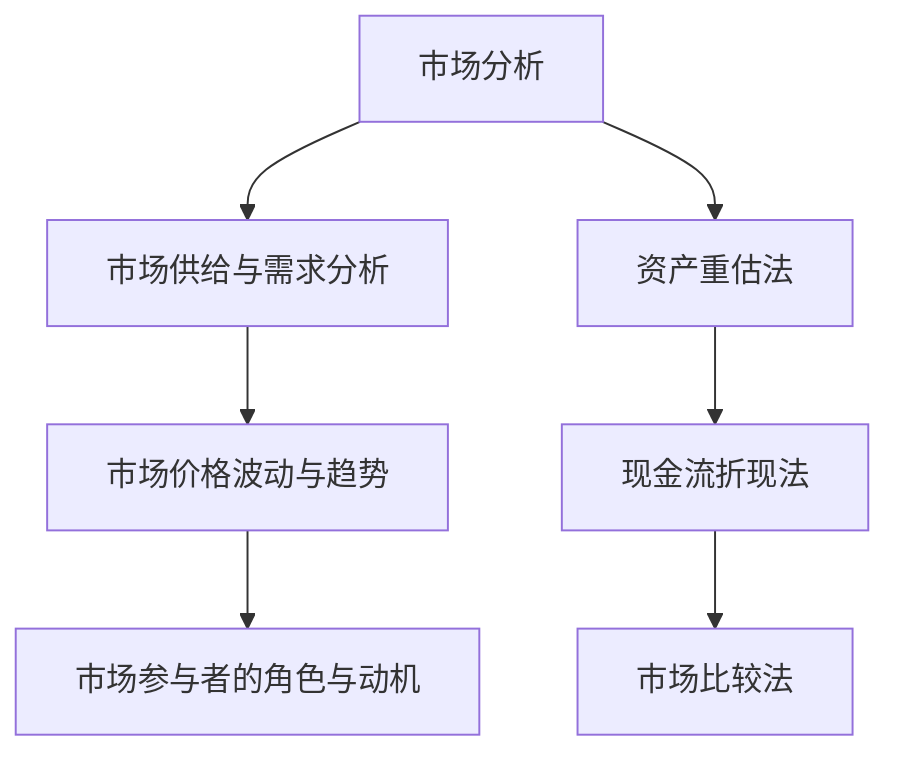

                 

# 不良资产投资：高风险高回报的特殊机会

---

## 关键词  
不良资产、投资策略、风险管理、高风险高回报、特殊机会、市场分析、估值方法  

---

## 摘要  
不良资产投资是一种高风险、高回报的投资方式，主要涉及对陷入财务困境的企业或个人的不良债权、股权或其他资产的投资。本文从不良资产的基本概念、分类、市场分析、估值方法、投资策略、风险管理及案例分析等方面展开讨论，结合实际案例和数学模型，详细阐述不良资产投资的内在逻辑和操作实务。通过本文的分析，读者可以深入了解不良资产投资的核心要素，掌握如何在高风险中寻找高回报的机会，并在实际操作中规避潜在风险。

---

# 目录大纲：《不良资产投资：高风险高回报的特殊机会》

---

## 第一部分：引言

### 第1章：不良资产投资概述

#### 1.1 不良资产的基本概念  
- **1.1.1 不良资产的定义与分类**  
  - 不良资产的定义：不良资产是指由于债务人或企业无法偿还债务或经营不善，导致其拥有的资产价值严重贬损或难以变现的资产。  
  - 分类：包括不良债权、不良股权、不良房地产等。  
- **1.1.2 不良资产的特征与成因**  
  - 特征：资产流动性差、价值贬损、处置难度大。  
  - 成因：经济周期波动、企业经营不善、金融市场过度杠杆化等。  
- **1.1.3 不良资产投资的特点**  
  - 高风险性：资产价值不稳定，处置难度大。  
  - 高回报性：通过重组或处置可能获得超额收益。  

#### 1.2 不良资产投资的市场现状  
- **1.2.1 全球不良资产市场的规模与趋势**  
  - 全球不良资产市场的规模近年来持续增长，主要受经济波动和企业违约的影响。  
- **1.2.2 不良资产市场的参与者与角色**  
  - 参与者包括资产管理公司、银行、私募基金、政府机构等。  
- **1.2.3 不良资产市场的周期性与波动性**  
  - 不良资产市场的周期性与宏观经济周期密切相关，波动性较大。  

#### 1.3 不良资产投资与其他投资方式的比较  
- **1.3.1 不良资产投资的风险与回报特点**  
  - 相较于股票、债券等传统资产，不良资产投资的风险更高，但潜在回报也更大。  
- **1.3.2 与其他资产类别的对比分析**  
  - 不良资产投资的流动性较低，但收益可能更高。  

#### 1.4 本书的目标与方法论  
- **1.4.1 本书的研究目标与范围**  
  - 本书旨在系统性地分析不良资产投资的核心要素，包括市场分析、估值方法、投资策略等。  
- **1.4.2 本书的分析框架与方法**  
  - 通过理论分析、案例研究和数学建模相结合的方法，全面解析不良资产投资的逻辑与实践。  
- **1.4.3 本书的结构安排与内容概览**  
  - 本书共分为七大部分，涵盖不良资产的分类、市场分析、估值方法、投资策略、风险管理、法律税务考量以及案例分析等。  

---

## 第二部分：不良资产的分类与特征

### 第2章：不良资产的分类与分析

#### 2.1 不良资产的主要类型  
- **2.1.1 不良债权资产**  
  - 包括逾期贷款、不良债券等，是不良资产的主要形式。  
- **2.1.2 不良股权资产**  
  - 包括因企业经营不善导致的股权贬值。  
- **2.1.3 不良房地产资产**  
  - 包括烂尾楼、空置房产等。  
- **2.1.4 其他不良资产形式**  
  - 如应收账款、存货等。  

#### 2.2 不良资产的特征分析  
- **2.2.1 资产贬值与流动性差**  
  - 不良资产的市场价值通常低于账面价值，且难以快速变现。  
- **2.2.2 债务人财务状况恶化**  
  - 债务人可能面临破产或重组，资产处置难度增加。  
- **2.2.3 资产处置难度大**  
  - 不良资产的处置通常涉及复杂的法律程序和谈判。  

#### 2.3 不良资产的成因分析  
- **2.3.1 经济周期的影响**  
  - 经济衰退可能导致企业违约，从而产生不良资产。  
- **2.3.2 企业经营不善**  
  - 管理不善、竞争加剧等因素导致企业无法偿还债务。  
- **2.3.3 金融市场波动**  
  - 过度杠杆化和金融创新可能引发市场波动，导致不良资产增加。  

---

## 第三部分：不良资产投资的市场分析

### 第3章：不良资产市场的分析框架

#### 3.1 不良资产市场的基本分析  
- **3.1.1 市场供给与需求分析**  
  - 市场供给主要来自银行和非银行金融机构的不良资产处置，需求来自资产管理公司、私募基金等投资者。  
- **3.1.2 市场价格波动与趋势**  
  - 不良资产价格受宏观经济、政策环境和市场供需的影响，波动较大。  
- **3.1.3 市场参与者的角色与动机**  
  - 银行：通过处置不良资产改善资产负债表。  
  - 资产管理公司：通过收购和重组实现收益。  
  - 私募基金：寻求高回报的投资机会。  

#### 3.2 不良资产市场的估值方法  
- **3.2.1 资产重估法**  
  - 通过分析资产的市场价值，调整其账面价值。  
- **3.2.2 现金流折现法**  
  - 通过预测未来现金流，计算资产的内在价值。  
- **3.2.3 市场比较法**  
  - 基于类似资产的市场交易价格进行估值。  

---

### 第3章：不良资产市场的分析框架（续）

#### 3.3 不良资产市场的定价策略  
- **3.3.1 定价模型与流程**  
  - 包括数据收集、市场分析、资产评估、定价决策等步骤。  
- **3.3.2 定价中的关键因素**  
  - 资产状况、市场流动性、政策环境等。  

---

### 图3-1：不良资产市场分析框架的Mermaid流程图

---

## 第四部分：不良资产投资的策略与实务

### 第4章：不良资产投资策略

#### 4.1 不良资产投资的策略框架  
- **4.1.1 策略类型**  
  - 困境投资：投资于陷入财务困境的企业，通过重组实现价值回升。  
  - 债务重组：通过债务重组获取重组收益。  
  - 资产剥离：将不良资产从资产负债表中剥离，改善企业财务状况。  

#### 4.2 不良资产投资的关键步骤  
- **4.2.1 资产筛选与尽职调查**  
  - 通过尽职调查评估资产的实际价值和风险。  
- **4.2.2 投资组合管理**  
  - 通过分散投资降低风险，优化投资组合的收益与风险比。  

---

## 第五部分：不良资产投资的风险管理

### 第5章：风险管理与控制

#### 5.1 不良资产投资中的主要风险  
- **5.1.1 信用风险**  
  - 债务人无法偿还债务的风险。  
- **5.1.2 市场风险**  
  - 市场波动导致资产价值贬损的风险。  
- **5.1.3 法律与合规风险**  
  - 处置过程中可能面临的法律纠纷和合规问题。  

#### 5.2 不良资产投资的风险管理策略  
- **5.2.1 风险评估与监控**  
  - 定期评估资产风险，建立风险监控机制。  
- **5.2.2 风险分散与对冲**  
  - 通过多样化投资和金融衍生工具对冲风险。  

---

## 第六部分：不良资产投资的法律与税务考量

### 第6章：法律与税务考量

#### 6.1 不良资产投资的法律框架  
- **6.1.1 不良资产处置的法律程序**  
  - 包括破产重整、债务重组等法律程序。  
- **6.1.2 相关法律法规与政策**  
  - 如《企业破产法》、《公司法》等。  

#### 6.2 不良资产投资的税务优化  
- **6.2.1 税务规划与优化策略**  
  - 利用税收优惠政策降低税务负担。  

---

## 第七部分：不良资产投资的案例分析

### 第7章：经典案例分析

#### 7.1 困境企业重组案例  
- **7.1.1 案例背景**  
  - 某制造企业因经营不善导致大量债务违约，进入破产重整程序。  
- **7.1.2 投资策略**  
  - 投资者通过债务重组和资产重组，帮助企业恢复生产，最终实现收益。  

---

## 结论

不良资产投资是一种高风险、高回报的投资方式，其成功与否取决于对市场、资产和风险的深刻理解。通过系统的市场分析、科学的估值方法、合理的投资策略和有效的风险管理，投资者可以在不良资产市场中找到潜在的高回报机会。未来，随着经济环境的变化和金融市场的发展，不良资产投资将继续吸引更多的关注和投资。

---

## 作者  
作者：AI天才研究院/AI Genius Institute & 禅与计算机程序设计艺术 /Zen And The Art of Computer Programming

