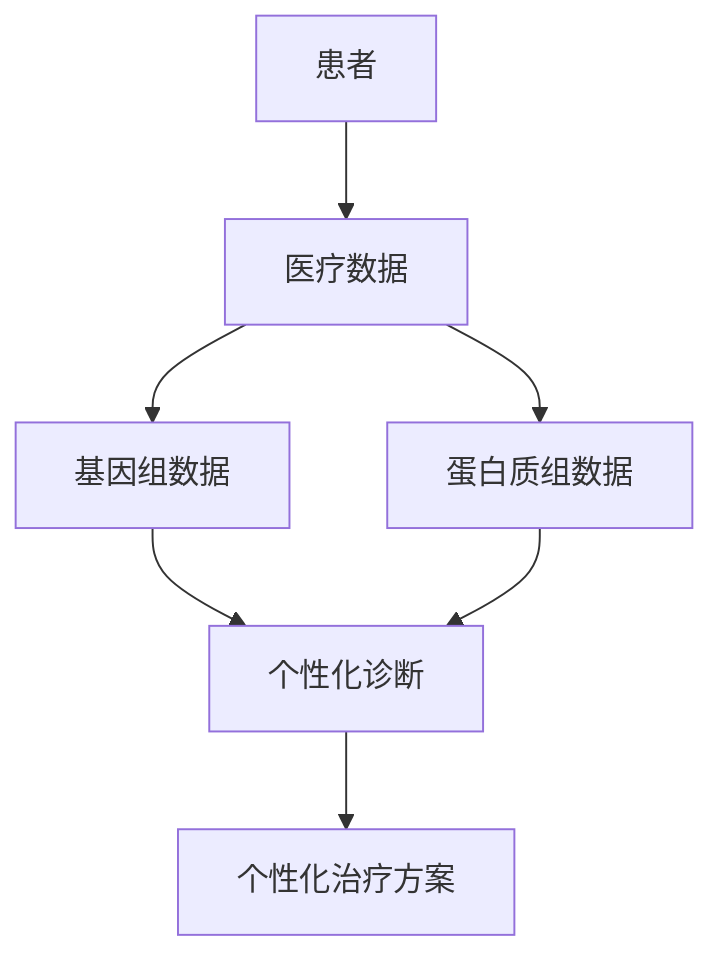
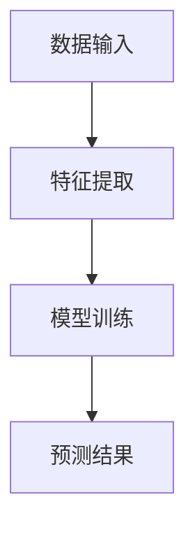
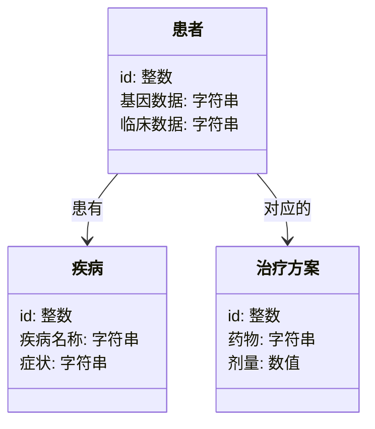

                 


# 个性化医疗的发展趋势与投资策略

## 关键词
个性化医疗、精准医学、基因组学、人工智能、投资策略

## 摘要
个性化医疗是现代医学发展的重要方向，它通过基因组学、蛋白质组学和人工智能等技术手段，实现疾病的精准诊断和个性化治疗。本文将详细分析个性化医疗的发展趋势，探讨其在医学领域的应用前景，并为投资者提供科学的投资策略。文章从技术原理、系统架构、项目实战等多方面展开，结合实际案例，深入剖析个性化医疗的核心要素和投资价值。

---

## 第一部分: 个性化医疗的背景与发展

### 第1章: 个性化医疗的定义与背景

#### 1.1 个性化医疗的定义
个性化医疗（Personalized Medicine）是指根据患者的个体特征（如基因、环境、生活方式等），量身定制适合其特定需求的诊断、治疗和预防方案。与传统医疗相比，个性化医疗更加注重个体差异，能够显著提高治疗效果并减少副作用。

- **个性化医疗的起源与发展**  
  个性化医疗的概念可以追溯到20世纪末，随着基因组学技术的突破，特别是人类基因组计划的完成，个性化医疗逐渐从理论走向实践。近年来，人工智能和大数据技术的快速发展进一步推动了个性化医疗的普及。

- **个性化医疗的核心概念**  
  个性化医疗的核心在于“精准”，即通过精准的诊断和治疗，实现对疾病的最佳控制和管理。其核心要素包括基因数据、蛋白质数据、临床数据以及患者的生活习惯等。

- **个性化医疗与传统医疗的区别**  
  传统医疗通常基于通用的治疗方案，而个性化医疗则强调个体化。例如，在癌症治疗中，个性化医疗可以根据患者的基因特征选择最有效的药物，避免传统化疗带来的广泛副作用。

---

#### 1.2 个性化医疗的背景与现状

- **个性化医疗的背景**  
  随着人口老龄化和慢性病的增加，人们对精准医疗的需求日益增长。个性化医疗能够显著提高治疗效果，降低医疗成本，因此受到政府、企业和学术界的广泛关注。

- **个性化医疗的现状**  
  当前，个性化医疗已在癌症、罕见病等领域取得显著进展。例如，基于PD-L1表达的免疫治疗方案就是个性化医疗的典型应用。然而，个性化医疗的普及仍然面临技术、成本和隐私保护等挑战。

- **个性化医疗的技术基础**  
  个性化医疗的技术基础主要包括基因组学、蛋白质组学、人工智能和大数据分析。这些技术的进步为个性化医疗的实现提供了强大的工具支持。

- **个性化医疗的应用领域**  
  个性化医疗在肿瘤治疗、遗传病诊断、慢性病管理等领域具有广泛应用前景。例如，基于基因检测的用药指导可以帮助患者选择最适合的药物，从而提高治疗效果。

---

### 第2章: 个性化医疗的核心概念与联系

#### 2.1 精准医学的概念与原理

- **精准医学的定义**  
  精准医学是指通过基因组、蛋白质组等多组学数据，结合临床数据，为患者提供个性化诊断和治疗的医学模式。

- **精准医学的核心原理**  
  精准医学的核心原理是通过分析患者的个体特征，找到疾病的关键驱动因素，从而制定针对性的治疗方案。例如，在癌症治疗中，精准医学可以通过检测肿瘤的基因突变，选择最有效的靶向药物。

- **精准医学与个性化医疗的关系**  
  精准医学是个性化医疗的重要组成部分，两者在目标和方法上高度一致，但精准医学更强调基于分子特征的治疗。

---

#### 2.2 基因组学与个性化医疗

- **基因组学的基本概念**  
  基因组学是研究基因组结构和功能的学科。通过基因测序技术，可以获取患者的基因信息，从而为个性化医疗提供数据支持。

- **基因组学在个性化医疗中的应用**  
  基因组学在个性化医疗中的应用主要体现在疾病诊断、药物选择和治疗方案优化等方面。例如，基于基因组数据的多基因风险评分可以预测患者患某种疾病的风险。

- **基因检测技术的发展**  
  近年来，基因检测技术的快速发展使得基因组学在个性化医疗中的应用更加广泛。例如，下一代测序技术（NGS）可以在短时间内完成大规模基因测序，为个性化医疗提供高效的数据支持。

---

#### 2.3 蛋白质组学与个性化医疗

- **蛋白质组学的定义与特点**  
  蛋白质组学是研究蛋白质结构和功能的学科。蛋白质是基因表达的产物，其水平和功能的变化直接反映疾病的发生和发展。

- **蛋白质组学在个性化医疗中的应用**  
  蛋白质组学在个性化医疗中的应用主要体现在疾病诊断、治疗效果评估和药物开发等方面。例如，基于蛋白质组学数据的生物标志物发现可以为疾病的早期诊断提供依据。

- **蛋白质组学与基因组学的结合**  
  基因组学和蛋白质组学的结合可以更全面地分析疾病的分子机制。例如，通过整合基因和蛋白质数据，可以更准确地预测患者的治疗反应。

---

#### 2.4 个性化医疗的实体关系图



---

### 第3章: 个性化医疗的算法原理

#### 3.1 个性化医疗中的机器学习算法

- **机器学习在个性化医疗中的应用**  
  机器学习在个性化医疗中的应用主要体现在疾病预测、治疗方案优化和药物开发等方面。例如，机器学习算法可以通过分析患者的基因数据和临床数据，预测患者对某种药物的反应。

- **常见的机器学习算法**  
  常见的机器学习算法包括支持向量机（SVM）、随机森林（Random Forest）、神经网络（Neural Networks）等。这些算法在个性化医疗中的应用各有特点。

- **支持向量机（SVM）在个性化医疗中的应用**  
  支持向量机是一种监督学习算法，常用于分类和回归问题。在个性化医疗中，SVM可以用于疾病诊断和治疗方案优化。



---

#### 3.2 个性化医疗中的数据分析流程

- **数据预处理**  
  数据预处理是数据分析的第一步，主要包括数据清洗、标准化和特征选择等步骤。例如，基因数据的预处理可能包括去除低质量数据和降维处理。

- **数据建模与分析**  
  数据建模是数据分析的核心步骤，主要包括选择合适的算法、训练模型和评估模型性能等步骤。例如，可以通过随机森林算法对患者的数据进行分类，预测疾病类型。

- **模型优化与部署**  
  模型优化是提高模型性能的重要步骤，主要包括调整模型参数和选择合适的评估指标等。模型部署则是将模型应用于实际场景，例如临床诊断或药物开发。

---

#### 3.3 个性化医疗的数学模型

- **线性回归模型**  
  线性回归是一种简单而有效的回归模型，常用于预测连续型变量。例如，可以通过线性回归模型预测患者的疾病风险。

$$ y = \beta_0 + \beta_1 x + \epsilon $$

- **逻辑回归模型**  
  逻辑回归是一种用于分类的模型，常用于二分类问题。例如，可以通过逻辑回归模型预测患者是否患有某种疾病。

$$ P(y=1|x) = \frac{e^{\beta_0 + \beta_1 x}}{1 + e^{\beta_0 + \beta_1 x}} $$

---

## 第四部分: 系统分析与架构设计方案

### 第4章: 系统分析与架构设计

#### 4.1 问题场景介绍

- **问题场景**  
  在个性化医疗系统中，患者的数据包括基因数据、蛋白质数据、临床数据等。这些数据需要通过系统进行整合和分析，以生成个性化的诊断和治疗方案。

- **项目介绍**  
  本项目旨在开发一个个性化医疗系统，能够根据患者的基因数据和临床数据，提供个性化的诊断和治疗建议。

---

#### 4.2 系统功能设计

- **领域模型设计**  
  领域模型是系统设计的核心部分，主要包括患者、疾病、治疗方案等实体。通过类图可以清晰地展示这些实体之间的关系。



- **系统架构设计**  
  系统架构设计是系统实现的基础，主要包括数据采集、数据处理、模型训练和结果展示等模块。


---

## 第五部分: 项目实战

### 第5章: 项目实战

#### 5.1 环境安装与配置

- **环境要求**  
  本项目需要安装Python 3.6及以上版本，以及相关库如Pandas、Scikit-learn等。

```bash
pip install pandas scikit-learn
```

---

#### 5.2 系统核心实现

- **数据预处理**  
  数据预处理是数据分析的第一步，主要包括数据清洗、标准化和特征选择等步骤。

```python
import pandas as pd

# 读取数据
data = pd.read_csv('patient_data.csv')

# 数据清洗
data.dropna(inplace=True)

# 标准化
from sklearn.preprocessing import StandardScaler
scaler = StandardScaler()
scaled_data = scaler.fit_transform(data)
```

- **模型训练与评估**  
  模型训练是数据分析的核心步骤，主要包括选择合适的算法、训练模型和评估模型性能等步骤。

```python
from sklearn.model_selection import train_test_split
from sklearn.svm import SVC

# 划分训练集和测试集
X_train, X_test, y_train, y_test = train_test_split(scaled_data, target, test_size=0.2)

# 训练模型
model = SVC()
model.fit(X_train, y_train)

# 评估模型
print(model.score(X_test, y_test))
```

---

## 第六部分: 最佳实践

### 第6章: 最佳实践

#### 6.1 小结

- **个性化医疗的核心价值**  
  个性化医疗的核心价值在于通过精准的诊断和治疗，提高治疗效果并降低医疗成本。随着技术的不断进步，个性化医疗的应用前景广阔。

- **投资策略总结**  
  投资个性化医疗需要关注技术进步、市场需求和政策支持。特别是在基因组学、人工智能和大数据分析等领域，具有较高的投资价值。

---

#### 6.2 注意事项

- **技术风险**  
  个性化医疗的技术门槛较高，投资者需要关注技术风险，例如数据隐私和算法优化等问题。

- **市场风险**  
  个性化医疗的市场需求受政策和患者接受度的影响较大，投资者需要关注市场风险。

---

#### 6.3 拓展阅读

- **推荐书籍**  
  - 《The Precision Medicine Field》
  - 《Artificial Intelligence in Healthcare》

- **推荐网站**  
  - [Nature Medicine](https://www.nature.com/medicine/)
  - [Journal of Personalized Medicine](https://www.mdpi.com/journal/jpm)

---

## 作者：AI天才研究院/AI Genius Institute & 禅与计算机程序设计艺术 /Zen And The Art of Computer Programming

