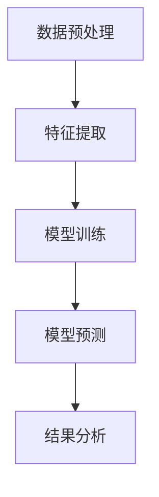
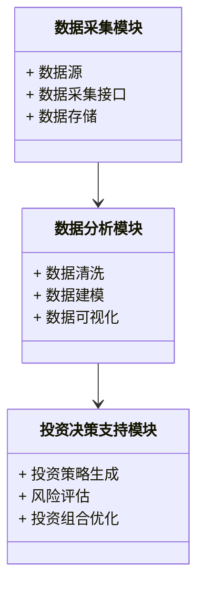
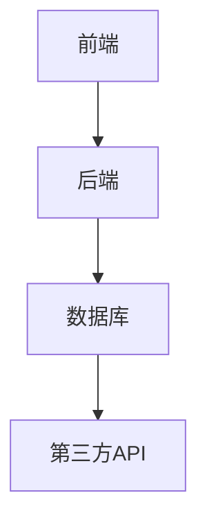
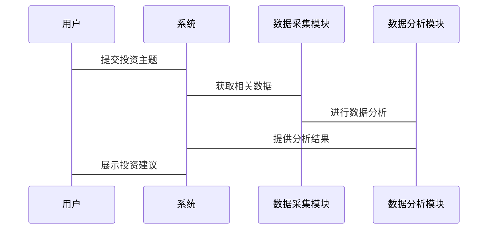

                 


# 主题投资：把握长期经济社会发展趋势

> 关键词：主题投资、长期趋势、经济社会发展、投资策略、技术分析

> 摘要：本文探讨了主题投资的核心概念，分析了长期经济社会发展趋势的重要性，并通过具体案例展示了如何利用技术方法识别和把握这些趋势，为投资者提供科学的投资策略。

---

## 第1章: 主题投资的基本概念

### 1.1 什么是主题投资

#### 1.1.1 主题投资的定义

主题投资是一种以长期经济社会发展趋势为核心，通过识别和投资于符合这些趋势的主题或行业，来实现超额收益的投资策略。与传统的个股或行业投资不同，主题投资更加注重趋势的持续性和广泛性。

$$
\text{主题投资} = \text{趋势分析} + \text{投资策略}
$$

#### 1.1.2 主题投资的核心要素

主题投资的核心要素包括以下几个方面：

1. **趋势的持续性**：趋势必须具有长期性和稳定性，能够持续较长时间。
2. **行业的广泛性**：趋势影响的行业范围越广，投资机会越大。
3. **市场的可量化性**：趋势可以通过量化指标进行分析和预测。
4. **投资标的的选择**：根据趋势选择相关的股票、基金或其他金融资产。

#### 1.1.3 主题投资与传统投资的区别

| 方面 | 主题投资 | 传统投资 |
|------|----------|----------|
| 核心 | 长期趋势 | 个股或行业 | 
| 风险 | 系统性风险较高 | 非系统性风险较高 |
| 持股策略 | 长期持有 | 短期交易 |

---

### 1.2 长期经济社会发展趋势的重要性

#### 1.2.1 经济发展周期与投资机会

经济发展的周期性波动为投资者提供了不同的投资机会。例如，在经济衰退期，政府可能会出台刺激政策，推动某些行业的发展。

#### 1.2.2 社会变迁对投资主题的影响

社会变迁，如人口老龄化、消费升级等，都会对投资主题产生深远影响。例如，老龄化社会可能会推动医疗健康行业的快速发展。

#### 1.2.3 技术进步与投资趋势的关系

技术进步是推动经济发展的重要动力。例如，人工智能、大数据等技术的快速发展，为科技主题投资提供了巨大的机会。

---

## 第2章: 主题投资的背景与现状

### 2.1 当前经济社会发展的主要趋势

#### 2.1.1 数字经济与产业升级

数字经济的快速发展，推动了传统产业的升级和转型。例如，电子商务、互联网金融等行业的崛起。

#### 2.1.2 绿色经济与可持续发展

绿色经济强调环保和可持续发展，推动了新能源、节能环保等行业的快速发展。

#### 2.1.3 全球化与区域经济一体化

全球化促进了跨国投资和贸易，同时也推动了区域经济一体化的发展。

### 2.2 主题投资的兴起与演变

#### 2.2.1 主题投资的历史发展

主题投资的概念起源于20世纪90年代，随着全球经济的快速发展和科技的进步，主题投资逐渐成为一种重要的投资策略。

#### 2.2.2 主题投资在现代金融中的地位

在现代金融中，主题投资越来越受到重视，尤其是在机构投资者中。它可以帮助投资者更好地把握长期趋势，实现资产的长期增值。

#### 2.2.3 主题投资的现状与未来展望

当前，主题投资在科技、医疗、绿色能源等领域表现尤为突出。未来，随着技术的进步和经济的发展，主题投资将更加多样化和专业化。

---

## 第3章: 长期趋势的识别与分析

### 3.1 主要长期趋势的分类

#### 3.1.1 科技创新趋势

科技创新是推动经济发展的核心动力。例如，人工智能、5G、区块链等技术的快速发展，为科技主题投资提供了巨大的机会。

#### 3.1.2 人口结构变化趋势

人口结构的变化，如老龄化、人口迁移等，会对投资主题产生深远影响。例如，老龄化社会可能会推动医疗健康行业的快速发展。

#### 3.1.3 政策导向与法规变化

政府政策和法规的变化，对投资主题的影响不容忽视。例如，环保政策的加强，推动了新能源行业的快速发展。

### 3.2 长期趋势的量化分析方法

#### 3.2.1 数据驱动的长期趋势分析

通过收集和分析大量数据，可以识别出某些行业的长期发展趋势。例如，通过分析GDP增长率、行业产值等数据，可以判断出哪些行业具有长期增长潜力。

#### 3.2.2 专家判断与定性分析

专家判断和定性分析是主题投资的重要补充。例如，行业专家可以通过对市场趋势的深入了解，判断出某些行业的投资价值。

#### 3.2.3 综合分析模型的构建

综合分析模型结合了定量和定性分析方法，能够更全面地评估长期趋势。例如，可以通过构建行业竞争力模型，评估某个行业的长期发展潜力。

---

## 第4章: 主要长期趋势的案例分析

### 4.1 科技创新领域的长期趋势

#### 4.1.1 人工智能与大数据

人工智能和大数据技术的快速发展，推动了多个行业的智能化转型。例如，人工智能在金融、医疗、制造业等领域的应用日益广泛。

#### 4.1.2 新能源与清洁能源

随着环保意识的增强和能源结构的调整，新能源和清洁能源行业迎来了快速发展。例如，太阳能、风能等可再生能源的装机容量快速增长。

#### 4.1.3 生物技术与医疗健康

生物技术的进步和医疗健康需求的增加，推动了生物医药、基因编辑等领域的快速发展。

### 4.2 人口结构变化的长期影响

#### 4.2.1 老龄化社会的投资机会

老龄化社会推动了医疗健康、养老服务等行业的快速发展。例如，养老地产、医疗设备等行业的投资机会显著增加。

#### 4.2.2 人口迁移与城市化趋势

人口迁移和城市化趋势推动了房地产、交通、教育等行业的快速发展。例如，城市化进程加快推动了房地产市场的繁荣。

#### 4.2.3 新生代消费群体的崛起

新生代消费群体的崛起，推动了消费升级和个性化消费的发展。例如，年轻消费者对高端电子产品、个性化服务的需求增加。

### 4.3 政策导向与法规变化的影响

#### 4.3.1 政府政策对投资主题的推动

政府政策的调整对投资主题的影响不容忽视。例如，环保政策的加强推动了新能源行业的快速发展。

#### 4.3.2 法规变化对行业的影响

法规变化可能会对某些行业产生重大影响。例如，金融监管政策的调整可能会对金融机构的投资行为产生直接影响。

#### 4.3.3 政策周期与投资机会的关系

政策周期与投资机会密切相关。例如，在政策鼓励的周期内，某些行业可能会迎来快速发展的机会。

---

## 第5章: 主题投资的量化分析方法

### 5.1 数学模型与公式

主题投资的量化分析可以通过数学模型进行预测和评估。例如，可以通过构建行业增长模型，预测某个行业的未来增长潜力。

$$
\text{行业增长潜力} = \text{市场需求增长率} \times \text{行业利润率}
$$

### 5.2 机器学习算法的应用

机器学习算法可以用于主题投资的预测和分析。例如，可以通过训练模型，预测某个行业的未来走势。

#### 5.2.1 算法流程图



#### 5.2.2 Python代码实现

```python
import pandas as pd
from sklearn.linear_model import LinearRegression

# 数据预处理
data = pd.read_csv('data.csv')
data.dropna(inplace=True)

# 特征提取
X = data[['GDP增长率', '行业利润率']]
y = data['行业增长潜力']

# 模型训练
model = LinearRegression()
model.fit(X, y)

# 模型预测
new_data = pd.DataFrame({'GDP增长率': [5, 6], '行业利润率': [10, 15]})
predictions = model.predict(new_data)

print(predictions)
```

---

## 第6章: 投资分析系统的架构设计

### 6.1 系统功能设计

投资分析系统的功能模块包括数据采集、数据分析、投资决策支持等。

#### 6.1.1 领域模型



### 6.2 系统架构设计

#### 6.2.1 系统架构图



### 6.3 系统接口设计

系统接口包括数据接口、算法接口、用户接口等。

#### 6.3.1 数据接口

数据接口用于与外部数据源进行交互，获取所需的数据。

#### 6.3.2 算法接口

算法接口用于调用机器学习算法，进行数据建模和预测。

#### 6.3.3 用户接口

用户接口用于与用户交互，展示分析结果和投资建议。

### 6.4 系统交互流程

#### 6.4.1 交互流程图



---

## 第7章: 项目实战

### 7.1 环境安装

#### 7.1.1 安装Python

```bash
python --version
pip install numpy pandas scikit-learn
```

### 7.2 系统核心实现

#### 7.2.1 数据采集与处理

```python
import pandas as pd
import requests

def get_data(url):
    response = requests.get(url)
    data = response.json()
    return pd.DataFrame(data)

data = get_data('https://example.com/api')
```

#### 7.2.2 数据分析与建模

```python
from sklearn.ensemble import RandomForestRegressor

model = RandomForestRegressor()
model.fit(X, y)
```

#### 7.2.3 投资策略制定

```python
def generate_strategy(data, model):
    predictions = model.predict(data)
    return predictions

strategy = generate_strategy(new_data, model)
```

### 7.3 实际案例分析

#### 7.3.1 案例背景

以新能源行业为例，分析其长期发展趋势和投资机会。

#### 7.3.2 数据分析

通过分析新能源行业的历史数据和未来预测，评估其投资价值。

#### 7.3.3 投资策略制定

根据数据分析结果，制定相应的投资策略，如配置新能源股票、基金等。

### 7.4 项目小结

通过项目实战，我们可以看到主题投资的量化分析方法在实际中的应用，同时也需要注意数据的准确性和模型的可解释性。

---

## 第8章: 最佳实践与小结

### 8.1 投资策略

在主题投资中，投资者需要结合长期趋势和市场环境，制定科学的投资策略。

### 8.2 风险管理

风险管理是主题投资的重要组成部分，投资者需要关注市场波动、政策变化等潜在风险。

### 8.3 持续学习

投资环境不断变化，投资者需要持续学习，更新自己的知识和技能。

### 8.4 小结

主题投资通过把握长期经济社会发展趋势，为投资者提供了重要的投资机会。然而，投资者需要结合实际市场情况，制定科学的投资策略，并注重风险管理。

### 8.5 注意事项

1. 投资者需要关注政策变化和市场环境的变化。
2. 投资者需要结合自身的风险承受能力和投资目标，制定合适的投资策略。
3. 投资者需要注重数据的准确性和模型的可解释性。

### 8.6 拓展阅读

1. 《投资学基础》
2. 《量化投资：数据驱动的投资策略》
3. 《长期趋势分析：方法与实践》

---

## 作者

作者：AI天才研究院/AI Genius Institute & 禅与计算机程序设计艺术 /Zen And The Art of Computer Programming

