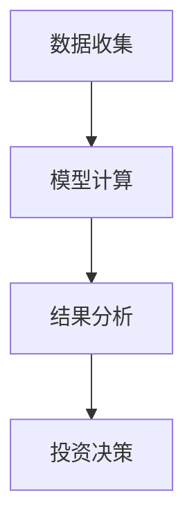

                 

# 乔尔格林布拉特的价值投资教育

> 关键词：价值投资、格林布拉特、投资模型、财务指标、市场分析、风险管理、投资教育

> 摘要：本文深入探讨了乔尔·格林布拉特的价值投资方法及其教育意义。通过分析其投资模型的核心算法和数学模型，结合实际案例，展示了如何应用这些方法进行投资决策。文章还总结了投资的最佳实践和风险管理策略，为读者提供系统的投资教育。

---

## 第一部分: 价值投资的基础与背景

### 第1章: 价值投资的起源与发展

#### 1.1 投资的基本概念与分类

投资是指将资金投入到能够产生收益的资产或项目中，以实现财富增值。投资可以分为多种类型，包括股票、债券、房地产、私募股权等。每种投资类型都有其独特的风险和回报特征。

#### 1.2 价值投资的核心理念

价值投资是一种投资策略，强调购买被市场低估的资产，长期持有，等待其价值回归。其核心理念是寻找具有内在价值的公司，并在市场低估时买入，市场高估时卖出。

#### 1.3 价值投资的历史发展与现状

价值投资起源于20世纪初，由本杰明·格雷厄姆和戴维·多德提出。后来，沃伦·巴菲特、彼得·林奇等投资者继承和发展了这一理念。乔尔·格林布拉特进一步将其量化，提出了著名的“神奇公式”。

---

### 第2章: 乔尔·格林布拉特的背景与贡献

#### 2.1 乔尔·格林布拉特的生平简介

乔尔·格林布拉特是一位成功的投资家和教育家，以其量化价值投资方法闻名。他著有《The New York Times Million Dollar Portfolio》一书，分享了他的投资策略和成果。

#### 2.2 格林布拉特的投资理念

格林布拉特认为，投资的本质是寻找具有持续竞争优势和合理估值的企业。他通过数学模型量化企业的内在价值，帮助投资者做出更科学的投资决策。

---

### 第3章: 价值投资的核心理念

#### 3.1 内在价值的定义

内在价值是企业在正常市场条件下所能产生的现金流的现值。投资者的目标是以低于内在价值的价格买入股票，以获得长期收益。

#### 3.2 安全边际的重要性

安全边际是指股票市场价格与内在价值之间的差距。通过购买低于内在价值的股票，投资者可以降低市场波动带来的风险。

#### 3.3 长期投资的重要性

价值投资强调长期持有优质资产，避免频繁交易。长期投资有助于降低交易成本，并充分利用复利效应。

---

## 第二部分: 格林布拉特投资模型的核心概念

### 第4章: 格林布拉特投资模型的原理与算法

#### 4.1 投资模型的核心算法

格林布拉特的“神奇公式”是一个量化价值投资的模型，综合考虑了企业的基本面和市场估值。其公式为：

$$
\text{Value} = \frac{\text{Earnings} \times \text{Revenue}}{\text{Market Cap}}
$$

其中，Earnings代表净利润，Revenue代表收入，Market Cap代表市值。

#### 4.2 算法实现的步骤

1. 收集目标公司的财务数据，包括净利润和收入。
2. 计算公司的价值得分，使用上述公式。
3. 对所有公司进行排序，选择得分最高的公司进行投资。

#### 4.3 算法的数学模型

格林布拉特的模型通过将基本面指标与市场估值指标结合，量化企业的内在价值。其数学模型可以表示为：

$$
\text{Score} = \frac{\text{Earnings}}{\text{Median Earnings}} + \frac{\text{Revenue}}{\text{Median Revenue}}
$$

其中，Median Earnings和Median Revenue是同行业公司的中位数。

---

### 第5章: 数学模型与系统架构

#### 5.1 数学模型的构建

通过将基本面指标和市场估值指标结合起来，构建一个综合评分系统。例如，使用加权平均法对多个指标进行综合评估。

#### 5.2 系统架构设计

一个典型的系统架构包括数据收集、模型计算、结果分析和投资决策四个模块。系统架构图如下：

---

### 第6章: 项目实战与案例分析

#### 6.1 项目实战

以苹果公司为例，计算其价值得分。假设苹果的净利润为1000亿美元，收入为3000亿美元，同行业公司的中位数净利润和收入分别为500亿美元和2000亿美元。则：

$$
\text{Score} = \frac{1000}{500} + \frac{3000}{2000} = 2 + 1.5 = 3.5
$$

苹果的得分远高于行业平均水平，具有较高的投资价值。

#### 6.2 案例分析

通过分析多个公司，验证模型的有效性。例如，购买并持有谷歌的股票，长期来看，其价值增长显著。

---

## 第三部分: 投资教育与风险管理

### 第7章: 投资心态与风险管理

#### 7.1 投资心态的重要性

投资者需要保持冷静和耐心，避免情绪化决策。长期投资需要坚持价值理念，不被短期波动影响。

#### 7.2 风险管理策略

通过分散投资和设定止损点，降低投资风险。定期审视投资组合，调整持仓结构。

---

### 第8章: 投资教育的总结与展望

#### 8.1 总结

价值投资是一种科学且艺术的投资方法。通过量化模型和长期持有，投资者可以实现财富的稳定增长。

#### 8.2 展望

随着人工智能和大数据技术的发展，价值投资将更加精准和高效。未来的投资教育将更加注重理论与实践的结合。

---

## 结语

乔尔·格林布拉特的价值投资教育为我们提供了一种科学的投资方法。通过量化模型和长期持有优质资产，投资者可以在市场中获得稳定的收益。希望本文能为读者提供有价值的投资教育，帮助他们在投资道路上走得更远。

---

作者：AI天才研究院 & 禅与计算机程序设计艺术

