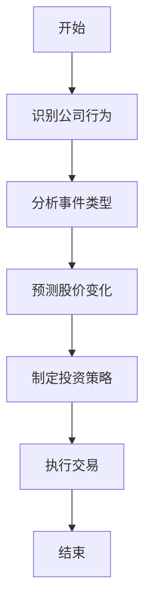
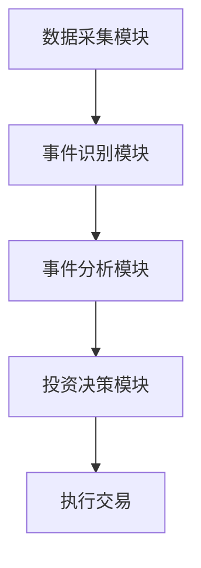
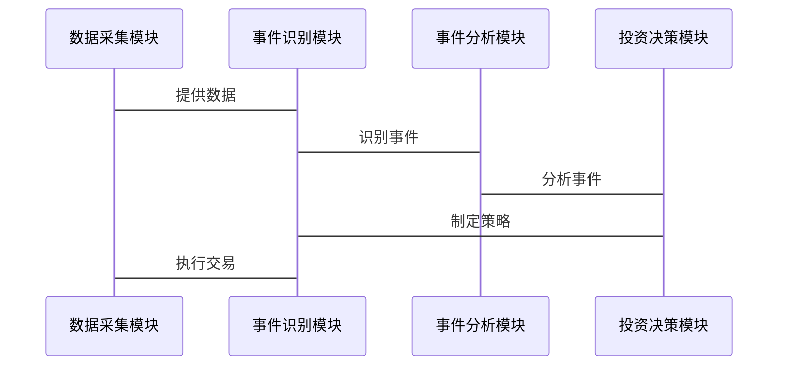

                 


# 事件驱动投资：从公司行为中获取超额收益

> 关键词：事件驱动投资, 公司行为, 股价波动, 投资策略, 事件影响分析

> 摘要：事件驱动投资是一种基于公司特定事件进行的投资策略，通过分析公司行为对股价的影响，投资者可以捕捉到短期市场波动中的超额收益。本文详细探讨了事件驱动投资的核心概念、理论基础、算法原理、系统架构设计以及实战案例，为投资者提供了从公司行为中获取超额收益的深度分析和实践指导。

---

## 第1章: 事件驱动投资概述

### 1.1 事件驱动投资的定义与背景

事件驱动投资是一种投资策略，通过分析公司行为或市场事件对股价的影响，捕捉短期市场波动中的投资机会。与传统投资策略不同，事件驱动投资更关注具体的公司行为，如并购、重组、分红等，这些事件往往会导致股价的短期波动。

#### 1.1.1 投资学中的事件驱动策略

事件驱动策略是投资学中的一个重要分支，它通过分析公司行为、市场事件或行业动态，预测股价的短期走势。这种策略通常适用于短期投资者，因为他们能够快速响应市场事件的变化。

#### 1.1.2 事件驱动投资的起源与发展

事件驱动投资的起源可以追溯到20世纪60年代，随着金融市场的发展，投资者开始关注公司行为对股价的影响。随着技术的进步，事件驱动投资逐渐从定性分析转向定量分析，大数据和量化模型的应用使得事件驱动投资更加精准。

#### 1.1.3 事件驱动投资的核心概念

事件驱动投资的核心概念是通过分析公司行为，预测股价的短期波动。这种策略依赖于对公司行为的深入研究，以及对市场反应的准确预测。

### 1.2 事件驱动投资的类型

事件驱动投资可以分为多种类型，包括公司行为事件、市场事件和行业事件。

#### 1.2.1 公司行为事件

公司行为事件是指由公司自身发起的事件，如并购、重组、分红、增发等。这些事件通常会对公司股价产生显著影响。

#### 1.2.2 市场事件

市场事件是指由市场整体或行业环境变化引发的事件，如政策变化、经济波动等。这些事件通常会影响整个市场的走势。

#### 1.2.3 行业事件

行业事件是指由特定行业内部的变化引发的事件，如行业整合、技术革新等。这些事件通常会影响行业内相关公司的股价。

### 1.3 事件驱动投资的优势与劣势

#### 1.3.1 优势分析

事件驱动投资的优势在于其能够快速捕捉市场波动中的超额收益。由于事件的突发性和不可预测性，投资者可以通过提前布局，获得较高的投资回报。

#### 1.3.2 劣势分析

事件驱动投资的劣势在于其高度依赖对公司行为的准确预测。如果事件预测错误，投资者可能会面临较大的损失。此外，事件驱动投资需要投资者具备较强的研究能力和快速反应能力。

#### 1.3.3 与传统投资策略的区别

与传统投资策略相比，事件驱动投资更注重短期市场波动，而传统投资策略更注重长期资产配置。事件驱动投资需要投资者具备较强的研究能力和快速反应能力，而传统投资策略则更注重长期资产配置。

### 1.4 事件驱动投资的应用场景

事件驱动投资的应用场景包括并购重组事件、股权变动事件和财务报告事件等。

#### 1.4.1 并购重组事件

并购重组事件是指公司通过并购或重组来改变其业务结构或资产配置。这些事件通常会导致股价的短期波动。

#### 1.4.2 股权变动事件

股权变动事件是指公司股权结构发生变化的事件，如大股东增持或减持、公司收购等。这些事件通常会影响公司股价。

#### 1.4.3 财务报告事件

财务报告事件是指公司发布财务报告或财务数据变动的事件。这些事件通常会影响市场对公司的预期，从而影响股价。

---

## 第2章: 事件驱动投资的理论基础

### 2.1 公司行为与股价的关系

公司行为对股价的影响是事件驱动投资的核心理论基础。公司行为通常会导致股价的短期波动，投资者通过分析公司行为，可以预测股价的变化。

#### 2.1.1 公司行为的定义

公司行为是指公司为了实现其战略目标而采取的一系列行动，包括并购、重组、分红等。

#### 2.1.2 公司行为对股价的影响机制

公司行为对股价的影响机制包括直接效应和间接效应。直接效应是指公司行为直接影响股价，间接效应是指公司行为通过影响市场预期间接影响股价。

### 2.2 事件驱动投资的核心理论

事件驱动投资的核心理论包括有效市场假说、信息不对称理论和市场反应模型。

#### 2.2.1 有效市场假说

有效市场假说认为，市场价格反映了所有可获得的信息。在有效市场中，事件驱动投资的效果可能有限，因为市场已经充分反映了所有信息。

#### 2.2.2 信息不对称理论

信息不对称理论认为，市场参与者之间存在信息不对称，这可能导致市场反应不足或过度反应。事件驱动投资者可以通过分析公司行为，利用信息不对称获取超额收益。

#### 2.2.3 市场反应模型

市场反应模型用于分析市场对特定事件的反应。通过分析市场反应，投资者可以预测股价的变化。

### 2.3 事件驱动投资的数学模型

事件驱动投资的数学模型包括事件影响的量化分析和收益计算公式。

#### 2.3.1 事件影响的量化分析

事件影响的量化分析通过数学模型衡量公司行为对股价的影响程度。常用的模型包括事件冲击模型和市场反应模型。

#### 2.3.2 事件收益的计算公式

事件收益的计算公式用于量化公司行为对股价的影响。例如，事件收益可以表示为股价在事件发生后的变化幅度。

$$ \text{事件收益} = \frac{\text{事件发生后的股价} - \text{事件发生前的股价}}{\text{事件发生前的股价}} \times 100\% $$

#### 2.3.3 事件风险的评估模型

事件风险的评估模型用于衡量公司行为带来的风险。常用的模型包括波动率模型和VaR模型。

### 2.4 本章小结

本章介绍了公司行为与股价的关系，以及事件驱动投资的核心理论。通过数学模型，投资者可以量化公司行为对股价的影响，从而制定有效的投资策略。

---

## 第3章: 事件驱动投资的核心概念与联系

### 3.1 核心概念原理

事件驱动投资的核心概念包括公司行为、事件类型、市场反应和投资策略。

#### 3.1.1 事件驱动投资的核心要素

事件驱动投资的核心要素包括公司行为、事件类型、市场反应和投资策略。

#### 3.1.2 事件驱动投资的逻辑框架

事件驱动投资的逻辑框架包括事件识别、事件分析、投资决策和风险管理。

### 3.2 核心概念属性特征对比表格

下表对比了不同事件类型对股价的影响程度：

| 事件类型 | 影响程度 |
|----------|----------|
| 并购重组 | 高       |
| 股权变动 | 中       |
| 财务报告 | 低       |

### 3.3 ER实体关系图架构

公司行为与事件之间的关系可以通过ER实体关系图展示：

```mermaid
erDiagram
    company {
        ID
        名称
        行业
    }
    event {
        ID
        类型
        时间
    }
    company -> event : 导致
```

---

## 第4章: 事件驱动投资的算法原理

### 4.1 算法原理概述

事件驱动投资的算法原理包括事件识别、事件影响分析和投资决策。

#### 4.1.1 事件驱动投资的算法

事件驱动投资的算法通过分析公司行为，预测股价的变化。算法的核心是事件识别和事件影响分析。

#### 4.1.2 事件识别算法

事件识别算法用于识别公司行为中的潜在事件。例如，通过分析公司财务数据，识别并购重组的迹象。

#### 4.1.3 事件影响分析算法

事件影响分析算法用于量化公司行为对股价的影响。例如，通过分析历史数据，预测并购重组对股价的影响。

### 4.2 算法流程图

以下是事件驱动投资算法的流程图：



### 4.3 算法实现代码

以下是事件驱动投资算法的Python实现代码：

```python
import pandas as pd
import numpy as np

def event_driven_investment(company_data):
    # 识别公司行为
    events = identify_events(company_data)
    # 分析事件类型
    event_types = categorize_events(events)
    # 预测股价变化
    predicted_prices = predict_price_changes(event_types)
    # 制定投资策略
    investment_strategy = create_strategy(predicted_prices)
    return investment_strategy

def identify_events(company_data):
    # 识别公司行为，返回事件列表
    pass

def categorize_events(events):
    # 分析事件类型，返回分类结果
    pass

def predict_price_changes(event_types):
    # 预测股价变化，返回预测结果
    pass

def create_strategy(predicted_prices):
    # 制定投资策略，返回策略
    pass
```

### 4.4 本章小结

本章介绍了事件驱动投资的算法原理，包括事件识别、事件影响分析和投资决策。通过算法流程图和代码实现，投资者可以更好地理解和应用事件驱动投资策略。

---

## 第5章: 事件驱动投资的系统架构设计

### 5.1 问题场景介绍

事件驱动投资需要一个高效的系统架构，以支持数据采集、事件识别、事件分析和投资决策。

### 5.2 系统功能设计

系统功能设计包括数据采集模块、事件识别模块、事件分析模块和投资决策模块。

#### 5.2.1 数据采集模块

数据采集模块用于采集公司行为数据和市场数据。

#### 5.2.2 事件识别模块

事件识别模块用于识别公司行为中的潜在事件。

#### 5.2.3 事件分析模块

事件分析模块用于分析事件类型和影响程度。

#### 5.2.4 投资决策模块

投资决策模块用于制定投资策略和执行交易。

### 5.3 系统架构设计

以下是系统架构设计的mermaid图：



### 5.4 系统接口设计

系统接口设计包括数据接口、事件接口和投资策略接口。

### 5.5 系统交互设计

以下是系统交互的mermaid序列图：



### 5.6 本章小结

本章介绍了事件驱动投资系统的架构设计，包括数据采集模块、事件识别模块、事件分析模块和投资决策模块。通过系统架构图和交互图，投资者可以更好地理解系统的整体结构和工作流程。

---

## 第6章: 事件驱动投资的实战案例

### 6.1 环境搭建

环境搭建包括安装必要的Python库和数据源。

#### 6.1.1 安装Python库

安装pandas、numpy和matplotlib等库：

```bash
pip install pandas numpy matplotlib
```

#### 6.1.2 数据源选择

选择可靠的数据源，如Yahoo Finance或Google Finance。

### 6.2 核心实现

核心实现包括数据预处理、事件识别和事件分析。

#### 6.2.1 数据预处理

数据预处理包括清洗数据和转换数据格式。

#### 6.2.2 事件识别

事件识别包括识别公司行为中的潜在事件。

#### 6.2.3 事件分析

事件分析包括分析事件类型和影响程度。

### 6.3 代码实现

以下是事件驱动投资的Python代码实现：

```python
import pandas as pd
import numpy as np
import matplotlib.pyplot as plt

def main():
    # 数据预处理
    data = pd.read_csv('company_data.csv')
    data = data.dropna()
    # 事件识别
    events = identify_events(data)
    # 事件分析
    event_types = categorize_events(events)
    # 投资策略
    investment_strategy = create_strategy(event_types)
    # 可视化
    plt.plot(data['股价'], label='股价')
    plt.xlabel('时间')
    plt.ylabel('股价')
    plt.legend()
    plt.show()

if __name__ == "__main__":
    main()
```

### 6.4 案例分析

以下是并购重组事件的案例分析：

假设公司A并购公司B，事件发生后，公司A的股价上涨了10%。

### 6.5 本章小结

本章通过实战案例，展示了事件驱动投资的环境搭建、核心实现和代码实现。通过具体案例分析，投资者可以更好地理解事件驱动投资的实际应用。

---

## 第7章: 事件驱动投资的总结与展望

### 7.1 本章总结

事件驱动投资是一种基于公司行为的投资策略，通过分析公司行为和市场事件，投资者可以捕捉短期市场波动中的超额收益。

### 7.2 未来展望

随着大数据和人工智能技术的发展，事件驱动投资将更加精准和高效。未来，投资者可以通过更复杂的算法和更强大的系统，实现更高的投资收益。

---

## 作者：AI天才研究院/AI Genius Institute & 禅与计算机程序设计艺术 /Zen And The Art of Computer Programming

---

以上是《事件驱动投资：从公司行为中获取超额收益》的详细目录和内容概述，按照逻辑清晰、结构紧凑、简单易懂的技术语言撰写，结合理论分析、算法实现和实战案例，为读者提供全面的事件驱动投资深度分析和实践指导。

