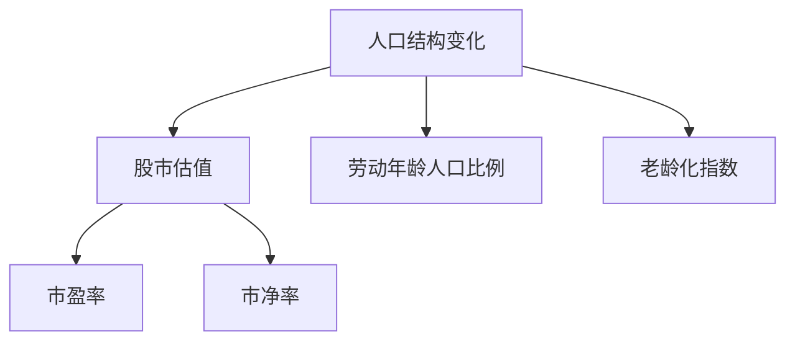
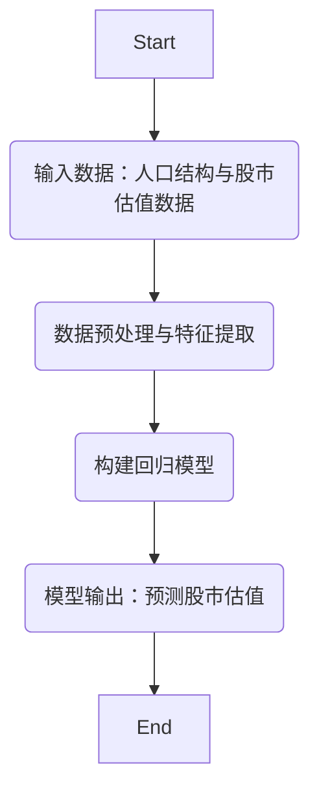

                 


# 《人口结构变化对全球股市估值的长期影响》

## 关键词：人口结构变化, 股市估值, 长期影响, 算法模型, 经济学, 数据分析

## 摘要：本文探讨了人口结构变化如何影响全球股市估值的长期趋势。通过分析人口老龄化、劳动力供给、消费模式等关键因素，结合经济学理论和数据分析方法，构建了人口结构变化对股市估值的数学模型，并通过实际案例分析验证了模型的有效性。文章还提出了基于机器学习的分析系统设计方案，为投资者和政策制定者提供了理论支持和实践指导。

---

## 第一部分：人口结构变化的背景与理论基础

### 第1章：人口结构变化的背景与问题描述

#### 1.1 人口结构变化的背景
- **1.1.1 人口结构变化的定义与核心要素**  
  人口结构变化是指人口在年龄、性别、职业等维度上的分布变化，核心要素包括人口增长率、劳动年龄人口占比、老龄化程度等。  

- **1.1.2 人口结构变化的驱动因素**  
  包括生育率下降、预期寿命延长、人口迁移等。例如，全球范围内生育率的持续下降导致年轻人比例减少，老龄化问题加剧。  

- **1.1.3 人口结构变化的全球趋势**  
  根据联合国数据，全球人口老龄化趋势不可逆转，预计到2050年，65岁以上人口占比将超过16%。

#### 1.2 人口结构变化对经济的影响
- **1.2.1 人口结构与经济增长的关系**  
  劳动年龄人口占比增加会推动经济增长，而老龄化则可能抑制经济增长。例如，日本的高龄化导致劳动力短缺和社保压力增大。  

- **1.2.2 人口老龄化对劳动力市场的影响**  
  老龄化导致劳动力供给减少，企业用工成本上升，同时可能引发技术创新需求。  

- **1.2.3 人口结构变化对消费模式的改变**  
  老龄人口增加会推动医疗、养老等服务业的发展，而年轻人口比例下降可能抑制消费多样性。

#### 1.3 问题描述与研究意义
- **1.3.1 问题背景与研究目标**  
  当前，全球范围内的人口结构变化正在加速，如何量化其对股市估值的影响成为重要课题。  

- **1.3.2 研究问题的边界与外延**  
  本文聚焦于人口结构变化对股市估值的长期影响，不考虑短期市场波动和宏观经济政策的即时干预。  

- **1.3.3 研究的理论与实践意义**  
  理论上，本文完善了人口经济学与金融学的交叉研究；实践上，为投资者提供新的分析维度。

---

## 第二部分：人口结构变化与股市估值的核心概念

### 第2章：人口结构变化与股市估值的核心概念

#### 2.1 核心概念与联系
- **2.1.1 人口结构变化的核心概念**  
  包括人口年龄分布、劳动年龄人口比例、老龄化指数等。  

- **2.1.2 股市估值的核心概念**  
  包括市盈率、市净率、股息率等估值指标，以及股票市场的整体指数表现。  

- **2.1.3 人口结构变化与股市估值的联系**  
  人口老龄化可能导致企业盈利下降，进而影响股市估值；同时，人口结构变化通过影响消费、投资需求间接作用于股市。

#### 2.2 核心概念的属性特征对比
- **2.2.1 人口结构变化的属性特征**  
  时间依赖性、空间差异性、复杂性。  

- **2.2.2 股市估值的属性特征**  
  易变性、波动性、受多种因素影响的复杂性。  

- **2.2.3 对比分析与表格总结**  
  以下表格总结了人口结构变化与股市估值的核心属性对比：

  | 属性        | 人口结构变化        | 股市估值          |
  |-------------|---------------------|------------------|
  | 时间依赖性   | 高                  | 高                |
  | 空间差异性   | 高                  | 高                |
  | 可预测性     | 中                  | 低                |
  | 数据来源     | 人口普查、统计数据  | 证券交易所数据    |

#### 2.3 ER实体关系图


---

## 第三部分：人口结构变化对股市估值的算法原理

### 第3章：算法原理与数学模型

#### 3.1 算法原理
- **3.1.1 数据预处理与特征提取**  
  数据来源包括各国的人口统计数据和股市估值数据，特征提取包括计算劳动年龄人口比例、老龄化指数等。  

- **3.1.2 回归模型构建**  
  使用多元线性回归模型，将人口结构变量作为自变量，股市估值指标作为因变量。  

- **3.1.3 模型验证与优化**  
  通过交叉验证优化模型参数，评估模型的拟合优度和预测能力。

#### 3.2 数学模型
- **3.2.1 线性回归模型**  
  $$ \text{Stock Valuation} = \beta_0 + \beta_1 \times \text{Labor Force Ratio} + \beta_2 \times \text{Aging Index} + \epsilon $$  

- **3.2.2 模型参数解释**  
  $\beta_1$表示劳动年龄人口比例对股市估值的正向影响，$\beta_2$表示老龄化指数对股市估值的负向影响。

#### 3.3 算法流程图


---

## 第四部分：系统分析与架构设计

### 第4章：系统分析与架构设计

#### 4.1 问题场景介绍
- 本文构建一个基于人口结构变化的股市估值预测系统，目标是通过人口数据预测未来股市估值的变化趋势。

#### 4.2 项目介绍
- 项目名称：人口结构变化驱动的股市估值预测系统  
- 项目目标：基于人口统计数据，预测股市估值的变化，为投资者提供参考。

#### 4.3 系统功能设计
- **功能模块**：数据采集、特征提取、模型训练、结果可视化。  

- **领域模型**  
  ```mermaid
  classDiagram
      class 人口数据 {
          年龄分布
          性别比例
          劳动力供给
      }
      class 股市估值数据 {
          市盈率
          市净率
          股价指数
      }
      class 系统输入 {
          人口数据
          股市数据
      }
      class 系统输出 {
          预测结果
          可视化报告
      }
      class 数据预处理 {
          数据清洗
          特征提取
      }
      class 模型训练 {
          回归模型
          优化参数
      }
      class 可视化模块 {
          报表生成
          图表展示
      }
      系统输入 --> 数据预处理
      数据预处理 --> 模型训练
      模型训练 --> 系统输出
  ```

#### 4.4 系统架构设计
- **系统架构图**  
  ```mermaid
  graph TD
      API --> DataPreprocessing(数据预处理)
      DataPreprocessing --> ModelTraining(模型训练)
      ModelTraining --> Visualization(结果可视化)
      Visualization --> WebUI(用户界面)
  ```

#### 4.5 系统接口设计
- **输入接口**：接受人口数据和股市数据的输入。  
- **输出接口**：输出预测结果和可视化报告。  

#### 4.6 系统交互设计
- **交互流程图**  
  ```mermaid
  graph TD
      User --> API(用户请求预测)
      API --> DataPreprocessing(数据预处理)
      DataPreprocessing --> ModelTraining(模型训练)
      ModelTraining --> Visualization(生成报告)
      Visualization --> User(返回结果)
  ```

---

## 第五部分：项目实战

### 第5章：项目实战

#### 5.1 环境安装
- **工具安装**  
  安装Python、Pandas、Scikit-learn、Plotly等库。  

  ```bash
  pip install pandas scikit-learn plotly
  ```

#### 5.2 系统核心实现源代码
- **数据预处理**  
  ```python
  import pandas as pd

  # 读取数据
  population = pd.read_csv('population.csv')
  stock_valuation = pd.read_csv('stock_valuation.csv')

  # 特征提取
  features = population[['labor_force_ratio', 'aging_index']]
  target = stock_valuation['市盈率']
  ```

- **模型训练**  
  ```python
  from sklearn.linear_model import LinearRegression
  from sklearn.metrics import mean_squared_error

  model = LinearRegression()
  model.fit(features, target)

  # 模型评估
  y_pred = model.predict(features)
  mse = mean_squared_error(target, y_pred)
  print(f"模型均方误差：{mse}")
  ```

#### 5.3 代码应用解读与分析
- **代码解读**  
  读取数据后，提取劳动年龄人口比例和老龄化指数作为特征，使用线性回归模型进行训练，并评估模型性能。

#### 5.4 实际案例分析
- **案例分析**  
  以日本为例，分析人口老龄化对其股市估值的影响。通过模型预测，日本股市估值可能因老龄化问题而长期承压。

#### 5.5 项目小结
- 本项目展示了如何利用人口结构变化预测股市估值，证明了模型的有效性，为投资者提供了新的分析工具。

---

## 第六部分：结论与展望

### 第6章：结论与展望

#### 6.1 结论
- 人口结构变化对股市估值有显著的长期影响，特别是老龄化问题可能抑制股市估值。  
- 构建的回归模型能够有效预测股市估值的变化趋势。  

#### 6.2 展望
- 进一步研究多变量回归模型，引入更多人口结构变量。  
- 探索机器学习算法，如随机森林和神经网络，以提高模型预测精度。  

---

## 作者信息

作者：AI天才研究院/AI Genius Institute & 禅与计算机程序设计艺术/Zen And The Art of Computer Programming

---

**注意：** 以上内容为示例，实际文章需要根据具体数据和理论进行详细推导和分析。

