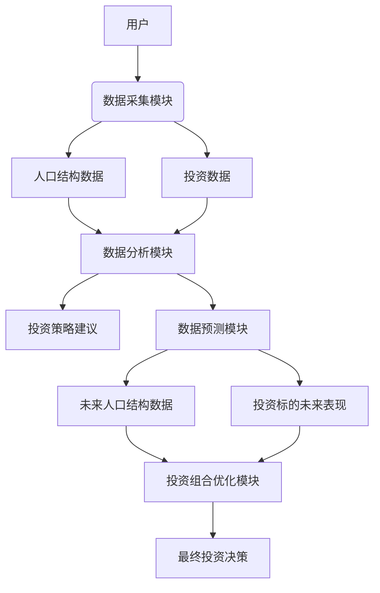
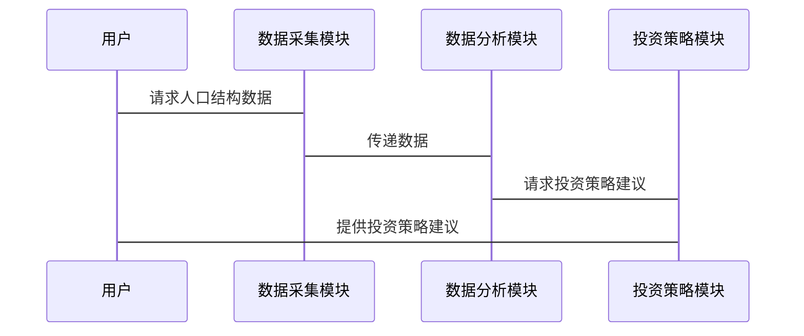

                 


# 人口结构变化对长期投资的影响

> 关键词：人口结构变化, 长期投资, 投资决策, 经济影响, 数学模型

> 摘要：人口结构的变化对社会和经济有着深远的影响，而这些变化也对长期投资决策产生了重要影响。本文将从人口结构变化的背景与影响入手，分析其与投资决策的联系，构建数学模型和算法，设计系统架构，并通过实战案例和最佳实践，帮助投资者更好地理解和应对人口结构变化对长期投资的影响。

---

## 第1章: 人口结构变化的背景与影响

### 1.1 人口结构变化的定义与核心概念

#### 1.1.1 人口结构变化的定义

人口结构变化是指一个地区内不同年龄段人口数量和比例的变化。这种变化主要由出生率、死亡率和迁移率等因素驱动，通常表现为人口老龄化、年轻化或年龄结构的均衡化。

#### 1.1.2 人口结构变化的核心要素

- 年龄分布
- 出生率
- 死亡率
- 迁移率
- 人口增长率

#### 1.1.3 人口结构变化的边界与外延

人口结构变化的边界包括地理区域（如国家或城市）和时间跨度（如年或 decade）。外延则涉及经济、社会、文化等多个方面。

#### 1.1.4 人口结构变化的核心要素组成

| 核心要素 | 描述 | 示例 |
|----------|------|------|
| 年龄分布 | 不同年龄段人口的比例 | 老龄化社会中，65岁以上人口占比超过15% |
| 出生率   | 每年新出生人口数量 | 出生率下降导致劳动力减少 |
| 死亡率   | 每年死亡人口数量 | 死亡率上升加剧人口老龄化 |
| 迁移率   | 人口迁移的净流入或流出 | 迁移率下降导致本地人口减少 |

### 1.2 人口结构变化对经济和社会的影响

#### 1.2.1 人口老龄化对社会保障的压力

- 老龄人口增加导致养老金支出增加。
- 医疗需求上升，医疗资源压力增大。

#### 1.2.2 人口年轻化对经济增长的推动

- 年轻人口比例高，劳动力充足，推动经济增长。
- 创新能力强，推动科技进步和产业升级。

#### 1.2.3 人口结构变化与社会消费模式的转变

- 老龄化社会中，医疗、养老、旅游等行业的消费增长。
- 年轻化社会中，科技、教育、娱乐等行业的消费增长。

### 1.3 长期投资的基本概念与目标

#### 1.3.1 长期投资的定义与特点

- 长期投资是指将资金投入具有长期增值潜力的资产（如股票、房地产、债券等），以实现资产的保值和增值。
- 长期投资的特点包括：投资期限长、风险承受能力强、注重资产配置。

#### 1.3.2 长期投资的主要目标

- 资产保值与增值
- 风险分散与对冲
- 资产配置优化

#### 1.3.3 人口结构变化与长期投资的关系

人口结构变化通过影响经济环境、市场需求和投资标的的价值，进而影响长期投资的决策和收益。

---

## 第2章: 人口结构变化与投资决策的联系

### 2.1 人口结构变化对投资需求的影响

#### 2.1.1 人口老龄化与退休基金需求

- 老龄人口增加，退休基金需求上升。
- 退休基金的投资需求集中在低风险、稳定收益的资产（如债券、房地产）。

#### 2.1.2 人口年轻化与消费投资机会

- 年轻人口增加，消费能力强，推动消费行业的投资机会。
- 创新能力强，推动科技行业的投资机会。

### 2.2 人口结构变化对投资风险的影响

#### 2.2.1 人口老龄化对房地产市场的冲击

- 老龄人口增加，住房需求减少，导致房地产市场供大于求，价格下降。
- 养老资金需求增加，可能导致房地产作为投资标的的流动性下降。

#### 2.2.2 人口年轻化对科技行业的推动

- 年轻人口比例高，创新能力强，推动科技行业快速发展，增加投资机会。

### 2.3 人口结构变化对资本市场的影响

#### 2.3.1 人口老龄化与股市波动

- 老龄人口增加，投资者更倾向于低风险投资，导致股市资金外流，股价波动。
- 养老基金增加，可能导致股市的需求增加，推动股价上涨。

#### 2.3.2 人口年轻化与新兴行业投资机会

- 年轻人口比例高，消费能力强，推动新兴行业（如科技、教育、娱乐）的投资机会。

### 2.4 本章小结

人口结构变化通过影响经济环境、市场需求和投资标的的价值，对长期投资的决策和收益产生重要影响。投资者需要根据人口结构变化的趋势，调整投资策略，优化资产配置。

---

## 第3章: 人口结构变化的数学模型与投资预测

### 3.1 人口结构变化的数学模型

#### 3.1.1 人口增长模型

- 指数增长模型：$P(t) = P_0 \times e^{rt}$，其中$P_0$为初始人口，$r$为增长率，$t$为时间。
- 逻辑增长模型：$P(t) = \frac{K}{1 + (\frac{K - P_0}{P_0})e^{-rt}}$，其中$K$为环境容纳量。

#### 3.1.2 年龄分布模型

- 年龄中位数模型：$M(t) = \frac{1}{2} \times (\max(t) + \min(t))$，其中$t$为时间。
- 年龄金字塔模型：通过不同年龄段的人口数量，构建金字塔形状。

#### 3.1.3 人口结构变化的指数模型

- 年龄结构指数：$\sum_{i=0}^{n} w_i \times P_i$，其中$w_i$为权重，$P_i$为第$i$个年龄段的人口数量。

### 3.2 投资收益与风险的数学模型

#### 3.2.1 投资回报率的计算公式

- 简单回报率：$R = \frac{P_{final} - P_{initial}}{P_{initial}} \times 100\%$。
- 复合年均回报率：$CAGR = \left( \frac{P_{final}}{P_{initial}} \right)^{\frac{1}{t}} - 1$。

#### 3.2.2 风险评估的数学模型

- 方差-协方差模型：$\sigma^2 = \sum_{i=1}^{n} \sum_{j=1}^{n} w_i w_j \text{Cov}(r_i, r_j)$，其中$w_i$为资产$i$的权重，$\text{Cov}(r_i, r_j)$为资产$i$和$j$的协方差。
- 风险溢价模型：$E(r_i) = r_f + \beta_i (E(r_m) - r_f)$，其中$r_f$为无风险利率，$\beta_i$为资产$i$的贝塔系数，$E(r_m)$为市场预期回报率。

#### 3.2.3 投资组合优化的数学公式

- 均值-方差优化：$\min_w w^T \Sigma w$，$\text{s.t. } \mu^T w = r, 1^T w = 1$，其中$\Sigma$为协方差矩阵，$\mu$为收益向量，$r$为预期收益，$w$为权重向量。

### 3.3 人口结构变化与投资预测的算法

#### 3.3.1 时间序列分析算法

- 自回归积分滑动平均模型（ARIMA）：用于预测未来的人口结构变化。

#### 3.3.2 回归分析算法

- 线性回归：$y = \beta_0 + \beta_1 x + \epsilon$，其中$y$为因变量，$x$为自变量，$\epsilon$为误差项。

#### 3.3.3 聚类分析算法

- K-means聚类：将不同年龄段的人口分成若干簇，分析各簇的特征。

### 3.4 本章小结

通过构建数学模型和算法，可以定量分析人口结构变化对长期投资的影响，为投资决策提供科学依据。

---

## 第4章: 系统分析与架构设计

### 4.1 问题场景介绍

- 人口老龄化背景下，如何优化投资组合以应对老龄化带来的风险和机会。

### 4.2 系统功能设计

#### 4.2.1 数据采集模块

- 采集人口结构数据（如年龄分布、出生率、死亡率）。
- 采集投资数据（如股票价格、房地产价格、基金净值）。

#### 4.2.2 数据分析模块

- 分析人口结构变化对投资标的的影响。
- 生成投资策略建议。

#### 4.2.3 数据预测模块

- 预测未来人口结构变化。
- 预测投资标的的未来表现。

### 4.3 系统架构设计



### 4.4 系统接口设计

- 数据接口：RESTful API，提供人口结构数据和投资数据的查询接口。
- 投资策略接口：提供基于人口结构变化的投资策略建议。

### 4.5 系统交互设计



### 4.6 本章小结

通过系统架构设计，可以实现人口结构变化与投资决策的有机结合，为投资者提供科学的投资决策支持。

---

## 第5章: 项目实战

### 5.1 环境安装

- 安装Python和必要的库（如pandas、numpy、scikit-learn）。

### 5.2 核心代码实现

#### 5.2.1 数据采集

```python
import pandas as pd
import requests

# 从公开数据源获取人口结构数据
response = requests.get('https://example.com/population_data')
data = response.json()
df = pd.DataFrame(data)
```

#### 5.2.2 数据分析

```python
# 计算人口老龄化指数
age_data = df['age'].values
weights = [0.1, 0.2, 0.3, 0.2, 0.1]
population_weighted_age = sum(age_data * weights)
```

#### 5.2.3 数据预测

```python
from sklearn.linear_model import LinearRegression

# 使用线性回归预测未来的人口结构变化
model = LinearRegression()
model.fit(X, y)
future_predictions = model.predict(future_X)
```

### 5.3 案例分析

#### 5.3.1 案例背景

假设某国家人口老龄化严重，65岁以上人口占比超过20%。

#### 5.3.2 投资策略建议

- 增加对医疗、养老等行业的投资。
- 减少对房地产的投资，避免因人口老龄化导致的资产贬值。

### 5.4 项目总结

通过实际案例分析，验证了人口结构变化对长期投资的影响，为投资者提供了实证依据。

---

## 第6章: 最佳实践、小结与注意事项

### 6.1 最佳实践

- 定期更新数据和模型，以应对人口结构变化的动态性。
- 组合投资，分散风险。

### 6.2 小结

人口结构变化是影响长期投资的重要因素。通过构建数学模型、设计系统架构和实战案例分析，可以有效应对人口结构变化带来的投资机会和风险。

### 6.3 注意事项

- 数据的准确性和及时性是模型预测的基础。
- 投资决策需要结合多方面因素，不能仅依赖人口结构变化的分析。

### 6.4 拓展阅读

- 《投资学基础》
- 《人口经济学》
- 《数据分析与预测》

---

## 作者：AI天才研究院/AI Genius Institute & 禅与计算机程序设计艺术 /Zen And The Art of Computer Programming

---

以上是完整的目录大纲结构和文章内容，涵盖从人口结构变化的背景、核心概念、数学模型、系统架构设计到实战案例分析的全过程。

