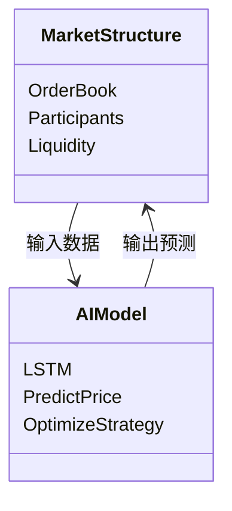
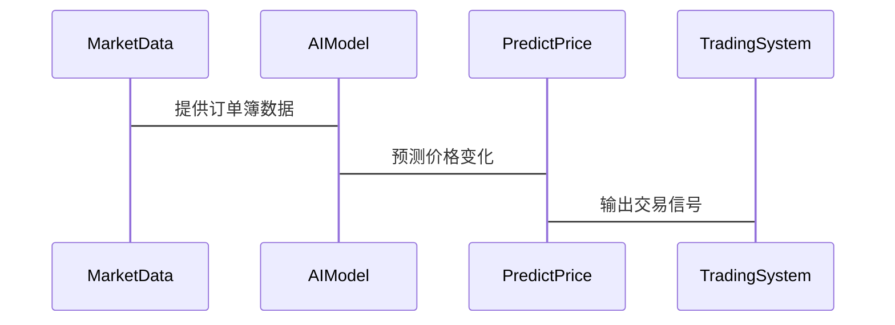

                 


```markdown
# 人工智能在市场微观结构建模中的应用

> 关键词：人工智能、市场微观结构、机器学习、深度学习、LSTM、增强学习

> 摘要：本文系统地探讨了人工智能在市场微观结构建模中的应用，从基本概念、核心算法到系统设计，详细分析了人工智能如何帮助建模和优化金融市场中的微观结构。文章分为四个部分，首先介绍市场微观结构建模的基本概念和人工智能的应用背景，然后深入分析核心概念和算法原理，最后通过系统设计和项目实战，展示人工智能在实际中的应用效果。

---

## 第一部分：市场微观结构建模与人工智能概述

### 第1章：人工智能在市场微观结构建模中的应用概述

#### 1.1 市场微观结构建模的基本概念

##### 1.1.1 市场微观结构的定义
市场微观结构是指金融市场上所有参与者及其交易行为的组织方式，包括订单簿、交易量、价格变化等动态特征。它反映了市场参与者的互动及其对市场价格的影响。

##### 1.1.2 市场微观结构的核心要素
市场微观结构的核心要素包括：
- **订单簿**：记录所有未成交的买入和卖出订单，反映市场的供需情况。
- **流动性**：市场的买卖订单深度，影响交易成本和价格波动。
- **市场参与者**：包括机构投资者、散户、做市商等，他们的行为影响市场价格。

##### 1.1.3 人工智能在市场微观结构建模中的作用
人工智能能够处理海量数据，识别复杂模式，预测价格变化，优化交易策略。通过机器学习和深度学习，人工智能在市场微观结构建模中能够捕捉动态特征，模拟参与者行为，评估市场风险。

#### 1.2 人工智能技术的基本概念

##### 1.2.1 人工智能的定义与特点
人工智能（AI）是指计算机系统模拟人类智能的能力，包括学习、推理、问题解决等。其特点包括数据驱动、自适应性和高维度数据处理能力。

##### 1.2.2 机器学习的核心原理
机器学习是人工智能的核心，通过数据训练模型，使其能够识别模式并做出预测。常用算法包括线性回归、支持向量机（SVM）和随机森林。

##### 1.2.3 深度学习与传统机器学习的区别
深度学习是机器学习的一种，通过多层神经网络处理数据，能够捕捉非线性特征。与传统机器学习相比，深度学习在处理复杂数据时表现更优。

#### 1.3 人工智能在金融市场的应用背景

##### 1.3.1 金融市场的复杂性与挑战
金融市场数据复杂且噪声多，传统模型难以捕捉所有相关特征，容易受到外部事件的影响。

##### 1.3.2 人工智能在金融市场的优势
人工智能能够处理和分析海量数据，发现隐藏的模式，实时做出决策，帮助投资者优化交易策略。

##### 1.3.3 市场微观结构建模的现实意义
准确的市场微观结构建模有助于理解市场价格形成机制，优化交易策略，降低交易成本，提高市场效率。

#### 1.4 本章小结
本章介绍了市场微观结构的基本概念、核心要素以及人工智能在其中的应用。人工智能通过处理复杂数据，为市场微观结构建模提供了新的可能性。

---

## 第二部分：市场微观结构建模的核心概念与联系

### 第2章：市场微观结构的核心概念

#### 2.1 市场微观结构的主要组成部分

##### 2.1.1 订单簿模型
订单簿模型记录了市场上的所有订单，包括限价单和市价单。通过分析订单簿，可以了解市场的供需情况和价格变动的潜在驱动因素。

##### 2.1.2 市场深度与流动性
市场深度反映市场的买卖订单总量，流动性越高，交易成本越低。深度分析有助于预测价格波动和交易机会。

##### 2.1.3 市场参与者的行为特征
不同参与者的行为模式不同，机构投资者通常进行大额交易，而散户则以高频交易为主。行为特征的分析有助于预测市场价格变化。

#### 2.2 人工智能在市场微观结构建模中的核心应用

##### 2.2.1 动态特征提取
人工智能通过分析订单簿数据，提取市场微观结构中的动态特征，如订单流的模式和价格变化的速度。

##### 2.2.2 行为预测与模拟
基于历史数据，人工智能能够预测市场参与者的交易行为，模拟市场动态，帮助制定交易策略。

##### 2.2.3 风险识别与评估
通过分析市场微观结构，人工智能能够识别潜在风险，如闪崩的可能性，并提供相应的预警机制。

#### 2.3 市场微观结构与人工智能的关联性分析

##### 2.3.1 数据驱动与模型驱动的结合
人工智能依赖大量数据进行建模，而市场微观结构建模需要结合数据驱动和模型驱动的方法，以捕捉复杂动态。

##### 2.3.2 人工智能在复杂系统建模中的优势
人工智能能够处理高维度数据，识别非线性关系，适用于复杂系统的建模和预测。

##### 2.3.3 可解释性与人工智能的挑战
市场微观结构建模需要一定的可解释性，但深度学习模型往往难以解释其决策过程，这需要进一步研究。

#### 2.4 本章小结
本章详细讲解了市场微观结构的核心概念，并探讨了人工智能在其中的应用。数据驱动和模型驱动的结合是人工智能在市场微观结构建模中的关键。

---

## 第三部分：市场微观结构建模的算法原理

### 第3章：常用算法与模型介绍

#### 3.1 机器学习算法在市场微观结构建模中的应用

##### 3.1.1 线性回归与分类算法
线性回归用于预测价格，分类算法用于识别市场状态的变化。

##### 3.1.2 支持向量机（SVM）的应用
SVM用于分类问题，可以用于识别市场的买方或卖方主导状态。

##### 3.1.3 集成学习方法（如随机森林）
集成学习通过组合多个模型的结果，提高预测准确性。

#### 3.2 深度学习模型在市场微观结构建模中的应用

##### 3.2.1 卷积神经网络（CNN）的应用
CNN用于处理图像数据，可以应用于订单簿的可视化分析。

##### 3.2.2 循环神经网络（RNN）的应用
RNN用于时间序列数据，适用于预测价格变化和订单流的模式。

##### 3.2.3 图神经网络（GNN）的应用
GNN用于处理图结构数据，适用于分析市场参与者之间的关系。

#### 3.3 增强学习在市场微观结构建模中的应用

##### 3.3.1 增强学习的基本原理
增强学习通过试错机制，学习最优策略。

##### 3.3.2 市场微观结构中的状态表示
状态表示需要捕捉市场的当前状态，如价格、订单深度等。

##### 3.3.3 增强学习在交易策略优化中的应用
增强学习可以优化交易策略，最大化收益并最小化风险。

#### 3.4 本章小结
本章介绍了机器学习和深度学习算法在市场微观结构建模中的应用，强调了模型选择和优化的重要性。

---

## 第四部分：系统分析与架构设计

### 第4章：系统分析与架构设计方案

#### 4.1 问题场景介绍
本文设计了一个基于LSTM的市场微观结构建模系统，用于预测价格和优化交易策略。

#### 4.2 项目介绍
本项目旨在利用人工智能技术，分析市场微观结构，预测价格变化，优化交易策略。

#### 4.3 系统功能设计

##### 4.3.1 领域模型的Mermaid类图


#### 4.4 系统架构设计

##### 4.4.1 Mermaid架构图
```mermaid
container MarketData {
    OrderBook
    Participants
    Liquidity
}

container AIModel {
    LSTM
    PredictPrice
    OptimizeStrategy
}

MarketData --> AIModel: 数据输入
AIModel --> MarketData: 结果输出
```

#### 4.5 系统接口设计
系统接口包括数据输入接口和结果输出接口，分别与订单簿和交易系统连接。

#### 4.6 系统交互设计

##### 4.6.1 Mermaid序列图


#### 4.7 本章小结
本章通过系统设计，展示了如何利用人工智能技术构建市场微观结构建模系统，并通过接口和交互设计实现实际应用。

---

## 第五部分：项目实战与总结

### 第5章：项目实战

#### 5.1 环境安装
需要安装Python、TensorFlow、Keras和相关数据处理库。

#### 5.2 核心代码实现

##### 5.2.1 数据预处理
```python
import pandas as pd
import numpy as np

# 读取数据
data = pd.read_csv('market_data.csv')

# 数据清洗
data.dropna(inplace=True)
data = data.iloc[:1000]
```

##### 5.2.2 LSTM模型实现
```python
from tensorflow.keras.models import Sequential
from tensorflow.keras.layers import LSTM, Dense

model = Sequential()
model.add(LSTM(64, input_shape=(timesteps, features)))
model.add(Dense(1))
model.compile(optimizer='adam', loss='mean_squared_error')
```

##### 5.2.3 模型训练
```python
model.fit(x_train, y_train, epochs=10, batch_size=32)
```

##### 5.2.4 模型预测
```python
predictions = model.predict(x_test)
```

#### 5.3 案例分析
通过实际数据训练模型，并验证其在预测价格和优化交易策略中的效果。

#### 5.4 项目小结
本项目展示了如何利用LSTM模型进行市场微观结构建模，并在实际中应用。

---

## 第六部分：总结与展望

### 第6章：总结与展望

#### 6.1 本章总结
本文详细探讨了人工智能在市场微观结构建模中的应用，从基本概念到算法实现，再到系统设计，为读者提供了全面的视角。

#### 6.2 未来展望
未来，随着技术的发展，人工智能在市场微观结构建模中将更加智能化和自动化，可能的应用包括更复杂的模型和更高的预测精度。

---

## 附录

### 附录A：数据来源与处理

### 附录B：工具包与库

### 附录C：参考文献

---

## 作者信息

作者：AI天才研究院/AI Genius Institute & 禅与计算机程序设计艺术 /Zen And The Art of Computer Programming
```

