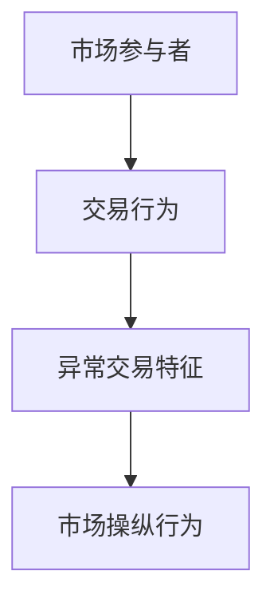
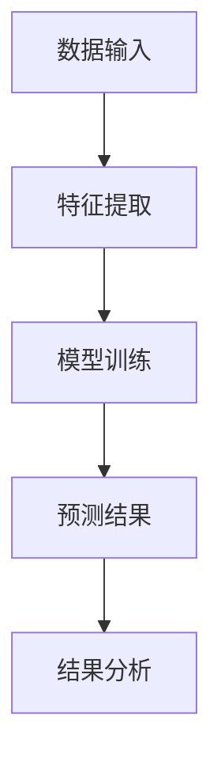
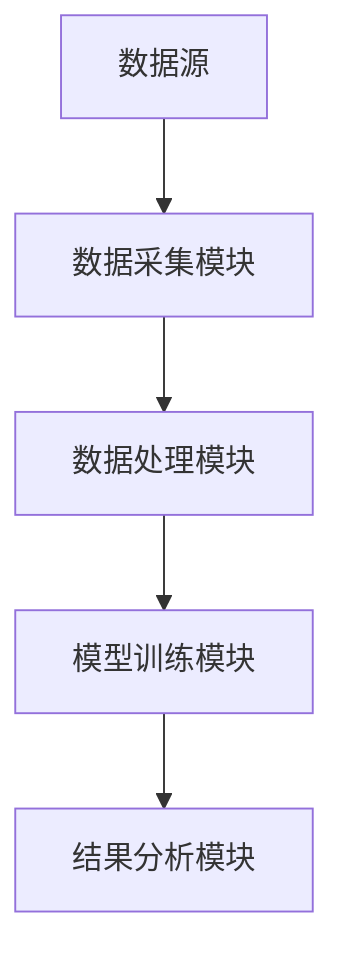
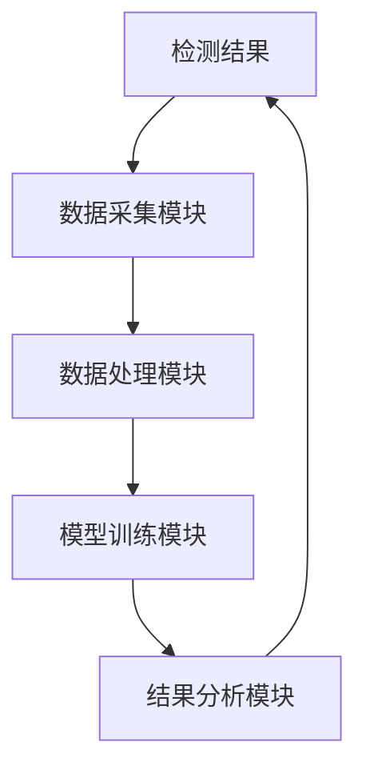

                 


# 人工智能在市场操纵行为检测中的应用

> 关键词：市场操纵行为，人工智能，机器学习，深度学习，金融监管，时间序列分析

> 摘要：本文详细探讨了人工智能在市场操纵行为检测中的应用，从背景、数据特征、算法原理到系统设计和项目实战，为读者提供了一个全面的视角。通过机器学习和深度学习算法，能够有效地识别异常交易行为，提高市场监管的效率和准确性。

---

## 第一部分：人工智能在市场操纵行为检测中的应用概述

### 第1章：市场操纵行为与人工智能检测的背景

#### 1.1 市场操纵行为的定义与特征

##### 1.1.1 市场操纵行为的法律定义

市场操纵行为是指通过虚假的交易行为，影响市场价格走势，从中牟取不正当利益的行为。例如，通过大量买入或卖出某只股票，制造市场恐慌或虚假的需求，诱使其他投资者跟风交易。

##### 1.1.2 市场操纵行为的主要类型

- **拉高出货**：先用大笔资金拉升股价，再逐步卖出获利。
- **压低股价**：通过大量抛售股票，制造股价下跌的假象，吸引投资者低价买入，随后拉升股价获利。
- **对倒交易**：交易双方相互买卖，制造交易量的假象，影响市场价格。

##### 1.1.3 市场操纵行为的危害与影响

- 破坏市场公平性，损害投资者利益。
- 影响市场正常运行，扭曲价格信号。
- 降低市场信心，影响经济发展。

#### 1.2 人工智能在金融领域的应用背景

##### 1.2.1 人工智能技术的发展与进步

人工智能技术的快速发展，特别是在自然语言处理、计算机视觉和时间序列分析领域的突破，为金融领域的应用提供了强大的工具。大数据技术的进步使得金融机构能够处理和分析海量的交易数据，为市场行为分析提供了丰富的数据来源。

##### 1.2.2 人工智能在金融监管中的潜力

传统的金融监管手段依赖于人工分析，效率低下且容易受到主观因素的影响。人工智能技术能够快速处理大量数据，发现隐藏的模式和异常行为，提高监管效率和准确性。

##### 1.2.3 人工智能在市场行为分析中的优势

- 能够实时监控市场动态，快速识别异常交易行为。
- 利用深度学习技术分析复杂的时间序列数据，捕捉市场操纵行为的特征。
- 通过自然语言处理技术分析新闻、社交媒体等非结构化数据，辅助判断市场情绪和潜在的操纵行为。

#### 1.3 本章小结

本章通过介绍市场操纵行为的定义、类型及其危害，阐述了人工智能技术在金融监管中的潜力和优势，为后续章节的分析奠定了基础。

---

## 第二部分：市场操纵行为检测的核心概念与联系

### 第2章：市场操纵行为检测的核心概念

#### 2.1 数据特征分析

##### 2.1.1 市场操纵行为的交易特征

- **高频交易**：短时间内大量买卖同一股票，制造价格波动。
- **大额交易**：短时间内出现大额交易，可能涉嫌拉高出货或压低股价。
- **交易量异常**：交易量突然激增或骤减，与市场整体走势不符。

##### 2.1.2 异常交易行为的识别

- 识别异常交易行为的关键在于发现交易数据中的异常模式，如价格走势、交易量和市场参与者行为的异常。
- 异常交易行为可能包括：价格在短时间内大幅波动、交易量异常集中、订单簿的异常变化等。

##### 2.1.3 时间序列数据的特征提取

- 时间序列数据具有时序性、趋势性、周期性等特征。
- 通过滑动窗口技术、差分等方法，可以提取时间序列数据中的有用特征，如均值、方差、自相关系数等。

#### 2.2 算法原理与联系

##### 2.2.1 机器学习算法在市场行为分析中的应用

- 机器学习算法能够从历史数据中学习市场行为模式，识别异常交易特征。
- 常用的算法包括支持向量机（SVM）、随机森林（Random Forest）、XGBoost等。
- 机器学习算法适用于处理结构化数据，能够快速识别交易数据中的异常特征。

##### 2.2.2 深度学习算法的优势与局限性

- 深度学习算法（如LSTM、Transformer）能够处理复杂的时间序列数据，捕捉市场操纵行为的复杂模式。
- 深度学习算法需要大量的计算资源和数据支持，且模型解释性较差，可能难以满足实时检测的需求。

##### 2.2.3 算法选择与市场场景的匹配

- 根据具体的市场场景和数据类型选择合适的算法。
- 对于实时检测场景，可能更适合选择计算效率较高的机器学习算法；而对于复杂的时间序列分析，深度学习算法可能更具优势。

#### 2.3 核心概念的ER实体关系图



---

## 第三部分：人工智能算法原理与实现

### 第3章：基于机器学习的市场行为分析

#### 3.1 特征工程

##### 3.1.1 数据预处理与特征提取

- 数据清洗：去除缺失值、异常值，处理重复数据。
- 特征提取：从原始数据中提取有用的特征，如价格、成交量、订单簿信息等。
- 特征标准化：对特征进行标准化处理，使其具有相似的尺度，方便模型训练。

##### 3.1.2 异常交易特征的构建

- 通过统计方法（如均值、标准差、自相关系数等）构建异常交易特征。
- 结合时间窗口技术，提取不同时间尺度上的特征。

##### 3.1.3 特征选择与降维

- 使用特征选择方法（如递归特征消除）筛选重要特征。
- 应用主成分分析（PCA）等降维技术，减少特征维度，提高模型效率。

#### 3.2 模型选择与调优

##### 3.2.1 常见机器学习算法对比

- 支持向量机（SVM）：适用于中小规模数据，分类效果较好。
- 随机森林（Random Forest）：能够处理高维数据，具有较强的抗过拟合能力。
- XGBoost：在分类任务中表现优异，适合处理类别不平衡的数据。

##### 3.2.2 支持向量机（SVM）的应用

- SVM是一种监督学习算法，适用于分类任务。
- 在市场操纵行为检测中，可以将交易数据分为正常交易和异常交易两类。
- 通过调整惩罚参数和核函数，优化模型的分类性能。

##### 3.2.3 随机森林的优化

- 通过调整树的深度、叶子节点样本数等参数，优化随机森林的性能。
- 使用特征重要性分析，识别对市场操纵行为检测最重要的特征。

#### 3.3 算法流程图



---

### 第4章：基于深度学习的市场行为分析

#### 4.1 LSTM网络原理

##### 4.1.1 LSTM的基本结构

- LSTM（长短期记忆网络）通过引入记忆单元和门控机制，能够有效地处理时间序列数据中的长距离依赖关系。
- LSTM的基本结构包括输入门、遗忘门和输出门，分别控制信息的输入、保留和输出。

##### 4.1.2 LSTM在时间序列分析中的优势

- 能够捕捉时间序列中的长距离依赖关系。
- 适用于处理复杂的非线性时间序列数据。

##### 4.1.3 LSTM的数学模型与公式

- LSTM的核心运算包括输入门、遗忘门和输出门的计算：
  - 遗忘门：$f_t = \sigma(W_f x_t + U_f h_{t-1})$
  - 输入门：$i_t = \sigma(W_i x_t + U_i h_{t-1})$
  - 输出门：$o_t = \sigma(W_o x_t + U_o h_{t-1})$
  - 记忆单元更新：$c_t = f_t c_{t-1} + i_t \tanh(W_c x_t + U_c h_{t-1})$
  - 当前状态：$h_t = o_t \tanh(c_t)$

#### 4.2 深度学习模型实现

##### 4.2.1 模型训练流程

- 数据预处理：清洗数据，提取特征，划分训练集和测试集。
- 模型构建：定义LSTM网络结构，选择优化器和损失函数。
- 模型训练：使用训练数据训练模型，调整超参数，优化模型性能。
- 模型验证：在测试数据上验证模型的分类性能，评估模型的泛化能力。

##### 4.2.2 模型调参与优化

- 调整LSTM网络的参数，如隐藏层的大小、学习率、批次大小等。
- 使用早停法（Early Stopping）防止过拟合。
- 通过交叉验证评估模型性能，选择最优的模型。

##### 4.2.3 模型评估与验证

- 使用准确率、召回率、F1分数等指标评估模型的分类性能。
- 对比不同算法的性能，选择最优的模型。

#### 4.3 深度学习与传统机器学习的对比

##### 4.3.1 算法性能对比

- 在处理复杂的时间序列数据时，深度学习算法通常表现优于传统机器学习算法。
- 但在数据量较小的情况下，传统机器学习算法可能更优。

##### 4.3.2 计算复杂度分析

- 深度学习算法需要大量的计算资源，训练时间较长。
- 传统机器学习算法计算效率较高，适合实时检测场景。

##### 4.3.3 实际应用场景中的选择

- 对于复杂的市场操纵行为，深度学习算法可能更适合。
- 对于实时性要求较高的场景，可能需要选择计算效率较高的传统机器学习算法。

---

## 第四部分：系统架构与设计

### 第5章：系统架构与设计

#### 5.1 系统功能设计

##### 5.1.1 数据采集模块

- 从金融市场数据源（如股票交易数据、订单簿数据、新闻数据等）采集数据。
- 数据采集模块需要具备高效的数据获取能力，支持多种数据格式和接口。

##### 5.1.2 数据处理模块

- 对采集到的数据进行预处理，包括数据清洗、特征提取、数据标准化等。
- 数据处理模块需要具备灵活的配置能力，支持不同的数据处理流程。

##### 5.1.3 模型训练模块

- 使用处理后的数据训练市场操纵行为检测模型。
- 模型训练模块需要支持多种算法，能够根据不同的场景选择合适的算法。

##### 5.1.4 结果分析模块

- 对模型的输出结果进行分析，识别异常交易行为。
- 结果分析模块需要具备可视化能力，能够生成直观的报告和图表。

#### 5.2 系统架构设计图



#### 5.3 系统接口设计

- **数据接口**
  - 数据输入接口：接收金融市场数据，支持多种数据格式。
  - 数据输出接口：提供处理后的数据和模型输出结果。

- **模型接口**
  - 模型训练接口：接收训练数据，输出训练好的模型。
  - 模型预测接口：接收实时数据，输出预测结果。

#### 5.4 系统交互设计

##### 5.4.1 用户交互流程

- 用户输入金融市场数据。
- 系统处理数据，训练模型。
- 系统输出检测结果，提示市场操纵行为。

##### 5.4.2 系统交互流程图



---

## 第五部分：项目实战

### 第6章：项目实战

#### 6.1 项目环境安装

- 安装必要的Python库，如NumPy、Pandas、Scikit-learn、Keras、TensorFlow等。
- 安装数据采集工具，如Yahoo Finance API、Alpha Vantage等。

#### 6.2 系统核心实现源代码

##### 6.2.1 数据预处理代码

```python
import pandas as pd
import numpy as np

# 加载数据
data = pd.read_csv('stock_data.csv')

# 数据清洗
data.dropna()

# 特征提取
features = data[['open', 'high', 'low', 'close', 'volume']]
```

##### 6.2.2 模型训练代码

```python
from sklearn.model_selection import train_test_split
from sklearn.ensemble import RandomForestClassifier
from sklearn.metrics import accuracy_score

# 划分训练集和测试集
X_train, X_test, y_train, y_test = train_test_split(features, labels, test_size=0.2)

# 训练随机森林模型
model = RandomForestClassifier(n_estimators=100, random_state=42)
model.fit(X_train, y_train)

# 模型评估
y_pred = model.predict(X_test)
print("Accuracy:", accuracy_score(y_test, y_pred))
```

##### 6.2.3 深度学习模型代码

```python
import tensorflow as tf
from tensorflow.keras import layers

# 定义LSTM模型
model = tf.keras.Sequential()
model.add(layers.LSTM(64, input_shape=(timesteps, features)))
model.add(layers.Dense(1, activation='sigmoid'))
model.compile(loss='binary_crossentropy', optimizer='adam', metrics=['accuracy'])
```

#### 6.3 代码应用解读与分析

##### 6.3.1 数据预处理

- 数据清洗：去除缺失值和异常值，确保数据的完整性和准确性。
- 特征提取：从原始数据中提取有用的特征，如开盘价、收盘价、成交量等。
- 数据标准化：对特征进行标准化处理，使其具有相似的尺度，方便模型训练。

##### 6.3.2 模型训练

- 划分训练集和测试集：将数据分为训练集和测试集，用于模型训练和评估。
- 训练随机森林模型：使用随机森林算法训练分类模型，预测市场操纵行为。
- 深度学习模型训练：使用LSTM网络训练时间序列模型，捕捉复杂的市场行为模式。

#### 6.4 实际案例分析

##### 6.4.1 案例分析

- 使用实际的股票交易数据，训练市场操纵行为检测模型。
- 通过模型预测结果，识别潜在的市场操纵行为。
- 对比模型预测结果与实际市场行为，评估模型的准确性和有效性。

#### 6.5 项目小结

本章通过实际案例分析，展示了如何利用人工智能技术检测市场操纵行为。通过项目实战，读者可以更好地理解理论知识，并掌握实际应用的技能。

---

## 第六部分：总结与展望

### 第7章：总结与展望

#### 7.1 总结

- 本文详细介绍了人工智能在市场操纵行为检测中的应用，从背景、数据特征、算法原理到系统设计和项目实战，为读者提供了一个全面的视角。
- 通过机器学习和深度学习算法，能够有效地识别异常交易行为，提高市场监管的效率和准确性。

#### 7.2 未来展望

##### 7.2.1 算法优化

- 进一步优化深度学习算法，提高模型的解释性和计算效率。
- 研究更复杂的时间序列模型，如Transformer结构，捕捉更复杂的市场行为模式。

##### 7.2.2 数据源扩展

- 结合多源数据，如新闻、社交媒体等，提高市场行为分析的全面性。
- 利用自然语言处理技术，分析文本数据，辅助判断市场情绪和潜在的操纵行为。

##### 7.2.3 实时检测系统

- 构建实时市场操纵行为检测系统，实现对金融市场交易的实时监控。
- 结合流数据处理技术，提高系统的实时性和响应速度。

#### 7.3 最佳实践 Tips

- 在实际应用中，建议结合多种算法和技术，构建综合性的市场操纵行为检测系统。
- 定期更新模型和数据，保持系统的准确性和有效性。
- 注意数据隐私和合规性，确保系统的合法性和合规性。

#### 7.4 项目小结

通过本文的介绍，读者可以了解到人工智能在市场操纵行为检测中的潜力和应用价值。未来，随着技术的不断进步，人工智能将在金融监管领域发挥更重要的作用。

---

### 附录

#### 附录1：数学公式汇总

- 支持向量机（SVM）的优化目标：
  $$ \min_{w,b,\xi} \frac{1}{2}||w||^2 + C \sum_{i=1}^n \xi_i $$
  $$ \text{subject to } y_i(w \cdot x_i + b) \geq 1 - \xi_i, \xi_i \geq 0 $$

- 随机森林的特征重要性计算：
  $$ \text{特征重要性} = \sum_{i=1}^n (importance_i) $$

#### 附录2：系统架构图


#### 附录3：代码示例

##### 6.2.1 数据预处理代码

```python
import pandas as pd
import numpy as np

# 加载数据
data = pd.read_csv('stock_data.csv')

# 数据清洗
data.dropna()

# 特征提取
features = data[['open', 'high', 'low', 'close', 'volume']]
```

##### 6.2.2 模型训练代码

```python
from sklearn.model_selection import train_test_split
from sklearn.ensemble import RandomForestClassifier
from sklearn.metrics import accuracy_score

# 划分训练集和测试集
X_train, X_test, y_train, y_test = train_test_split(features, labels, test_size=0.2)

# 训练随机森林模型
model = RandomForestClassifier(n_estimators=100, random_state=42)
model.fit(X_train, y_train)

# 模型评估
y_pred = model.predict(X_test)
print("Accuracy:", accuracy_score(y_test, y_pred))
```

---

### 作者信息

作者：AI天才研究院/AI Genius Institute & 禅与计算机程序设计艺术 /Zen And The Art of Computer Programming

