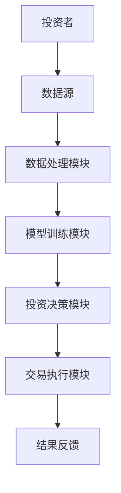
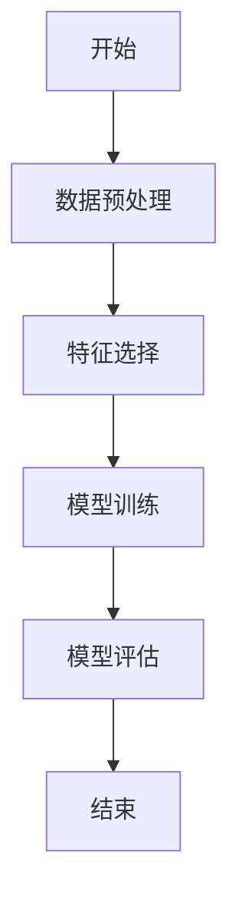
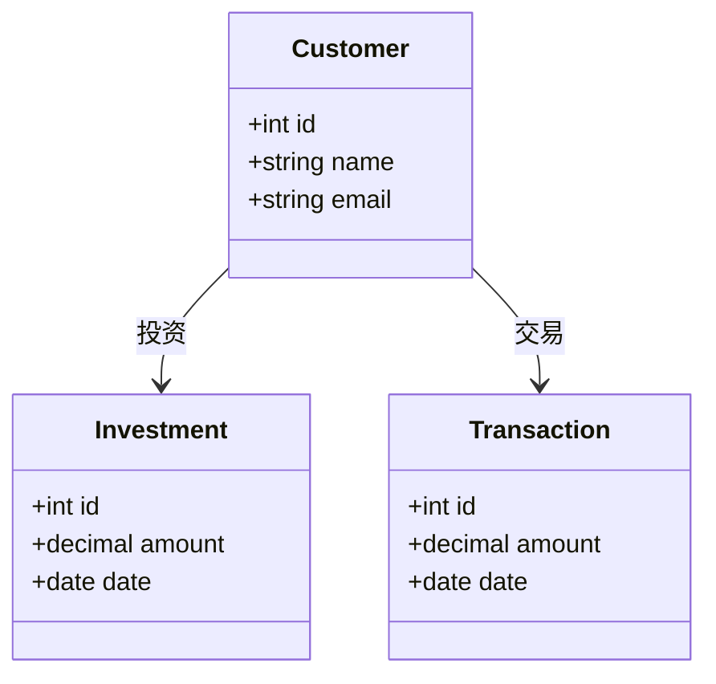
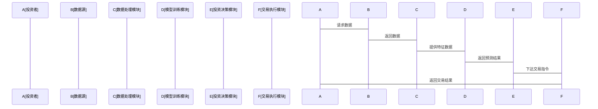

                 


# 人工智能在投资决策中的应用

> 关键词：人工智能，投资决策，机器学习，深度学习，量化交易，风险管理，数据驱动

> 摘要：人工智能在投资决策中的应用日益广泛，通过机器学习、深度学习等技术，投资者能够更高效地分析市场数据、识别投资机会并优化投资组合。本文将从人工智能的基本原理出发，探讨其在投资决策中的具体应用，包括算法选择、数据特征提取、决策机制设计、数学模型构建、系统架构设计以及实际项目案例分析等，为读者提供全面而深入的技术解析。

---

# 第1章: 人工智能与投资决策的结合

## 1.1 投资决策的复杂性与挑战
### 1.1.1 投资决策的核心问题
- **市场不确定性**：市场的波动性和不可预测性。
- **信息过载**：海量数据的处理与筛选。
- **决策效率**：如何快速做出准确的决策。

### 1.1.2 人工智能如何解决投资问题
- **数据处理能力**：AI能够快速处理和分析大量非结构化数据。
- **模式识别**：通过深度学习识别市场中的隐藏模式。
- **实时反馈机制**：AI能够根据市场变化实时调整投资策略。

### 1.1.3 人工智能在投资中的核心作用
- **数据驱动决策**：基于历史数据和实时数据进行分析。
- **自动化交易**：通过算法实现自动化的买卖决策。
- **风险管理**：AI帮助识别和规避潜在风险。

## 1.2 人工智能技术基础
### 1.2.1 机器学习简介
- **监督学习**：基于标记数据进行模型训练。
- **无监督学习**：从无标记数据中发现模式。
- **半监督学习**：结合有监督和无监督学习。

### 1.2.2 深度学习与神经网络
- **卷积神经网络（CNN）**：用于图像识别和时间序列分析。
- **循环神经网络（RNN）**：处理序列数据，如股票价格波动。
- **变换器架构（Transformer）**：用于自然语言处理和时间序列预测。

### 1.2.3 自然语言处理与图像识别
- **NLP在金融新闻中的应用**：通过新闻情感分析影响投资决策。
- **图像识别在金融文档中的应用**：识别财务报表中的数据。

## 1.3 投资决策的核心概念
### 1.3.1 数据特征分析
- **特征选择**：从大量数据中提取有用的特征。
- **特征工程**：对数据进行预处理和特征转换。
- **特征重要性评估**：通过模型评估特征对预测的影响。

### 1.3.2 算法模型选择
- **回归模型**：预测股票价格。
- **分类模型**：判断股票涨跌。
- **聚类模型**：发现市场中的相似股票。

### 1.3.3 决策机制设计
- **规则驱动的决策**：基于特定规则制定投资策略。
- **模型驱动的决策**：基于机器学习模型的预测结果。
- **混合驱动的决策**：结合规则和模型的混合策略。

## 1.4 人工智能在投资中的伦理与风险
### 1.4.1 数据隐私与合规性
- **数据收集的合法性**：确保数据来源合法。
- **数据使用的合规性**：遵守相关法律法规。

### 1.4.2 模型的可解释性
- **黑箱模型的风险**：难以解释AI决策的原因。
- **可解释性模型的应用**：如线性回归和决策树。

### 1.4.3 投资风险的可控性
- **模型的稳定性**：避免模型过拟合。
- **风险控制机制**：设定止损点和风险敞口。

## 1.5 本章小结
- 人工智能在投资中的应用解决了传统投资决策中的许多难题，但同时也带来了新的挑战，如数据隐私和模型解释性问题。

---

# 第2章: 投资决策中的核心概念与联系

## 2.1 核心概念的原理
### 2.1.1 数据特征提取
- **时间序列特征**：如均值、标准差、波动率。
- **文本特征**：如关键词提取和情感分析。
- **图像特征**：如颜色分布和形状特征。

### 2.1.2 算法模型选择
- **模型选择依据**：数据类型、任务类型、计算资源。
- **模型评估指标**：准确率、召回率、F1分数。

### 2.1.3 决策机制优化
- **决策树模型**：通过树状结构进行决策。
- **贝叶斯网络**：基于概率进行决策。
- **强化学习策略**：通过奖励机制优化决策。

## 2.2 核心概念的对比分析
### 2.2.1 不同算法的特征对比
| 算法类型 | 数据类型 | 是否需要标签 | 复杂度 |
|---------|----------|-------------|--------|
| 线性回归 | 数值型   | 需要         | 低     |
| 支持向量机 | 数值型、文本型 | 需要         | 高     |
| 随机森林 | 数值型、文本型 | 需要         | 高     |

### 2.2.2 数据特征与模型性能的关系
- **特征相关性**：相关性高的特征有助于模型性能提升。
- **特征冗余**：冗余特征可能导致模型过拟合。

### 2.2.3 决策机制的优缺点
- **规则驱动决策**：优点是可解释性强，缺点是灵活性差。
- **模型驱动决策**：优点是灵活性高，缺点是可解释性差。

## 2.3 实体关系图（ER图）架构
### 2.3.1 投资决策系统的实体关系
```mermaid
erDiagram
    customer[CUSTOMER] {
        +int id
        +string name
        +string email
    }
    investment [INVESTMENT] {
        +int id
        +decimal amount
        +date date
    }
    transaction [TRANSACTION] {
        +int id
        +decimal amount
        +date date
    }
    customer --> investment: 投资
    customer --> transaction: 交易
```

### 2.3.2 数据流与信息流向


### 2.3.3 系统架构的模块划分
- **数据采集模块**：收集市场数据和新闻。
- **数据处理模块**：清洗和预处理数据。
- **模型训练模块**：训练机器学习模型。
- **投资决策模块**：基于模型输出决策。

---

# 第3章: 人工智能算法在投资中的应用

## 3.1 机器学习算法
### 3.1.1 线性回归与逻辑回归
- **线性回归**：用于预测连续型变量，如股票价格。
- **逻辑回归**：用于分类问题，如判断股票涨跌。

### 3.1.2 支持向量机（SVM）
- **SVM原理**：通过找到最优超平面进行分类。
- **核函数**：将数据映射到高维空间。

### 3.1.3 随机森林与梯度提升树
- **随机森林**：通过集成多个决策树提高准确率。
- **梯度提升树**：通过逐步优化损失函数构建模型。

## 3.2 深度学习算法
### 3.2.1 卷积神经网络（CNN）
- **CNN结构**：卷积层、池化层、全连接层。
- **应用案例**：图像识别用于识别图表中的趋势。

### 3.2.2 循环神经网络（RNN）
- **RNN结构**：处理序列数据。
- **长短期记忆网络（LSTM）**：用于时间序列分析。

### 3.2.3 变换器架构（Transformer）
- **自注意力机制**：捕捉数据中的长距离依赖关系。
- **应用案例**：自然语言处理用于分析新闻和报告。

## 3.3 强化学习算法
### 3.3.1 Q-learning算法
- **Q值更新**：通过奖励机制更新Q值。
- **策略选择**：选择当前状态下的最优动作。

### 3.3.2 Deep Q-Network（DQN）
- **DQN结构**：深度神经网络替代传统的Q表。
- **经验回放**：通过回放历史经验提高学习效率。

### 3.3.3 政策梯度方法（Policy Gradient）
- **策略直接优化**：直接优化策略而非Q值。
- **优势函数**：通过优势函数改进策略。

## 3.4 算法流程图
### 3.4.1 机器学习算法流程


---

# 第4章: 数学模型在投资决策中的应用

## 4.1 时间序列分析
### 4.1.1 时间序列的特征
- **趋势**：长期趋势。
- **季节性**：周期性波动。
- **随机性**：不可预测的波动。

### 4.1.2 ARIMA模型
- **ARIMA原理**：自回归积分滑动平均模型。
- **模型参数**：p、d、q。

## 4.2 回归模型
### 4.2.1 线性回归
- **最小二乘法**：最小化预测值与实际值的平方差之和。

### 4.2.2 逻辑回归
- **sigmoid函数**：将线性回归输出映射到概率范围。

## 4.3 强化学习的数学基础
### 4.3.1 状态空间
- **状态表示**：将市场状态表示为向量。
- **动作空间**：可能的交易动作，如买入、卖出、持有。

### 4.3.2 奖励函数
- **即时奖励**：每次交易后的收益。
- **累积奖励**：长期收益的累计。

---

# 第5章: 投资决策系统的架构设计

## 5.1 问题场景介绍
### 5.1.1 投资决策系统的功能需求
- **数据采集**：实时采集市场数据。
- **数据处理**：清洗和预处理数据。
- **模型训练**：训练机器学习模型。
- **投资决策**：基于模型输出决策。

### 5.1.2 系统架构设计
- **模块划分**：数据采集模块、数据处理模块、模型训练模块、投资决策模块。
- **交互流程**：用户输入需求，系统输出决策建议。

## 5.2 系统功能设计
### 5.2.1 领域模型


### 5.2.2 系统架构


## 5.3 系统接口设计
### 5.3.1 API接口
- **RESTful API**：提供HTTP接口供其他系统调用。
- **WebSocket**：实时推送市场数据。

### 5.3.2 数据接口
- **数据源接口**：连接数据源，如股票交易所。
- **数据库接口**：与关系型数据库交互。

## 5.4 系统交互流程
### 5.4.1 交易执行流程


---

# 第6章: 项目实战

## 6.1 环境搭建
### 6.1.1 安装Python
- **Anaconda**：使用Anaconda安装Python和相关库。
- **虚拟环境**：创建虚拟环境，安装项目依赖。

### 6.1.2 安装依赖库
- **numpy**：数据处理库。
- **pandas**：数据分析库。
- **scikit-learn**：机器学习库。
- **tensorflow**：深度学习库。

## 6.2 数据处理
### 6.2.1 数据获取
- **Yahoo Finance API**：获取股票数据。
- **Alpha Vantage API**：获取金融数据。

### 6.2.2 数据清洗
- **处理缺失值**：填充、删除或插值。
- **标准化**：归一化处理。

## 6.3 模型实现
### 6.3.1 线性回归模型
```python
from sklearn.linear_model import LinearRegression
model = LinearRegression()
model.fit(X_train, y_train)
```

### 6.3.2 LSTM模型
```python
from tensorflow.keras.layers import LSTM, Dense
model = Sequential()
model.add(LSTM(64, input_shape=(timesteps, features)))
model.add(Dense(1))
model.compile(loss='mean_squared_error', optimizer='adam')
```

## 6.4 实验结果与分析
### 6.4.1 模型评估
- **均方误差（MSE）**：评估模型预测的准确性。
- **R平方值**：评估模型拟合的好坏。

### 6.4.2 结果可视化
- **预测值与实际值对比图**：使用matplotlib绘制。

## 6.5 项目小结
- **项目总结**：介绍项目的成功之处和不足。
- **经验教训**：总结在项目中的经验教训。
- **改进建议**：提出未来改进的方向。

---

# 第7章: 案例分析与实际应用

## 7.1 案例分析
### 7.1.1 量化交易案例
- **算法交易**：基于算法自动执行交易。
- **高频交易**：利用算法快速捕捉市场机会。

### 7.1.2 风险管理案例
- **风险评估模型**：评估投资组合的风险。
- **止损策略**：设定止损点以控制风险。

## 7.2 实际应用
### 7.2.1 股票市场预测
- **使用LSTM预测股票价格**：展示预测结果与实际价格的对比。
- **使用随机森林进行分类**：判断股票涨跌。

### 7.2.2 债券评级
- **基于文本分析进行债券评级**：使用NLP技术分析财务报告。

## 7.3 案例小结
- **案例总结**：总结案例中的关键点和经验。
- **实际应用中的注意事项**：提醒读者在实际应用中需要注意的问题。

---

# 第8章: 人工智能在投资中的未来展望

## 8.1 未来趋势
### 8.1.1 更复杂的模型
- **更大的模型**：如更大规模的Transformer模型。
- **多模态模型**：结合文本、图像等多种数据源。

### 8.1.2 更高效的数据处理
- **分布式计算**：利用分布式计算提高处理效率。
- **边缘计算**：在边缘设备上进行实时计算。

## 8.2 挑战与建议
### 8.2.1 模型解释性
- **可解释性的重要性**：确保模型的决策可以被理解。
- **可解释性方法**：如SHAP值和LIME解释。

### 8.2.2 数据隐私与安全
- **数据隐私保护**：确保数据在处理和传输过程中的安全性。
- **合规性要求**：遵守相关法律法规。

## 8.3 投资者的最佳实践
### 8.3.1 深入理解模型
- **模型的工作原理**：了解模型如何做出决策。
- **模型的局限性**：知道模型在哪些方面可能出错。

### 8.3.2 结合人工分析
- **人工分析与AI结合**：利用AI辅助人工决策。
- **持续监控模型表现**：定期评估模型的性能。

## 8.4 本章小结
- **总结全文**：回顾全文的主要内容。
- **展望未来**：预测人工智能在投资中的未来发展方向。

---

# 作者：AI天才研究院/AI Genius Institute & 禅与计算机程序设计艺术 /Zen And The Art of Computer Programming

