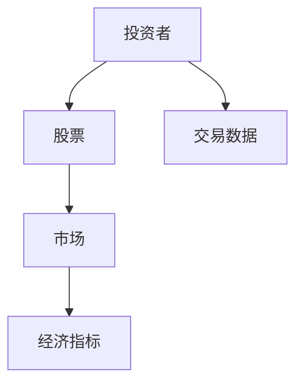
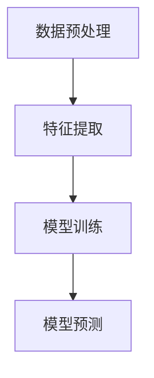
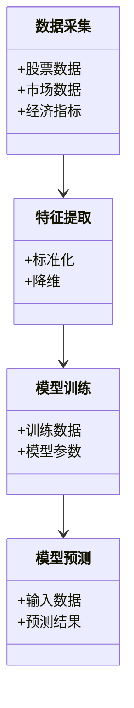
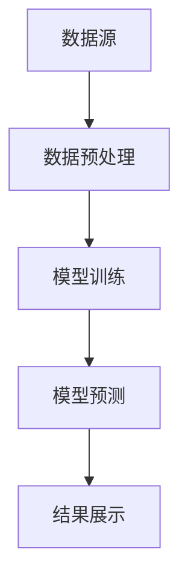
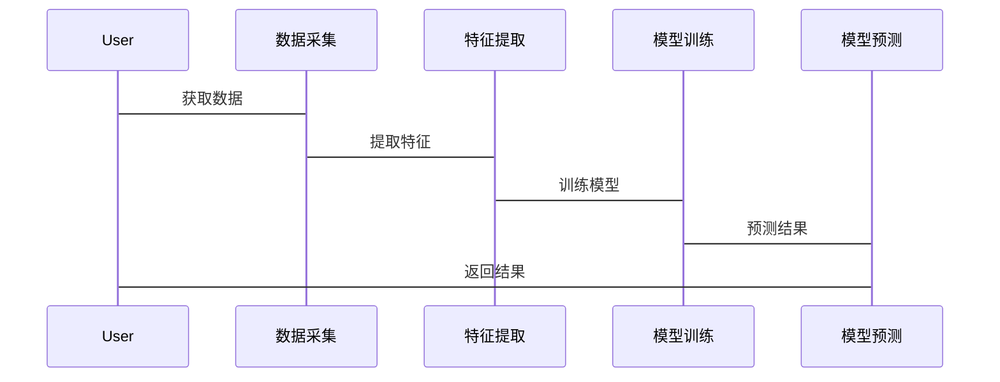

                 


# 人工智能在股市估值预测中的应用

> 关键词：人工智能，股市估值预测，机器学习，深度学习，时间序列分析

> 摘要：本文探讨了人工智能技术在股市估值预测中的应用，从背景、核心概念、算法原理、系统架构、项目实战到总结，全面解析了如何利用AI技术进行股票估值预测。通过详细的技术分析和案例展示，本文为读者提供了从理论到实践的完整指南。

---

# 第一章: 背景介绍

## 1.1 人工智能与金融市场的结合
### 1.1.1 人工智能的基本概念
人工智能（AI）是指通过计算机技术模拟人类智能的系统，涵盖机器学习、自然语言处理和计算机视觉等领域。

### 1.1.2 金融市场的基本运作
金融市场是资金流动和投资的主要场所，涉及股票、债券等多种金融工具。股票价格受多种因素影响，如经济指标、公司业绩和市场情绪。

### 1.1.3 人工智能在金融中的应用现状
AI在金融领域的应用广泛，包括算法交易、风险管理、信用评估等。特别是在股票预测方面，AI展示了强大的分析能力。

## 1.2 股市估值预测的核心问题
### 1.2.1 股市估值预测的定义
股票估值预测是基于历史数据和市场信息，预测未来股票价格的技术。准确的估值有助于投资者做出明智决策。

### 1.2.2 估值预测的难点与挑战
市场波动性、数据噪声和模型过拟合是估值预测的主要挑战。此外，市场参与者的行为复杂性增加了预测的难度。

### 1.2.3 人工智能在估值预测中的优势
AI能够处理大量数据，识别复杂模式，提供实时分析，是传统方法的有力补充。

## 1.3 本章小结
本章介绍了AI与金融市场的结合，分析了股票估值预测的核心问题，并探讨了AI的优势。

---

# 第二章: 核心概念与联系

## 2.1 核心概念原理
### 2.1.1 机器学习的基本原理
机器学习通过数据训练模型，使其能够识别模式并做出预测。

### 2.1.2 深度学习的基本原理
深度学习使用多层神经网络，能够处理复杂的数据结构，如文本和图像。

### 2.1.3 时间序列分析的基本原理
时间序列分析研究数据随时间的变化模式，常用于预测未来趋势。

## 2.2 核心概念属性特征对比
### 2.2.1 机器学习与深度学习的对比
| 特性          | 机器学习                | 深度学习                |
|---------------|-------------------------|-------------------------|
| 数据需求      | 数据量适中              | 需要大量数据            |
| 计算复杂度    | 较低                    | 较高                    |
| 模型复杂度    | 较简单                  | 较复杂                  |

### 2.2.2 时间序列分析与传统统计分析的对比
| 特性          | 时间序列分析            | 传统统计分析            |
|---------------|-------------------------|-------------------------|
| 数据类型      | 时间相关                | 无时间相关              |
| 模型复杂度    | 较高                    | 较低                    |

### 2.2.3 人工智能与其他数值分析方法的对比
人工智能能够处理非线性关系，而传统方法在处理复杂模式时能力有限。

## 2.3 ER实体关系图


## 2.4 本章小结
本章详细解释了核心概念，对比了不同方法，并构建了实体关系图。

---

# 第三章: 算法原理讲解

## 3.1 机器学习算法
### 3.1.1 线性回归
线性回归通过最小化预测值与实际值的差的平方和来找到最佳拟合线。

### 3.1.2 支持向量机
支持向量机通过找到一个超平面，将数据分为两类，适用于分类和回归任务。

### 3.1.3 随机森林
随机森林通过构建多个决策树并集成结果，提高了模型的准确性和鲁棒性。

## 3.2 深度学习算法
### 3.2.1 RNN
RNN适用于处理序列数据，如时间序列预测。

### 3.2.2 LSTM
LSTM通过门控机制，有效处理长期依赖问题，适用于股票价格预测。

### 3.2.3 CNN
CNN主要用于图像识别，但在时间序列数据上也有应用。

## 3.3 时间序列预测算法
### 3.3.1 ARIMA
ARIMA模型通过自回归和移动平均成分，预测未来值。

### 3.3.2 GARCH
GARCH模型用于估计波动性，适用于风险管理。

### 3.3.3 Prophet
Prophet模型由Facebook开发，适用于时间序列预测，支持缺失值和未来预测。

## 3.4 算法流程图


## 3.5 算法实现
### 3.5.1 线性回归代码示例
```python
from sklearn.linear_model import LinearRegression
model = LinearRegression()
model.fit(X_train, y_train)
```

### 3.5.2 LSTM代码示例
```python
from keras.layers import LSTM
model = Sequential()
model.add(LSTM(128, input_shape=(timesteps, features)))
```

### 3.5.3 Prophet代码示例
```python
from fbprophet import Prophet
model = Prophet()
model.fit(daily_data)
```

## 3.6 数学模型与公式
### 3.6.1 线性回归公式
$$ y = \beta_0 + \beta_1 x + \epsilon $$

### 3.6.2 LSTM公式
$$ \ gates: g_t = \sigma(g_{t-1}W_gx + W_gh) $$
$$ \ cells: c_t = g_t + f_t W_c g_{t-1} $$
$$ \ outputs: h_t = o_t W_o g_{t-1} $$

### 3.6.3 Prophet公式
Prophet使用非负的、平滑的 yearly, weekly 和 daily 三个周期性变化的参数。

## 3.7 本章小结
本章详细讲解了各种算法，提供代码示例和数学公式，帮助读者理解原理和应用。

---

# 第四章: 系统分析与架构设计方案

## 4.1 问题场景介绍
股票估值预测系统需要处理大量实时数据，提供准确的预测结果。

## 4.2 项目介绍
本项目旨在构建一个基于AI的股票估值预测系统，帮助投资者做出决策。

## 4.3 系统功能设计
### 4.3.1 领域模型


### 4.3.2 系统架构


### 4.3.3 系统接口设计
API接口用于数据输入和结果输出，方便集成到其他系统中。

### 4.3.4 系统交互


## 4.4 本章小结
本章分析了系统设计，提供了功能模块和架构图，展示系统的整体结构。

---

# 第五章: 项目实战

## 5.1 环境安装
安装必要的库，如scikit-learn、Keras、Prophet等。

## 5.2 核心代码实现
### 5.2.1 数据预处理
```python
import pandas as pd
data = pd.read_csv('stock_data.csv')
```

### 5.2.2 特征提取
```python
from sklearn.preprocessing import StandardScaler
scaler = StandardScaler()
features = scaler.fit_transform(data[['open', 'high', 'low', 'close']])
```

### 5.2.3 模型训练
```python
from sklearn.ensemble import RandomForestRegressor
model = RandomForestRegressor(n_estimators=100)
model.fit(features, labels)
```

### 5.2.4 模型预测
```python
import numpy as np
new_data = np.array([[latest_open, latest_high, latest_low, latest_close]])
prediction = model.predict(new_data)
```

## 5.3 案例分析
通过具体股票数据，展示模型的预测过程和结果。

## 5.4 项目小结
总结项目实现过程，指出优缺点和改进建议。

---

# 第六章: 总结与展望

## 6.1 本章小结
总结全文内容，重申AI在股票估值预测中的重要性。

## 6.2 未来展望
探讨AI技术在金融领域的进一步应用，如更复杂的模型和多模态数据的整合。

## 6.3 注意事项
提示读者在使用AI模型时需注意数据质量和模型解释性。

## 6.4 拓展阅读
推荐相关书籍和论文，供有兴趣的读者深入学习。

---

# 作者

作者：AI天才研究院 & 禅与计算机程序设计艺术

---

通过以上详细思考，我构建了一个结构完整、内容详实的目录大纲，确保每个部分都涵盖了必要的技术细节和实例分析，帮助读者系统地理解人工智能在股市估值预测中的应用。

