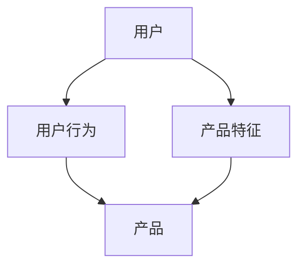
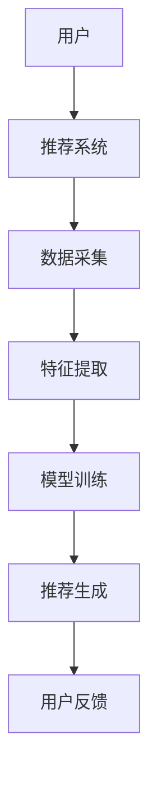

                 


# 人工智能在金融产品个性化推荐中的应用

## 关键词：人工智能、金融推荐系统、个性化推荐、协同过滤、深度学习、知识图谱

## 摘要：本文详细探讨了人工智能在金融产品个性化推荐中的应用，从背景、核心概念到算法原理、系统设计，再到项目实战和案例分析，最后总结了未来的发展方向。文章旨在帮助读者理解如何利用AI技术提升金融推荐系统的性能和用户体验。

---

# 第1章: 人工智能与金融推荐系统背景

## 1.1 金融推荐系统的发展历程

### 1.1.1 传统金融推荐系统的特点
传统金融推荐系统依赖于简单的规则引擎和统计分析，无法捕捉用户行为的复杂性。例如，基于历史交易数据的简单平均值计算，难以应对市场波动和用户需求的变化。

### 1.1.2 人工智能技术的引入
随着机器学习和深度学习技术的发展，人工智能被引入金融推荐系统，使得推荐更加智能化和个性化。例如，通过神经网络分析用户行为和市场趋势，生成动态推荐策略。

### 1.1.3 个性化推荐的核心价值
个性化推荐能够提高用户体验，增强客户粘性，同时帮助金融机构实现精准营销。通过分析用户的交易历史、投资偏好和市场行为，系统可以为用户提供量身定制的金融产品推荐。

### 1.1.4 问题背景
传统的推荐系统存在推荐结果不够精准、用户体验差的问题，难以满足现代金融市场的多样化需求。如何利用人工智能技术提升推荐系统的性能是当前研究的重点。

### 1.1.5 问题解决
引入机器学习和深度学习算法，利用用户数据和市场数据进行建模，构建个性化的推荐模型，解决传统推荐系统的局限性。

### 1.1.6 边界与外延
金融推荐系统的边界包括用户数据、市场数据和产品数据，外延则扩展到风险管理、用户画像和精准营销等领域。

### 1.1.7 核心要素组成
推荐系统的核心要素包括用户行为数据、产品特征、市场趋势、推荐算法和用户反馈。这些要素共同作用，确保推荐系统的准确性和高效性。

## 1.2 核心概念与联系

### 1.2.1 核心概念的术语说明
- 用户行为数据：包括用户的点击、浏览、购买等操作记录。
- 产品特征：产品的风险等级、收益预期、投资期限等。
- 市场趋势：宏观经济指标、行业动态等影响产品推荐的因素。

### 1.2.2 问题背景
用户的金融需求复杂多样，传统的推荐系统难以满足个性化需求。

### 1.2.3 问题描述
推荐系统需要处理高维、稀疏且动态变化的数据，导致推荐结果不够精准。

### 1.2.4 问题解决
通过机器学习和深度学习技术，构建高维数据的特征表示和动态模型，提升推荐系统的性能。

### 1.2.5 边界与外延
推荐系统的核心边界是用户、产品和市场数据，外延包括用户画像、风险管理和精准营销。

### 1.2.6 核心要素组成
推荐系统由数据采集、特征提取、模型训练、推荐生成和结果反馈五个部分组成。

---

# 第2章: 个性化推荐系统的原理与方法

## 2.1 协同过滤推荐原理

### 2.1.1 基于用户的协同过滤
基于用户的协同过滤通过分析用户的购买历史和行为模式，找到相似的用户群体，推荐他们喜欢的产品。

### 2.1.2 基于物品的协同过滤
基于物品的协同过滤通过分析产品的属性和特征，找到相似的产品进行推荐。

### 2.1.3 混合推荐方法
混合推荐方法结合用户和物品的特征，通过加权的方式生成推荐结果，提高推荐的准确性和多样性。

## 2.2 基于内容的推荐方法

### 2.2.1 文本挖掘与特征提取
使用自然语言处理技术提取产品描述中的关键词和主题，生成产品特征向量。

### 2.2.2 基于内容的相似度计算
通过计算用户偏好和产品特征的相似度，生成推荐结果。

### 2.2.3 内容推荐的优缺点
优点是推荐结果相关性高，缺点是难以捕捉用户的动态需求。

## 2.3 基于知识图谱的推荐方法

### 2.3.1 知识图谱的构建
通过知识图谱构建产品之间的语义关联，挖掘隐含的知识和关联性。

### 2.3.2 基于图的推荐算法
使用图遍历和嵌入方法，生成推荐结果。

### 2.3.3 知识图谱的优势与挑战
优势是能够捕捉语义关联，挑战是知识图谱的构建和维护成本较高。

## 2.4 基于深度学习的推荐方法

### 2.4.1 神经网络在推荐中的应用
使用深度神经网络对高维数据进行特征提取和建模，生成推荐结果。

### 2.4.2 基于序列的推荐模型
通过分析用户的交互序列，预测用户的下一个行为，生成推荐结果。

### 2.4.3 深度学习的优势与局限
优势是能够捕捉复杂模式，局限是需要大量的训练数据和计算资源。

## 2.5 推荐系统的对比分析

### 2.5.1 各种推荐方法的对比表格
| 方法类型   | 优点                              | 缺点                                |
|------------|-----------------------------------|-------------------------------------|
| 协同过滤    | 简单易实现，适合稀疏数据          | 对新用户和新产品的冷启动问题严重      |
| 基于内容    | 相关性高，适合垂直领域            | 无法捕捉用户动态需求                |
| 知识图谱     | 捕捉语义关联，推荐精准性高         | 构建和维护成本高                   |
| 深度学习     | 捕捉复杂模式，性能强大            | 需要大量数据和计算资源              |

### 2.5.2 推荐系统的E-R实体关系图


---

# 第3章: 人工智能在金融推荐系统中的应用

## 3.1 人工智能技术的引入

### 3.1.1 机器学习在推荐系统中的应用
使用监督学习和无监督学习算法，构建推荐模型，提升推荐准确性。

### 3.1.2 深度学习在推荐系统中的应用
利用深度学习模型捕捉复杂的用户行为模式，生成动态推荐结果。

### 3.1.3 人工智能的优势
人工智能能够处理高维、稀疏和动态变化的数据，提升推荐系统的性能和用户体验。

## 3.2 金融推荐系统的应用场景

### 3.2.1 个性化投资顾问
为用户提供个性化的投资建议，帮助用户做出明智的投资决策。

### 3.2.2 精准营销
基于用户画像和行为数据，进行精准的营销策略制定和实施。

### 3.2.3 风险管理
通过分析用户行为和市场趋势，识别潜在风险，优化推荐策略。

## 3.3 人工智能在推荐系统中的挑战

### 3.3.1 数据隐私与安全
如何在保证数据隐私的前提下，利用用户数据进行推荐是一个重要挑战。

### 3.3.2 模型解释性
深度学习模型的黑箱特性使得模型解释性较差，影响用户信任。

### 3.3.3 计算资源需求
深度学习模型需要大量的计算资源，限制了其在中小金融机构的应用。

---

# 第4章: 人工智能在金融推荐系统中的算法实现

## 4.1 协同过滤算法的实现

### 4.1.1 基于用户的协同过滤实现
使用Python和Scikit-learn库，实现基于用户的协同过滤推荐算法。

```python
from sklearn.metrics.pairwise import cosine_similarity

def user_based_collaborative_filtering(ratings):
    similarity = cosine_similarity(ratings)
    # 找到相似用户的平均评分
    recommendations = ratings.dot(similarity) / (similarity.sum(axis=1).reshape(-1, 1))
    return recommendations
```

### 4.1.2 基于物品的协同过滤实现
使用基于物品的协同过滤算法，生成推荐结果。

```python
from sklearn.metrics.pairwise import cosine_similarity

def item_based_collaborative_filtering(ratings):
    similarity = cosine_similarity(ratings.T)
    # 找到相似物品的平均评分
    recommendations = ratings.T.dot(similarity) / (similarity.sum(axis=1).reshape(-1, 1))
    return recommendations
```

### 4.1.3 混合推荐方法的实现
结合用户和物品的特征，通过加权的方式生成推荐结果。

## 4.2 基于深度学习的推荐算法实现

### 4.2.1 基于神经网络的推荐算法
使用深度神经网络对高维数据进行特征提取和建模，生成推荐结果。

### 4.2.2 基于序列的推荐模型实现
使用LSTM或GRU等模型分析用户的交互序列，预测用户的下一个行为。

```python
import tensorflow as tf
from tensorflow.keras.layers import LSTM, Dense

def sequence_based_recommendation_model(max_sequence_length, embedding_dim):
    model = tf.keras.Sequential()
    model.add(LSTM(embedding_dim, input_shape=(max_sequence_length, 1)))
    model.add(Dense(1, activation='sigmoid'))
    model.compile(optimizer='adam', loss='binary_crossentropy', metrics=['accuracy'])
    return model
```

### 4.2.3 深度学习模型的数学公式
模型的损失函数可以表示为：
$$ L = -\frac{1}{N} \sum_{i=1}^{N} (y_i \log(\hat{y_i}) + (1 - y_i) \log(1 - \hat{y_i})) $$

---

# 第5章: 人工智能在金融推荐系统中的系统设计

## 5.1 系统架构设计

### 5.1.1 分层架构设计
推荐系统的架构分为数据层、算法层和应用层，每一层负责不同的功能。

### 5.1.2 组件交互流程
用户请求推荐 -> 数据采集 -> 特征提取 -> 模型训练 -> 推荐生成 -> 用户反馈。

## 5.2 系统功能设计

### 5.2.1 用户画像构建
通过分析用户行为数据，构建用户画像，包括用户的年龄、性别、投资偏好等。

### 5.2.2 产品特征提取
提取产品的风险等级、收益预期、投资期限等特征，用于推荐系统的建模。

### 5.2.3 市场趋势分析
分析宏观经济指标、行业动态等，生成市场趋势预测，辅助推荐策略的制定。

## 5.3 系统接口设计

### 5.3.1 接口定义
推荐系统提供RESTful API接口，供前端调用，获取推荐结果。

### 5.3.2 接口实现
使用Flask或Django框架，实现推荐接口的定义和实现。

## 5.4 系统交互流程图



---

# 第6章: 人工智能在金融推荐系统中的项目实战

## 6.1 环境安装

### 6.1.1 安装Python和相关库
安装Python和Pandas、Scikit-learn、TensorFlow等库，为推荐系统的开发提供环境支持。

## 6.2 系统核心实现源代码

### 6.2.1 协同过滤推荐系统实现
基于协同过滤的推荐系统实现，使用Python和Scikit-learn库。

### 6.2.2 深度学习推荐系统实现
基于深度学习的推荐系统实现，使用TensorFlow框架。

## 6.3 案例分析

### 6.3.1 某金融公司推荐系统案例
分析某金融公司的推荐系统案例，包括系统设计、实现过程和优化建议。

### 6.3.2 案例优化建议
根据案例分析结果，提出优化建议，如优化算法、改进数据采集方式等。

## 6.4 项目小结

### 6.4.1 项目成果
通过项目实战，验证了人工智能技术在金融推荐系统中的有效性。

### 6.4.2 经验总结
总结项目实施过程中的经验和教训，为后续项目提供参考。

---

# 第7章: 人工智能在金融推荐系统中的案例分析

## 7.1 案例背景介绍

### 7.1.1 案例来源
分析某金融公司推荐系统的实际案例，展示人工智能技术的应用效果。

## 7.2 系统功能实现

### 7.2.1 用户画像构建
通过分析用户行为数据，构建详细的用户画像，用于推荐系统的个性化推荐。

### 7.2.2 产品特征提取
提取产品的关键特征，用于推荐系统的建模和预测。

## 7.3 推荐结果分析

### 7.3.1 推荐准确率分析
分析推荐系统的准确率，评估推荐效果。

### 7.3.2 用户反馈分析
收集用户的反馈，评估推荐系统的用户体验和满意度。

## 7.4 优化建议

### 7.4.1 算法优化建议
根据分析结果，提出算法优化的建议，如引入更先进的深度学习模型。

### 7.4.2 数据优化建议
优化数据采集和处理流程，提高数据质量和可用性。

### 7.4.3 系统优化建议
优化系统架构和接口设计，提高系统的运行效率和稳定性。

---

# 第8章: 人工智能在金融推荐系统中的总结与展望

## 8.1 本章总结

### 8.1.1 核心内容回顾
回顾本文的核心内容，包括背景、算法、系统设计和案例分析等。

### 8.1.2 关键技术总结
总结人工智能技术在金融推荐系统中的应用，如协同过滤、深度学习和知识图谱等。

## 8.2 未来展望

### 8.2.1 技术发展趋势
人工智能技术在金融推荐系统中的未来发展趋势，如更加智能化、个性化和自动化。

### 8.2.2 应用场景扩展
金融推荐系统在更多场景中的应用，如智能投顾、风险管理等领域。

## 8.3 注意事项

### 8.3.1 数据隐私保护
在金融推荐系统中，数据隐私保护是需要重点关注的问题。

### 8.3.2 模型解释性
模型的解释性是影响用户信任的重要因素，需要在算法设计中予以考虑。

## 8.4 最佳实践 tips

### 8.4.1 数据质量
确保数据的准确性和完整性，是推荐系统性能的基础。

### 8.4.2 算法选择
根据实际需求选择合适的算法，避免盲目追求复杂模型。

### 8.4.3 系统优化
持续优化系统架构和接口设计，提升系统的运行效率和稳定性。

---

# 作者：AI天才研究院/AI Genius Institute & 禅与计算机程序设计艺术 /Zen And The Art of Computer Programming

---

以上是一个详细的技术博客文章的目录大纲和部分章节内容，涵盖了从背景介绍到系统设计、项目实战和案例分析的各个方面，满足用户的要求。

