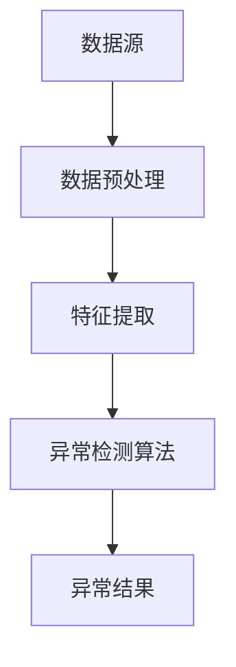
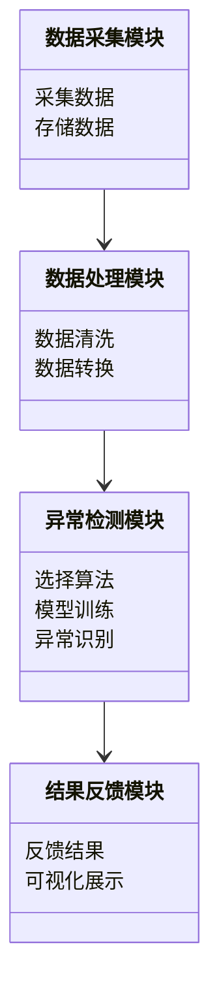
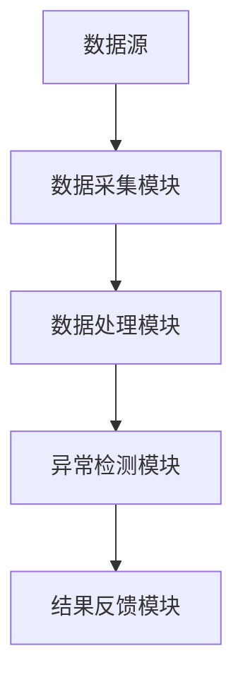
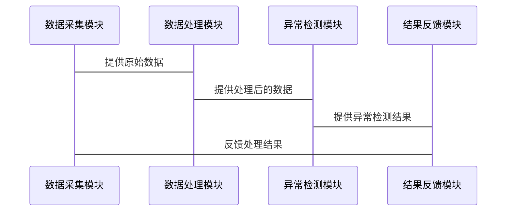

                 


# 人工智能在高频数据异常检测中的应用

> 关键词：人工智能，异常检测，高频数据，机器学习，深度学习，数据处理

> 摘要：本文深入探讨了人工智能在高频数据异常检测中的应用，从背景介绍、核心概念、算法原理到系统架构设计和项目实战，全面分析了高频数据异常检测的关键技术与实现方案。通过结合理论与实践，本文为读者提供了从理论理解到实际应用的完整知识体系。

---

## 第1章: 高频数据异常检测的背景与核心概念

### 1.1 异常检测的定义与问题背景

#### 1.1.1 什么是异常检测
异常检测（Outlier Detection）是指在数据中识别出与大多数数据点显著不同的样本或数据模式。这些异常值可能是错误数据、噪声或具有特殊意义的信号。

#### 1.1.2 异常检测的应用场景
- 金融领域：检测 fraudulent transactions（欺诈交易）、市场异常波动。
- 网络安全：识别入侵行为、异常流量。
- 健康医疗：发现异常生理指标、疾病早期预警。
- 智慧城市：监控交通、环境数据中的异常情况。

#### 1.1.3 高频数据的特点与挑战
高频数据通常具有以下特点：
- 数据采集频率高：例如每秒采集数千甚至数万个数据点。
- 数据量大：短时间内积累大量数据。
- 数据实时性要求高：需要快速处理和响应。
- 数据噪声多：高频数据容易受到环境噪声干扰。
- 数据稀疏性：某些情况下数据可能存在缺失或稀疏分布。

### 1.2 高频数据的定义与特点

#### 1.2.1 高频数据的定义
高频数据指的是在短时间内采集的大量数据，通常用于需要实时分析和快速响应的场景。例如，股票交易中的高频交易数据、物联网设备的实时传感器数据。

#### 1.2.2 高频数据的特征分析
- 数据时间序列性：数据通常以时间序列为基础。
- 数据连续性：高频数据往往需要连续采集和处理。
- 数据多样性：涉及多个特征维度，数据结构复杂。

#### 1.2.3 高频数据处理的难点
- 数据量大：需要高效的存储和处理方案。
- 数据实时性：需要实时处理和反馈。
- 数据质量：需要处理噪声和缺失值。

### 1.3 异常检测的核心目标与边界

#### 1.3.1 异常检测的目标
- 识别异常值：发现与正常数据模式不符的样本。
- 提供预警：及时发现潜在风险或异常事件。
- 支持决策：为后续处理提供数据依据。

#### 1.3.2 异常检测的边界与外延
- 异常检测的范围：从单变量到多变量，从时间序列到空间数据。
- 异常检测的类型：点异常、上下文异常、集体异常。

#### 1.3.3 异常检测的分类与场景
- 点异常：单个数据点的异常。
- 时间序列异常：时间序列中的突变或趋势变化。
- 集群异常：数据集中某个子集的异常。

### 1.4 高频数据异常检测的核心要素

#### 1.4.1 数据采集与预处理
- 数据采集：高频数据通常需要高效的采集机制。
- 数据清洗：处理噪声、缺失值和重复数据。
- 数据转换：将数据转换为适合算法处理的形式。

#### 1.4.2 异常检测算法选择
- 算法选择：根据数据特点和应用场景选择合适的算法。
- 算法评估：通过准确率、召回率等指标评估算法性能。

#### 1.4.3 结果解释与反馈机制
- 结果可视化：将异常检测结果以图表形式展示。
- 反馈机制：将异常信息反馈到系统或用户端。

### 1.5 本章小结
本章从背景和概念入手，详细介绍了异常检测的定义、应用场景、高频数据的特点以及异常检测的核心目标与实现要素。通过这些内容，读者可以对高频数据异常检测有一个全面的了解。

---

## 第2章: 高频数据异常检测的核心概念

### 2.1 异常检测的基本原理

#### 2.1.1 基于统计的异常检测原理
基于统计的方法通过计算数据的分布特性来判断异常值。例如：
- Z-Score：衡量数据点与均值的距离。
- 算术平均数与标准差：通过设定阈值判断异常值。

#### 2.1.2 基于机器学习的异常检测原理
基于机器学习的方法通过训练模型来学习正常数据的分布，然后识别异常数据。例如：
- Isolation Forest：通过构建随机森林来隔离异常点。
- One-Class SVM：通过支持向量机学习正常数据的分布。

#### 2.1.3 基于深度学习的异常检测原理
基于深度学习的方法通过神经网络提取数据的深层特征，然后识别异常。例如：
- Autoencoder：通过重构损失判断异常。
- LSTM：通过时间序列的预测误差判断异常。

### 2.2 异常检测的主要分类

#### 2.2.1 离群点检测
离群点检测（Point Anomaly Detection）关注单个数据点的异常性。例如：
- 数据点的某个特征值远超出正常范围。

#### 2.2.2 异常时间序列检测
异常时间序列检测（Time Series Anomaly Detection）关注时间序列中的突变或趋势变化。例如：
- 股票价格的突然波动。
- 网络流量的异常 spike。

#### 2.2.3 异常事件检测
异常事件检测（Event Anomaly Detection）关注数据集中某个子集的异常行为。例如：
- 多个传感器同时出现异常读数。
- 多个交易行为的异常组合。

### 2.3 高频数据异常检测的挑战

#### 2.3.1 数据量大与实时性要求
高频数据通常意味着数据量大且需要实时处理，这对算法的效率提出了更高的要求。

#### 2.3.2 数据噪声与稀疏性
高频数据往往伴随着大量噪声，同时可能因为设备故障或环境干扰导致数据稀疏。

#### 2.3.3 模型更新与可解释性
异常检测模型需要不断更新以适应数据分布的变化，同时需要具备一定的可解释性以便于调试和优化。

### 2.4 异常检测的核心概念与联系

#### 2.4.1 实体关系图


### 2.5 本章小结
本章详细介绍了异常检测的基本原理和分类，并分析了高频数据异常检测面临的挑战。通过这些内容，读者可以理解异常检测的核心概念和其在高频数据中的具体应用。

---

## 第3章: 高频数据异常检测的主流算法

### 3.1 基于统计的异常检测算法

#### 3.1.1 Z-Score方法
Z-Score方法通过计算数据点与均值的距离来判断异常值：
$$ Z = \frac{X - \mu}{\sigma} $$
其中，$\mu$ 是均值，$\sigma$ 是标准差。

#### 3.1.2 算术平均数与标准差方法
通过设定一个阈值，当数据点偏离均值超过一定标准差时，判定为异常：
$$ \mu = \frac{1}{n}\sum_{i=1}^{n}x_i $$
$$ \sigma = \sqrt{\frac{1}{n}\sum_{i=1}^{n}(x_i - \mu)^2} $$

#### 3.1.3 程度检验法
通过计算数据点与整体数据的偏离程度来判断异常值。

### 3.2 基于机器学习的异常检测算法

#### 3.2.1 Isolation Forest算法
Isolation Forest是一种基于随机森林的异常检测算法，通过构建随机树来隔离异常点。

#### 3.2.2 One-Class SVM算法
One-Class SVM是一种无监督学习算法，用于学习正常数据的分布，并将异常数据排除在外。

#### 3.2.3 KNN近邻异常检测
KNN异常检测通过计算数据点的最近邻居密度来判断异常值。

### 3.3 基于深度学习的异常检测算法

#### 3.3.1 Autoencoder网络
Autoencoder通过重构数据来学习正常数据的特征，重构误差大的数据点被判为异常。

#### 3.3.2 LSTM网络
LSTM通过预测时间序列的未来值，比较预测值与实际值的误差来判断异常。

#### 3.3.3 Transformer网络
Transformer通过注意力机制和自编码结构来捕捉时间序列的复杂模式。

### 3.4 不同算法的对比分析

#### 3.4.1 算法性能对比
| 算法类型       | 优点                               | 缺点                               |
|----------------|------------------------------------|------------------------------------|
| 统计方法       | 实现简单，计算效率高               | 对复杂分布的适应性较差           |
| 机器学习方法   | 学习能力强，适合非线性分布         | 需要大量数据，可解释性较差         |
| 深度学习方法   | 能够捕捉复杂模式，适合高维数据     | 训练时间长，计算资源消耗大         |

#### 3.4.2 算法适用场景
- 统计方法适用于简单分布的数据。
- 机器学习方法适用于中等规模的数据。
- 深度学习方法适用于高维复杂数据。

#### 3.4.3 算法优缺点分析
- 统计方法优点是简单高效，缺点是难以处理复杂分布。
- 机器学习方法在复杂场景下表现更好，但需要更多的数据和计算资源。
- 深度学习方法能够处理高维数据，但训练时间较长。

### 3.5 本章小结
本章介绍了高频数据异常检测中的主流算法，包括基于统计、机器学习和深度学习的方法，并通过对比分析帮助读者选择合适的算法。

---

## 第4章: 高频数据异常检测的数学模型与算法原理

### 4.1 基于统计的异常检测数学模型

#### 4.1.1 Z-Score公式
$$ Z = \frac{X - \mu}{\sigma} $$

#### 4.1.2 算术平均数与标准差公式
$$ \mu = \frac{1}{n}\sum_{i=1}^{n}x_i $$
$$ \sigma = \sqrt{\frac{1}{n}\sum_{i=1}^{n}(x_i - \mu)^2} $$

#### 4.1.3 程度检验法公式
$$ \chi^2 = \sum_{i=1}^{n} \frac{(x_i - \mu)^2}{\sigma^2} $$

### 4.2 基于机器学习的异常检测算法原理

#### 4.2.1 Isolation Forest算法原理
Isolation Forest通过构建随机树将数据点隔离，异常点更容易被隔离在较短的路径上。

#### 4.2.2 One-Class SVM算法原理
One-Class SVM通过在高维空间中构建一个超球，将正常数据包含在内，异常数据则位于超球之外。

#### 4.2.3 KNN近邻异常检测原理
KNN通过计算数据点的最近邻居密度，密度较低的点被判为异常。

### 4.3 基于深度学习的异常检测算法原理

#### 4.3.1 Autoencoder网络原理
Autoencoder通过编码器和解码器的结构，学习正常数据的低维表示，重构误差大的数据点被判为异常。

#### 4.3.2 LSTM网络原理
LSTM通过记忆单元和 gates 来捕捉时间序列的长期依赖关系，预测未来值并与实际值比较来判断异常。

#### 4.3.3 Transformer网络原理
Transformer通过注意力机制和自编码结构，捕捉数据中的全局关系，预测异常。

### 4.4 本章小结
本章详细讲解了高频数据异常检测中各种算法的数学模型和原理，帮助读者理解这些方法的内在机制。

---

## 第5章: 高频数据异常检测的系统架构设计

### 5.1 问题场景介绍

#### 5.1.1 系统需求分析
- 实时数据采集与处理
- 异常检测算法的高效运行
- 结果的实时反馈与可视化

#### 5.1.2 项目介绍
- 项目目标：设计一个高频数据异常检测系统。
- 项目范围：从数据采集到结果反馈的全流程设计。

### 5.2 系统功能设计

#### 5.2.1 领域模型设计


#### 5.2.2 系统架构设计


#### 5.2.3 系统接口设计
- 数据采集模块接口：提供数据采集和存储功能。
- 数据处理模块接口：提供数据清洗和转换功能。
- 异常检测模块接口：提供算法选择和模型训练功能。
- 结果反馈模块接口：提供结果反馈和可视化功能。

#### 5.2.4 系统交互设计


### 5.3 本章小结
本章从系统架构的角度，详细介绍了高频数据异常检测系统的功能设计、架构设计和交互设计，为后续的实现提供了理论基础。

---

## 第6章: 高频数据异常检测的项目实战

### 6.1 环境安装与配置

#### 6.1.1 系统环境
- 操作系统：Linux/Windows/MacOS
- Python版本：Python 3.x
- 开发工具：PyCharm/Jupyter Notebook

#### 6.1.2 依赖库安装
```bash
pip install numpy
pip install pandas
pip install scikit-learn
pip install tensorflow
```

### 6.2 系统核心实现源代码

#### 6.2.1 数据采集与预处理
```python
import pandas as pd
import numpy as np

# 数据采集
data = pd.read_csv('data.csv')

# 数据清洗
data.dropna(inplace=True)
data = data[~data.duplicated()]

# 数据转换
data['timestamp'] = pd.to_datetime(data['timestamp'])
data.set_index('timestamp', inplace=True)
```

#### 6.2.2 异常检测算法实现

##### 6.2.2.1 基于统计的异常检测
```python
def z_score_outliers(data, threshold=3):
    mean = data.mean()
    std = data.std()
    z_scores = (data - mean) / std
    return data[(z_scores > threshold) | (z_scores < -threshold)]
```

##### 6.2.2.2 基于机器学习的异常检测
```python
from sklearn.ensemble import IsolationForest

model = IsolationForest(random_state=42)
model.fit(data)
outliers = model.predict(data) == -1
```

##### 6.2.2.3 基于深度学习的异常检测
```python
import tensorflow as tf
from tensorflow.keras.layers import Dense, LSTM, Bidirectional, Dropout

model = tf.keras.Sequential([
    Bidirectional(LSTM(64, return_sequences=True), input_shape=(None, 1)),
    Dropout(0.2),
    Dense(64),
    Dropout(0.2),
    Dense(1)
])
model.compile(loss='mse', optimizer='adam')
model.fit(X_train, y_train, epochs=100, batch_size=32)
```

#### 6.2.3 结果可视化与分析
```python
import matplotlib.pyplot as plt

plt.figure(figsize=(12, 6))
plt.plot(data, label='Normal Data')
plt.plot(outliers, 'ro', markersize=5, label='Outliers')
plt.legend()
plt.show()
```

### 6.3 项目小结
本章通过一个具体的项目实战，详细讲解了高频数据异常检测的环境配置、算法实现和结果可视化，帮助读者掌握从理论到实践的全过程。

---

## 第7章: 总结与展望

### 7.1 本章总结
- 异常检测是高频数据分析中的重要任务。
- 本文介绍了多种异常检测算法及其在高频数据中的应用。
- 系统架构设计和项目实战为读者提供了实际应用的参考。

### 7.2 注意事项
- 数据预处理是异常检测的关键步骤。
- 算法选择需要根据数据特点和应用场景进行调整。
- 结果解释和反馈机制是异常检测系统的重要组成部分。

### 7.3 拓展阅读
- 《Anomaly Detection: A Survey》
- 《Deep Learning for Time Series Anomaly Detection》
- 《Practical Time Series Analysis》

### 7.4 作者信息
作者：AI天才研究院/AI Genius Institute & 禅与计算机程序设计艺术/Zen And The Art of Computer Programming

---

通过以上目录结构，您可以逐步完成整篇文章的写作。每一章的内容都需要结合理论与实践，确保文章逻辑清晰、内容详实。

