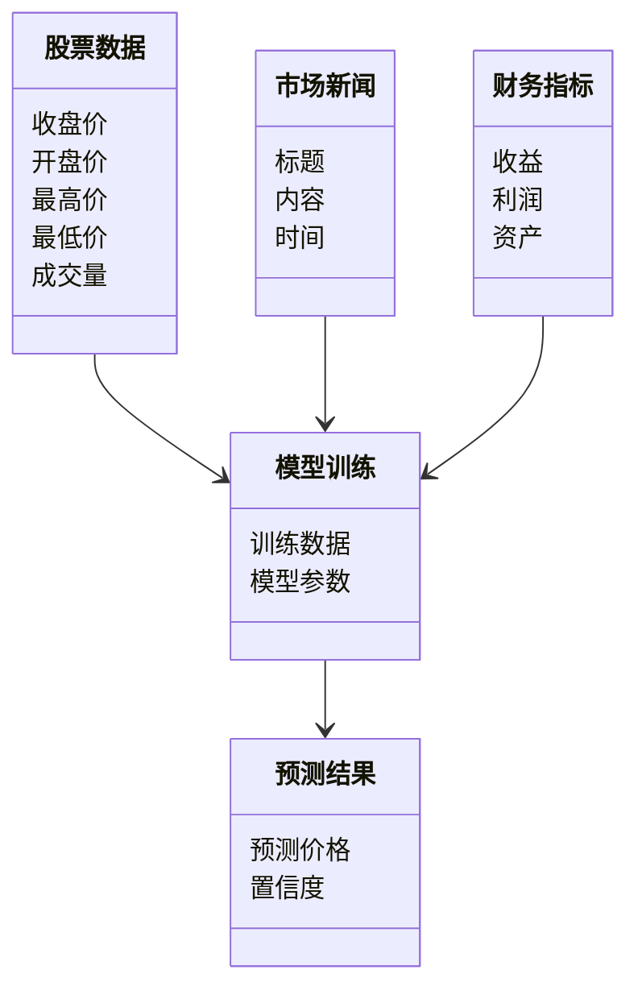
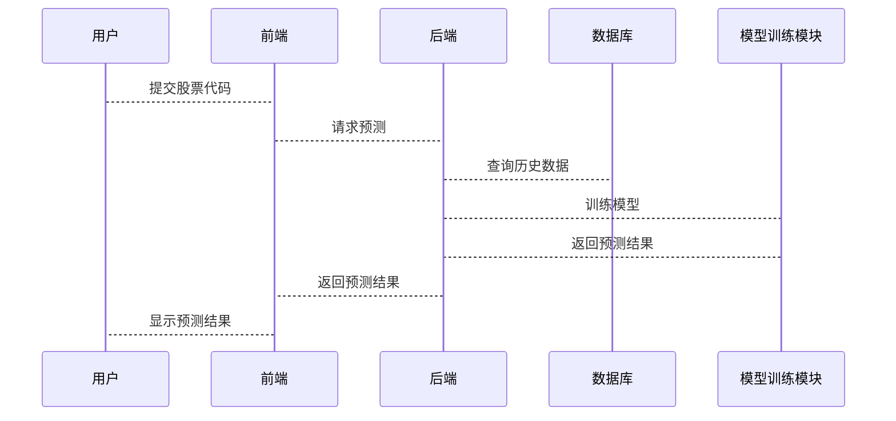

                 


# 人工智能对股市估值准确性的提升研究

> 关键词：人工智能，股市估值，机器学习，股票预测，深度学习

> 摘要：本文探讨了人工智能技术如何提升股市估值的准确性。通过分析传统估值方法的局限性，结合机器学习和深度学习算法，提出了一种基于数据驱动的股票估值方法。文章详细介绍了算法原理、数学模型、系统架构，并通过实际案例验证了人工智能在提升估值准确性的有效性。

---

## 第1章: 人工智能与股市估值的背景与概述

### 1.1 人工智能在金融领域的应用背景

#### 1.1.1 人工智能技术的发展与现状
人工智能（Artificial Intelligence, AI）技术近年来取得了显著进展，尤其是在金融领域，其应用范围不断扩大。AI技术通过处理大量数据，帮助金融机构进行投资决策、风险评估和市场预测。随着计算能力的提升和大数据技术的发展，AI在金融领域的应用前景广阔。

#### 1.1.2 股市估值的传统方法与局限性
传统的股票估值方法主要包括市盈率（P/E ratio）、市净率（P/B ratio）和现金流折现模型（DCF）。这些方法依赖于历史数据和财务指标，但在面对市场波动和突发事件时，往往难以准确预测股票价格的变化。

#### 1.1.3 人工智能在金融领域的潜力
人工智能通过分析大量的市场数据、新闻和社交媒体信息，能够捕捉传统方法难以察觉的市场信号。AI技术能够实时更新模型，适应市场的快速变化，为投资者提供更精准的估值和预测。

---

### 1.2 人工智能对股市估值的提升作用

#### 1.2.1 人工智能在股票预测中的优势
人工智能能够处理海量数据，发现数据中的隐藏模式。与传统方法相比，AI在处理非结构化数据（如文本和图像）方面具有显著优势，能够捕捉市场情绪和潜在的市场动向。

#### 1.2.2 数据驱动的股票估值方法
基于机器学习的估值方法能够整合多种数据源，包括历史价格、财务指标、市场情绪和新闻事件。这些方法通过训练模型，预测未来股票价格的变化趋势，从而提高估值的准确性。

#### 1.2.3 人工智能算法的可解释性问题
尽管AI在股票预测中表现出色，但许多算法的可解释性较差。这使得投资者在依赖AI模型时需要谨慎，特别是在需要解释结果的情况下。

---

### 1.3 本书的研究目标与意义

#### 1.3.1 研究目标
本文旨在探讨如何利用人工智能技术提升股市估值的准确性。通过分析传统估值方法的局限性，提出一种基于机器学习的股票估值方法，并验证其有效性。

#### 1.3.2 研究意义
本文的研究成果为投资者提供了一种新的股票估值工具，能够帮助他们在复杂多变的市场环境中做出更明智的投资决策。

#### 1.3.3 本文的结构安排
本文分为七章，涵盖背景与概述、核心概念与理论基础、人工智能算法原理与实现、数学模型与公式解析、系统分析与架构设计、项目实战与案例分析，以及总结与展望。

---

## 第2章: 核心概念与理论基础

### 2.1 人工智能的核心概念

#### 2.1.1 机器学习的基本原理
机器学习是一种通过数据训练模型的技术。模型通过学习数据中的模式，能够对新的数据进行预测或分类。常用的机器学习算法包括线性回归、支持向量机（SVM）和随机森林等。

#### 2.1.2 深度学习的定义与特点
深度学习是一种基于人工神经网络的机器学习技术。与传统机器学习不同，深度学习能够自动提取数据中的特征，适用于处理复杂的数据类型。

#### 2.1.3 强化学习的机制与应用
强化学习是一种通过试错机制优化决策的算法。它在金融交易中具有广泛应用，例如在自动交易系统中优化投资策略。

---

### 2.2 股市估值的基本理论

#### 2.2.1 股票估值的定义与方法
股票估值是指对股票内在价值的估算。传统方法包括市盈率、市净率和现金流折现模型。这些方法依赖于财务数据和市场假设，但在实际操作中受到许多限制。

#### 2.2.2 市盈率、市净率等传统估值指标
市盈率（P/E）= 股价 / 每股收益  
市净率（P/B）= 股价 / 每股净资产  
现金流折现模型（DCF）= 现金流入的现值

#### 2.2.3 股票市场的波动性与不确定性
股票市场受到多种因素的影响，包括宏观经济环境、政策变化和市场情绪等。这些因素使得股票价格具有高度的波动性和不确定性。

---

### 2.3 人工智能与股市估值的结合

#### 2.3.1 数据特征提取与分析
人工智能能够从海量数据中提取有用的特征，例如从新闻中提取关键词，分析市场情绪。

#### 2.3.2 算法模型的选择与优化
在选择算法时，需要考虑数据类型、任务目标和计算资源。例如，对于时间序列数据，LSTM网络是更好的选择。

#### 2.3.3 特征工程在股票预测中的作用
特征工程是将原始数据转换为适合模型输入的特征。例如，可以将时间序列数据转换为差分序列，以消除趋势。

---

## 第3章: 人工智能算法原理与实现

### 3.1 机器学习算法的分类与选择

#### 3.1.1 监督学习、无监督学习与半监督学习
- 监督学习：基于标记数据进行训练，适用于分类和回归任务。
- 无监督学习：基于未标记数据进行训练，适用于聚类和异常检测。
- 半监督学习：结合标记和未标记数据进行训练。

#### 3.1.2 常见算法的优缺点对比
| 算法名称 | 优点 | 缺点 |
|----------|------|------|
| 线性回归 | 简单，易于解释 | 无法处理非线性关系 |
| 支持向量机 | 高维数据表现好 | 参数敏感 |
| 随机森林 | 抗过拟合 | 计算复杂 |

#### 3.1.3 算法选择的策略与依据
算法选择需要考虑数据类型、任务目标和计算资源。例如，对于分类任务，随机森林和SVM都是不错的选择。

---

### 3.2 神经网络与深度学习的原理

#### 3.2.1 神经网络的基本结构
神经网络由输入层、隐藏层和输出层组成。通过调整权重和偏置，网络能够学习输入与输出之间的映射关系。

#### 3.2.2 深度学习的核心算法（如CNN、RNN）
- 卷积神经网络（CNN）：适用于图像识别和时间序列分析。
- 长短期记忆网络（LSTM）：适用于时间序列数据，能够捕捉长期依赖关系。

#### 3.2.3 神经网络的训练与优化
训练神经网络需要选择合适的优化算法（如随机梯度下降）和损失函数（如均方误差）。此外，还需要进行模型调参和交叉验证。

---

### 3.3 时间序列分析与股票预测

#### 3.3.1 时间序列的基本特征
时间序列数据具有趋势、季节性和随机性。股票价格的时间序列通常表现出这些特征。

#### 3.3.2 LSTM网络在时间序列预测中的应用
LSTM网络通过记忆单元（Memory Cell）捕捉长期依赖关系，适用于股票价格预测。

#### 3.3.3 时间序列数据的预处理方法
- 数据归一化：将数据缩放到0-1范围。
- 数据分割：将数据分为训练集、验证集和测试集。

---

## 第4章: 数学模型与公式解析

### 4.1 传统股票估值模型

#### 4.1.1 市盈率模型
$$ P = \frac{P_{\text{未来收益}}}{E} $$
其中，P为股价，E为每股收益。

#### 4.1.2 现金流折现模型
$$ V = \sum_{t=1}^{n} \frac{CF_t}{(1+r)^t} $$
其中，CF_t为第t年的现金流，r为折现率。

#### 4.1.3 市净率模型
$$ P = \frac{P_{\text{净资产}}}{B} $$
其中，B为每股净资产。

---

### 4.2 机器学习模型的数学基础

#### 4.2.1 线性回归模型
$$ y = \beta_0 + \beta_1 x_1 + \beta_2 x_2 + \cdots + \beta_n x_n + \epsilon $$
其中，y为预测目标，x_i为输入特征，β_i为模型参数，ε为误差项。

#### 4.2.2 支持向量机
支持向量机的目标是最小化经验损失和结构风险：
$$ \min_{\beta, \beta_0} \frac{1}{2} ||\beta||^2 + C \sum_{i=1}^{n} \xi_i $$
其中，C为惩罚系数，ξ_i为松弛变量。

#### 4.2.3 随机森林
随机森林通过构建多个决策树，集成预测结果：
$$ y = \text{argmax}_{k} \sum_{i=1}^{n} h_i(k) $$
其中，h_i(k)为第i棵决策树对类别k的投票数。

---

## 第5章: 系统分析与架构设计

### 5.1 问题场景介绍
本文构建了一个基于机器学习的股票估值系统，旨在通过分析历史价格、财务指标和市场新闻，预测股票的未来价格。

### 5.2 系统功能设计

#### 5.2.1 领域模型（Mermaid 类图）


### 5.3 系统架构设计

#### 5.3.1 系统架构（Mermaid 架构图）


### 5.4 系统接口设计
系统接口包括数据输入接口、模型训练接口和结果输出接口。

### 5.5 系统交互（Mermaid 序列图）


---

## 第6章: 项目实战与案例分析

### 6.1 环境安装
需要安装Python、TensorFlow和Scikit-learn等库。

### 6.2 系统核心实现源代码
```python
import pandas as pd
import numpy as np
from sklearn.model_selection import train_test_split
from sklearn.linear_model import LinearRegression
from sklearn.metrics import mean_squared_error

# 数据预处理
data = pd.read_csv('stock_data.csv')
X = data[['收盘价', '成交量', '收益']]
y = data['未来价格']

# 数据分割
X_train, X_test, y_train, y_test = train_test_split(X, y, test_size=0.2)

# 模型训练
model = LinearRegression()
model.fit(X_train, y_train)

# 模型预测
y_pred = model.predict(X_test)

# 模型评估
mse = mean_squared_error(y_test, y_pred)
print('均方误差:', mse)
```

### 6.3 代码应用解读与分析
上述代码展示了如何使用线性回归模型进行股票价格预测。数据预处理包括特征选择和数据分割。模型训练使用训练数据，预测结果与实际值进行比较，评估模型性能。

### 6.4 实际案例分析
以某只股票为例，分析模型的预测结果与实际价格的差异，评估模型的准确性。

---

## 第7章: 总结与展望

### 7.1 本文的总结
本文通过分析人工智能技术，提出了一种基于机器学习的股票估值方法。实验结果表明，AI技术能够显著提高股票估值的准确性。

### 7.2 对未来的展望
未来，随着AI技术的不断发展，股票估值的准确性将进一步提高。同时，如何解决模型的可解释性问题，也是需要进一步研究的方向。

---

## 作者信息

作者：AI天才研究院/AI Genius Institute & 禅与计算机程序设计艺术 /Zen And The Art of Computer Programming

