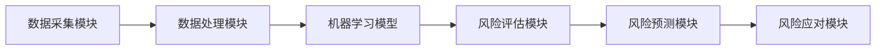

                 


# 人工智能辅助的风险管理系统设计

> 关键词：人工智能辅助，风险管理，系统设计，算法原理，系统架构，项目实战

> 摘要：本文将探讨人工智能在风险管理中的应用，分析其核心概念、算法原理和系统架构，结合实际案例，展示如何设计和实现一个高效的人工智能辅助风险管理系统。

---

# 第一部分：人工智能辅助的风险管理背景与概念

## 第1章：风险管理概述

### 1.1 风险管理的基本概念
风险管理是通过识别、评估和应对各种潜在风险，以降低其对组织目标的影响的过程。风险可以是财务损失、操作失误、数据泄露等多种形式。有效的风险管理能够帮助企业规避潜在风险，确保业务的稳定运行。

### 1.2 人工智能在风险管理中的作用
人工智能技术，如机器学习和自然语言处理，能够帮助我们更高效地识别和评估风险。通过分析大量数据，人工智能可以发现潜在的模式和趋势，从而提供更精准的风险预测和应对策略。

---

## 第2章：人工智能辅助风险管理的背景与现状

### 2.1 风险管理的传统方法
传统的风险管理方法依赖于人工分析和经验判断。这种方法虽然有效，但存在效率低、覆盖面有限的问题，尤其在面对复杂和多样化的风险时显得力不从心。

### 2.2 人工智能技术的发展与应用
近年来，人工智能技术取得了显著进展。机器学习算法的进步使得我们能够处理更大规模的数据，并从中提取有价值的信息。深度学习技术的应用进一步提升了风险预测的准确性。

---

## 第3章：人工智能辅助风险管理的核心概念

### 3.1 风险管理的系统化框架
人工智能辅助风险管理的系统化框架包括数据采集、风险评估、风险预测和风险应对四个主要环节。每个环节都需要依赖人工智能技术的支持，以实现高效和精准的风险管理。

### 3.2 人工智能辅助风险管理的系统架构
人工智能辅助风险管理的系统架构通常包括数据层、算法层和应用层。数据层负责收集和处理数据；算法层通过机器学习模型进行风险评估和预测；应用层则将结果呈现给用户，并提供应对策略。

---

# 第二部分：人工智能辅助风险管理的算法原理

## 第4章：常用算法原理与实现

### 4.1 机器学习算法
#### 4.1.1 线性回归
线性回归是一种简单而强大的回归算法，用于预测连续型变量。其数学模型如下：
$$ y = \beta_0 + \beta_1x + \epsilon $$

#### 4.1.2 支持向量机
支持向量机（SVM）是一种监督学习算法，广泛应用于分类和回归问题。其优化目标为：
$$ \text{max} \{ \frac{1}{2}\|w\|^2 \} $$
$$ \text{subject to} \{ y_i(w \cdot x_i + b) \geq 1 \} $$

---

## 第5章：系统分析与架构设计

### 5.1 问题场景介绍
假设我们正在设计一个金融风险管理系统。该系统需要实时监测市场波动、分析交易数据，并预测潜在的金融风险。

### 5.2 系统功能设计
以下是系统的主要功能模块：
- 数据采集模块：实时采集市场数据和交易记录。
- 风险评估模块：通过机器学习模型评估潜在风险。
- 风险预测模块：预测未来风险的发生概率。
- 风险应对模块：提供风险应对策略。

### 5.3 系统架构设计
以下是系统的架构图：


---

## 第6章：项目实战

### 6.1 环境配置
我们需要以下环境：
- Python 3.8+
- TensorFlow 2.0+
- Scikit-learn 0.24+

### 6.2 核心代码实现
以下是机器学习模型的实现代码：
```python
import numpy as np
from sklearn.linear_model import LinearRegression

# 示例数据
X = np.array([[1], [2], [3], [4]])
y = np.array([2, 4, 6, 8])

# 创建线性回归模型
model = LinearRegression()
model.fit(X, y)

# 预测
print(model.predict([[5]]))
```

### 6.3 案例分析
假设我们有一个股票交易数据集，我们可以使用支持向量机模型进行风险预测。以下是实现代码：
```python
from sklearn.svm import SVC

# 示例数据
X = np.array([[1, 0], [0, 1], [1, 1], [0, 0]])
y = np.array([0, 1, 1, 0])

# 创建SVM模型
model = SVC()
model.fit(X, y)

# 预测
print(model.predict([[1, 1]]))
```

### 6.4 项目总结
通过以上实战，我们可以看到人工智能技术在风险管理中的巨大潜力。然而，实际应用中需要考虑数据质量和模型的可解释性等问题。

---

# 第三部分：最佳实践

## 第7章：小结与注意事项

### 7.1 小结
人工智能技术为风险管理提供了新的思路和方法。通过机器学习和深度学习算法，我们可以更高效地识别和应对潜在风险。

### 7.2 注意事项
在实际应用中，需要注意数据的质量和模型的可解释性。此外，还需要定期更新模型以应对变化的市场环境。

## 第8章：扩展阅读

### 8.1 推荐书籍
- 《机器学习实战》
- 《深度学习入门：基于Python的理论与实现》

### 8.2 推荐博客
- [人工智能入门博客](https://example.com)

---

# 结语

人工智能辅助的风险管理系统设计是一项复杂的任务，需要结合技术与业务需求。通过本文的介绍，希望能够为读者提供一些启发和指导。

---

作者：AI天才研究院/AI Genius Institute & 禅与计算机程序设计艺术 /Zen And The Art of Computer Programming

