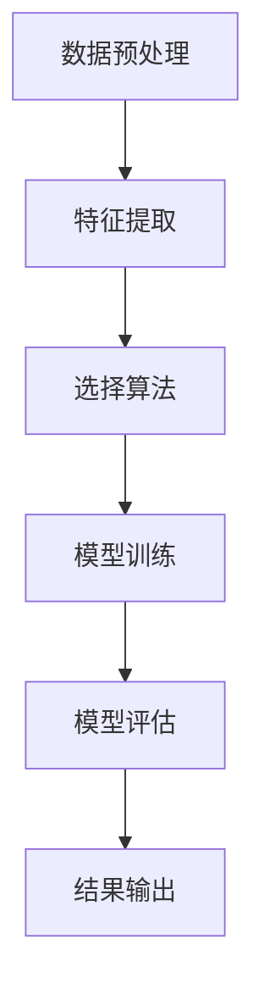
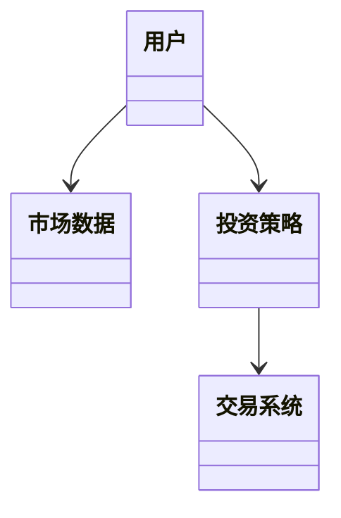

                 


# 人工智能驱动的个性化投资顾问服务

## 关键词：人工智能，投资顾问，个性化服务，机器学习，金融技术

## 摘要：  
人工智能技术的快速发展为金融领域带来了革命性的变化，特别是在个性化投资顾问服务方面。本文详细探讨了人工智能如何通过数据驱动的方式，为投资者提供高度个性化的投资建议。从核心概念到算法原理，从系统设计到项目实战，本文全面解析了人工智能在投资顾问服务中的应用，为读者提供了深入的技术分析和实践指导。

---

# 第一部分: 人工智能驱动的个性化投资顾问服务概述

## 第1章: 人工智能与投资顾问服务的背景介绍

### 1.1 问题背景与问题描述  
在传统投资顾问服务模式下，投资者通常需要依赖专业金融分析师或投资顾问提供投资建议。然而，这种模式存在以下问题：  

1. **服务成本高**：传统投资顾问服务通常针对高净值客户，服务门槛较高，普通投资者难以负担。  
2. **服务范围有限**：传统投资顾问服务往往基于固定的策略和模型，难以满足投资者个性化需求。  
3. **信息处理能力有限**：面对海量的市场数据和复杂的投资环境，传统投资顾问难以实时提供精准的建议。  

人工智能技术的出现，为解决这些问题提供了新的可能性。通过大数据分析、机器学习算法和自然语言处理技术，人工智能能够以更低的成本、更高的效率为投资者提供个性化的投资建议。

---

### 1.2 个性化投资顾问服务的核心要素  

个性化投资顾问服务的核心在于满足投资者的个性化需求。以下是其实现的关键要素：  

1. **投资者需求分析**：通过数据采集和分析，了解投资者的风险偏好、投资目标和财务状况。  
2. **市场数据处理**：对股票、基金、债券等市场的实时数据进行清洗、特征提取和建模分析。  
3. **投资策略生成**：基于投资者需求和市场数据，生成个性化的投资组合和交易策略。  

---

### 1.3 人工智能在投资顾问服务中的应用前景  

人工智能技术的快速发展为投资顾问服务带来了巨大的潜力：  

1. **数据处理能力**：人工智能能够快速处理海量市场数据，提取关键特征，为投资决策提供支持。  
2. **预测能力**：通过机器学习算法，人工智能可以预测市场趋势和资产价格，帮助投资者做出更明智的决策。  
3. **个性化服务**：基于投资者的个性化需求，人工智能可以实时调整投资策略，提供动态化的投资建议。  

---

## 第2章: 个性化投资顾问服务的核心概念与联系  

### 2.1 核心概念原理  

人工智能驱动的个性化投资顾问服务的核心在于数据驱动的投资策略生成。以下是其实现的关键步骤：  

1. **数据采集**：收集投资者的财务数据、市场数据以及外部经济指标。  
2. **特征提取**：从数据中提取有用的特征，例如投资者的风险偏好、市场的波动性等。  
3. **模型训练**：使用机器学习算法对数据进行建模，生成个性化的投资策略。  

---

### 2.2 核心概念属性特征对比  

以下表格对比了传统投资顾问服务与人工智能驱动的个性化投资顾问服务的核心属性：  

| 属性 | 传统投资顾问 | 人工智能驱动的个性化投资顾问 |  
|------|----------------|---------------------------------|  
| 服务对象 | 高净值客户为主 | 所有投资者，包括普通投资者 |  
| 服务成本 | 高 | 低 |  
| 服务效率 | 低 | 高 |  
| 策略定制化 | 有限 | 高度个性化 |  

---

### 2.3 ER实体关系图  

以下是一个简单的实体关系图，展示了个性化投资顾问服务的核心实体及其关系：  

```mermaid
erDiagram
    customer{<-[投资顾问服务]
    market_data{<-[投资顾问服务]
    investment_strategy{<-[投资顾问服务]
    transaction{<-[投资顾问服务]
    AI_model{<-[投资顾问服务]
```

---

## 第3章: 人工智能驱动的个性化投资顾问服务算法原理  

### 3.1 常见算法及其在投资顾问中的应用  

以下是几种常用的机器学习算法及其在投资顾问服务中的应用：  

1. **线性回归**：用于预测股票价格的趋势。  
2. **支持向量机（SVM）**：用于分类市场趋势（如牛市、熊市）。  
3. **随机森林与梯度提升树**：用于特征重要性分析和投资组合优化。  
4. **神经网络与深度学习**：用于复杂市场模式的识别和预测。  

---

### 3.2 算法流程图  

以下是基于线性回归算法的投资价格预测流程图：  



---

### 3.3 算法数学模型与公式  

以下是线性回归模型的数学表达式：  

$$ y = \beta_0 + \beta_1x + \epsilon $$  

其中：  
- $y$ 是目标变量（如股票价格）  
- $x$ 是自变量（如时间）  
- $\beta_0$ 和 $\beta_1$ 是模型参数  
- $\epsilon$ 是误差项  

---

## 第4章: 个性化投资顾问服务的系统分析与架构设计  

### 4.1 系统功能设计  

个性化投资顾问服务系统的功能模块包括：  

1. **用户模块**：用户注册、登录、个人信息管理。  
2. **数据模块**：数据采集、清洗、存储。  
3. **算法模块**：模型训练、策略生成。  
4. **交易模块**：投资组合优化、交易执行。  

---

### 4.2 系统架构设计  

以下是系统的分层架构图：  



---

## 第5章: 项目实战  

### 5.1 环境安装  

以下是项目实战所需的环境配置：  

1. Python 3.8+  
2. NumPy、Pandas、Scikit-learn、XGBoost  
3. Jupyter Notebook 或 IDE  

---

### 5.2 系统核心实现源代码  

以下是基于线性回归算法的投资价格预测代码：  

```python
import numpy as np
import pandas as pd
from sklearn.linear_model import LinearRegression
from sklearn.metrics import mean_squared_error

# 数据加载
data = pd.read_csv('stock_prices.csv')

# 特征与目标分离
X = data[['time']]
y = data['price']

# 模型训练
model = LinearRegression()
model.fit(X, y)

# 模型预测
y_pred = model.predict(X)

# 模型评估
mse = mean_squared_error(y, y_pred)
print(f"均方误差：{mse}")
```

---

### 5.3 实际案例分析  

假设我们有以下股票价格数据：  

| 时间（天） | 价格（美元） |  
|------------|---------------|  
| 1          | 100           |  
| 2          | 105           |  
| 3          | 110           |  
| 4          | 115           |  

通过线性回归模型，我们可以预测第5天的价格为：  

$$ y = 100 + 5x $$  

因此，第5天的价格预测为 $120 美元。  

---

## 第6章: 最佳实践与小结  

### 6.1 最佳实践  

1. **数据质量**：确保数据的完整性和准确性。  
2. **模型选择**：根据具体问题选择合适的算法。  
3. **实时性**：确保系统能够实时处理市场数据。  

---

### 6.2 小结  

人工智能技术为个性化投资顾问服务提供了强大的工具和方法。通过数据驱动的投资策略生成，人工智能能够帮助投资者做出更明智的决策。然而，实际应用中仍需注意数据隐私、模型解释性等问题。

---

## 作者信息  

作者：AI天才研究院（AI Genius Institute） & 禅与计算机程序设计艺术（Zen And The Art of Computer Programming）

