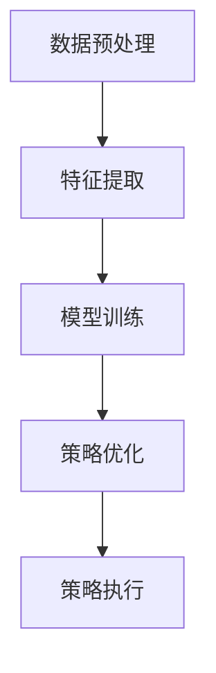
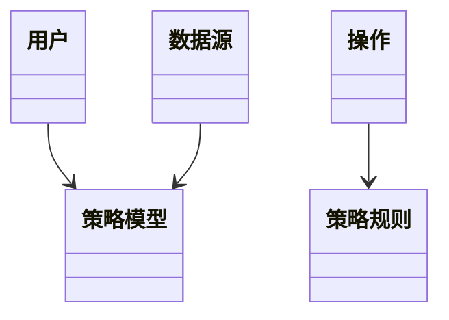
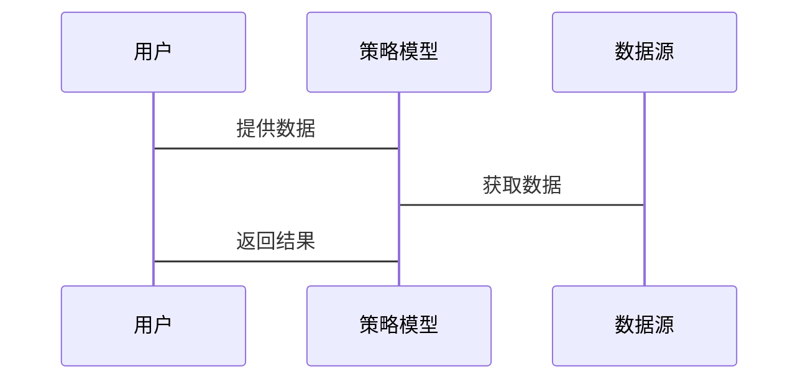

                 


# 人工智能驱动的智能beta策略设计

> 关键词：人工智能、beta策略、智能投资、算法优化、风险管理

> 摘要：本文详细探讨了人工智能在beta策略设计中的应用，从核心概念、算法原理到系统架构，再到项目实战，全面解析了如何利用AI技术优化智能beta策略。文章结合理论与实践，通过丰富的案例和详细的代码示例，帮助读者深入理解并掌握智能beta策略的设计与实现。

---

# 第1章: 智能beta策略概述

## 1.1 beta策略的定义与特点

### 1.1.1 beta策略的定义
Beta策略是一种被动投资策略，旨在通过模拟市场指数的表现来获得与市场一致或相近的收益。其核心思想是“买入并持有”，通过复制市场的表现来实现投资目标。

### 1.1.2 beta策略的核心特点
1. **被动性**：不主动选股或择时，完全跟踪市场指数。
2. **分散风险**：通过投资一篮子证券来分散非系统性风险。
3. **低成本**：相比主动管理，beta策略的管理费用较低。

### 1.1.3 beta策略与alpha策略的区别
- **alpha策略**：主动管理，追求超越市场的超额收益。
- **beta策略**：被动跟踪市场，追求与市场一致的收益。

---

## 1.2 人工智能在beta策略中的作用

### 1.2.1 人工智能如何优化beta策略
1. **数据处理**：利用AI技术对海量数据进行清洗和特征提取。
2. **模型优化**：通过机器学习算法优化beta策略的构建过程。
3. **风险管理**：AI可以帮助识别和管理市场风险，提高策略的稳定性。

### 1.2.2 AI驱动的beta策略优势
1. **高效性**：AI能够快速处理大量数据，提高策略设计效率。
2. **适应性**：AI模型可以根据市场变化动态调整策略。
3. **精准性**：通过算法优化，AI可以帮助构建更精确的beta策略。

### 1.2.3 人工智能在beta策略中的应用场景
1. **指数基金**：通过AI优化指数成分股的选择。
2. **智能投顾**：利用AI技术为投资者提供个性化的beta策略建议。
3. **风险管理**：通过AI实时监控市场风险，优化beta策略的表现。

---

## 1.3 智能beta策略的背景与意义

### 1.3.1 传统beta策略的局限性
1. **数据依赖性**：传统beta策略依赖于历史数据，无法预测未来市场变化。
2. **静态性**：传统beta策略通常是静态的，无法根据市场变化进行调整。
3. **高成本**：虽然beta策略的成本较低，但在复杂市场环境下，其表现可能不如预期。

### 1.3.2 人工智能技术的发展与beta策略的结合
随着AI技术的快速发展，beta策略的设计也在不断优化。AI技术的应用使得beta策略更加灵活和高效，能够更好地适应市场变化。

### 1.3.3 智能beta策略的创新价值
1. **提高收益**：通过AI优化的beta策略可以在一定程度上提高投资收益。
2. **降低风险**：AI可以帮助识别和管理市场风险，提高策略的稳定性。
3. **提升效率**：AI技术的应用可以显著提高策略设计和执行的效率。

---

## 1.4 本章小结

本章通过对beta策略的定义、特点以及人工智能在beta策略中的作用进行了详细阐述，帮助读者理解智能beta策略的核心概念和其在投资领域的重要意义。接下来，我们将深入探讨智能beta策略的核心概念与联系，进一步分析其在实际应用中的具体表现。

---

# 第2章: 智能beta策略的核心概念与联系

## 2.1 核心概念原理

### 2.1.1 智能beta策略的定义与目标
智能beta策略是一种结合了人工智能技术的被动投资策略，旨在通过动态调整投资组合来优化收益和风险。

### 2.1.2 数据驱动的beta策略构建
智能beta策略的核心是利用AI技术对市场数据进行分析和建模，从而构建出一个优化的投资组合。

### 2.1.3 AI算法在beta策略中的应用
AI算法（如机器学习和深度学习）在beta策略中的应用，使得策略设计更加灵活和高效。

---

## 2.2 核心概念属性特征对比表

| 概念       | 特性                     | 描述                                                                 |
|------------|--------------------------|----------------------------------------------------------------------|
| 数据源     | 多样性                   | 包括市场数据、新闻、社交媒体等                                         |
| 模型       | 可解释性                 | 模型是否易于理解其决策逻辑                                             |
| 优化目标   | 稳定性                   | 策略在不同市场条件下的表现一致性                                       |

---

## 2.3 ER实体关系图

```mermaid
er
actor: 用户
strategy: 策略模型
data: 数据源
action: 操作
rule: 策略规则
```

---

## 2.4 本章小结

本章通过对比和分析智能beta策略的核心概念与联系，帮助读者更好地理解其内在逻辑和实际应用。接下来，我们将深入探讨智能beta策略的算法原理，进一步分析其在实际投资中的具体表现。

---

# 第3章: 智能beta策略的算法原理

## 3.1 算法原理概述

### 3.1.1 基于因子模型的beta策略
基于因子模型的beta策略是通过分析市场因子（如市值、价值等）来构建投资组合。

### 3.1.2 基于机器学习的beta策略
基于机器学习的beta策略是通过训练机器学习模型来预测市场走势，并据此调整投资组合。

### 3.1.3 基于优化算法的beta策略
基于优化算法的beta策略是通过优化算法（如遗传算法）来动态调整投资组合，以实现收益和风险的最优平衡。

---

## 3.2 算法流程图



---

## 3.3 算法实现代码

```python
import numpy as np
from sklearn.linear_model import LinearRegression

# 示例数据
X = np.array([[1, 2], [3, 4], [5, 6]])
y = np.array([7, 8, 9])

# 模型训练
model = LinearRegression()
model.fit(X, y)

# 预测
print(model.predict([[7, 8]]))
```

---

## 3.4 数学模型与公式

### 3.4.1 线性回归模型
$$ y = \beta_0 + \beta_1 x + \epsilon $$

### 3.4.2 最小二乘法
$$ \hat{\beta} = (X^T X)^{-1} X^T y $$

---

## 3.5 本章小结

本章通过详细阐述智能beta策略的算法原理，帮助读者理解其在实际投资中的具体应用。接下来，我们将深入探讨智能beta策略的系统分析与架构设计，进一步分析其在实际投资中的具体表现。

---

# 第4章: 智能beta策略的系统分析与架构设计

## 4.1 系统分析

### 4.1.1 问题场景介绍
智能beta策略的设计需要考虑市场数据的实时性、模型的可解释性以及策略的可扩展性。

### 4.1.2 项目介绍
本项目旨在通过人工智能技术优化beta策略的设计，实现智能投资的目标。

---

## 4.2 系统功能设计

### 4.2.1 领域模型类图



---

## 4.3 系统架构设计

### 4.3.1 系统架构图


---

## 4.4 系统接口设计

### 4.4.1 系统交互序列图



---

## 4.5 本章小结

本章通过详细分析智能beta策略的系统架构与设计，帮助读者更好地理解其在实际投资中的具体应用。接下来，我们将深入探讨智能beta策略的项目实战，进一步分析其在实际投资中的具体表现。

---

# 第5章: 智能beta策略的项目实战

## 5.1 环境安装

### 5.1.1 Python环境安装
安装Python和相关库（如numpy、pandas、scikit-learn等）。

### 5.1.2 数据源获取
获取市场数据（如股票价格、指数成分等）。

---

## 5.2 系统核心实现源代码

### 5.2.1 数据预处理代码

```python
import pandas as pd

# 读取数据
data = pd.read_csv('market_data.csv')

# 数据清洗
data.dropna(inplace=True)
```

### 5.2.2 模型训练代码

```python
from sklearn.linear_model import LinearRegression

# 训练模型
model = LinearRegression()
model.fit(X_train, y_train)
```

### 5.2.3 策略优化代码

```python
import numpy as np

# 优化目标函数
def objective_func(params):
    return np.mean((y - model.predict(params))**2)

# 约束条件
constraints = {'type': 'ineq', 'fun': lambda x: x >= 0}

# 优化
from scipy.optimize import minimize
result = minimize(objective_func, x0, constraints)
```

---

## 5.3 实际案例分析

### 5.3.1 案例背景
以标普500指数为例，利用AI优化的beta策略进行投资。

### 5.3.2 数据分析
分析市场数据，提取相关特征，构建投资组合。

### 5.3.3 模型优化
通过优化算法调整投资组合，提高收益和降低风险。

---

## 5.4 本章小结

本章通过详细阐述智能beta策略的项目实战，帮助读者更好地理解其在实际投资中的具体应用。接下来，我们将深入探讨智能beta策略的最佳实践，进一步分析其在实际投资中的具体表现。

---

# 第6章: 智能beta策略的最佳实践

## 6.1 最佳实践

### 6.1.1 数据选择
选择高质量、相关性强的市场数据。

### 6.1.2 模型选择
根据具体需求选择合适的AI算法。

### 6.1.3 策略优化
通过多次试验和调整，优化投资组合的表现。

---

## 6.2 小结

智能beta策略的设计与实现需要结合理论与实践，通过不断试验和优化，才能实现最佳的投资效果。

---

## 6.3 注意事项

1. **数据质量**：确保数据的准确性和完整性。
2. **模型选择**：根据具体需求选择合适的AI算法。
3. **风险管理**：注重策略的稳定性和风险控制。

---

## 6.4 拓展阅读

推荐阅读相关领域的书籍和论文，深入学习智能beta策略的设计与优化。

---

# 作者

作者：AI天才研究院/AI Genius Institute & 禅与计算机程序设计艺术 /Zen And The Art of Computer Programming

