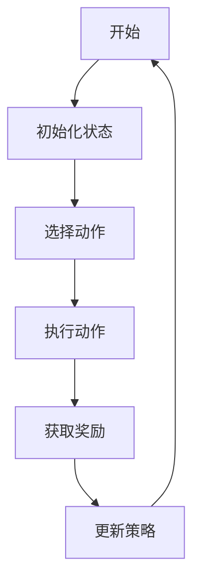
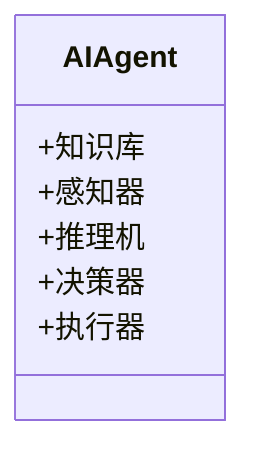

                 


# 从零开始：构建AI Agent的完整指南

## 关键词：AI Agent, 人工智能, 强化学习, 知识表示, 系统架构, 项目实战

## 摘要：构建AI Agent需要系统化的知识和技能，从基本概念到算法实现，再到系统设计和项目实战，本文将一步步引导读者完成AI Agent的构建过程，涵盖核心概念、算法原理、系统架构、项目实战等多个方面，帮助读者全面掌握AI Agent的开发方法。

---

# 第一部分: AI Agent的背景与核心概念

## 第1章: AI Agent概述

### 1.1 AI Agent的基本概念

#### 1.1.1 什么是AI Agent
AI Agent（人工智能代理）是指能够感知环境、自主决策并执行任务的智能体。它能够根据输入的信息做出反应，完成特定的目标。与传统的被动程序不同，AI Agent具有主动性和适应性，能够在动态环境中自主工作。

#### 1.1.2 AI Agent的核心特点
- **自主性**：AI Agent能够自主决策，无需外部干预。
- **反应性**：能够实时感知环境并做出反应。
- **目标导向**：以实现特定目标为导向。
- **学习能力**：能够通过经验改进性能。

#### 1.1.3 AI Agent与传统AI的区别
| 特性 | 传统AI | AI Agent |
|------|--------|-----------|
| 决策方式 | 被动执行 | 主动决策 |
| 交互方式 | 单向输入 | 双向互动 |
| 适应性 | 固定规则 | 动态适应 |

---

### 1.2 AI Agent的背景与问题背景

#### 1.2.1 AI Agent的起源与发展
AI Agent的概念起源于20世纪60年代，随着人工智能技术的发展，AI Agent逐渐从理论走向实际应用。近年来，随着深度学习和强化学习的兴起，AI Agent在游戏、机器人、自动驾驶等领域得到了广泛应用。

#### 1.2.2 当前AI Agent的应用场景
- **游戏开发**：AI Agent在游戏中的角色控制和对手行为模拟。
- **机器人控制**：用于工业机器人和家庭服务机器人的自主决策。
- **智能助手**：如Siri、Alexa等虚拟助手。

#### 1.2.3 AI Agent面临的主要问题
- **复杂环境的适应性**：在动态和不确定的环境中，AI Agent需要更强的适应能力。
- **多智能体协作**：在多智能体系统中，需要解决协作与竞争的问题。
- **安全性与伦理问题**：AI Agent的决策可能对人类产生重大影响，需要考虑伦理和安全问题。

---

### 1.3 AI Agent的核心要素与概念结构

#### 1.3.1 AI Agent的组成要素
- **感知器（Perceptor）**：负责感知环境信息。
- **知识库（Knowledge Base）**：存储任务相关的知识和经验。
- **推理机（Reasoner）**：根据知识和感知信息进行推理。
- **决策器（Decider）**：基于推理结果做出决策。
- **执行器（Actuator）**：执行决策动作。

#### 1.3.2 AI Agent的属性特征对比表
| 特性 | 描述 |
|------|------|
| 知识表示 | 用于表示任务相关知识的数据结构 |
| 行为规划 | 决策如何执行动作以达到目标 |
| 人机交互 | 与用户或环境进行信息交换的方式 |

#### 1.3.3 AI Agent的ER实体关系图
```mermaid
er
actor AI Agent
/--> owns 知识库
|     \--> contains 知识单元
actor 环境
/--> observes 感知器
|     \--> triggers 决策器
```

---

## 第2章: AI Agent的核心概念与原理

### 2.1 AI Agent的核心原理

#### 2.1.1 知识表示与推理
知识表示是AI Agent的核心，常用的表示方法包括：
- **谓词逻辑**：用谓词和事实表示知识。
- **语义网络**：用节点和关系表示知识。
- **概率图模型**：用概率图表示不确定性知识。

#### 2.1.2 行为规划与决策
行为规划是AI Agent根据目标和环境状态制定行动计划的过程。常见的决策方法包括：
- **基于规则的决策**：根据预定义的规则进行决策。
- **基于强化学习的决策**：通过奖励机制优化决策策略。
- **基于搜索的决策**：通过搜索算法找到最优路径。

#### 2.1.3 人机交互与反馈机制
人机交互是AI Agent与用户或环境进行信息交换的过程。常见的交互方式包括：
- **自然语言处理**：通过文本或语音进行交互。
- **图形界面交互**：通过可视化界面进行交互。
- **反馈机制**：根据用户反馈调整行为策略。

---

### 2.2 AI Agent的架构设计

#### 2.2.1 基于状态空间的搜索算法
状态空间搜索是一种常见的AI Agent决策方法，适用于目标明确的场景。常用的算法包括：
- **广度优先搜索（BFS）**：按层遍历状态空间。
- **深度优先搜索（DFS）**：按深度遍历状态空间。
- **A*算法**：带启发式的最短路径搜索算法。

#### 2.2.2 基于强化学习的决策算法
强化学习是一种通过试错学习优化决策策略的方法。常用的算法包括：
- **Q-Learning**：通过更新Q值表进行决策。
- **Deep Q-Network（DQN）**：使用深度神经网络近似Q值函数。
- **策略梯度法**：通过优化策略参数直接更新策略。

#### 2.2.3 混合架构的设计与实现
混合架构结合了规则和机器学习的优点，适用于复杂场景。例如：
- **规则驱动的强化学习**：在规则的基础上，通过强化学习优化决策策略。
- **混合推理与学习**：结合符号推理和数值计算，提高决策的准确性和效率。

---

### 2.3 AI Agent的数学模型与公式

#### 2.3.1 状态空间模型
状态空间模型用于描述AI Agent可能处于的所有状态。例如：
$$ S = \{s_1, s_2, ..., s_n\} $$
其中，$s_i$表示第$i$个状态。

#### 2.3.2 动作空间模型
动作空间模型用于描述AI Agent在每个状态下可执行的所有动作。例如：
$$ A = \{a_1, a_2, ..., a_m\} $$
其中，$a_j$表示第$j$个动作。

#### 2.3.3 奖励函数模型
奖励函数模型用于描述AI Agent在执行动作后获得的奖励。例如：
$$ R(s, a) = r \in \mathbb{R} $$
其中，$r$是AI Agent在状态$s$执行动作$a$后获得的奖励值。

---

## 第3章: AI Agent的算法原理与实现

### 3.1 AI Agent的算法原理

#### 3.1.1 状态空间搜索算法
状态空间搜索算法通过遍历所有可能的状态和动作，找到最优路径。例如：


#### 3.1.2 基于强化学习的算法
强化学习算法通过不断试错优化策略。例如：
```python
def agent_algorithm(state):
    for action in possible_actions:
        next_state = transition(state, action)
        reward = reward_function(state, action)
        update_policy(reward)
    return best_action
```

#### 3.1.3 基于监督学习的算法
监督学习算法通过标记数据训练模型。例如：
$$ \text{损失函数} = \sum_{i=1}^{n} (y_i - \hat{y}_i)^2 $$

---

### 3.2 AI Agent的算法实现

#### 3.2.1 算法流程图（mermaid）


#### 3.2.2 算法代码实现
```python
def agent_algorithm(state):
    # 状态空间搜索
    for action in possible_actions:
        next_state = transition(state, action)
        reward = reward_function(state, action)
        update_policy(reward)
    return best_action
```

---

## 第4章: AI Agent的系统分析与架构设计

### 4.1 系统分析

#### 4.1.1 问题场景介绍
以一个简单的游戏AI为例，AI Agent需要在游戏环境中自主决策。

#### 4.1.2 项目目标与范围
目标是实现一个能够在游戏环境中自主决策的AI Agent。

#### 4.1.3 系统功能需求
- 环境感知
- 行为决策
- 人机交互

---

### 4.2 系统架构设计

#### 4.2.1 领域模型设计（mermaid）


#### 4.2.2 系统架构设计
- **感知层**：负责感知环境信息。
- **决策层**：负责根据感知信息进行推理和决策。
- **执行层**：负责执行决策动作。

---

## 第5章: AI Agent的项目实战

### 5.1 环境安装
安装所需的开发环境和依赖库，例如Python、TensorFlow等。

### 5.2 系统核心实现源代码
```python
class AI_Agent:
    def __init__(self, knowledge_base):
        self.knowledge_base = knowledge_base
        self.sensor = Sensor()
        self.reasoner = Reasoner()
        self.decider = Decider()
        self.actuator = Actuator()
    
    def perceive(self):
        return self.sensor.get_info()
    
    def reason(self, info):
        return self.reasoner.infer(info)
    
    def decide(self, info):
        return self.decider.make_decision(info)
    
    def act(self, action):
        self.actuator.execute_action(action)
```

### 5.3 案例分析
以一个简单的游戏AI为例，展示AI Agent在实际场景中的应用。

### 5.4 项目总结
总结项目的实现过程，分析优缺点，并提出改进建议。

---

## 第6章: 总结与展望

### 6.1 总结
AI Agent是一种强大的工具，能够帮助我们实现许多复杂任务的自动化。

### 6.2 展望
随着人工智能技术的不断发展，AI Agent将在更多领域得到广泛应用。

---

## 第7章: 最佳实践 tips

### 7.1 小结
构建AI Agent需要系统化的知识和技能。

### 7.2 注意事项
- 确保系统的安全性和稳定性。
- 处理多智能体协作问题时，需要考虑通信和协调机制。

### 7.3 拓展阅读
推荐一些经典的AI Agent相关书籍和论文，供读者深入学习。

---

## 作者：AI天才研究院/AI Genius Institute & 禅与计算机程序设计艺术 /Zen And The Art of Computer Programming

