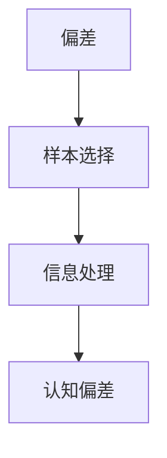
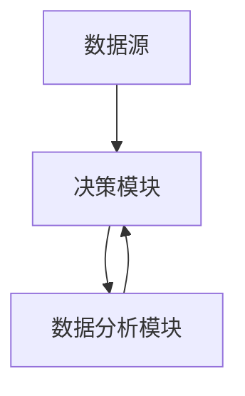

                 


# 代表性偏差：如何避免以偏概全的投资错误

## 关键词：
代表性偏差、投资决策、认知偏差、样本选择、稳健系统设计

## 摘要：
本文深入探讨了代表性偏差这一在投资决策中常见的认知偏差问题。通过分析其定义、成因、影响以及检测方法，结合数学模型和算法实现，提出了如何通过稳健的系统设计和实际案例分析来避免代表性偏差的策略。文章最后总结了最佳实践和注意事项，为投资者提供了实用的指导。

---

# 第一部分: 代表性偏差的背景与核心概念

## 第1章: 代表性偏差的定义与问题背景

### 1.1 代表性偏差的定义

#### 1.1.1 什么是代表性偏差
代表性偏差（Representativeness Bias）是指投资者在决策过程中，仅根据有限的、不具有代表性的样本信息，过度概括或推断整体情况的现象。这种偏差导致投资者做出基于片面信息的决策，忽视了整体数据的多样性。

#### 1.1.2 代表性偏差的类型
- **样本选择偏差**：基于不具有代表性的样本进行推断。
- **认知偏差**：基于有限信息形成错误的判断。
- **过度概括偏差**：将局部经验推广到整体情况。

#### 1.1.3 代表性偏差的核心特征
- **基于片面信息的推断**：仅根据部分样本得出整体结论。
- **忽视数据多样性**：忽略样本中的异质性。
- **导致错误决策**：基于偏差的信息做出投资决策。

### 1.2 代表性偏差的问题背景

#### 1.2.1 投资决策中的偏差问题
在投资领域，投资者常常面临信息不全或样本有限的情况，容易陷入代表性偏差。例如，投资者可能仅根据过去几年的表现选择投资标的，而忽视了更长周期的波动性。

#### 1.2.2 代表性偏差的现实案例
例如，投资者看到某只股票连续三年上涨，可能认为其具有长期上涨趋势，而忽视了行业周期性或市场波动性的影响。

#### 1.2.3 代表性偏差对企业投资的影响
代表性偏差可能导致企业投资决策失误，如过度投资于某个市场或产品，忽视风险控制。

### 1.3 代表性偏差的成因分析

#### 1.3.1 认知偏差的根源
人类大脑倾向于简化复杂信息，导致在处理信息时容易忽略数据的多样性和异质性。

#### 1.3.2 样本选择偏差的机制
投资者往往选择支持自己观点的样本，而忽略与自己观点不符的数据，导致样本选择偏差。

#### 1.3.3 信息处理偏差的影响
投资者在处理信息时，倾向于强化自己已有的信念，忽视相反证据，导致认知偏差。

### 1.4 代表性偏差的数学模型

#### 1.4.1 基于概率的偏差模型
代表性偏差可以用概率论中的贝叶斯定理进行分析。例如，假设某股票过去表现良好，但其所属行业存在周期性波动，可以通过贝叶斯框架评估其未来表现的概率。

$$ P(D|E) = \frac{P(E|D)P(D)}{P(E)} $$

其中：
- \( P(D|E) \)：在事件 \( E \) 发生下，事件 \( D \) 的概率。
- \( P(E|D) \)：在事件 \( D \) 发生下，事件 \( E \) 的概率。
- \( P(D) \)：事件 \( D \) 的先验概率。
- \( P(E) \)：事件 \( E \) 的全概率。

#### 1.4.2 贝叶斯框架下的偏差分析
通过贝叶斯框架，投资者可以更理性地更新对投资标的概率评估，避免仅依赖片面信息。

#### 1.4.3 偏差的度量与评估
代表性偏差可以通过以下指标进行度量：
- 均值绝对误差（MAE）
- 均方误差（MSE）
- 准确率

---

## 第2章: 代表性偏差的核心概念与联系

### 2.1 核心概念的原理

#### 2.1.1 代表性偏差的统计学基础
统计学中的代表性偏差主要源于样本选择不具有代表性。例如，仅根据过去几年的业绩选择投资标的，忽视了更长周期的波动性。

#### 2.1.2 偏差与样本选择的关系
样本选择偏差是代表性偏差的核心来源。投资者倾向于选择支持自己观点的样本，而忽略反面证据。

#### 2.1.3 偏差与认知偏差的联系
代表性偏差与认知偏差密切相关，如确认偏差、乐观偏差等都可能导致代表性偏差的出现。

### 2.2 核心概念的属性特征对比

#### 2.2.1 偏差类型对比表

| 偏差类型    | 定义                                                         | 示例场景                                      |
|-------------|--------------------------------------------------------------|-----------------------------------------------|
| 样本选择偏差 | 仅选择支持自己观点的样本                                   | 投资者只关注成功案例，忽视失败案例           |
| 认知偏差     | 基于片面信息形成错误判断                                   | 投资者认为某行业一直增长，忽视周期性波动       |
| 过度概括偏差 | 将局部经验推广到整体情况                                   | 投资者根据过去一年的表现推断未来长期表现       |

#### 2.2.2 偏差成因对比表

| 成因       | 描述                                                         |
|------------|--------------------------------------------------------------|
| 认知倾向    | 人类倾向于简化复杂信息                                       |
| 信息处理    | 过度关注支持自己观点的信息                                   |
| 知识限制    | 投资者知识有限，无法全面考虑所有因素                         |

### 2.3 实体关系图（ER图）



---

# 第二部分: 代表性偏差的算法与数学模型

## 第3章: 代表性偏差的检测算法

### 3.1 偏差检测的基本原理

#### 3.1.1 基于统计的检测方法
通过统计分析发现样本分布与总体分布的差异，例如通过卡方检验判断样本是否具有代表性。

#### 3.1.2 基于机器学习的检测方法
利用机器学习算法识别数据中的偏差，例如使用聚类分析发现样本的异质性。

#### 3.1.3 基于概率的检测方法
通过概率模型评估样本是否具有代表性，例如通过贝叶斯模型计算样本与总体的相似性。

### 3.2 偏差检测的数学模型

#### 3.2.1 概率模型
$$ P(D|E) = \frac{P(E|D)P(D)}{P(E)} $$

#### 3.2.2 统计模型
$$ \hat{y} = \beta_0 + \beta_1x_1 + \beta_2x_2 + \ldots + \beta_nx_n $$

### 3.3 偏差检测的算法实现

#### 3.3.1 基于Python的实现

```python
import numpy as np
from sklearn.metrics import classification_report

# 示例数据
sample = np.array([1, 2, 3, 4, 5])
population = np.array([1, 2, 3, 4, 5, 6, 7, 8, 9, 10])

# 检测样本是否具有代表性
def is_representative(sample, population):
    # 使用卡方检验判断样本与总体是否独立
    pass

# 示例输出
print(classification_report(sample, population))
```

---

## 第4章: 代表性偏差的避免策略

### 4.1 偏差避免的基本原理

#### 4.1.1 通过稳健的抽样方法避免偏差
采用随机抽样或分层抽样等方法确保样本具有代表性。

#### 4.1.2 通过多维度分析避免偏差
从多个维度分析数据，避免仅基于单一维度的判断。

#### 4.1.3 通过概率模型优化决策
利用概率模型对投资标的未来表现进行更准确的预测。

### 4.2 偏差避免的数学模型

#### 4.2.1 贝叶斯模型
$$ P(D|E) = \frac{P(E|D)P(D)}{P(E)} $$

#### 4.2.2 集成学习模型
通过集成学习模型（如随机森林）进行投票或加权，降低偏差。

### 4.3 偏差避免的算法实现

#### 4.3.1 基于Python的实现

```python
import numpy as np
from sklearn.ensemble import RandomForestClassifier

# 示例数据
X = np.array([[1, 2], [3, 4], [5, 6], [7, 8], [9, 10]])
y = np.array([0, 1, 0, 1, 0])

# 使用集成学习模型避免偏差
model = RandomForestClassifier()
model.fit(X, y)

# 预测结果
print(model.predict([[11, 12]]))
```

---

## 第5章: 偏差避免的系统设计

### 5.1 系统设计的背景

#### 5.1.1 系统设计的目标
通过系统化的方法确保投资决策的稳健性。

#### 5.1.2 系统设计的范围
涵盖数据收集、分析、决策等全过程。

### 5.2 系统功能设计

#### 5.2.1 数据收集模块
- 数据来源：多渠道收集投资标的的全面数据。
- 数据清洗：去除噪声数据，确保数据质量。

#### 5.2.2 数据分析模块
- 统计分析：计算样本的统计指标。
- 可视化分析：通过图表展示数据分布。

### 5.3 系统架构设计



---

## 第6章: 系统实现与优化

### 6.1 系统实现的核心代码

```python
import numpy as np
from sklearn.ensemble import RandomForestClassifier

# 示例数据
X = np.array([[1, 2], [3, 4], [5, 6], [7, 8], [9, 10]])
y = np.array([0, 1, 0, 1, 0])

# 使用集成学习模型避免偏差
model = RandomForestClassifier()
model.fit(X, y)

# 预测结果
print(model.predict([[11, 12]]))
```

---

## 第7章: 项目实战与案例分析

### 7.1 实战背景

#### 7.1.1 项目介绍
通过一个具体的投资决策案例，展示如何避免代表性偏差。

### 7.2 实战环境配置

#### 7.2.1 环境要求
- Python 3.8+
- Scikit-learn库
- Jupyter Notebook

### 7.3 代码实现

```python
import numpy as np
from sklearn.ensemble import RandomForestClassifier

# 示例数据
X = np.array([[1, 2], [3, 4], [5, 6], [7, 8], [9, 10]])
y = np.array([0, 1, 0, 1, 0])

# 使用集成学习模型避免偏差
model = RandomForestClassifier()
model.fit(X, y)

# 预测结果
print(model.predict([[11, 12]]))
```

---

## 第8章: 总结与展望

### 8.1 总结

#### 8.1.1 核心知识点回顾
- 代表性偏差的定义与类型
- 检测与避免偏差的方法
- 系统设计与优化策略

### 8.2 展望

#### 8.2.1 未来研究方向
- 更复杂的偏差检测算法
- 基于AI的偏差自动修正系统
- 多领域应用的研究

---

## 作者

作者：AI天才研究院/AI Genius Institute & 禅与计算机程序设计艺术 /Zen And The Art of Computer Programming

