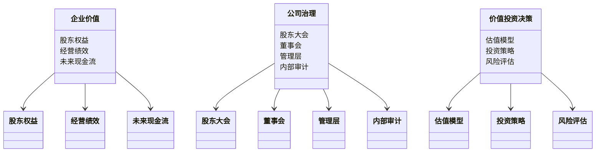
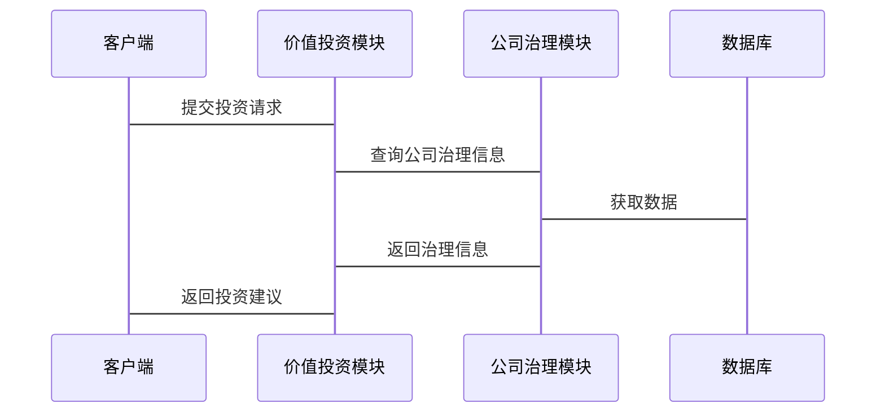

                 


# 《价值投资与公司治理的关系》

---

## 关键词：
价值投资、公司治理、股东利益、投资决策、企业价值、风险管理、企业战略

---

## 摘要：
本文探讨了价值投资与公司治理之间的关系，分析了两者如何共同影响企业的价值和投资决策。通过系统分析和实际案例，本文揭示了公司治理如何影响价值投资的决策过程，并展示了如何通过优化公司治理来提升企业价值。文章还提出了结合价值投资与公司治理的最佳实践建议，为投资者和企业管理者提供了实用的指导。

---

# 第1章: 价值投资的核心概念

## 1.1 价值投资的定义与特点
### 1.1.1 价值投资的定义
价值投资是一种以企业内在价值为基础的投资策略，强调以低于内在价值的价格购买优质资产。其核心在于识别被市场低估的企业，长期持有以实现收益。

### 1.1.2 价值投资的特点
- 长期投资：注重长期价值，而非短期波动。
- 估值驱动：基于对企业财务状况和未来现金流的分析。
- 选股标准：关注企业基本面，如盈利能力、财务健康和竞争优势。

### 1.1.3 价值投资的基本原理
价值投资的理论基础是市场短期波动，但长期会回归企业的真实价值。投资者通过分析企业内在价值，寻找安全边际，即市场价格低于内在价值的部分。

## 1.2 价值投资与公司治理的关系
### 1.2.1 价值投资关注的公司治理要素
- 股东权益保护：确保股东利益不受侵害。
- 管理层素质：高效、透明的管理层有助于提升企业价值。
- 透明度与披露：及时、准确的信息披露有助于投资者评估企业价值。

### 1.2.2 公司治理对价值投资的影响
公司治理的优劣直接影响企业的长期表现。良好的治理结构能够提升企业价值，降低投资风险，从而吸引更多价值投资者。

---

# 第2章: 公司治理的核心概念

## 2.1 公司治理的定义与特点
### 2.1.1 公司治理的定义
公司治理是指通过公司章程、制度和机制，确保公司有效运作，平衡股东、管理层和利益相关者权益的过程。

### 2.1.2 公司治理的特点
- 制度化：依靠公司章程和规章制度。
- 透明化：确保信息对称，提升信任度。
- 协调性：平衡不同利益相关者的权益。

## 2.2 公司治理的基本原则
### 2.2.1 股东主权原则
股东是公司所有者，有权参与公司重大决策。

### 2.2.2 透明与披露原则
企业应定期披露财务信息和治理情况，确保信息透明。

### 2.2.3 责任与制衡原则
通过董事会和审计委员会等机制，确保管理层责任与权力制衡。

## 2.3 公司治理与股东利益的关系
### 2.3.1 股东利益的保护
良好的公司治理能够有效保护股东权益，防止利益被侵害。

### 2.3.2 股东价值的提升
通过优化治理结构，提升企业运营效率，进而增加股东价值。

---

# 第3章: 价值投资与公司治理的联系

## 3.1 价值投资与公司治理的共同目标
### 3.1.1 提升企业价值
两者都致力于通过优化企业运营和管理，提升企业内在价值。

### 3.1.2 风险管理
通过良好的公司治理，降低企业经营风险，为价值投资提供安全保障。

## 3.2 公司治理如何影响价值投资
### 3.2.1 治理结构对投资决策的影响
高效的治理结构能够增强投资者信心，吸引更多投资。

### 3.2.2 透明度对估值的影响
高透明度的公司更容易获得准确估值，降低投资风险。

## 3.3 价值投资如何促进公司治理优化
### 3.3.1 投资者的监督作用
价值投资者通过持股和参与公司治理，推动企业改进管理。

### 3.3.2 市场压力的推动作用
价值投资者的关注迫使企业提升治理水平，以获得更好的估值。

---

# 第4章: 价值投资与公司治理的背景分析

## 4.1 价值投资的历史发展
### 4.1.1 价值投资的起源
起源于20世纪初，以本杰明·格雷厄姆和戴维·多德为代表，强调安全边际和内在价值。

### 4.1.2 价值投资的发展阶段
从早期的简单估值到现代的多维度分析，逐步发展为系统化的投资方法。

## 4.2 公司治理的演进历程
### 4.2.1 早期公司治理
注重股东权益，但忽视管理层责任和透明度。

### 4.2.2 现代公司治理
引入董事会、独立董事和审计委员会等机制，提升治理效率。

### 4.2.3 全球化背景下的公司治理
随着全球化和资本市场的扩展，公司治理面临更多挑战和变革。

## 4.3 价值投资与公司治理的现状
### 4.3.1 当前价值投资的实践特点
从单一的财务分析转向综合评估企业治理、战略和竞争优势。

### 4.3.2 公司治理的现状分析
企业治理逐渐受到重视，但仍存在透明度不足、利益输送等问题。

### 4.3.3 价值投资与公司治理的结合趋势
越来越多的价值投资者关注公司治理，推动企业治理水平提升。

---

# 第5章: 价值投资与公司治理的系统分析

## 5.1 系统架构设计
### 5.1.1 领域模型（mermaid类图）


### 5.1.2 系统架构（mermaid架构图）
```mermaid
archi
    客户端 --> 价值投资模块
    价值投资模块 --> 公司治理模块
    公司治理模块 --> 数据库
    数据库 --> 公司治理模块
    公司治理模块 --> 价值投资模块
    价值投资模块 --> 客户端
```

### 5.1.3 系统交互（mermaid序列图）


## 5.2 功能需求设计
### 5.2.1 价值投资模块
- 提供企业估值模型，支持多维度分析。
- 提供投资策略建议，基于公司治理情况调整投资决策。

### 5.2.2 公司治理模块
- 提供公司治理评分，评估企业治理水平。
- 提供治理改进建议，优化企业治理结构。

---

# 第6章: 项目实战

## 6.1 环境安装
安装Python、Pandas、Matplotlib、Scikit-learn等工具，配置Jupyter Notebook环境。

## 6.2 核心代码实现
### 6.2.1 企业估值模型（Python代码）
```python
import pandas as pd
import numpy as np

# 示例数据
data = {
    '收入': [100, 200, 150, 250, 300],
    '成本': [50, 100, 70, 120, 150],
    '净利润': [30, 50, 35, 55, 75]
}

df = pd.DataFrame(data)
df['毛利率'] = df['收入'] - df['成本']
df['净利率'] = df['净利润'] / df['收入']

print(df)
```

### 6.2.2 公司治理评分模型
```python
def governance_score(revenue, net_profit, cash_flow):
    # 计算现金流健康度
    cash_health = cash_flow / revenue * 100
    # 计算盈利稳定性
    profit_stability = net_profit / revenue * 100
    # 综合评分
    score = (cash_health + profit_stability) / 2
    return score

# 示例计算
revenue = 500
net_profit = 100
cash_flow = 200
score = governance_score(revenue, net_profit, cash_flow)
print(f"公司治理评分为: {score}%")
```

## 6.3 案例分析
以某制造企业为例，分析其公司治理结构，评估其治理评分，制定投资策略。

---

# 第7章: 最佳实践与总结

## 7.1 最佳实践 tips
- **数据收集**：确保数据来源可靠，涵盖财务和非财务指标。
- **模型调优**：根据实际情况调整估值模型和治理评分标准。
- **结果验证**：通过历史数据验证模型的准确性和稳定性。

## 7.2 小结
价值投资与公司治理密切相关，良好的公司治理能够提升企业价值，降低投资风险。投资者应关注企业的治理结构和管理层素质，选择具有长期竞争优势的企业。

## 7.3 注意事项
- 避免仅依赖单一指标，进行多维度分析。
- 定期评估投资组合，及时调整策略。

## 7.4 拓展阅读
- 格雷厄姆《证券分析》
- 希尔曼《公司治理原则》

---

# 作者：
AI天才研究院/AI Genius Institute & 禅与计算机程序设计艺术/Zen And The Art of Computer Programming

--- 

通过以上结构和内容，文章详细分析了价值投资与公司治理的关系，结合理论和实际案例，为投资者和企业管理者提供了实用的指导。

