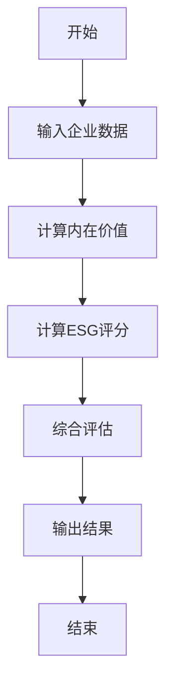
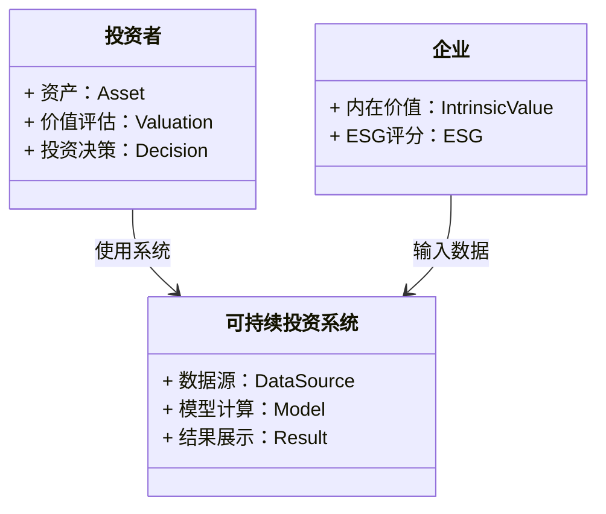
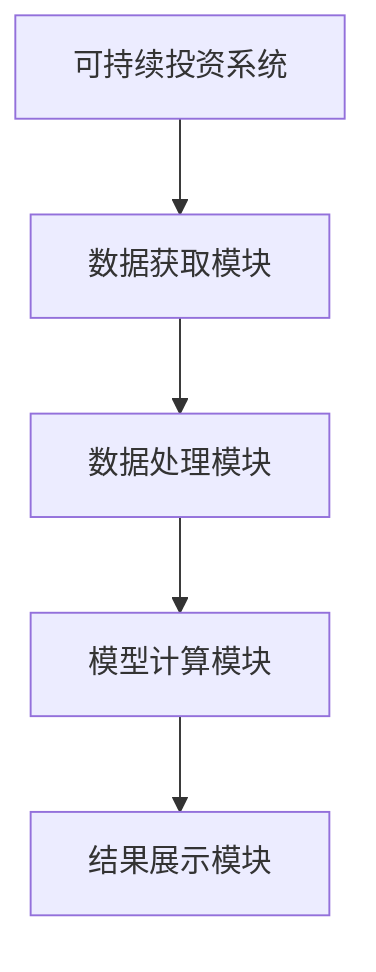

                 


# 《价值投资与可持续发展》

**关键词：** 价值投资，可持续发展，ESG，投资策略，技术分析

**摘要：**  
本文从价值投资与可持续发展的概念入手，结合技术分析方法，深入探讨了如何将可持续发展理念融入价值投资策略中。通过数学模型和算法设计，提出了一个基于ESG（环境、社会、治理）评分的可持续投资评估系统，并通过实际案例分析，展示了如何利用技术手段实现可持续投资的量化评估与优化。文章还详细介绍了系统的架构设计和实现方法，为投资者提供了从理论到实践的完整指导。

---

# 第1章 价值投资与可持续发展的背景介绍

## 1.1 价值投资的定义与核心理念

### 1.1.1 价值投资的定义  
价值投资是一种长期投资策略，强调以低于资产内在价值的价格买入优质资产。其核心在于寻找市场低估的公司，并长期持有，等待其价值回归。

### 1.1.2 价值投资的核心理念  
- **安全边际**：买入价格低于内在价值，以降低投资风险。  
- **长期视角**：关注企业的基本面，而非短期市场波动。  
- **逆周期投资**：在市场低迷时买入优质资产。  

### 1.1.3 价值投资与传统投资的区别  
| 方面 | 价值投资 | 传统投资 |  
|------|----------|----------|  
| 理论基础 | 基于内在价值 | 基于市场情绪 |  
| 投资期限 | 长期 | 短期 |  
| 风险控制 | 强调安全边际 | 依赖市场波动 |  

---

## 1.2 可持续发展的定义与内涵

### 1.2.1 可持续发展的定义  
可持续发展是指在满足当前需求的同时，不损害后代满足其需求的能力。其核心是平衡经济、社会和环境三个维度。

### 1.2.2 可持续发展的三个核心维度  
- **环境（Environmental）**：关注资源消耗、碳排放、污染等问题。  
- **社会（Social）**：关注员工权益、社区影响、公平性等问题。  
- **治理（Governance）**：关注公司治理结构、透明度、管理层责任等问题。  

### 1.2.3 可持续发展与企业社会责任的关系  
企业社会责任（CSR）是可持续发展的重要组成部分，强调企业在追求利润的同时，应承担对社会和环境的责任。

---

## 1.3 价值投资与可持续发展的关联

### 1.3.1 价值投资中的可持续发展理念  
价值投资者越来越关注企业的可持续性，认为具备良好ESG表现的企业更具长期投资价值。

### 1.3.2 可持续发展对企业价值的影响  
- 优秀的企业治理和可持续发展表现能够降低企业风险，提升其长期盈利能力。  
- 环境和社会责任履行良好的企业更容易获得投资者的信任和长期支持。  

### 1.3.3 价值投资与可持续发展的相互作用  
- 可持续发展理念丰富了价值投资的内涵，使其更符合长期发展的需求。  
- 价值投资方法为可持续发展提供了量化工具和实践路径。  

---

## 1.4 本章小结  
本章介绍了价值投资的核心理念和可持续发展的定义与内涵，并分析了两者之间的关联。通过将可持续发展理念融入价值投资，投资者可以在追求财务回报的同时，实现长期的社会和环境价值。

---

# 第2章 价值投资与可持续发展的核心概念

## 2.1 核心概念与属性对比

### 2.1.1 价值投资的核心概念  
- 内在价值：企业未来现金流的现值。  
- 安全边际：买入价格与内在价值的折扣率。  

### 2.1.2 可持续发展的核心概念  
- ESG评分：衡量企业在环境、社会和治理方面的表现。  
- 可持续投资：基于ESG评分的投资策略。  

### 2.1.3 核心概念的属性对比表格  
| 属性 | 价值投资 | 可持续发展 |  
|------|----------|------------|  
| 核心目标 | 实现资产增值 | 实现社会与环境价值 |  
| 关注点 | 企业基本面、安全边际 | ESG表现、社会责任 |  

---

## 2.2 实体关系图（ER图）

```mermaid
erDiagram
    actor 投资者
    actor 管理层
    actor 社会
    actor 环境
    actor 治理机构
    class 企业
    class 资产
    class 可持续发展指标
    class 价值评估
    class 投资决策
    投资者 --> 资产 : 持有
    投资者 --> 价值评估 : 评估
    投资者 --> 投资决策 : 决策
    管理层 --> 企业 : 管理
    社会 --> 企业 : 影响
    环境 --> 企业 : 影响
    治理机构 --> 企业 : 监管
    可持续发展指标 --> 价值评估 : 输入
```

---

## 2.3 本章小结  
本章通过对比分析，明确了价值投资与可持续发展的核心概念及其属性，并通过实体关系图展示了两者之间的关系。

---

# 第3章 价值投资与可持续发展的数学模型与算法原理

## 3.1 数学模型与公式

### 3.1.1 价值投资的数学模型  
企业内在价值公式：  
$$ V = \frac{CF}{r - g} $$  
其中，$CF$为自由现金流，$r$为折现率，$g$为增长率。  

### 3.1.2 可持续发展评估的数学模型  
ESG评分公式：  
$$ ESG = 0.4 \times E + 0.3 \times S + 0.3 \times G $$  
其中，$E$、$S$、$G$分别为环境、社会和治理评分。  

---

## 3.2 算法原理与流程图

### 3.2.1 算法原理  
- **输入**：企业财务数据、ESG数据。  
- **输出**：企业价值评估报告。  
- **步骤**：  
  1. 计算企业的内在价值。  
  2. 计算企业的ESG评分。  
  3. 综合评估企业的投资价值。  

### 3.2.2 算法流程图  



---

## 3.3 本章小结  
本章通过数学模型和算法设计，展示了如何将ESG评分与价值投资相结合，实现可持续投资的量化评估。

---

# 第4章 价值投资与可持续发展的系统分析与架构设计

## 4.1 系统分析

### 4.1.1 问题场景介绍  
投资者需要一个系统来量化评估企业的可持续投资价值。  

### 4.1.2 领域模型（Mermaid类图）



---

## 4.2 系统架构设计

### 4.2.1 系统架构图  



---

## 4.3 本章小结  
本章通过系统分析和架构设计，展示了如何构建一个支持可持续投资的系统，帮助投资者实现科学决策。

---

# 第5章 价值投资与可持续发展的项目实战

## 5.1 环境安装与配置

### 5.1.1 开发环境的安装  
- Python 3.8+  
- Jupyter Notebook  
- Pandas、NumPy、Scipy等库  

### 5.1.2 数据源的获取与配置  
- 数据来源：企业财务数据、ESG评分数据。  
- 数据格式：CSV或Excel格式。  

### 5.1.3 工具链的安装与配置  
```bash
pip install pandas numpy scipy matplotlib
```

---

## 5.2 核心系统实现

### 5.2.1 核心算法的实现  
```python
import pandas as pd
import numpy as np

def calculate_intrinsic_value(cash_flow, discount_rate, growth_rate):
    return cash_flow / (discount_rate - growth_rate)

def calculate_esg_score(e, s, g):
    return 0.4 * e + 0.3 * s + 0.3 * g

def main():
    data = pd.read_csv('input.csv')
    results = []
    for index, row in data.iterrows():
        iv = calculate_intrinsic_value(row['CF'], row['r'], row['g'])
        esg = calculate_esg_score(row['E'], row['S'], row['G'])
        results.append({'企业': row['企业'], '内在价值': iv, 'ESG评分': esg})
    results_df = pd.DataFrame(results)
    results_df.to_csv('output.csv', index=False)

if __name__ == "__main__":
    main()
```

---

## 5.3 本章小结  
本章通过项目实战，展示了如何利用Python和相关库实现可持续投资评估系统的数据处理和模型计算功能。

---

# 作者：AI天才研究院/AI Genius Institute & 禅与计算机程序设计艺术 /Zen And The Art of Computer Programming

---

**小结：** 本文通过背景介绍、核心概念、数学模型、系统设计和项目实战，全面分析了价值投资与可持续发展的结合与实现。从理论到实践，为投资者提供了从理解到应用的完整指导。

