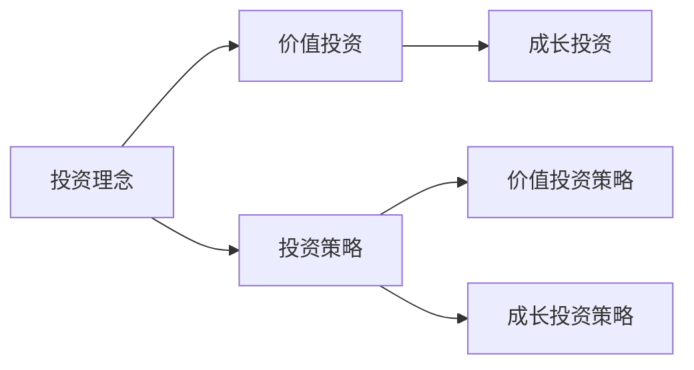
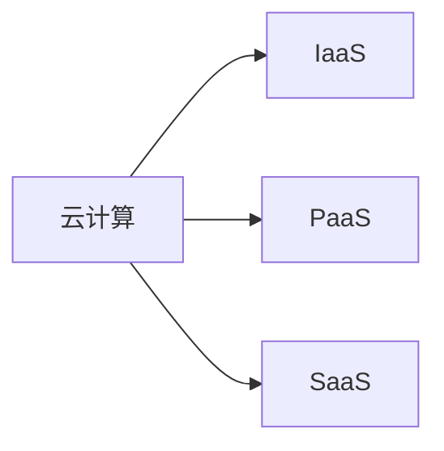

                 


```markdown
# 价值投资中的产业互联网机遇

> 关键词：价值投资，产业互联网，云计算，大数据，人工智能，投资策略

> 摘要：本文探讨了产业互联网对价值投资的深远影响，分析了云计算、大数据和人工智能等技术如何改变投资决策，提供了在产业互联网时代的价值投资策略和风险管理方法，最后结合实际案例展示了如何在智能制造和智慧医疗等领域捕捉投资机会。

---

## 第一部分: 价值投资与产业互联网概述

### 第1章: 价值投资的基本概念

#### 1.1 价值投资的定义与核心理念

- **价值投资的起源与历史发展**
  - 价值投资由本杰明·格雷厄姆和戴维·多德提出，强调寻找被市场低估的股票。
  - 20世纪30年代经济大萧条中，价值投资理念逐渐成熟，后来被沃伦·巴菲特发扬光大。

- **价值投资的核心原则**
  - 购买低于内在价值的股票。
  - 长期投资，耐心等待价值回归。
  - 重视公司的基本面分析，如市盈率、市净率、ROE等。

- **价值投资与成长投资的区别**
  - 价值投资注重安全边际和低估值，成长投资注重高增长和高潜力。
  - 价值投资者可能投资于传统行业，而成长投资者可能更关注科技和新兴行业。



---

### 第2章: 产业互联网的定义与特点

#### 2.1 产业互联网的定义

- 产业互联网是将互联网技术应用于传统产业，通过数字化改造提升产业效率和竞争力。
- 与消费互联网（如电商、社交媒体）不同，产业互联网专注于企业间的协作和效率提升。

#### 2.2 产业互联网的核心特点

- **数据驱动**：通过数据采集和分析优化生产流程。
- **智能化**：利用AI和机器学习提升决策效率。
- **平台化**：构建行业平台促进企业间协作。

#### 2.3 产业互联网与传统互联网的区别

| 特性             | 产业互联网               | 消费互联网         |
|------------------|--------------------------|--------------------|
| 主要用户         | 企业                     | 消费者             |
| 核心技术         | 大数据、AI、IoT          | 电商、社交媒体     |
| 应用场景         | 制造、物流、医疗等       | 零售、娱乐         |

---

## 第二部分: 产业互联网的技术基础

### 第3章: 云计算与大数据分析

#### 3.1 云计算的基本原理

- 云计算通过虚拟化技术和分布式计算提供弹性资源。
- 通过IaaS、PaaS、SaaS三层架构为企业提供灵活的计算能力。



#### 3.2 大数据分析的技术与方法

- **数据采集**：通过传感器、API等收集数据。
- **数据存储**：使用Hadoop、MongoDB等技术存储海量数据。
- **数据处理**：利用MapReduce、Spark进行数据清洗和计算。
- **数据可视化**：通过Tableau、Power BI等工具展示分析结果。

#### 3.3 云计算与大数据在产业互联网中的应用

- **智能制造**：实时监控生产线数据，优化生产流程。
- **供应链管理**：通过大数据分析优化物流路径，降低成本。

### 第4章: 人工智能与机器学习

#### 4.1 人工智能的基本概念

- 人工智能（AI）是模拟人类智能的计算机系统，包括学习、推理和自适应能力。

#### 4.2 机器学习的核心算法

- **监督学习**：如线性回归、决策树。
- **无监督学习**：如聚类、降维。
- **深度学习**：如神经网络、卷积神经网络（CNN）。

```latex
$$y = \theta_0 + \theta_1 x + \epsilon$$
```

#### 4.3 人工智能在产业互联网中的应用

- **预测分析**：通过机器学习模型预测市场趋势和企业业绩。
- **智能推荐**：为投资者推荐潜在投资机会。

---

## 第三部分: 价值投资中的产业互联网机遇

### 第5章: 产业互联网对价值投资的影响

#### 5.1 产业互联网如何改变产业格局

- 提高产业效率，降低成本。
- 促进企业间的协同合作，推动产业升级。

#### 5.2 产业互联网对投资决策的支持

- 提供实时数据支持，增强投资决策的科学性。
- 通过AI技术快速识别投资机会和风险。

#### 5.3 产业互联网时代的价值投资策略

- **数据驱动策略**：利用大数据分析筛选投资标的。
- **技术驱动策略**：投资于具备技术优势的企业。

### 第6章: 产业互联网与企业价值评估

#### 6.1 企业价值评估的基本方法

- 市盈率（P/E）=股价/每股收益
- 市净率（P/B）=股价/每股净资产

#### 6.2 产业互联网对企业价值的影响

- 提升企业运营效率，增强盈利能力。
- 通过数字化转型提高企业的市场竞争力。

#### 6.3 产业互联网时代的企业价值评估模型

- 结合技术优势、数据资产和运营效率进行综合评估。

---

## 第四部分: 产业互联网的典型投资机会

### 第7章: 智能制造与工业互联网

#### 7.1 智能制造的基本概念

- 利用物联网、大数据和AI技术实现智能化生产。

#### 7.2 工业互联网的核心技术

- **物联网（IoT）**：连接生产设备，实时采集数据。
- **边缘计算**：在设备端进行数据处理，减少云端依赖。

#### 7.3 智能制造与工业互联网的投资机会

- 投资于具备技术优势的智能制造解决方案提供商。

### 第8章: 智慧医疗与健康互联网

#### 8.1 智慧医疗的基本概念

- 利用互联网技术提升医疗服务效率和质量。

#### 8.2 健康互联网的核心技术

- **电子健康记录（EHR）**：整合患者医疗数据。
- **远程医疗**：通过互联网提供远程诊断和治疗。

#### 8.3 智慧医疗与健康互联网的投资机会

- 投资于健康数据平台和远程医疗解决方案提供商。

---

## 第五部分: 价值投资中的风险管理

### 第9章: 产业互联网投资中的风险分析

#### 9.1 产业互联网投资的主要风险

- **技术风险**：技术更新换代快，可能导致投资失败。
- **市场风险**：市场竞争加剧，可能导致收益下降。

#### 9.2 风险管理的基本策略

- 分散投资，降低单一投资的风险。
- 定期评估投资组合，及时调整策略。

#### 9.3 产业互联网时代的风险评估模型

- 结合技术、市场、财务等多个维度进行综合评估。

### 第10章: 投资组合优化与风险管理

#### 10.1 投资组合优化的基本原理

- 通过优化算法寻找最优的投资组合，最大化收益，最小化风险。

#### 10.2 产业互联网时代的风险管理策略

- **动态调整**：根据市场变化及时调整投资组合。
- **分散投资**：避免过度集中在某一领域或行业。

#### 10.3 投资组合优化的数学模型与公式

```latex
$$\text{目标函数：} \max \mu \cdot w - \lambda \cdot w^T \Sigma w$$
$$\text{约束条件：} \sum w_i = 1, w_i \geq 0$$
```

---

## 第六部分: 价值投资中的产业互联网案例分析

### 第11章: 典型产业互联网投资案例

#### 11.1 典型案例一：云计算服务提供商

- **公司背景**：提供云计算服务，帮助企业降低IT成本。
- **投资价值**：市场需求大，技术壁垒高。

#### 11.2 典型案例二：人工智能应用企业

- **公司背景**：利用AI技术提供智能客服解决方案。
- **投资价值**：技术领先，市场前景广阔。

#### 11.3 典型案例三：智能制造解决方案提供商

- **公司背景**：提供智能化生产线解决方案。
- **投资价值**：符合产业升级趋势，市场潜力大。

### 第12章: 产

---

## 总结与展望

产业互联网的兴起为价值投资带来了新的机遇，同时也带来了新的挑战。通过云计算、大数据和人工智能等技术，投资者可以更科学地进行决策，捕捉更多的投资机会。未来，随着技术的不断进步，产业互联网将在更多领域发挥作用，为价值投资创造更大的价值。

---

## 作者

作者：AI天才研究院/AI Genius Institute & 禅与计算机程序设计艺术 /Zen And The Art of Computer Programming

---

通过本文，读者可以深入了解产业互联网对价值投资的影响，掌握在产业互联网时代的价值投资策略和风险管理方法，并通过实际案例分析找到潜在的投资机会。
```

