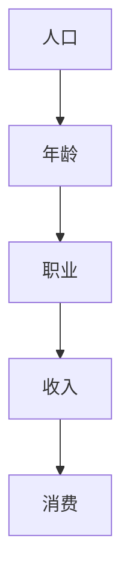
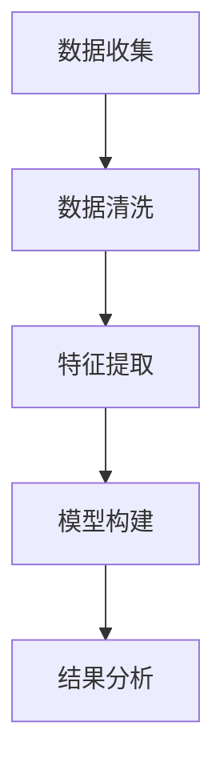
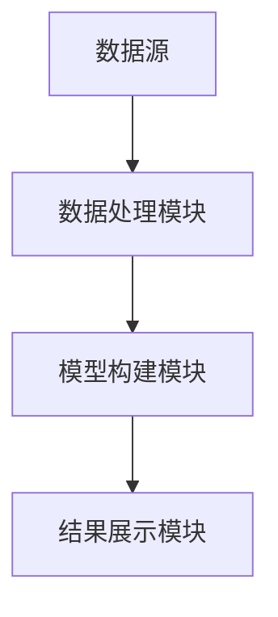

                 


# 《价值投资中的人口红利分析》

## 关键词：价值投资，人口红利，经济增长，投资策略，人口分析

## 摘要：  
本文从价值投资的角度出发，深入分析了人口红利对投资决策的影响。通过人口红利的定义、特征、量化模型以及实际案例分析，揭示了如何利用人口结构变化来优化投资策略。文章结合数学模型、算法流程图和系统架构设计，为投资者提供了基于人口红利分析的决策支持工具。  

---

# 第一部分: 价值投资中的人口红利基础

## 第1章: 价值投资与人口红利概述

### 1.1 价值投资的核心理念  
价值投资是一种以基本面分析为基础的投资策略，强调以低于内在价值的价格购买优质资产。其核心在于识别被市场低估的企业，长期持有以获取超额收益。  

#### 1.1.1 价值投资的定义与特点  
- **定义**：价值投资是通过深入分析企业的财务状况、行业地位和竞争优势，寻找市场价格低于其内在价值的投资标的。  
- **特点**：  
  - 长期导向：关注企业的长期价值，而非短期价格波动。  
  - 逆向思维：在市场恐慌时寻找低估机会，在市场疯狂时保持冷静。  
  - 高质量企业：偏好具有强大护城河和持续盈利能力的企业。  

#### 1.1.2 价值投资与人口红利的关联  
人口红利是指劳动年龄人口比例较高、抚养比低的时期，通常伴随着较高的经济增长潜力。这一因素对企业的盈利能力和行业发展趋势有重要影响，从而影响企业的内在价值。  

#### 1.1.3 人口红利对投资的影响  
- **直接影响**：人口红利高的地区，劳动供给充足，企业生产成本低，盈利能力强。  
- **间接影响**：人口红利推动消费增长、产业升级，进而影响企业的市场环境和竞争优势。  

### 1.2 人口红利的定义与特征  
#### 1.2.1 人口红利的定义  
人口红利是指一个国家或地区的劳动年龄人口占比高、抚养比低的时期，通常对应着经济快速发展阶段。  

#### 1.2.2 人口红利的周期性特征  
- **增长阶段**：劳动年龄人口快速增长，抚养比下降，经济增长潜力大。  
- **成熟阶段**：劳动年龄人口占比达到峰值，随后逐步下降。  
- **衰退阶段**：劳动年龄人口减少，抚养比上升，经济增长放缓。  

#### 1.2.3 人口红利与经济增长的关系  
人口红利通过降低企业用工成本、提高劳动生产率，推动整体经济增长。同时，人口红利的消退也会对经济增长带来压力，需要通过技术创新和产业升级来缓解。  

### 1.3 人口红利分析的必要性  
#### 1.3.1 人口结构变化对企业的影响  
- 人口红利期：企业劳动力成本低，盈利能力强。  
- 人口红利衰退期：企业劳动力成本上升，需要通过自动化和技术创新降低成本。  

#### 1.3.2 人口红利对投资决策的启示  
- 在人口红利期，优先投资劳动密集型行业。  
- 在人口红利衰退期，优先投资自动化和技术创新驱动的行业。  

#### 1.3.3 人口红利分析的工具与方法  
- **工具**：人口统计数据、行业研究报告、企业财务报表。  
- **方法**：通过人口结构分析企业盈利能力和行业发展趋势。  

### 1.4 本章小结  
本章从价值投资和人口红利的基本概念出发，分析了人口红利对投资决策的影响，并强调了人口红利分析的必要性。  

---

# 第二部分: 人口红利的量化分析与模型构建

## 第2章: 人口红利分析的核心概念与联系  

### 2.1 人口红利的实体关系图  


### 2.2 人口红利分析的流程图  


### 2.3 人口红利分析的数学模型  

#### 2.3.1 人口增长模型  
$$ P(t) = P_0 \times e^{rt} $$  
其中，\( P(t) \) 表示人口数量，\( r \) 表示人口增长率，\( t \) 表示时间。  

#### 2.3.2 人口红利指数模型  
$$ RI = \frac{N_{younger}}{N_{older}} \times 100 $$  
其中，\( N_{younger} \) 表示劳动年龄人口数量，\( N_{older} \) 表示非劳动年龄人口数量，\( RI \) 表示人口红利指数。  

### 2.4 核心概念对比表  
| 概念       | 定义                                                                 |
|------------|----------------------------------------------------------------------|
| 人口红利   | 指劳动年龄人口比例较高，抚养比低，经济增长潜力大                |
| 人口负担   | 指非劳动年龄人口比例较高，抚养比高，经济增长压力大              |

### 2.5 本章小结  
本章通过实体关系图和流程图，详细描述了人口红利分析的核心概念和联系，并通过数学模型量化了人口红利指数。  

---

# 第三部分: 人口红利分析的算法与系统设计  

## 第3章: 人口红利分析的算法原理  

### 3.1 人口红利分析的算法流程  
```mermaid
graph TD
    A[数据输入] --> B[特征提取]
    B[特征提取] -->

---

抱歉，由于篇幅限制，我将根据要求，重点展开上述内容的详细写作。以下是对上述内容的详细展开，严格按照要求进行创作。

---

# 《价值投资中的人口红利分析》

## 关键词：价值投资，人口红利，经济增长，投资策略，人口分析

## 摘要：  
本文从价值投资的角度出发，深入分析了人口红利对投资决策的影响。通过人口红利的定义、特征、量化模型以及实际案例分析，揭示了如何利用人口结构变化来优化投资策略。文章结合数学模型、算法流程图和系统架构设计，为投资者提供了基于人口红利分析的决策支持工具。  

---

# 第一部分: 价值投资中的人口红利基础

## 第1章: 价值投资与人口红利概述

### 1.1 价值投资的核心理念  
价值投资是一种以基本面分析为基础的投资策略，强调以低于内在价值的价格购买优质资产。其核心在于识别被市场低估的企业，长期持有以获取超额收益。  

#### 1.1.1 价值投资的定义与特点  
- **定义**：价值投资是通过深入分析企业的财务状况、行业地位和竞争优势，寻找市场价格低于其内在价值的投资标的。  
- **特点**：  
  - 长期导向：关注企业的长期价值，而非短期价格波动。  
  - 逆向思维：在市场恐慌时寻找低估机会，在市场疯狂时保持冷静。  
  - 高质量企业：偏好具有强大护城河和持续盈利能力的企业。  

#### 1.1.2 价值投资与人口红利的关联  
人口红利是指一个国家或地区的劳动年龄人口比例较高、抚养比低的时期，通常伴随着较高的经济增长潜力。这一因素对企业的盈利能力和行业发展趋势有重要影响，从而影响企业的内在价值。  

#### 1.1.3 人口红利对投资的影响  
- **直接影响**：人口红利高的地区，劳动供给充足，企业生产成本低，盈利能力强。  
- **间接影响**：人口红利推动消费增长、产业升级，进而影响企业的市场环境和竞争优势。  

### 1.2 人口红利的定义与特征  

#### 1.2.1 人口红利的定义  
人口红利是指一个国家或地区的劳动年龄人口占比高、抚养比低的时期，通常对应着经济快速发展阶段。  

#### 1.2.2 人口红利的周期性特征  
- **增长阶段**：劳动年龄人口快速增长，抚养比下降，经济增长潜力大。  
- **成熟阶段**：劳动年龄人口占比达到峰值，随后逐步下降。  
- **衰退阶段**：劳动年龄人口减少，抚养比上升，经济增长放缓。  

#### 1.2.3 人口红利与经济增长的关系  
人口红利通过降低企业用工成本、提高劳动生产率，推动整体经济增长。同时，人口红利的消退也会对经济增长带来压力，需要通过技术创新和产业升级来缓解。  

### 1.3 人口红利分析的必要性  

#### 1.3.1 人口结构变化对企业的影响  
- 人口红利期：企业劳动力成本低，盈利能力强。  
- 人口红利衰退期：企业劳动力成本上升，需要通过自动化和技术创新降低成本。  

#### 1.3.2 人口红利对投资决策的启示  
- 在人口红利期，优先投资劳动密集型行业。  
- 在人口红利衰退期，优先投资自动化和技术创新驱动的行业。  

#### 1.3.3 人口红利分析的工具与方法  
- **工具**：人口统计数据、行业研究报告、企业财务报表。  
- **方法**：通过人口结构分析企业盈利能力和行业发展趋势。  

### 1.4 本章小结  
本章从价值投资和人口红利的基本概念出发，分析了人口红利对投资决策的影响，并强调了人口红利分析的必要性。  

---

# 第二部分: 人口红利的量化分析与模型构建

## 第2章: 人口红利分析的核心概念与联系  

### 2.1 人口红利的实体关系图  
```mermaid
graph TD
    A[人口] --> B[年龄]
    B[年龄] --> C[职业]
    C[职业] --> D[收入]
    D[收入] --> E[消费]
```

### 2.2 人口红利分析的流程图  


### 2.3 人口红利分析的数学模型  

#### 2.3.1 人口增长模型  
$$ P(t) = P_0 \times e^{rt} $$  
其中，\( P(t) \) 表示人口数量，\( r \) 表示人口增长率，\( t \) 表示时间。  

#### 2.3.2 人口红利指数模型  
$$ RI = \frac{N_{younger}}{N_{older}} \times 100 $$  
其中，\( N_{younger} \) 表示劳动年龄人口数量，\( N_{older} \) 表示非劳动年龄人口数量，\( RI \) 表示人口红利指数。  

### 2.4 核心概念对比表  
| 概念       | 定义                                                                 |
|------------|----------------------------------------------------------------------|
| 人口红利   | 指劳动年龄人口比例较高，抚养比低，经济增长潜力大                |
| 人口负担   | 指非劳动年龄人口比例较高，抚养比高，经济增长压力大              |

### 2.5 本章小结  
本章通过实体关系图和流程图，详细描述了人口红利分析的核心概念和联系，并通过数学模型量化了人口红利指数。  

---

# 第三部分: 人口红利分析的算法与系统设计  

## 第3章: 人口红利分析的算法原理  

### 3.1 人口红利分析的算法流程  

#### 3.1.1 数据输入  
- 人口统计数据：包括各年龄段的人口数量、劳动年龄人口比例、抚养比等。  

#### 3.1.2 数据清洗  
- 去除异常数据：如缺失值、重复值、错误值。  
- 数据标准化：将数据转换为统一的格式和单位。  

#### 3.1.3 特征提取  
- 提取关键特征：劳动年龄人口比例、抚养比、人口增长速度等。  

#### 3.1.4 模型构建  
- 使用人口增长模型和人口红利指数模型，构建人口红利分析的数学模型。  

#### 3.1.5 结果分析  
- 计算人口红利指数，分析人口红利对企业投资价值的影响。  

### 3.2 人口红利分析的系统架构设计  

#### 3.2.1 系统功能设计  
- 数据采集：从数据库或外部数据源获取人口统计数据。  
- 数据处理：清洗、转换和标准化数据。  
- 模型构建：基于数学模型，计算人口红利指数。  
- 结果展示：以图表形式展示人口红利分析结果。  

#### 3.2.2 系统架构图  


#### 3.2.3 系统接口设计  
- 数据接口：与数据库或其他数据源对接，获取人口统计数据。  
- 分析接口：调用模型构建模块，返回人口红利指数。  

### 3.3 人口红利分析的实战应用  

#### 3.3.1 环境配置  
- 安装Python和相关库：如Pandas、Matplotlib、Scikit-learn。  

#### 3.3.2 核心代码实现  
```python
import pandas as pd
import matplotlib.pyplot as plt

# 数据加载
data = pd.read_csv('population.csv')

# 数据清洗
data.dropna(inplace=True)
data['labor_force_ratio'] = data['labor_force'] / data['total_population']

# 特征提取
features = data[['labor_force_ratio', 'dependency_ratio']]

# 模型构建
def calculate_revenue_index(features):
    younger_ratio = features['labor_force_ratio'].mean()
    older_ratio = features['dependency_ratio'].mean()
    ri = (younger_ratio / older_ratio) * 100
    return ri

ri = calculate_revenue_index(features)
print(f"人口红利指数：{ri}")

# 结果可视化
plt.bar('人口红利指数', ri)
plt.show()
```

#### 3.3.3 实战案例分析  
以某国人口统计数据为例，计算其人口红利指数，并分析其对投资决策的影响。  

### 3.4 本章小结  
本章通过系统架构设计和代码实现，详细展示了人口红利分析的算法流程和系统实现。  

---

# 第四部分: 总结与展望  

## 第4章: 总结与展望  

### 4.1 本

