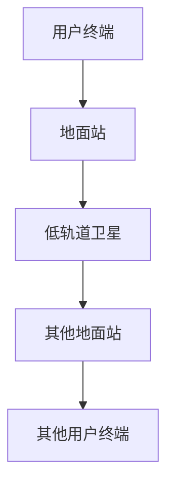

                 

# 价值投资中的低轨道卫星通信前景

---

## 关键词：  
低轨道卫星通信、价值投资、卫星通信技术、投资前景、技术原理、市场分析

---

## 摘要：  
本文深入分析了低轨道卫星通信的技术原理、市场现状、投资价值及未来趋势，结合价值投资的视角，探讨了低轨道卫星通信行业的投资机会与风险。通过技术分析、市场数据和财务模型，本文为投资者提供了全面的分析框架和决策支持，帮助读者更好地理解低轨道卫星通信在价值投资中的潜力。

---

# 第1章: 低轨道卫星通信的背景与现状

## 1.1 低轨道卫星通信的定义与特点  
低轨道卫星通信是指利用距离地球较近的卫星（通常在数百公里到数千公里的轨道高度）进行通信的技术。其特点包括：  
- **低延迟**：低轨道卫星距离地球近，信号传输延迟小。  
- **高带宽**：支持高速数据传输，满足物联网、5G等场景需求。  
- **覆盖广**：低轨道卫星组网可以实现全球覆盖，弥补地面基站的不足。  
- **抗干扰能力强**：低轨道卫星通信技术通过先进的抗干扰算法确保信号稳定性。  

---

## 1.2 低轨道卫星通信的发展历程  
低轨道卫星通信的发展经历了多个阶段：  
1. **早期探索阶段**：20世纪60年代至90年代，主要用于政府和军用通信。  
2. **商业化阶段**：21世纪初，商业卫星通信开始兴起，企业如SpaceX和OneWeb推动低轨道卫星组网。  
3. **大规模部署阶段**：近年来，全球掀起低轨道卫星通信建设热潮，目标是实现全球互联网覆盖。  

---

## 1.3 低轨道卫星通信的市场现状  
当前，全球低轨道卫星通信市场呈现以下特点：  
- **需求增长快**：随着物联网、5G、智能家居等应用的普及，对低轨道卫星通信的需求持续增长。  
- **竞争激烈**：主要参与者包括SpaceX、OneWeb、亚马逊的Project Kuiper等。  
- **技术进步快**：低轨道卫星通信技术不断升级，卫星设计、通信协议等领域的创新加速。  

---

## 1.4 低轨道卫星通信在价值投资中的意义  
低轨道卫星通信行业具有以下投资价值：  
- **行业规模大**：预计到2030年，全球卫星通信市场规模将超过千亿美元。  
- **技术门槛高**：低轨道卫星通信需要复杂的技术支持，具有较高的竞争壁垒。  
- **政策支持强**：政府对卫星通信技术的重视和政策支持为行业提供了增长动力。  

---

# 第2章: 低轨道卫星通信的技术原理  

## 2.1 低轨道卫星通信的基本原理  
低轨道卫星通信通过卫星与地面站或用户终端之间的无线电波传输数据。其基本原理包括：  
1. **信号发射**：地面站将信号发送到低轨道卫星。  
2. **信号中继**：卫星接收信号并转发到其他卫星或地面站。  
3. **信号接收**：用户终端接收卫星发送的信号。  

---

## 2.2 低轨道卫星通信系统架构  
低轨道卫星通信系统通常包括以下部分：  
- **卫星星座**：由多个低轨道卫星组成，形成全球覆盖网络。  
- **地面站**：负责与卫星通信并提供网络服务。  
- **用户终端**：包括手机、物联网设备等，用于接收和发送信号。  

---

## 2.3 低轨道卫星通信的关键技术  
1. **频率复用技术**：通过分配不同的频率实现多用户通信。  
2. **抗干扰技术**：采用先进的编码和调制技术，确保信号稳定。  
3. **高通量技术**：通过多频段、多波束技术提高通信容量。  

---

## 2.4 低轨道卫星通信的产业链分析  
低轨道卫星通信的产业链包括：  
- **卫星制造**：生产低轨道卫星硬件。  
- **通信设备**：提供卫星通信所需的终端设备。  
- **卫星服务**：运营卫星网络并提供通信服务。  

---

# 第3章: 低轨道卫星通信的市场分析与投资价值评估  

## 3.1 低轨道卫星通信的市场需求分析  
1. **全球通信需求增长**：随着数字化转型的推进，对高速、稳定通信的需求增加。  
2. **新兴市场的潜力**：发展中国家对低轨道卫星通信的需求巨大。  
3. **应用场景扩展**：低轨道卫星通信在偏远地区、航空、航海等领域有广泛应用。  

---

## 3.2 低轨道卫星通信企业的财务表现分析  
1. **收入来源**：主要来自卫星通信服务和设备销售。  
2. **成本结构**：卫星制造和发射成本高，但随着技术进步，成本逐步下降。  
3. **盈利能力**：行业处于成长期，未来有望实现较高的利润率。  

---

## 3.3 低轨道卫星通信行业的竞争格局分析  
1. **主要竞争者**：SpaceX、OneWeb、亚马逊的Project Kuiper等。  
2. **市场占有率**：当前市场集中度较高，但新兴企业正在快速崛起。  
3. **竞争态势**：技术、成本和网络覆盖能力是竞争的核心。  

---

## 3.4 低轨道卫星通信的投资价值评估模型  
1. **估值方法**：采用DCF模型评估企业未来现金流。  
2. **投资风险**：技术风险、政策风险和市场风险。  
3. **投资回报**：预计未来5-10年，低轨道卫星通信行业将保持高增长。  

---

# 第4章: 低轨道卫星通信的技术创新与未来趋势  

## 4.1 低轨道卫星通信的技术创新方向  
1. **新型卫星设计**：采用更轻、更高效的材料和技术。  
2. **智能化网络管理**：利用AI技术优化网络性能。  
3. **绿色通信技术**：降低能源消耗，实现可持续发展。  

---

## 4.2 低轨道卫星通信的未来市场趋势  
1. **市场规模扩大**：预计未来十年，全球低轨道卫星通信市场规模将增长数倍。  
2. **应用场景多样化**：从通信扩展到物联网、智慧城市等领域。  
3. **技术融合**：低轨道卫星通信将与5G、AI等技术深度融合。  

---

# 第5章: 价值投资中的低轨道卫星通信策略  

## 5.1 低轨道卫星通信企业的投资策略  
1. **选择优质企业**：重点关注技术领先、市场占有率高的企业。  
2. **关注技术创新**：技术进步是行业发展的核心驱动力。  
3. **分散投资风险**：通过多元化投资降低市场波动带来的影响。  

---

## 5.2 低轨道卫星通信行业的风险管理  
1. **技术风险**：关注企业的技术储备和创新能力。  
2. **政策风险**：关注政府政策变化对企业的影响。  
3. **市场风险**：关注行业竞争格局和市场需求变化。  

---

## 5.3 低轨道卫星通信的长期投资价值  
1. **行业增长潜力**：低轨道卫星通信行业处于高速发展阶段。  
2. **技术驱动创新**：技术创新将持续推动行业增长。  
3. **全球市场机遇**：全球需求增长为行业提供了广阔的发展空间。  

---

# 作者：  
AI天才研究院/AI Genius Institute & 禅与计算机程序设计艺术/Zen And The Art of Computer Programming

