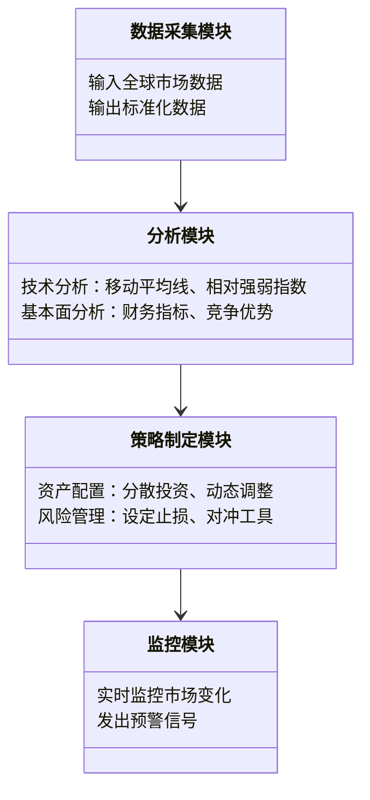
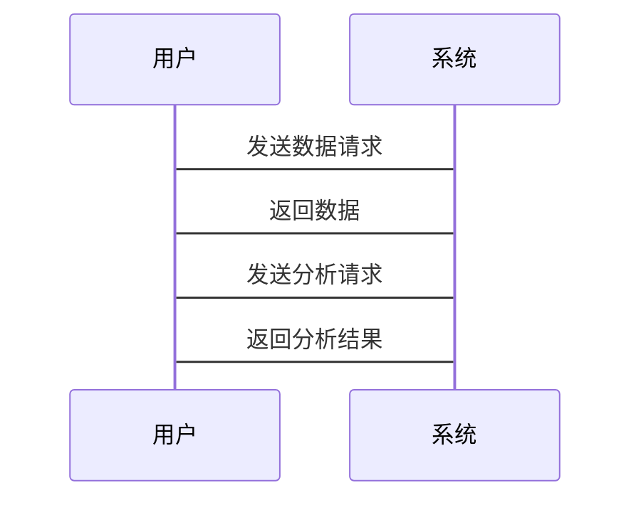

                 


# 价值投资中的全球化视角

---

## 关键词

- 价值投资
- 全球化视角
- 股票分析
- 资产配置
- 技术分析

---

## 摘要

在当今全球化不断深入的背景下，价值投资的视角也在不断扩展。本文从技术分析和系统架构设计的角度，探讨如何在全球化视角下进行价值投资，分析跨国公司和新兴市场的投资机会，并结合实际案例，提供详细的分析和见解。通过系统化的分析方法和工具，帮助投资者在全球化的市场中发现价值，制定有效的投资策略。

---

## 第一部分: 全球化视角下的价值投资基础

### 第1章: 全球化视角与价值投资概述

#### 1.1 全球化视角的定义与背景

- **全球化视角的定义**：从全球市场的角度分析投资机会，关注跨国公司的全球布局和不同市场的经济特点。
- **价值投资的核心理念**：寻找被市场低估的资产，长期持有，关注公司的基本面和长期盈利能力。
- **全球化视角与价值投资的结合**：在分析公司时，不仅要考虑本地市场，还要关注公司在全球市场中的竞争地位和战略布局。

#### 1.2 价值投资的基本原理

- **价值投资的定义与特点**：寻找价格低于内在价值的资产，强调安全边际和长期持有。
- **价值投资的核心要素**：公司基本面分析、财务指标评估、竞争优势分析。
- **价值投资的适用场景**：在市场恐慌或低估时期，价值投资策略表现尤为突出。

#### 1.3 全球化视角下的投资环境

- **全球经济与投资的关系**：全球经济周期、利率变化和通货膨胀对投资策略的影响。
- **不同国家与市场的特点**：新兴市场与发达市场的差异，汇率波动对投资的影响。
- **全球化视角下的投资风险**：国际政治经济风险、市场波动性增加、资产配置的复杂性。

---

### 第2章: 全球宏观经济与价值投资

#### 2.1 全球宏观经济分析

- **全球经济周期的分析**：全球经济的增长阶段和周期性波动对投资的影响。
- **主要经济体的经济政策**：美联储、欧洲央行等主要央行的货币政策对全球市场的影响。
- **通货膨胀与利率变化**：通货膨胀对资产价格的影响，利率变化对债券和股票的影响。

#### 2.2 宏观经济对投资策略的影响

- **经济周期与投资策略的关系**：在经济衰退期寻找价值股，在经济复苏期关注周期性行业。
- **利率变化对资产价格的影响**：低利率环境下的资产重定价，债券收益率与股票估值的关系。
- **通货膨胀对投资组合的影响**：通胀上升时的抗通胀资产配置，如黄金和大宗商品。

---

### 第3章: 全球行业分析与价值投资

#### 3.1 行业分析的基本方法

- **行业生命周期分析**：从幼稚期到衰退期的行业演变，不同阶段的投资策略。
- **行业竞争结构分析**：波特五力模型在行业分析中的应用，竞争优势的来源。
- **行业财务指标分析**：行业的平均ROE、毛利率、资产负债率等关键指标。

#### 3.2 全球化视角下的行业选择

- **跨国公司的全球布局**：分析跨国公司在不同市场的业务占比和增长潜力。
- **新兴市场的行业机会**：新兴市场中的高增长行业，如科技、消费和制造业。
- **行业风险与投资策略**：行业特定风险的识别和管理，如政策风险、技术风险。

---

### 第4章: 全球化视角下的公司分析

#### 4.1 公司基本面分析

- **财务报表分析**：利润表、资产负债表和现金流量表的关键指标解读。
- **公司治理结构**：董事会构成、管理层稳定性、公司治理透明度。
- **公司竞争优势分析**：成本优势、技术优势、品牌优势等。

#### 4.2 跨国公司的投资价值

- **跨国公司的全球业务布局**：分析跨国公司在不同市场的收入占比和增长潜力。
- **跨国公司的财务表现**：比较不同市场的财务指标，寻找被低估的市场。
- **跨国公司的风险管理**：汇率波动、政治风险、贸易政策变化对跨国公司的影响。

---

## 第二部分: 全球化视角下的投资策略

### 第5章: 全球化视角下的投资策略

#### 5.1 全球资产配置策略

- **资产配置的基本原则**：分散投资、风险与收益匹配、长期持有。
- **不同市场的资产配置比例**：根据市场风险和预期收益调整资产配置。
- **资产配置的动态调整**：定期评估市场变化，调整资产配置比例。

#### 5.2 全球化视角下的风险管理

- **全球化投资的风险来源**：汇率风险、市场风险、政治风险、流动性风险。
- **风险管理的策略与工具**：期权、期货、对冲基金等金融工具的应用。
- **风险管理的具体实施**：设定止损点、分散投资、监控市场风险。

---

### 第6章: 全球化视角下的价值投资实战

#### 6.1 全球化视角下的投资案例

- **跨国并购的案例分析**：分析跨国并购的动因、过程和对股价的影响。
- **全球资产配置的案例分析**：根据全球经济形势调整资产配置的具体案例。
- **新兴市场的投资机会**：分析新兴市场中的高增长行业和优质公司。

#### 6.2 投资策略的实施与调整

- **投资策略的制定与实施**：从市场分析到具体投资组合的构建。
- **投资策略的动态调整**：根据市场变化和公司基本面调整投资组合。
- **投资策略的绩效评估**：定期评估投资策略的收益和风险表现。

---

## 第三部分: 全球化视角下的价值投资总结与展望

### 第7章: 全球化视角下的价值投资总结与展望

#### 7.1 全球化视角下的投资总结

- **全球化视角下的投资成果**：通过全球化视角发现投资机会，提升投资收益。
- **投资过程中的经验与教训**：全球化投资中的风险管理、市场波动应对的经验教训。
- **全球化视角下的投资展望**：未来全球化市场的投资机会和挑战。

#### 7.2 价值投资的未来发展

- **价值投资的未来趋势**：技术进步对价值投资的影响，人工智能在投资分析中的应用。
- **全球化视角下的投资机会**：新兴市场的崛起，跨国公司的全球布局。
- **投资者应具备的能力与素质**：全球化视野、跨文化理解、技术分析能力。

#### 7.3 投资者的全球化视野培养

- **如何培养全球化视野**：学习全球经济知识、关注国际市场动态、理解不同文化背景。
- **全球化视角下的学习与成长**：通过阅读、交流和实践提升全球化视野。
- **全球化视角下的投资心态调整**：保持耐心、理性应对市场波动、避免盲目跟风。

---

## 第8章: 系统架构设计与实现

### 8.1 问题场景介绍

- **问题背景**：投资者需要在全球范围内寻找价值被低估的资产，但缺乏系统化的工具和方法。
- **项目目标**：设计一个基于全球化视角的价值投资系统，帮助投资者进行跨市场分析和资产配置。

### 8.2 系统功能设计

- **功能模块**：数据采集模块（收集全球市场数据）、分析模块（技术分析和基本面分析）、策略制定模块（资产配置和风险管理）、监控模块（实时监控市场变化）。
- **领域模型**：使用Mermaid类图展示系统各模块之间的关系。



### 8.3 系统架构设计

- **系统架构**：采用分层架构，包括数据层、业务逻辑层和用户界面层。
- **系统架构图**：使用Mermaid图展示系统架构。


### 8.4 系统接口设计

- **接口设计**：定义API接口，如数据接口、分析接口、策略接口。
- **接口交互流程**：使用Mermaid序列图展示用户与系统之间的交互。



---

## 第四部分: 项目实战与代码实现

### 第9章: 项目实战

#### 9.1 环境安装

- **安装Python环境**：安装Python 3.8及以上版本。
- **安装必要的库**：pandas、numpy、matplotlib、yfinance等。

#### 9.2 核心实现源代码

以下是一个基于全球化视角的简单价值投资策略代码示例：

```python
import pandas as pd
import numpy as np
import matplotlib.pyplot as plt
import yfinance as yf

# 下载数据
def get_data(ticker, start, end):
    data = yf.download(ticker, start=start, end=end)
    return data['Adj Close']

# 计算移动平均线（MA）
def calculate_ma(data, window):
    ma = data.rolling(window).mean()
    return ma

# 计算相对强弱指数（RSI）
def calculate_rsi(data, window):
    diff = data.diff().dropna()
    up = diff[diff > 0]
    down = diff[diff < 0]
    rs = up.rolling(window).mean() / down.rolling(window).mean().abs()
    rsi = 100 - 100 / (1 + rs)
    return rsi

# 主函数
def main():
    start_date = '2020-01-01'
    end_date = '2023-01-01'
    
    # 下载股票数据
    msft_data = get_data('MSFT', start_date, end_date)
    aapl_data = get_data('AAPL', start_date, end_date)
    google_data = get_data('GOOGL', start_date, end_date)
    
    # 计算移动平均线和RSI
    ma_msft = calculate_ma(msft_data, 20)
    rsi_msft = calculate_rsi(msft_data, 14)
    
    ma_aapl = calculate_ma(aapl_data, 20)
    rsi_aapl = calculate_rsi(aapl_data, 14)
    
    ma_google = calculate_ma(google_data, 20)
    rsi_google = calculate_rsi(google_data, 14)
    
    # 绘制图表
    plt.figure(figsize=(12, 6))
    plt.plot(msft_data, label='MSFT Price')
    plt.plot(ma_msft, label='MSFT 20-day MA')
    plt.plot(rsi_msft, label='MSFT RSI')
    plt.legend()
    plt.title('MSFT: Price, MA, RSI')
    plt.show()
    
    plt.figure(figsize=(12, 6))
    plt.plot(aapl_data, label='AAPL Price')
    plt.plot(ma_aapl, label='AAPL 20-day MA')
    plt.plot(rsi_aapl, label='AAPL RSI')
    plt.legend()
    plt.title('AAPL: Price, MA, RSI')
    plt.show()
    
    plt.figure(figsize=(12, 6))
    plt.plot(google_data, label='Google Price')
    plt.plot(ma_google, label='Google 20-day MA')
    plt.plot(rsi_google, label='Google RSI')
    plt.legend()
    plt.title('Google: Price, MA, RSI')
    plt.show()

if __name__ == '__main__':
    main()
```

#### 9.3 代码解读与分析

- **数据采集**：使用yfinance库从Yahoo Finance获取股票数据。
- **技术分析**：计算移动平均线（MA）和相对强弱指数（RSI）。
- **图表绘制**：绘制股票价格、移动平均线和RSI的图表，帮助投资者识别趋势和超买超卖信号。

#### 9.4 实际案例分析

以微软（MSFT）、苹果（AAPL）和谷歌（GOOGL）为例，分析它们在全球市场中的表现，结合技术指标和基本面分析，制定投资策略。

---

## 第五部分: 总结与展望

### 第10章: 总结与展望

#### 10.1 总结

- **全球化视角下的价值投资总结**：通过全球化视角，投资者能够发现更多的投资机会，降低风险，提升投资收益。
- **技术分析与系统设计的重要性**：技术分析工具和系统架构设计在价值投资中的关键作用。

#### 10.2 展望

- **未来技术发展**：人工智能和大数据技术在投资分析中的应用前景。
- **全球化视角的深化**：随着全球经济一体化的加深，全球化视角下的投资策略将更加重要。
- **投资者能力提升**：投资者需要不断学习和适应全球化市场中的变化，提升技术分析和系统设计能力。

---

## 作者

**作者：AI天才研究院/AI Genius Institute & 禅与计算机程序设计艺术 /Zen And The Art of Computer Programming**

---

这篇博客文章结合了技术分析、系统架构设计和实际案例，深入探讨了全球化视角下的价值投资策略。通过详细的分析和代码实现，帮助投资者更好地理解和应用全球化视角下的价值投资方法。

