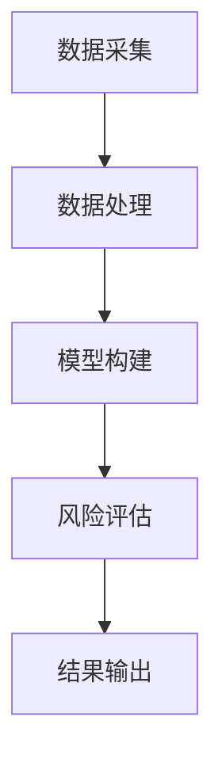

                 


# 价值投资中的可再生能源机会

---

## 关键词：
- 价值投资、可再生能源、投资机会、DCF模型、光伏发电、风电、能源转型

---

## 摘要：
本文探讨了在可再生能源领域进行价值投资的机会与策略。通过分析可再生能源行业的现状、技术发展趋势和政策支持，结合价值投资的核心理念，本文详细阐述了如何在可再生能源领域寻找具有长期投资价值的项目。文章还介绍了具体的项目分析方法，包括现金流分析、DCF模型的应用，以及系统架构设计等内容，帮助投资者在可再生能源领域做出明智的投资决策。

---

## 第1章：可再生能源与价值投资的背景介绍

### 1.1 可再生能源的基本概念
#### 1.1.1 可再生能源的定义与分类
可再生能源是指来源于自然界的能源，能够不断再生更新的能源形式。主要包括：
- **太阳能**：通过光伏效应或光热转换利用太阳辐射。
- **风能**：利用风力进行发电。
- **生物质能**：利用植物、动物及有机废弃物进行发电或供热。
- **地热能**：利用地球内部的热能进行发电或供热。
- **海洋能**：利用潮汐、波浪、海流等海洋运动能进行发电。

#### 1.1.2 可再生能源的技术特点与发展现状
可再生能源技术近年来取得了显著进展，尤其是在光伏发电和风电领域。例如，光伏发电的效率不断提高，成本持续下降；风电设备的单机容量越来越大，发电效率显著提升。

#### 1.1.3 可再生能源的全球发展趋势与政策支持
全球能源转型正在加速，各国政府纷纷制定可再生能源发展目标。例如，欧盟提出了“绿色新政”，目标在2030年实现55%的可再生能源占比；中国提出“双碳”目标，计划在2060年实现碳中和。

---

### 1.2 价值投资的基本概念与方法
#### 1.2.1 价值投资的定义与核心理念
价值投资是一种以低于其内在价值的价格购买优质资产的投资策略，核心理念是寻找市场低估的公司或项目，长期持有，等待其价值回归。

#### 1.2.2 价值投资的核心要素与分析框架
价值投资的分析框架主要包括：
1. **基本面分析**：研究公司的财务状况、盈利能力、成长能力等。
2. **行业分析**：了解行业的发展趋势、竞争格局和政策环境。
3. **估值分析**：通过DCF模型、市盈率、市净率等方法评估资产的内在价值。

#### 1.2.3 价值投资在不同领域的应用
价值投资在传统行业（如金融、能源）和新兴行业（如科技、医疗）均有广泛应用。本文重点关注其在可再生能源领域的应用。

---

### 1.3 可再生能源与价值投资的结合
#### 1.3.1 可再生能源行业的投资价值分析
可再生能源行业的投资价值主要体现在：
- 市场需求快速增长。
- 技术进步带来成本下降。
- 政策支持提供长期保障。

#### 1.3.2 价值投资在可再生能源领域的独特优势
价值投资在可再生能源领域的独特优势包括：
- 可再生能源行业的技术壁垒逐渐降低，适合通过长期持有的方式实现价值增值。
- 可再生能源项目的现金流稳定，适合使用DCF模型进行估值。

#### 1.3.3 可再生能源行业的风险与机遇
可再生能源行业的主要风险包括：
- 政策不确定性。
- 技术更新换代快。
- 初期投资成本高。

---

## 第2章：可再生能源行业的现状与投资机会分析

### 2.1 可再生能源行业的现状分析
#### 2.1.1 全球可再生能源装机容量分析
近年来，全球可再生能源装机容量快速增长。根据国际能源署（IEA）的数据，2022年全球可再生能源发电量占总发电量的38%，其中光伏发电占比最高。

#### 2.1.2 可再生能源技术进步与成本下降趋势
技术进步是推动可再生能源发展的重要因素。例如，光伏发电的单位成本在过去十年中下降了80%。

#### 2.1.3 可再生能源市场的供需格局
全球可再生能源市场供需格局正在发生变化，新兴市场（如印度、东南亚）的需求快速增长，而发达国家（如德国、美国）的市场逐渐饱和。

---

### 2.2 可再生能源行业的投资机会
#### 2.2.1 光伏发电的投资机会
- **市场空间**：光伏发电是可再生能源领域最大的市场，未来几年将保持快速增长。
- **技术优势**：光伏发电技术成熟，成本持续下降。
- **政策支持**：各国政府纷纷出台政策支持光伏发电发展。

#### 2.2.2 风电的投资机会
- **市场空间**：风电是第二大可再生能源市场，尤其在欧洲和中国市场需求旺盛。
- **技术优势**：风电技术成熟，单机容量不断增大。
- **政策支持**：风电被纳入各国能源转型计划。

#### 2.2.3 其他可再生能源（如生物质能、地热能）的投资机会
- **生物质能**：适用于农业资源丰富的地区，市场需求稳定。
- **地热能**：技术门槛高，但资源分布广泛。

---

### 2.3 可再生能源行业的未来发展趋势
#### 2.3.1 技术创新与成本下降的持续推动
技术创新将继续推动可再生能源成本下降，例如新型光伏电池技术和大型风电设备。

#### 2.3.2 政策支持与市场环境的变化
政策支持是可再生能源发展的重要推动力，未来政策的不确定性和支持力度将影响行业发展。

#### 2.3.3 全球能源转型与可再生能源的未来展望
全球能源转型将加速可再生能源的发展，预计到2050年，可再生能源将占据全球能源消费的主导地位。

---

## 第3章：价值投资在可再生能源中的方法论

### 3.1 价值投资的核心理念与可再生能源的结合
#### 3.1.1 价值投资的核心理念
价值投资的核心理念是寻找市场低估的资产，长期持有，等待价值回归。

#### 3.1.2 可再生能源行业的投资逻辑
在可再生能源领域，价值投资需要重点关注项目的：
- **内在价值**：通过DCF模型评估项目的未来现金流。
- **竞争优势**：选择具有技术优势、成本优势的企业。
- **政策支持**：关注政策稳定性对项目的影响。

---

### 3.2 可再生能源项目的价值评估方法
#### 3.2.1 现金流分析
现金流分析是评估可再生能源项目的核心方法。通过预测项目未来的现金流，可以评估其内在价值。

#### 3.2.2 DCF模型的应用
DCF（Discounted Cash Flow）模型是评估可再生能源项目价值的重要工具。其基本步骤如下：
1. **预测未来现金流**：包括运营现金流和资本支出。
2. **确定折现率**：通常使用加权平均资本成本（WACC）作为折现率。
3. **计算内在价值**：通过公式$$DCF = \sum_{t=1}^{n} \frac{CF_t}{(1 + r)^t} + \frac{Terminal Value}{(1 + r)^n}$$计算项目的内在价值。

#### 3.2.3 DCF模型的优缺点
- **优点**：DCF模型能够准确反映项目的未来现金流情况。
- **缺点**：模型的准确性依赖于对未来现金流的预测，存在较高的不确定性。

---

### 3.3 价值投资在可再生能源中的实践
#### 3.3.1 投资策略
- **长期持有**：选择具有长期竞争优势的可再生能源企业。
- **分散投资**：通过分散投资降低风险。

#### 3.3.2 投资组合管理
- **资产配置**：根据市场情况调整可再生能源在投资组合中的权重。
- **风险管理**：定期评估投资项目的风险，及时调整投资策略。

---

## 第4章：可再生能源项目分析

### 4.1 光伏发电项目分析
#### 4.1.1 项目基本情况
- **装机容量**：10MW。
- **投资成本**：800万元。
- **运营周期**：25年。

#### 4.1.2 项目现金流预测
| 年份 | 现金流入（万元） | 现金流出（万元） | 净现金流（万元） |
|------|------------------|------------------|------------------|
| 0    | 0                | 800              | -800             |
| 1    | 120              | 50               | 70               |
| 2    | 150              | 60               | 90               |
| ...  | ...              | ...              | ...              |
| 25   | 100              | 20               | 80               |

#### 4.1.3 项目估值
通过DCF模型计算，该项目的内在价值为$$DCF = \sum_{t=1}^{25} \frac{CF_t}{(1 + 0.08)^t} + \frac{100}{(1 + 0.08)^{25}} \approx 1000 \text{万元}$$

---

### 4.2 风电项目分析
#### 4.2.1 项目基本情况
- **装机容量**：50MW。
- **投资成本**：5000万元。
- **运营周期**：20年。

#### 4.2.2 项目现金流预测
| 年份 | 现金流入（万元） | 现金流出（万元） | 净现金流（万元） |
|------|------------------|------------------|------------------|
| 0    | 0                | 5000             | -5000            |
| 1    | 600              | 80               | 520              |
| 2    | 700              | 90               | 610              |
| ...  | ...              | ...              | ...              |
| 20   | 800              | 30               | 770              |

#### 4.2.3 项目估值
通过DCF模型计算，该项目的内在价值为$$DCF = \sum_{t=1}^{20} \frac{CF_t}{(1 + 0.08)^t} + \frac{800}{(1 + 0.08)^{20}} \approx 6000 \text{万元}$$

---

## 第5章：系统分析与架构设计

### 5.1 可再生能源项目评估系统
#### 5.1.1 系统功能设计
- **数据采集**：收集项目的现金流数据、市场数据和政策数据。
- **模型构建**：使用DCF模型进行项目估值。
- **风险评估**：分析项目的风险因素。

#### 5.1.2 系统架构设计


---

## 第6章：项目实战

### 6.1 光伏发电项目实战
#### 6.1.1 环境搭建
- **工具**：Excel、Python（用于DCF模型）。
- **数据来源**：公开市场数据、政府政策文件。

#### 6.1.2 核心代码实现
```python
def calculate_dcf(cash_flows, discount_rate, terminal_value):
    dcf = 0
    for t, cf in enumerate(cash_flows):
        if t == 0:
            continue
        dcf += cf / (1 + discount_rate) ** t
    dcf += terminal_value / (1 + discount_rate) ** len(cash_flows)
    return dcf

# 示例数据
cash_flows = [0, 120, 150, ..., 100]
discount_rate = 0.08
terminal_value = 100

dcf = calculate_dcf(cash_flows, discount_rate, terminal_value)
print(f"DCF Value: {dcf}")
```

---

## 第7章：总结与展望

### 7.1 总结
通过本文的分析，可以得出以下结论：
- 可再生能源行业具有广阔的投资机会。
- 价值投资在可再生能源领域的应用具有独特优势。
- DCF模型是评估可再生能源项目的重要工具。

### 7.2 展望
未来，随着技术进步和政策支持，可再生能源行业将继续保持快速增长。投资者可以通过价值投资的方法，在这一领域实现长期稳定的收益。

---

## 作者：AI天才研究院/AI Genius Institute & 禅与计算机程序设计艺术 /Zen And The Art of Computer Programming

