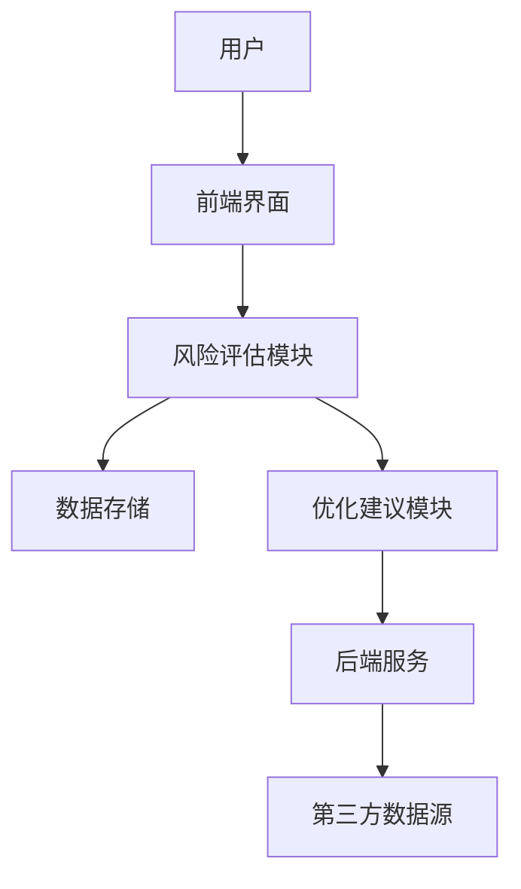

                 


# 价值投资中的可持续供应链管理分析

## 关键词：价值投资，可持续供应链，风险管理，多因子模型，企业治理

## 摘要：本文从价值投资的角度分析了可持续供应链管理的重要性，探讨了如何通过优化供应链管理来降低企业风险，提升投资价值。文章详细介绍了可持续供应链管理的核心概念、算法原理、系统架构设计以及实际项目案例，为投资者和企业管理者提供了深入的理论支持和实践指导。

---

## 第1章：可持续供应链管理的背景与概念

### 1.1 可持续供应链管理的背景

#### 1.1.1 供应链管理的演进历程

供应链管理从传统的关注成本和效率，逐步发展到注重可持续性。现代供应链管理强调透明度、社会责任和环境保护，以应对全球化带来的挑战。

#### 1.1.2 可持续发展对企业供应链的影响

企业通过优化供应链管理，减少资源浪费、降低碳排放，提升企业的社会形象和市场竞争力。同时，可持续供应链管理也帮助企业降低运营风险，增强供应链的韧性。

#### 1.1.3 全球化背景下的供应链挑战

全球化使得供应链更加复杂，企业需要应对更多的不确定性和潜在风险，如原材料短缺、物流中断等。可持续供应链管理为企业提供了应对这些挑战的策略。

---

### 1.2 价值投资的核心理念

#### 1.2.1 价值投资的定义与特点

价值投资强调以低于内在价值的价格购买优质资产，注重企业的基本面分析、长期增长潜力和合理的估值。

#### 1.2.2 价值投资与企业风险管理

价值投资者关注企业的风险管理能力，认为一个稳健的供应链管理能够降低企业的经营风险，从而提升企业的长期价值。

#### 1.2.3 可持续供应链管理与价值投资的结合

可持续供应链管理不仅降低了企业的运营风险，还提升了企业的社会责任形象，符合价值投资的核心理念。

---

### 1.3 可持续供应链管理的核心要素

#### 1.3.1 供应链的透明度

透明的供应链管理有助于识别潜在风险，提升供应链的整体效率和可持续性。

#### 1.3.2 供应链的伦理与社会责任

企业应关注供应链中的社会责任问题，如劳工权益、环境保护等，以提升企业的社会形象和投资价值。

#### 1.3.3 供应链的效率与可持续性平衡

在追求效率的同时，企业需要平衡供应链的可持续性，避免因短期利益而忽视长期风险。

---

## 第2章：可持续供应链管理的核心概念

### 2.1 供应链管理的关键环节

#### 2.1.1 采购与供应商管理

企业需要选择可靠的供应商，建立长期合作关系，确保供应链的稳定性和可持续性。

#### 2.1.2 生产与物流管理

优化生产流程和物流网络，减少资源浪费和碳排放，提升供应链的整体效率。

#### 2.1.3 库存与需求管理

通过精准的需求预测和库存管理，避免资源浪费，降低供应链的运营成本。

---

### 2.2 可持续供应链管理的属性特征对比

| 属性                | 可持续供应链管理                | 传统供应链管理                |
|---------------------|--------------------------------|-----------------------------|
| 透明度              | 高                           | 中/低                     |
| 伦理与社会责任      | 强调                         | 一般                        |
| 效率与可持续性平衡   | 平衡                         | 侧重效率                    |

---

### 2.3 可持续供应链管理的ER实体关系图

```mermaid
er
actor 供应链管理, [供应链参与者] {
    role 采购部门
    role 生产部门
    role 物流部门
}
actor 供应商, [供应商] {
    role 供应商A
    role 供应商B
}
actor 消费者, [消费者]
actor 第三方机构, [认证机构]
```

---

## 第3章：供应链风险管理的算法原理

### 3.1 风险评估模型的构建

#### 3.1.1 风险评估模型的输入与输出

- 输入：供应链各环节的风险因素（如供应商稳定性、物流风险、库存风险等）
- 输出：风险评分和优化建议

---

### 3.2 基于多因子模型的风险评估算法

#### 3.2.1 多因子模型的定义与特点

多因子模型是一种统计方法，通过多个因子（如供应商稳定性、物流效率、环境影响等）来评估供应链的整体风险。

---

#### 3.2.2 多因子模型的实现步骤

1. **数据收集**：收集供应链各环节的相关数据。
2. **因子选择**：选择影响供应链风险的关键因子。
3. **权重分配**：根据各因子的重要性分配权重。
4. **风险评分计算**：根据因子评分和权重计算整体风险评分。

---

### 3.3 风险评估模型的数学公式

#### 3.3.1 风险评分公式

$$ \text{风险评分} = \sum (\text{因子评分}_i \times \text{权重}_i) $$

#### 3.3.2 风险权重分配公式

$$ \text{权重}_i = \frac{\text{因子}_i \text{的重要性}}{\sum \text{所有因子的重要性}} $$

---

### 3.4 算法实现的Python代码

#### 3.4.1 数据预处理代码

```python
import pandas as pd

# 读取数据
data = pd.read_csv('supply_chain_risk.csv')

# 删除缺失值
data.dropna(inplace=True)
```

---

#### 3.4.2 风险评估模型代码

```python
def calculate_risk_score(data):
    # 定义因子和权重
    factors = ['factor1', 'factor2', 'factor3']
    weights = [0.4, 0.3, 0.3]
    
    # 计算加权风险评分
    risk_score = 0
    for factor, weight in zip(factors, weights):
        risk_score += data[factor] * weight
    
    return risk_score

# 应用模型计算风险评分
data['risk_score'] = data.apply(calculate_risk_score, axis=1)
```

---

## 第4章：可持续供应链管理的系统分析与架构设计

### 4.1 问题场景介绍

#### 4.1.1 供应链风险管理的典型场景

- 供应商突然中断供应
- 物流延迟导致库存积压
- 原材料价格上涨

---

#### 4.1.2 价值投资中的供应链管理需求

- 投资者需要了解企业的供应链风险，以评估企业的长期投资价值。

---

### 4.2 系统功能设计

#### 4.2.1 风险评估模块

- 提供供应链各环节的风险评估报告
- 生成风险评分和优化建议

---

#### 4.2.2 数据可视化模块

- 展示供应链的整体风险分布
- 提供数据的动态可视化

---

#### 4.2.3 供应链优化模块

- 根据风险评估结果，优化供应链的结构和流程

---

### 4.3 系统架构设计



---

### 4.4 系统接口设计

#### 4.4.1 API接口定义

```json
{
    "api": "/api/risk-assessment",
    "method": "POST",
    "params": {
        "data": "供应链相关数据"
    }
}
```

---

## 第5章：项目实战

### 5.1 环境安装与数据准备

#### 5.1.1 开发环境的搭建

- 安装Python、Pandas、Matplotlib等工具

---

#### 5.1.2 数据来源与数据清洗

- 数据来源：公开的供应链相关数据
- 数据清洗：处理缺失值、异常值等

---

### 5.2 供应链优化案例分析

#### 5.2.1 案例背景

某制造企业面临原材料供应链不稳定的问题，希望通过优化供应链管理降低风险。

---

#### 5.2.2 数据分析与优化建议

1. **数据分析**：发现部分供应商的交货周期不稳定。
2. **优化建议**：引入新的供应商，建立多元化的供应链网络。

---

### 5.3 系统实现与结果解读

#### 5.3.1 核心代码实现

```python
def optimize_supply_chain(data):
    # 分析数据，提出优化建议
    pass

# 调用优化函数
optimized_data = optimize_supply_chain(data)
```

---

#### 5.3.2 优化结果分析

- 供应链的整体风险评分降低
- 企业的运营成本下降
- 供应链的稳定性提高

---

## 第6章：总结与展望

### 6.1 最佳实践 tips

- **透明化**：保持供应链的透明度，有助于及时发现和解决问题。
- **风险管理**：建立完善的供应链风险评估机制，降低潜在风险。
- **持续优化**：定期评估和优化供应链管理，提升整体效率和可持续性。

---

### 6.2 小结

可持续供应链管理不仅是企业运营的核心，也是价值投资的重要考量因素。通过优化供应链管理，企业能够降低风险，提升长期投资价值。

---

### 6.3 注意事项

- 在实际应用中，需根据企业的实际情况调整供应链管理策略。
- 数据的准确性和完整性对供应链风险管理至关重要。

---

### 6.4 拓展阅读

- 《供应链风险管理》
- 《价值投资实战指南》
- 《企业治理与可持续发展》

---

## 作者：AI天才研究院/AI Genius Institute & 禅与计算机程序设计艺术 /Zen And The Art of Computer Programming

---

以上是《价值投资中的可持续供应链管理分析》的完整内容，涵盖了从背景介绍到系统设计的各个方面，结合实际案例和代码实现，为读者提供了全面的分析和指导。

