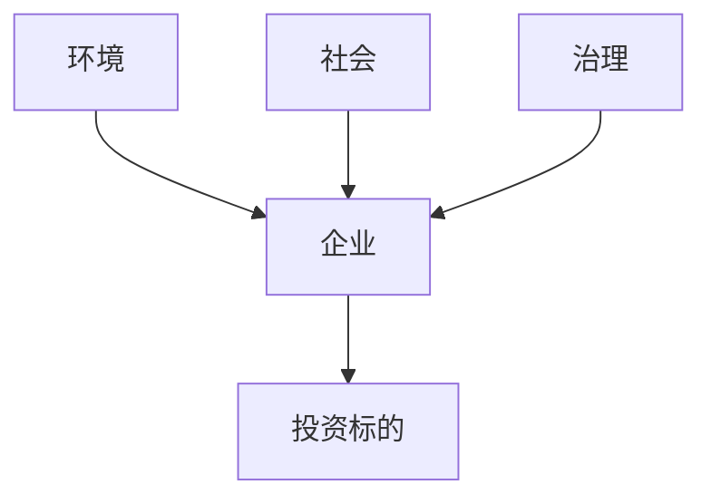
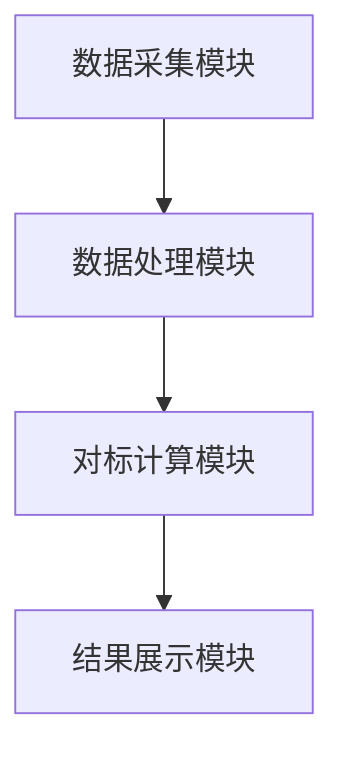
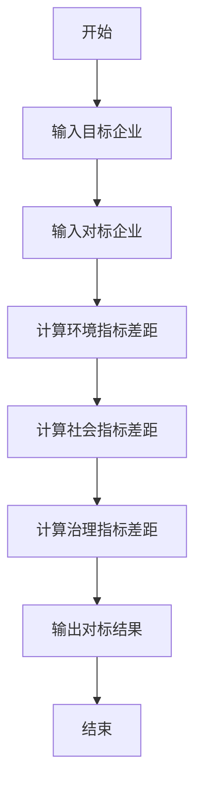

                 


# 价值投资中的可持续发展目标对标

## 关键词：价值投资、可持续发展目标、ESG、投资策略、风险管理、企业评价、技术应用

## 摘要：  
本文探讨了在价值投资中如何将可持续发展目标（如ESG）与投资策略相结合，通过系统化的分析方法和技术创新，帮助投资者在实现长期收益的同时，推动社会可持续发展。文章从理论到实践，结合具体案例，详细阐述了可持续发展目标在投资决策中的应用，并提出了基于技术手段的解决方案。

---

## 第一章：可持续发展目标的背景与意义

### 1.1 可持续发展目标的定义与内涵  
可持续发展目标（Sustainable Development Goals, SDGs）是联合国提出的17项全球性目标，旨在从2015年到2030年间，推动经济、社会和环境的全面发展。在投资领域，可持续发展目标不仅关注企业的财务表现，还强调企业在环境保护、社会责任和公司治理等方面的表现。

### 1.2 价值投资的基本原理  
价值投资是一种以基本面分析为基础的投资策略，强调以低于内在价值的价格买入优质资产。其核心理念是通过长期持有优质企业，获得超额收益。然而，传统的价值投资往往忽视了企业的社会和环境影响。

### 1.3 可持续发展目标在投资中的重要性  
将可持续发展目标纳入投资决策，不仅有助于提升企业的长期竞争力，还能帮助投资者规避与环境、社会和治理相关的风险。此外，随着全球对ESG（环境、社会、治理）的关注度提升，投资者通过关注可持续发展目标，可以在长期实现更高的收益。

---

## 第二章：可持续发展目标的核心概念与联系

### 2.1 可持续发展目标的核心要素  
- **环境（Environmental）**：关注企业在资源使用、碳排放、污染治理等方面的实践。
- **社会（Social）**：关注企业在员工权益、社区参与、产品安全等方面的实践。
- **治理（Governance）**：关注企业在公司治理结构、透明度、高管薪酬等方面的实践。

### 2.2 可持续发展目标与价值投资的关联性  
通过将ESG指标与传统的财务指标结合，投资者可以更全面地评估企业的价值。例如，一家企业在财务表现优异的同时，如果在ESG方面表现不佳，可能会影响其长期价值。

### 2.3 可持续发展目标的实体关系图  
以下是企业与可持续发展目标之间关系的实体关系图：



---

## 第三章：价值投资中的可持续发展目标对标方法

### 3.1 可持续发展目标对标的基本原理  
对标方法的核心是通过比较企业的实际表现与行业基准或竞争对手的表现，识别企业在可持续发展方面的优势与不足。

### 3.2 可持续发展目标对标的具体方法  
- **基于ESG指标的对标方法**：选择与企业处于同一行业、规模相近的企业作为对标对象，比较其在ESG方面的表现。
- **基于行业基准的对标方法**：将企业的ESG表现与行业平均水平进行对比，识别其在行业中的相对位置。
- **基于财务指标的对标方法**：结合财务指标和ESG指标，全面评估企业的投资价值。

### 3.3 可持续发展目标对标的应用案例  
以某行业的龙头企业为例，我们可以通过以下步骤进行对标分析：

1. **选择对标企业**：选择与目标企业处于同一行业、规模相近的企业作为对标对象。
2. **收集数据**：收集目标企业及对标企业在环境、社会和治理方面的相关数据。
3. **计算差距**：将目标企业的ESG表现与对标企业的表现进行对比，识别差距。
4. **提出建议**：根据对比结果，提出改进企业ESG表现的具体建议。

---

## 第四章：基于技术的可持续发展目标对标实现

### 4.1 系统架构设计  
以下是实现可持续发展目标对标系统的架构图：



### 4.2 算法原理讲解  
以下是一个基于ESG指标的对标算法流程图：



### 4.3 代码实现  
以下是计算企业ESG表现差距的Python代码示例：

```python
import pandas as pd

def calculate_esg_gap(target_esg, benchmark_esg):
    gap = target_esg - benchmark_esg
    return gap

# 示例数据
target_esg = {
    '环境': 85,
    '社会': 90,
    '治理': 80
}

benchmark_esg = {
    '环境': 75,
    '社会': 85,
    '治理': 78
}

# 计算差距
environment_gap = calculate_esg_gap(target_esg['环境'], benchmark_esg['环境'])
social_gap = calculate_esg_gap(target_esg['社会'], benchmark_esg['社会'])
governance_gap = calculate_esg_gap(target_esg['治理'], benchmark_esg['治理'])

print(f"环境差距: {environment_gap}")
print(f"社会差距: {social_gap}")
print(f"治理差距: {governance_gap}")
```

---

## 第五章：案例分析与实际应用

### 5.1 案例分析  
以某制造业企业为例，假设其在环境、社会和治理方面的得分为85、90、80。对标企业（行业平均水平）的得分为75、85、78。通过计算，该企业的环境和治理表现优于行业平均水平，但在社会表现方面与对标企业持平。

### 5.2 投资决策建议  
根据对标结果，投资者可以建议该企业进一步优化治理结构，并在环境保护方面继续保持优势。

---

## 第六章：总结与展望

### 6.1 总结  
本文通过理论分析和案例实践，探讨了可持续发展目标在价值投资中的应用。通过将ESG指标与传统财务指标结合，投资者可以更全面地评估企业的价值，并在实现长期收益的同时，推动社会的可持续发展。

### 6.2 展望  
未来，随着技术的不断进步，可持续发展目标在投资中的应用将更加广泛和深入。投资者可以通过人工智能、大数据等技术手段，进一步提升可持续发展目标对标的效果。

---

## 作者：AI天才研究院/AI Genius Institute & 禅与计算机程序设计艺术 /Zen And The Art of Computer Programming

