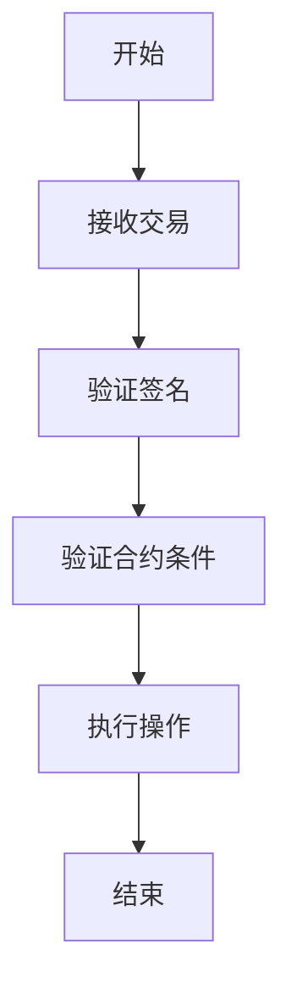
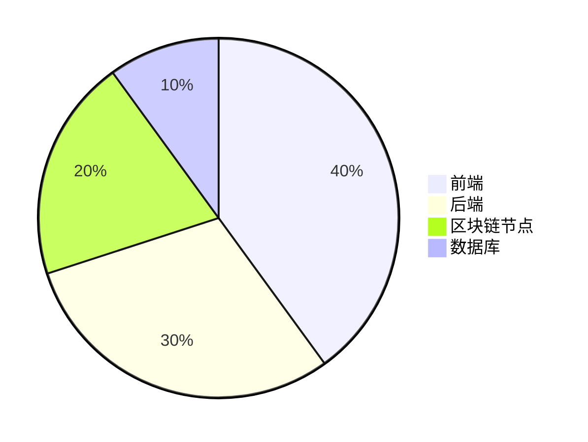
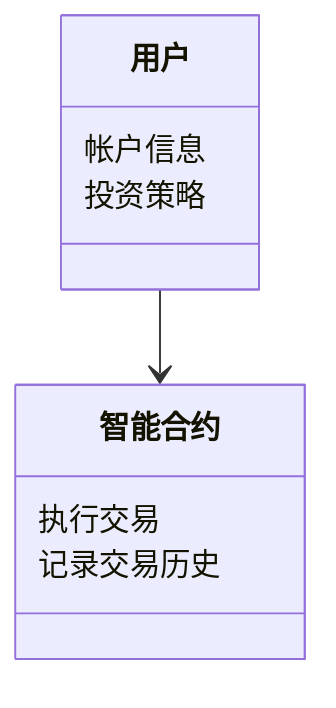

                 


# 价值投资中的可编程物质技术前景分析

> 关键词：价值投资、可编程物质技术、区块链、智能合约、DeFi、量化交易

> 摘要：本文探讨了价值投资与可编程物质技术的结合，分析了可编程物质技术在金融领域的应用前景，详细讲解了相关算法和系统架构，并通过实际案例展示了其在价值投资中的潜力。

---

## 第1章 价值投资与可编程物质技术概述

### 1.1 价值投资的定义与核心理念

价值投资是一种长期投资策略，强调以低于内在价值的价格购买优质资产。其核心理念包括：

- **长期持有**：投资优质企业，长期持有，获得复利效应。
- **安全边际**：买入价格低于内在价值，以降低风险。
- **企业基本面分析**：关注企业的财务状况、行业地位和竞争优势。

### 1.2 可编程物质技术的定义与特点

可编程物质技术是将数字技术与物理世界结合，通过智能合约实现对物质资产的自动化管理和交易。其特点包括：

- **自动化**：通过智能合约自动执行交易和管理。
- **透明性**：区块链技术确保数据不可篡改，提高透明度。
- **去中心化**：避免单点故障，降低系统风险。

### 1.3 价值投资与可编程物质技术的结合

可编程物质技术为价值投资提供了新的工具和平台，能够实现投资决策的自动化和高效管理。其结合点包括：

- **智能合约**：自动执行投资策略，如定时定额买入优质资产。
- **DeFi（去中心化金融）**：通过区块链技术实现无需信任的金融交易，降低交易成本。

---

## 第2章 可编程物质技术的核心概念与原理

### 2.1 可编程物质技术的核心概念

可编程物质技术的核心概念包括：

- **智能合约**：区块链上的自动执行程序，用于触发和执行交易。
- **代币化资产**：将传统资产（如股票、债券）转化为数字代币，便于交易和管理。

### 2.2 可编程物质技术的数学模型与公式

可编程物质技术的数学模型通常涉及哈希函数和加密算法。例如，比特币的哈希函数计算如下：

$$ H = \text{sha256}(\text{sha256}(x)) $$

其中，$x$ 是输入数据，$H$ 是哈希值。

### 2.3 可编程物质技术的算法原理

以下是智能合约的执行流程图：



---

## 第3章 价值投资中的可编程物质技术应用分析

### 3.1 可编程物质技术在价值投资中的应用场景

- **自动化投资**：通过智能合约自动执行买入和卖出指令，实现价值投资策略。
- **风险管理**：利用区块链的透明性和智能合约的自动化功能，实时监控和管理投资风险。

### 3.2 价值投资中的可编程物质技术系统架构设计

以下是可编程金融系统的架构图：



---

## 第4章 价值投资中的可编程物质技术项目实战

### 4.1 项目背景与目标

本项目旨在通过可编程物质技术实现一个自动化投资平台，用户可以设置投资策略，平台自动执行交易。

### 4.2 项目系统功能设计

以下是领域模型的类图：



### 4.3 项目系统实现

以下是智能合约的实现代码：

```python
def buy_asset(asset_id, amount):
    # 验证用户身份
    if not authenticated:
        return "未授权"
    # 调用智能合约
    contract = get_contract(asset_id)
    contract.execute("buy", amount)
```

---

## 第5章 最佳实践与总结

### 5.1 本章小结

可编程物质技术为价值投资提供了新的可能性，通过智能合约和区块链技术，能够实现投资决策的自动化和高效管理。

### 5.2 注意事项

- **安全性**：智能合约代码需要经过严格测试，避免漏洞。
- **合规性**：遵守相关法律法规，确保投资活动的合法性。

### 5.3 拓展阅读

- 推荐阅读《区块链技术进阶与实战》和《智能合约开发指南》。

---

作者：AI天才研究院/AI Genius Institute & 禅与计算机程序设计艺术 /Zen And The Art of Computer Programming

