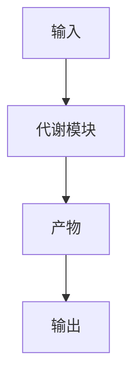
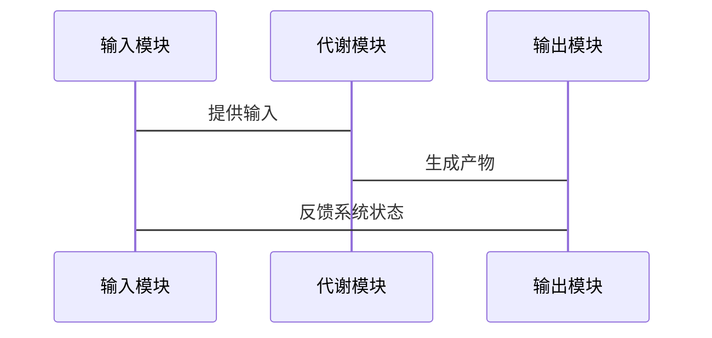

                 


# 价值投资中的合成生物学工程化细胞技术趋势

> 关键词：合成生物学，工程化细胞技术，价值投资，投资趋势，细胞工程

> 摘要：合成生物学与工程化细胞技术在投资领域具有重要潜力。本文分析了合成生物学的基本概念、工程化细胞技术的核心原理，探讨了其数学模型与算法，设计了系统架构，并通过具体案例分析了投资中的应用，提出了投资策略和风险管理建议，最后总结了当前趋势和未来展望。

---

## 第1章 合成生物学与工程化细胞技术的背景与基础

### 1.1 合成生物学的基本概念

#### 1.1.1 合成生物学的定义
合成生物学（Synthetic Biology）是通过工程学原理设计和构建新的生物系统，或对现有生物系统进行重新设计。其目标是实现对生命系统的精确控制和优化。

#### 1.1.2 合成生物学的核心目标
- **模块化设计**：将生物系统分解为可替换的模块。
- **功能增强**：通过基因编辑等技术提升生物系统的功能。
- **新系统构建**：设计并合成新的生物系统。

#### 1.1.3 合成生物学与传统生物学的区别
| 属性 | 合成生物学 | 传统生物学 |
|------|------------|------------|
| 方法 | 工程化、设计驱动 | 描述性、实验驱动 |
| 目标 | 创建新系统 | 理解现有系统 |
| 应用 | 工业生产、药物开发 | 研究生命现象 |

### 1.2 工程化细胞技术的定义与特点

#### 1.2.1 工程化细胞技术的定义
工程化细胞技术是指通过基因编辑、合成生物学等技术，对细胞进行改造，使其具备特定功能的技术。

#### 1.2.2 工程化细胞技术的核心特点
- **可编程性**：细胞功能可以通过基因设计进行编程。
- **高效性**：优化后的细胞能高效生产目标产物。
- **稳定性**：工程化细胞具有更高的稳定性和一致性。

#### 1.2.3 工程化细胞技术与传统细胞工程的区别
| 属性 | 工程化细胞技术 | 传统细胞工程 |
|------|----------------|---------------|
| 方法 | 基因编辑、系统设计 | 基因重组、细胞培养 |
| 技术工具 | CRISPR、合成基因回路 | 传统遗传工程 |
| 应用范围 | 工业生产、医疗 | 药物开发、细胞治疗 |

### 1.3 合成生物学在投资中的应用前景

#### 1.3.1 合成生物学的潜在投资领域
- **工业生产**：生物基材料、化学品。
- **医疗健康**：基因治疗、细胞疗法。
- **环保**：生物降解、污染治理。

#### 1.3.2 投资者采用合成生物学的优势
- **技术创新**：合成生物学推动了新技术的出现。
- **成本降低**：通过优化生产过程降低成本。
- **市场需求**：绿色经济和可持续发展需求增加。

#### 1.3.3 合成生物学投资的挑战与机遇
- **挑战**：技术不确定性、研发周期长、法规风险。
- **机遇**：技术突破带来的高回报、政策支持。

---

## 第2章 合成生物学的核心概念与原理

### 2.1 合成生物学的核心概念

#### 2.1.1 合成生物学的关键要素
- **基因回路**：生物系统的功能单元。
- **模块化设计**：系统分解为功能模块。
- **系统集成**：模块的组合与优化。

#### 2.1.2 合成生物学的系统工程方法
- **系统设计**：从整体出发设计生物系统。
- **模块构建**：构建可重用的功能模块。
- **系统优化**：通过实验和模拟优化系统性能。

#### 2.1.3 合成生物学与基因工程的区别
| 属性 | 合成生物学 | 基因工程 |
|------|------------|-----------|
| 对象 | 复杂生物系统 | 单个基因 |
| 方法 | 系统设计 | 基因编辑 |
| 应用 | 工业、医疗 | 医疗、农业 |

### 2.2 工程化细胞技术的原理

#### 2.2.1 细胞工程的基本原理
- **基因编辑**：使用CRISPR等技术修改细胞基因。
- **细胞培养**：在受控环境中培养细胞，促进其生长和功能表达。
- **产物收集**：从培养的细胞中提取目标产物。

#### 2.2.2 工程化细胞的设计与构建
- **基因设计**：设计合成基因回路以实现特定功能。
- **细胞改造**：通过基因编辑技术改造细胞。
- **功能验证**：在实验中验证细胞的功能。

#### 2.2.3 工程化细胞的优化与迭代
- **迭代优化**：通过多次实验优化细胞性能。
- **性能监测**：实时监测细胞的生长和产物生成情况。
- **反馈调节**：根据监测结果调整培养条件。

### 2.3 合成生物学与工程化细胞技术的联系

#### 2.3.1 合成生物学为工程化细胞技术提供理论基础
- **系统设计**：合成生物学的系统工程方法应用于细胞设计。
- **模块构建**：基因回路的设计为工程化细胞提供功能模块。

#### 2.3.2 工程化细胞技术是合成生物学的实践应用
- **工业生产**：工程化细胞用于生产生物基材料。
- **医疗应用**：工程化细胞用于药物开发和疾病治疗。

#### 2.3.3 两者的结合对投资的影响
- **技术创新**：合成生物学推动工程化细胞技术进步。
- **投资机会**：工程化细胞技术的商业化带来投资回报。

---

## 第3章 工程化细胞技术的数学模型与算法原理

### 3.1 工程化细胞技术的数学模型

#### 3.1.1 细胞生长的数学模型
- **模型建立**：使用微分方程描述细胞生长过程。
- **参数估计**：通过实验数据估计模型参数。
- **模型验证**：验证模型的准确性和适用性。

#### 3.1.2 细胞代谢的数学模型
- **代谢网络模型**：描述细胞内代谢反应的网络结构。
- **代谢流分析**：分析代谢流的方向和流量。
- **代谢优化模型**：优化代谢路径以提高产物产量。

#### 3.1.3 细胞响应的数学模型
- **响应模型**：描述细胞对外界刺激的响应。
- **动态模型**：考虑时间因素的动态响应模型。
- **稳态模型**：描述系统在稳态下的响应特性。

### 3.2 工程化细胞技术的算法原理

#### 3.2.1 细胞工程的优化算法
- **遗传算法**：模拟自然选择过程优化细胞设计。
- **模拟退火**：通过逐步降温找到全局最优解。
- **粒子群优化**：通过群体智能优化细胞性能。

#### 3.2.2 细胞设计的模拟算法
- **系统仿真**：通过计算机模拟预测细胞行为。
- **参数优化**：优化细胞设计的参数以提高性能。
- **模型校准**：通过实验数据校准数学模型。

#### 3.2.3 细胞性能的预测算法
- **机器学习**：使用机器学习算法预测细胞性能。
- **统计分析**：通过统计方法分析实验数据。
- **预测模型**：建立预测模型指导细胞设计。

### 3.3 算法的数学公式与实例

#### 3.3.1 细胞生长模型的公式推导
细胞生长模型可以用微分方程表示：
$$ \frac{dN}{dt} = rN \quad (1) $$
其中，$N$是细胞数量，$r$是增长率。

#### 3.3.2 细胞代谢模型的公式推导
代谢反应可以表示为：
$$ S \rightarrow P \quad (2) $$
其中，$S$是底物，$P$是产物。

#### 3.3.3 细胞响应模型的公式推导
细胞对外界刺激的响应可以用 dose-response 曲线表示：
$$ R = \frac{E_{\text{max}}}{1 + (C/\text{EC}_{50})^n} \quad (3) $$
其中，$R$是响应程度，$E_{\text{max}}$是最大效应，$\text{EC}_{50}$是半效应浓度，$n$是 cooperativity 指数。

---

## 第4章 工程化细胞技术的系统架构与设计

### 4.1 系统架构的设计原则

#### 4.1.1 系统模块划分
- **输入模块**：接收外界输入，如营养物质、环境条件。
- **代谢模块**：处理输入，进行代谢反应。
- **输出模块**：生成产物并输出。

#### 4.1.2 系统功能设计
- **功能模块**：包括基因回路、代谢路径、产物分泌。
- **系统目标**：优化细胞功能，提高产物产量。

#### 4.1.3 系统性能指标
- **生产效率**：单位时间内产物产量。
- **稳定性**：系统在不同条件下的稳定性。
- **可调控性**：系统对外界调控的响应能力。

### 4.2 系统架构的Mermaid图



### 4.3 系统接口的设计

#### 4.3.1 细胞输入接口
- **输入类型**：营养物质、生长因子。
- **输入方式**：连续输入或间歇输入。
- **接口设计**：标准化接口，方便不同输入源的连接。

#### 4.3.2 产物输出接口
- **输出类型**：目标产物、代谢废物。
- **输出方式**：连续输出或间歇输出。
- **接口设计**：高效分离产物与细胞。

#### 4.3.3 检测模块接口
- **检测类型**：实时监测细胞状态、产物浓度。
- **检测方式**：在线检测或离线检测。
- **接口设计**：集成传感器，实时反馈系统状态。

### 4.4 系统交互的Mermaid序列图



---

## 第5章 工程化细胞技术的项目实战

### 5.1 环境安装

#### 5.1.1 实验室环境
- **设备**：生物反应器、检测仪器、计算机。
- **软件**：数学建模软件、系统仿真工具。

#### 5.1.2 计算环境
- **操作系统**：Linux或Windows。
- **编程语言**：Python、R。
- **工具库**：scipy、numpy、pandas。

### 5.2 系统核心实现源代码

#### 5.2.1 细胞生长模型的实现
```python
import numpy as np
from scipy.integrate import odeint

def cell_growth_model(y, t, r):
    dydt = r * y
    return dydt

y0 = 1
t = np.linspace(0, 10, 100)
r = 0.5

solution = odeint(cell_growth_model, y0, t, args=(r,))
print(solution)
```

#### 5.2.2 代谢模型的实现
```python
import matplotlib.pyplot as plt

def metabolic_model(S, EC50, n, Emax):
    R = Emax / (1 + (S/EC50)**n)
    return R

S = np.linspace(0, 100, 100)
EC50 = 50
n = 2
Emax = 100

R = metabolic_model(S, EC50, n, Emax)
plt.plot(S, R)
plt.xlabel('S')
plt.ylabel('R')
plt.show()
```

### 5.3 代码应用解读与分析

#### 5.3.1 细胞生长模型
- **代码功能**：模拟细胞生长过程。
- **输入参数**：初始细胞数、时间、增长率。
- **输出结果**：细胞数量随时间的变化曲线。

#### 5.3.2 代谢模型
- **代码功能**：计算细胞代谢产物的响应。
- **输入参数**：底物浓度、半效应浓度、合作指数。
- **输出结果**：代谢响应曲线。

### 5.4 实际案例分析

#### 5.4.1 投资案例分析
- **案例背景**：某公司开发工程化细胞用于生产生物基塑料。
- **分析步骤**：
  1. **技术评估**：评估细胞的设计和优化。
  2. **成本分析**：计算生产成本和市场价格。
  3. **市场潜力**：评估市场需求和竞争对手情况。
  4. **风险分析**：识别技术、市场和政策风险。

#### 5.4.2 投资策略
- **技术驱动型投资**：投资于具有创新技术的公司。
- **市场导向型投资**：选择有明确市场需求的项目。
- **风险管理**：建立风险评估和管理机制。

### 5.5 项目小结

#### 5.5.1 项目总结
- **成功因素**：技术创新、市场需求、团队能力。
- **失败因素**：技术瓶颈、政策限制、市场变化。

#### 5.5.2 经验教训
- **技术风险**：技术不成熟可能导致项目失败。
- **市场风险**：市场需求变化影响投资回报。
- **管理风险**：项目管理不当可能导致进度延迟。

---

## 第6章 投资策略与风险管理

### 6.1 投资策略

#### 6.1.1 技术驱动型投资
- **投资标准**：技术创新、团队能力、知识产权。
- **投资方式**：早期投资、风险投资。
- **投资回报**：高风险高回报。

#### 6.1.2 市场导向型投资
- **投资标准**：市场需求、竞争优势、商业模式。
- **投资方式**：后期投资、并购。
- **投资回报**：相对稳定回报。

#### 6.1.3 组合投资策略
- **多样化投资**：分散投资降低风险。
- **阶段投资**：早期、中期、后期投资结合。
- **风险控制**：建立风险评估和管理机制。

### 6.2 风险管理

#### 6.2.1 技术风险
- **技术不确定性**：技术未成熟或存在重大缺陷。
- **应对措施**：加强技术评估，选择技术可靠的公司。

#### 6.2.2 市场风险
- **市场需求变化**：市场对产品的需求下降。
- **应对措施**：进行市场调研，选择有潜力的领域。

#### 6.2.3 政策风险
- **政策变化**：政策调整影响行业发展。
- **应对措施**：关注政策动向，选择符合政策的领域。

### 6.3 投资案例分析

#### 6.3.1 成功案例
- **案例背景**：某公司成功开发工程化细胞用于药物生产。
- **分析**：技术创新、市场需求明确、团队能力强。

#### 6.3.2 失败案例
- **案例背景**：某公司因技术问题导致项目失败。
- **分析**：技术不成熟、资金不足、管理不善。

### 6.4 投资总结

#### 6.4.1 投资总结
- **成功因素**：技术创新、市场需求、团队能力。
- **失败因素**：技术风险、市场风险、管理风险。

#### 6.4.2 对投资者的建议
- **技术评估**：加强技术评估，选择有潜力的技术。
- **风险管理**：建立风险评估和管理机制。
- **长期投资**：合成生物学技术需要长期投入，耐心等待回报。

---

## 第7章 总结与展望

### 7.1 总结

#### 7.1.1 合成生物学的核心概念
- 合成生物学是通过工程学方法设计和构建新的生物系统。
- 工程化细胞技术是合成生物学的重要应用，用于改造细胞实现特定功能。

#### 7.1.2 投资中的应用前景
- 合成生物学在工业生产、医疗健康、环保等领域具有广泛应用前景。
- 投资者应关注技术创新、市场需求和政策动向，选择具有潜力的项目。

### 7.2 未来展望

#### 7.2.1 技术发展趋势
- **技术进步**：基因编辑技术不断进步，细胞设计更加精确。
- **系统优化**：通过系统优化提高细胞性能和生产效率。
- **新应用领域**：合成生物学将拓展到更多领域，如人工智能、材料科学。

#### 7.2.2 投资机会
- **技术创新**：投资于具有创新技术的公司。
- **新兴领域**：关注合成生物学在新领域的应用。
- **政策支持**：利用政策支持和技术进步带来的投资机会。

#### 7.2.3 挑战与应对
- **技术挑战**：继续加强技术研发，克服技术瓶颈。
- **市场挑战**：积极开拓市场，满足市场需求。
- **政策挑战**：关注政策变化，确保合规性。

### 7.3 对投资者的建议

#### 7.3.1 关注技术创新
- **技术评估**：评估公司的技术实力和创新能力。
- **知识产权**：关注公司的知识产权布局。

#### 7.3.2 重视风险管理
- **风险评估**：全面评估项目的技术、市场和政策风险。
- **风险管理**：建立有效的风险管理机制。

#### 7.3.3 长期投资
- **耐心资本**：合成生物学技术需要长期投入，投资者应有耐心。
- **持续关注**：持续关注行业动态和技术进展。

---

## 作者：AI天才研究院/AI Genius Institute & 禅与计算机程序设计艺术/Zen And The Art of Computer Programming

---

通过以上内容，您可以逐步了解合成生物学工程化细胞技术在投资中的趋势和应用。希望对您有所帮助！

