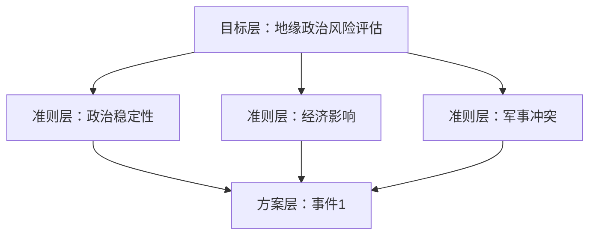
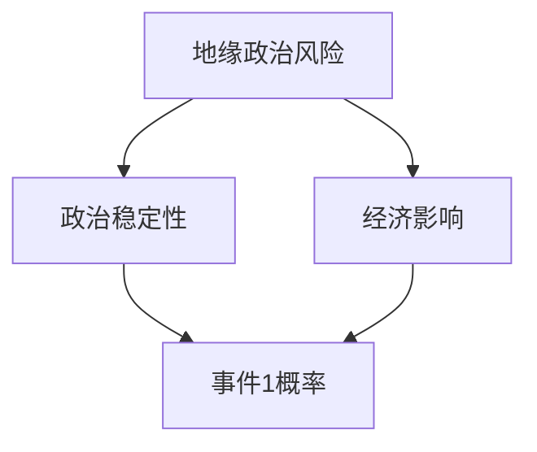

                 


# 价值投资中的地缘政治风险管理

---

## 关键词：地缘政治风险, 价值投资, 风险管理, 投资模型, 风险评估, 市场影响

---

## 摘要：  
本文探讨了地缘政治风险在价值投资中的重要性及其管理方法。通过分析地缘政治事件对市场的影响，结合风险管理的算法和数学模型，提出了构建地缘政治风险管理系统的方法。文章从背景、核心概念、算法原理、数学模型、系统架构到项目实战，全面解析了地缘政治风险管理在价值投资中的应用，并提供了实用的建议和案例分析。

---

## 第一部分：地缘政治风险管理的背景与基础

### 第1章：地缘政治风险管理概述

#### 1.1 地缘政治风险的定义与特征
- **1.1.1 地缘政治风险的定义**  
  地缘政治风险是指因地理位置、政治格局、国际关系等因素变化而导致的投资风险。  
- **1.1.2 地缘政治风险的核心特征**  
  - 不可预测性：地缘政治事件往往突发，难以准确预测。  
  - 波动性：事件发生时可能导致市场剧烈波动。  
  - 长期影响：某些事件可能对市场产生长期影响。  

#### 1.2 价值投资的基本原理
- **1.2.1 价值投资的定义与核心理念**  
  价值投资是指以低于内在价值的价格购买优质资产，长期持有的投资策略。  
- **1.2.2 价值投资中的风险因素**  
  - 市场波动风险  
  - 企业基本面变化风险  
  - 外部环境风险（如地缘政治）  

#### 1.3 地缘政治风险对投资的影响
- **1.3.1 地缘政治事件对市场的冲击**  
  - 战争、贸易摩擦、政策变动等事件可能导致市场剧烈波动。  
- **1.3.2 地缘政治风险的传导机制**  
  - 通过供应链、贸易关系、资本流动等方式影响市场。  
- **1.3.3 地缘政治风险的长期与短期影响**  
  - 短期：引发市场恐慌，导致资产价格暴跌。  
  - 长期：影响区域经济格局，改变投资机会。  

---

## 第二部分：地缘政治风险管理的核心概念与联系

### 第2章：地缘政治风险管理的核心概念

#### 2.1 地缘政治风险的构成要素
- **2.1.1 地缘政治风险的构成要素分析**  
  - 政治因素：政府政策、政治稳定性。  
  - 经济因素：贸易、汇率、经济制裁。  
  - 军事因素：战争、军事冲突。  
- **2.1.2 地缘政治风险的驱动因素**  
  - 国际关系紧张：如中美贸易摩擦、俄乌冲突。  
  - 地区动荡：如中东局势、南海争端。  

#### 2.2 价值投资与地缘政治风险的关联
- **2.2.1 价值投资中的地缘政治风险识别**  
  - 行业风险：某些行业受地缘政治影响较大，如能源、科技。  
  - 区域风险：特定地区投资需考虑地缘政治风险。  
- **2.2.2 地缘政治风险对资产定价的影响**  
  - 资产价格波动：地缘政治事件可能导致资产价格低估或高估。  
  - 风险溢价：投资者要求更高的回报率以补偿地缘政治风险。  

#### 2.3 地缘政治风险的系统性分析
- **2.3.1 地缘政治风险的系统性特征**  
  - 系统性风险：影响整个市场的地缘政治事件，如全球性贸易战争。  
- **2.3.2 地缘政治风险的非线性影响**  
  - 风险影响程度与事件的严重性非线性相关。  
- **2.3.3 地缘政治风险的复杂性与不确定性**  
  - 多因素相互作用，难以准确预测。  

---

## 第三部分：地缘政治风险管理的算法原理与数学模型

### 第3章：地缘政治风险评估的算法原理

#### 3.1 地缘政治风险评估的层次分析法（AHP）
- **3.1.1 层次分析法的基本原理**  
  层次分析法是一种定性与定量相结合的决策分析方法，适用于多因素决策问题。  
- **3.1.2 地缘政治风险评估的层次结构设计**  
  - 目标层：地缘政治风险评估。  
  - 准则层：政治稳定性、经济影响、军事冲突等。  
  - 方案层：具体地缘政治事件或区域。  
- **3.1.3 层次分析法在地缘政治风险评估中的应用**  
  通过权重计算确定各因素对风险的影响程度。  

**Mermaid 流程图：层次分析法的应用**



#### 3.2 地缘政治风险评估的贝叶斯网络模型
- **3.2.1 贝叶斯网络的基本原理**  
  贝叶斯网络是一种概率推理模型，适用于处理不确定性问题。  
- **3.2.2 贝叶斯网络在地缘政治风险评估中的应用**  
  - 构建概率模型，计算各因素对风险的影响概率。  

**Mermaid 流程图：贝叶斯网络模型**



#### 3.3 地缘政治风险的数学模型
- **3.3.1 风险概率计算**  
  设地缘政治事件的概率为 \( P \)，影响程度为 \( I \)，则风险指数 \( RI = P \times I \)。  
- **3.3.2 风险影响的量化**  
  使用层次分析法计算各因素的权重，构建综合风险评估模型。  

---

## 第四部分：系统分析与架构设计方案

### 第4章：地缘政治风险管理系统的设计

#### 4.1 问题场景介绍
- **目标**：构建一个能够实时评估地缘政治风险的系统。  
- **范围**：涵盖主要地缘政治事件，支持多区域分析。  

#### 4.2 系统功能设计
- **4.2.1 数据采集模块**  
  - 收集地缘政治事件数据。  
- **4.2.2 风险评估模块**  
  - 应用层次分析法和贝叶斯网络模型进行风险评估。  
- **4.2.3 风险预警模块**  
  - 设置预警阈值，及时提醒投资者潜在风险。  

#### 4.3 系统架构设计
- **4.3.1 系统架构图**  
  ```mermaid
  graph TD
      UI[用户界面] --> DataCollector[数据采集模块]
      DataCollector --> RiskAssessment[风险评估模块]
      RiskAssessment --> RiskWarning[风险预警模块]
  ```

#### 4.4 接口设计
- **API 接口**：提供风险评估结果的查询接口。  

---

## 第五部分：项目实战

### 第5章：地缘政治风险管理系统实现

#### 5.1 环境安装
- **Python 环境**：安装必要的库，如 `numpy`, `scipy`, `pymermaid`。  

#### 5.2 核心代码实现
```python
import numpy as np
from scipy.cluster import hierarchy

# 示例：层次分析法计算权重
def calculate_weights(matrix):
    # 计算层次分析法权重
    pass

# 示例：贝叶斯网络模型
def bayesian_network():
    pass
```

#### 5.3 案例分析
- **案例**：分析中东地区地缘政治风险对石油市场的冲击。  
- **结果解读**：通过模型计算得出风险指数，指导投资决策。  

---

## 第六部分：最佳实践与总结

### 第6章：最佳实践

#### 6.1 关键点总结
- **动态调整模型**：根据最新事件更新模型参数。  
- **多模型结合**：结合层次分析法和贝叶斯网络模型提高准确性。  

#### 6.2 注意事项
- **数据质量**：确保数据来源可靠。  
- **模型局限性**：地缘政治风险具有高度不确定性，模型结果仅供参考。  

#### 6.3 拓展阅读
- 推荐阅读《风险管理与投资组合》等相关书籍。  

---

## 作者：AI天才研究院 & 禅与计算机程序设计艺术

---

以上是《价值投资中的地缘政治风险管理》的详细目录和文章内容，涵盖从背景到实战的各个方面，帮助读者全面理解和应用地缘政治风险管理的方法。

