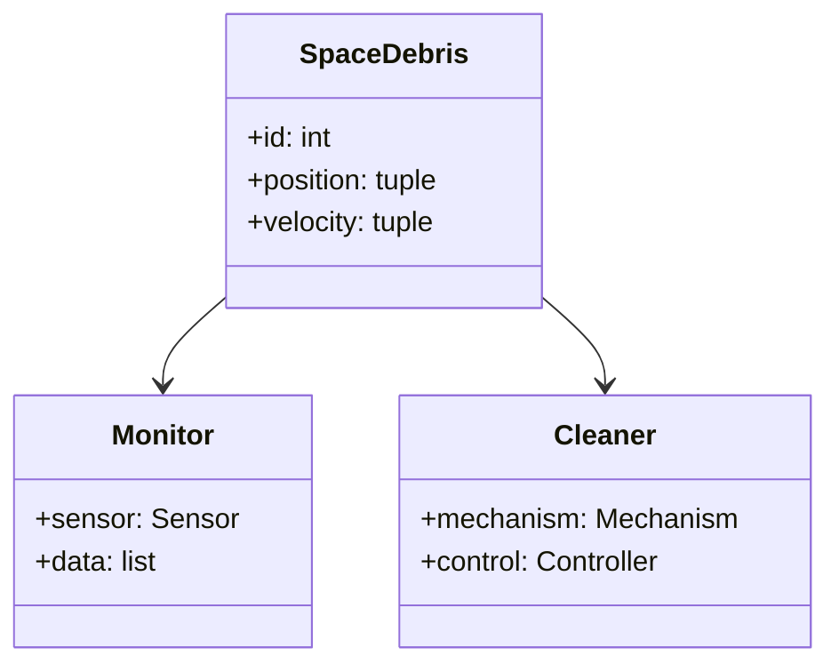

                 


# 价值投资中的太空 debris 清理技术前景

> 关键词：太空 debris 清理技术，价值投资，轨道预测算法，碎片识别算法，卫星安全，太空环境可持续性

> 摘要：本文探讨了太空 debris 清理技术的前景及其在价值投资中的潜力。通过分析当前太空 debris 的现状、清理技术的类型及其原理，结合算法模型和系统架构设计，为投资者提供决策支持。

---

## 第1章: 背景介绍

### 1.1 太空 debris 的问题背景

#### 1.1.1 太空 debris 的定义与分类
太空 debris 指在地球轨道上的无用物体，包括废弃的卫星、火箭部件和其他碎片。根据轨道高度，分为低地球轨道（LEO）、中地球轨道（MEO）和高地球轨道（GEO）的 debris。

#### 1.1.2 当前太空 debris 的现状与发展趋势
随着人类对太空探索的增加，太空 debris 的数量急剧上升，威胁到现有卫星和航天器的安全。

#### 1.1.3 太空 debris 对航天活动的威胁
太空 debris 可能导致卫星失效或航天器损坏，增加航天活动的成本和风险。

### 1.2 太空 debris 清理技术的价值投资背景

#### 1.2.1 太空 debris 清理技术的商业价值
清理太空 debris 可以保护现有卫星，延长其使用寿命，降低运营成本。

#### 1.2.2 价值投资在太空 debris 清理领域的潜力
随着太空探索的深入，清理技术的需求将增加，投资该领域具有较高的回报潜力。

#### 1.2.3 全球太空 debris 清理市场的现状与未来展望
目前，全球已有多个国家和企业开始研发清理技术，市场潜力巨大。

---

## 第2章: 太空 debris 清理技术的核心概念

### 2.1 太空 debris 清理技术的基本概念

#### 2.1.1 太空 debris 清理技术的定义
通过技术手段移除或回收轨道上的太空 debris，保护航天器安全。

#### 2.1.2 太空 debris 清理技术的核心要素
包括监测、识别、捕捉和回收等关键步骤。

#### 2.1.3 太空 debris 清理技术的边界与外延
清理技术不仅涉及物理操作，还包括法律和国际合作等方面。

### 2.2 太空 debris 清理技术的类型与特点

#### 2.2.1 机械抓取技术
使用机械臂或网状结构捕捉 debris，适用于较大的碎片。

#### 2.2.2 激光清理技术
利用高能激光烧蚀 debris，适合远距离操作。

#### 2.2.3 电动力学清理技术
利用电场或磁场引导 debris 进入大气层烧毁，成本较低。

#### 2.2.4 网状捕获技术
使用巨大网状设备捕捉 debris，灵活性高。

---

## 第3章: 太空 debris 清理技术的算法原理

### 3.1 轨道预测算法

#### 3.1.1 算法原理
轨道预测算法通过计算 debris 的轨道参数，预测其未来位置。

#### 3.1.2 算法流程
1. 收集 debris 的初始位置和速度数据。
2. 使用牛顿万有引力定律计算轨道参数。
3. 预测 debris 的未来位置。

#### 3.1.3 算法实现
```python
import numpy as np

def predict_orbit(initial_position, initial_velocity):
    # 计算轨道参数
    r0, v0 = initial_position, initial_velocity
    # 使用牛顿定律计算轨道
    # 具体实现略
    return predicted_position
```

### 3.2 碎片识别算法

#### 3.2.1 算法原理
通过图像识别技术，识别太空 debris 的形状和大小。

#### 3.2.2 算法流程
1. 获取 debris 的图像数据。
2. 使用图像处理技术提取特征。
3. 识别 debris 的类型和大小。

#### 3.2.3 算法实现
```python
import cv2

def identify_fragment(image):
    # 图像处理和识别
    # 具体实现略
    return fragment_info
```

---

## 第4章: 太空 debris 清理技术的数学模型

### 4.1 轨道力学模型

#### 4.1.1 Kepler方程
$$
T^2 = \frac{4\pi^2}{G(M+m)}a^3
$$
其中，T为轨道周期，a为轨道半长轴，M为中心天体质量，m为 debris 质量，G为引力常数。

### 4.2 碎片识别模型

#### 4.2.1 基于几何的识别
$$
A = \pi r^2
$$
其中，A为碎片面积，r为半径。

---

## 第5章: 太空 debris 清理系统的架构设计

### 5.1 项目场景介绍

#### 5.1.1 系统目标
设计一个能够监测、识别和清理太空 debris 的系统。

### 5.2 系统功能设计

#### 5.2.1 领域模型


---

## 第6章: 项目实战

### 6.1 环境安装

#### 6.1.1 安装依赖
```
pip install numpy matplotlib
```

### 6.2 核心代码实现

#### 6.2.1 轨道预测代码
```python
import numpy as np

def predict_orbit(r0, v0):
    # 计算轨道参数
    # 简化版实现
    return r0 + v0 * t
```

#### 6.2.2 碎片识别代码
```python
import cv2

def identify_fragment(image):
    # 图像处理和识别
    # 简化版实现
    return 'Fragment detected'
```

### 6.3 案例分析

#### 6.3.1 轨道预测案例
预测一颗卫星的未来位置，确保清理路径准确。

#### 6.3.2 碎片识别案例
识别一颗直径为1米的碎片，确保清理设备正确捕捉。

---

## 第7章: 最佳实践

### 7.1 小结
太空 debris 清理技术具有巨大的商业价值和投资潜力。

### 7.2 投资建议
建议投资者关注机械抓取技术和激光清理技术，这些技术市场前景广阔。

### 7.3 注意事项
投资前需评估技术成熟度和市场风险。

### 7.4 拓展阅读
推荐阅读《太空 debris 清理技术的发展与挑战》。

---

## 作者：AI天才研究院 & 禅与计算机程序设计艺术

