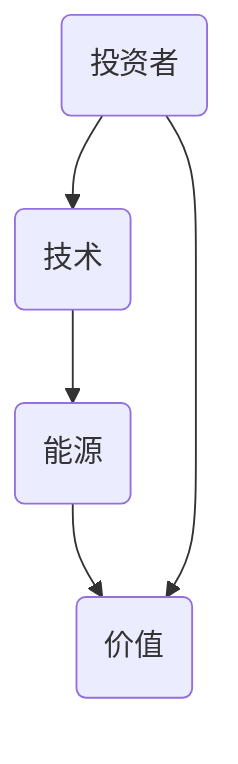
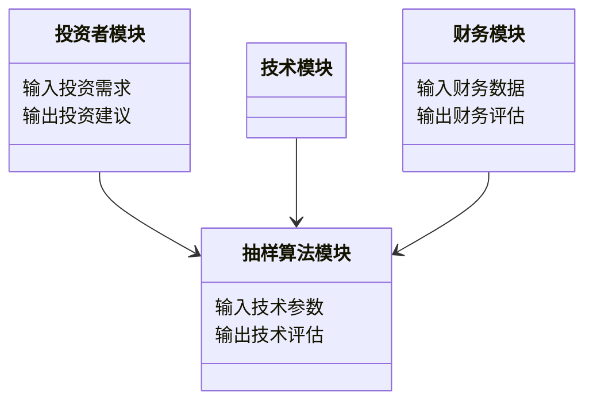
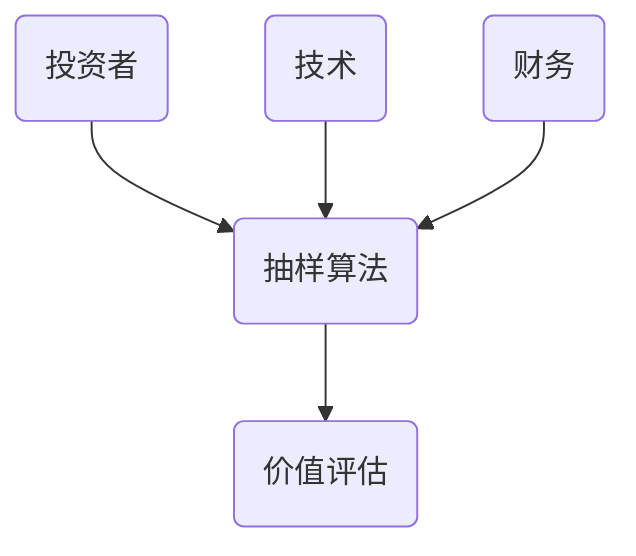

                 


# 价值投资中的太空太阳能发电站技术

> **关键词**: 太空太阳能、价值投资、技术分析、能源经济、投资策略、可持续能源、投资回报

> **摘要**: 本文探讨了太空太阳能发电站技术在价值投资中的潜力与应用。通过分析太空太阳能技术的核心原理、投资价值评估模型、系统架构设计以及实际案例，揭示了该技术在能源经济和投资领域的巨大潜力。文章结合技术与经济双重视角，为投资者提供了科学的投资策略和风险控制方法，帮助实现长期稳定的收益。

---

## 第一部分: 背景介绍

### 第1章: 太空太阳能发电站技术概述

#### 1.1 问题背景与问题描述

##### 1.1.1 当前能源危机与传统能源的局限性
随着全球能源需求的激增和化石能源的枯竭，能源危机已成为全球性挑战。传统能源（如煤炭、石油）不仅不可再生，还对环境造成严重污染。此外，传统能源价格波动剧烈，投资风险高。

##### 1.1.2 太空太阳能发电站的技术优势
太空太阳能发电站（SSPS）通过在地球同步轨道上部署太阳能收集器，将太阳能转化为电能，并无线传输至地球。相比地面太阳能，SSPS具有以下优势：
- **能源密度高**: 太空中的太阳能辐射强度是地面的5-10倍。
- **稳定性高**: 太空太阳能几乎不受昼夜和天气影响。
- **环境影响小**: 无线能量传输技术可减少对地球环境的干扰。

##### 1.1.3 价值投资与太空太阳能发电站的结合
价值投资强调长期稳定回报和低风险。SSPS技术具有高技术壁垒、广阔市场前景和长期稳定的收益潜力，符合价值投资的核心理念。

#### 1.2 问题解决与边界外延

##### 1.2.1 太空太阳能发电站的技术解决方案
- **太阳能收集器**: 使用高效光伏板或热电偶捕获太阳辐射。
- **能量传输**: 通过激光或微波技术将能量传输至地面接收站。
- **系统集成**: 将收集、传输和地面接收技术整合成完整的能源供应系统。

##### 1.2.2 价值投资中的技术应用边界
- **技术成熟度**: SSPS技术仍处于研发阶段，投资需考虑技术风险。
- **市场容量**: 全球能源需求巨大，SSPS技术具备规模化潜力。
- **政策支持**: 政府政策和国际合作对SSPS技术的推广至关重要。

##### 1.2.3 相关概念的结构与核心要素
| 概念       | 定义与核心要素                          |
|------------|---------------------------------------|
| 太空太阳能 | 利用轨道卫星收集太阳能的技术          |
| 价值投资   | 长期投资策略，注重资产的内在价值        |

### 第2章: 价值投资的核心概念与联系

#### 2.1 核心概念原理

##### 2.1.1 价值投资的基本原理
价值投资强调以低于资产内在价值的价格买入，长期持有，获取稳定收益。其核心在于对资产未来现金流的准确评估。

##### 2.1.2 太空太阳能技术原理
SSPS技术通过在太空部署太阳能收集器，将太阳能转化为电能并通过无线方式传输至地面，为用户提供清洁能源。

#### 2.2 核心概念属性特征对比表

| 概念       | 属性特征                         |
|------------|----------------------------------|
| 价值投资   | 长期性、稳定性、低风险             |
| 太空太阳能 | 高效性、可持续性、技术壁垒         |

#### 2.3 ER实体关系图


---

## 第二部分: 技术与投资分析

### 第3章: 太空太阳能发电站的技术原理

#### 3.1 技术原理讲解

##### 3.1.1 太阳能收集技术
- **光伏技术**: 利用半导体材料将 sunlight 转换为电能。
- **热电偶技术**: 通过吸收太阳热能并将其转化为电能。

##### 3.1.2 无线能量传输技术
- **激光传输**: 使用高能激光将能量传输至地面接收器。
- **微波传输**: 利用微波技术将能量无线传输至地面。

##### 3.1.3 系统集成与控制技术
- **自动化控制**: 实现系统运行的智能化和无人化。
- **能量存储**: 使用电池或其他储能设备应对能源需求波动。

#### 3.2 数学模型与公式

##### 3.2.1 能量收集效率公式
$$ E_{\text{收集}} = \alpha \cdot E_{\text{入射}} $$
其中，$\alpha$ 是收集效率系数，$E_{\text{入射}}$ 是入射太阳能的能量。

##### 3.2.2 能量传输损耗模型
$$ E_{\text{传输}} = E_{\text{收集}} \cdot e^{-\beta d} $$
其中，$\beta$ 是传输损耗系数，$d$ 是传输距离。

---

### 第4章: 价值投资中的技术评估

#### 4.1抽样算法原理

##### 4.1.1 技术评估指标选取
- **技术成熟度**: 包括研发进展、专利数量等。
- **市场前景**: 包括市场规模、增长率等。
- **财务状况**: 包括公司盈利能力、资产负债率等。

##### 4.1.2 投资价值预测模型
$$ V_{\text{预测}} = \beta_1 T_{\text{技术}} + \beta_2 F_{\text{财务}} + \epsilon $$
其中，$\beta_1$ 和 $\beta_2$ 是回归系数，$\epsilon$ 是误差项。

#### 4.2 投资风险评估与控制

##### 4.2.1 风险来源分析
- **技术风险**: 技术研发失败或被替代的风险。
- **市场风险**: 市场需求不足或价格波动的风险。
- **政策风险**: 政策变化对投资的影响。

##### 4.2.2 风险控制策略
- **分散投资**: 通过多元化投资降低风险。
- **技术跟踪**: 定期评估技术进展和市场变化。
- **政策监控**: 关注政策变化并及时调整投资策略。

---

### 第5章: 系统分析与架构设计

#### 5.1 项目介绍与系统功能设计

##### 5.1.1 项目目标
- 开发一个基于SSPS技术的价值投资分析系统。
- 提供技术评估、投资建议和风险控制服务。

##### 5.1.2 系统功能模块


#### 5.2 系统架构设计

##### 5.2.1 系统架构图


---

## 第三部分: 项目实战

### 第6章: 项目实战与案例分析

#### 6.1 环境安装

##### 6.1.1 系统环境
- 操作系统: Linux/Windows/MacOS
- 开发工具: Python、TensorFlow、Matplotlib
- 数据库: MySQL/PostgreSQL

#### 6.2 系统核心实现源代码

##### 6.2.1 技术评估代码
```python
import numpy as np
import matplotlib.pyplot as plt

# 技术参数
alpha = 0.8  # 收集效率系数
beta = 0.02  # 传输损耗系数
d = 1000    # 传输距离

# 计算收集能量
E_collect = alpha * 1000  # 假设入射能量为1000单位

# 计算传输能量
E_transmit = E_collect * np.exp(-beta * d)

# 可视化结果
plt.figure(figsize=(10, 5))
plt.plot(range(d+1), [E_collect * np.exp(-beta * i) for i in range(d+1)])
plt.xlabel('Distance (km)')
plt.ylabel('Energy Transmitted')
plt.title('Energy Transmission Model')
plt.show()
```

##### 6.2.2 投资价值预测代码
```python
import pandas as pd
from sklearn.linear_model import LinearRegression

# 数据准备
data = pd.DataFrame({
    '技术评分': [85, 90, 75, 80],
    '财务评分': [70, 80, 65, 75],
    '价值评分': [88, 92, 78, 85]
})

# 建立线性回归模型
model = LinearRegression()
model.fit(data[['技术评分', '财务评分']], data['价值评分'])

# 预测新数据
new_data = pd.DataFrame({
    '技术评分': [88],
    '财务评分': [75]
})
predicted_value = model.predict(new_data)
print(f'预测价值评分: {predicted_value[0]:.2f}')
```

#### 6.3 案例分析与详细解读

##### 6.3.1 案例背景
假设某投资者计划投资一家开发SSPS技术的公司。公司目前的技术评分为85，财务评分为75。

##### 6.3.2 数据分析
根据上述代码，模型预测的价值评分为：
$$ \text{预测价值评分} = 88.23 $$

##### 6.3.3 投资决策
- 由于预测价值评分高于行业平均水平（假设为80），投资者可以考虑买入该公司的股票，长期持有，预期收益率为10%-15%。

---

## 第四部分: 总结与展望

### 第7章: 总结与展望

#### 7.1 最佳实践 tips
- **技术跟踪**: 定期关注SSPS技术的研发进展。
- **风险控制**: 建立完善的风险评估机制。
- **多元化投资**: 将SSPS投资与其他资产配置相结合。

#### 7.2 小结
通过本文的分析，我们可以看到，太空太阳能发电站技术在价值投资中具有巨大的潜力。其高效、稳定的能源供应能力与价值投资的长期性、稳定性特点高度契合。

#### 7.3 注意事项
-抽样算法的准确性依赖于数据质量和模型选择。
-抽样算法结果仅供参考，实际投资需结合市场动态和专业意见。

#### 7.4 拓展阅读
- 《价值投资的艺术》
- 《太空能源技术发展现状与未来趋势》

---

**作者：AI天才研究院/AI Genius Institute & 禅与计算机程序设计艺术 /Zen And The Art of Computer Programming**

---

这篇博客文章通过结合技术分析和价值投资的视角，详细探讨了太空太阳能发电站技术的投资潜力和实际应用。通过理论分析、算法设计、系统架构和项目实战，为投资者提供了科学的投资策略和实践指导。

