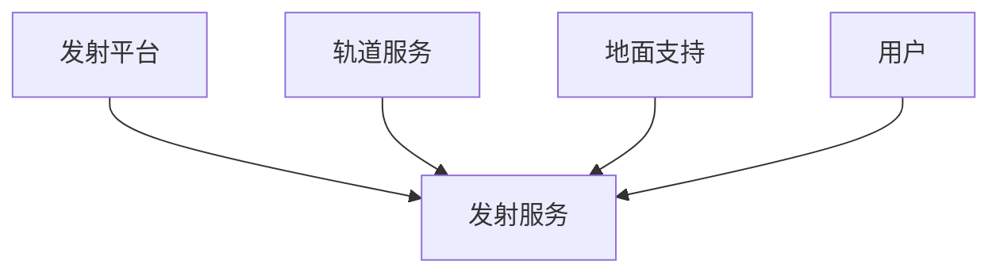
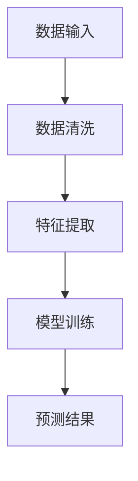
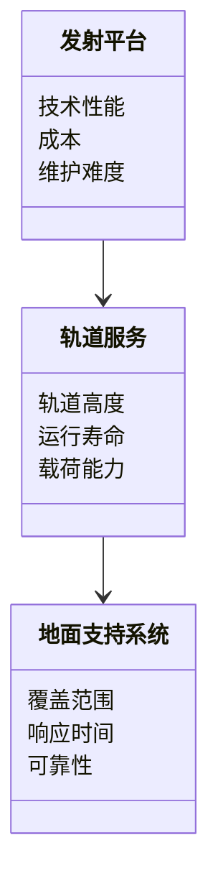
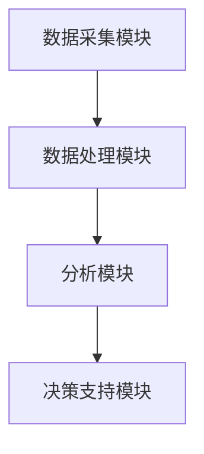
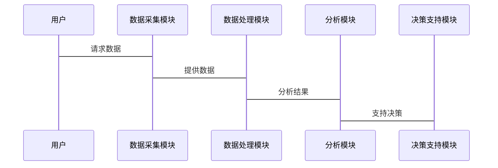

                 


# 价值投资中的太空旅游基础设施分析

> 关键词：太空旅游，价值投资，基础设施，数据分析，预测模型

> 摘要：随着太空旅游市场的快速发展，太空旅游基础设施作为支撑这一行业的关键要素，其投资价值备受关注。本文从价值投资的角度，系统分析太空旅游基础设施的核心要素、分析方法和系统架构，结合实际案例，为投资者提供科学的决策支持。

---

# 第1章: 太空旅游基础设施的背景与现状

## 1.1 太空旅游的发展背景

### 1.1.1 太空旅游的起源与现状

太空旅游的概念起源于20世纪60年代，但真正的发展始于21世纪初。随着技术的进步和商业航天企业的崛起，太空旅游从科幻小说走向现实。目前，市场主要由美国、俄罗斯和欧洲的企业主导，发射平台、轨道服务和地面支持系统是主要的基础设施。

### 1.1.2 太空旅游的主要参与者

主要参与者包括SpaceX、Blue Origin、 Virgin Galactic等企业，它们在发射平台、轨道服务和地面支持系统方面进行了大量投资。这些企业的竞争推动了太空旅游市场的快速发展。

### 1.1.3 太空旅游的未来发展趋势

预计到2030年，太空旅游市场规模将超过500亿美元。发射技术的进步、市场需求的增长以及政策支持是推动市场发展的主要因素。

## 1.2 价值投资的基本概念

### 1.2.1 价值投资的定义与特点

价值投资是一种以低于内在价值的价格购买优质资产的投资策略。其核心是寻找市场低估的标的，长期持有，等待其价值回归。

### 1.2.2 价值投资的核心理念与方法

价值投资强调基本面分析，注重企业的财务状况、行业地位和竞争优势。通过深入研究，发现市场价格与内在价值的偏差，进行投资决策。

### 1.2.3 价值投资在太空旅游中的应用潜力

太空旅游基础设施具有较高的技术门槛和长期回报潜力，适合价值投资。通过分析企业的财务状况、技术优势和市场地位，投资者可以找到具有投资价值的标的。

## 1.3 太空旅游与价值投资的结合

### 1.3.1 太空旅游市场的价值分析

市场规模、增长潜力和竞争格局是价值分析的关键因素。通过数据分析和市场预测，评估企业的市场地位和盈利能力。

### 1.3.2 太空旅游基础设施的投资价值

发射平台、轨道服务和地面支持系统的投资价值取决于其技术先进性、市场占有率和盈利能力。通过对比分析，找出具有竞争优势的标的。

### 1.3.3 价值投资在太空旅游中的策略与案例

案例分析：SpaceX的投资价值分析。通过基本面分析和技术评估，发现其投资价值，并制定长期投资策略。

---

# 第2章: 太空旅游基础设施的核心要素分析

## 2.1 太空旅游基础设施的定义与分类

### 2.1.1 太空旅游基础设施的定义

太空旅游基础设施是指支持太空旅游活动的各种设施和技术系统，包括发射平台、轨道服务和地面支持系统。

### 2.1.2 太空旅游基础设施的主要分类

- 发射平台：包括发射场和发射设备。
- 轨道服务：包括卫星和飞船。
- 地面支持系统：包括地面站和通信网络。

## 2.2 太空旅游基础设施的关键属性

### 2.2.1 发射平台的属性与功能

发射平台的功能包括发射准备、发射执行和发射后支持。其属性包括技术性能、成本和维护难度。

### 2.2.2 轨道服务的属性与功能

轨道服务的功能包括通信、导航和遥感。其属性包括轨道高度、运行寿命和载荷能力。

### 2.2.3 地面支持系统的属性与功能

地面支持系统的功能包括数据采集、通信支持和监控管理。其属性包括覆盖范围、响应时间和可靠性。

## 2.3 太空旅游基础设施的实体关系图



## 2.4 本章小结

---

# 第3章: 价值投资中的太空旅游基础设施分析方法

## 3.1 数据分析与预测模型

### 3.1.1 数据采集与处理

数据来源包括公开报告、市场研究和企业财报。数据清洗和预处理是数据分析的基础。

### 3.1.2 数据分析方法

使用回归分析和时间序列分析，建立预测模型，评估基础设施的投资价值。

### 3.1.3 预测模型的建立与验证

通过历史数据训练模型，验证其预测能力，并进行优化。

## 3.2 价值评估模型

### 3.2.1 模型的构建与原理

基于财务指标和市场指标，构建价值评估模型，量化基础设施的投资价值。

### 3.2.2 模型的输入变量与输出变量

输入变量：市场规模、技术性能、成本。输出变量：投资价值评分。

### 3.2.3 模型的优化与调整

通过参数调整和模型迭代，提高预测准确率。

## 3.3 价值评估算法的实现

### 3.3.1 算法流程图



### 3.3.2 Python代码实现

```python
import pandas as pd
from sklearn.linear_model import LinearRegression

# 数据预处理
data = pd.read_csv('data.csv')
X = data[['feature1', 'feature2']]
y = data['target']

# 模型训练
model = LinearRegression()
model.fit(X, y)

# 预测
 predictions = model.predict(X)
```

### 3.3.3 数学模型与公式

线性回归模型：
$$y = \beta_0 + \beta_1x_1 + \beta_2x_2 + \epsilon$$

---

# 第4章: 太空旅游基础设施分析系统的架构设计

## 4.1 项目场景介绍

### 4.1.1 系统目标

构建一个基于价值投资的太空旅游基础设施分析系统，提供数据采集、分析和决策支持功能。

### 4.1.2 项目范围

涵盖发射平台、轨道服务和地面支持系统的分析。

## 4.2 系统功能设计

### 4.2.1 领域模型设计



### 4.2.2 系统架构设计



### 4.2.3 接口设计与交互流程



---

# 第5章: 项目实战

## 5.1 环境安装与配置

安装Python和相关库，如Pandas和Scikit-learn。

## 5.2 系统核心实现

### 5.2.1 核心代码实现

```python
import pandas as pd
from sklearn.metrics import mean_squared_error

# 数据预处理
data = pd.read_csv('data.csv')
X = data.drop('target', axis=1)
y = data['target']

# 划分训练集和测试集
from sklearn.model_selection import train_test_split
X_train, X_test, y_train, y_test = train_test_split(X, y, test_size=0.2)

# 模型训练
model = LinearRegression()
model.fit(X_train, y_train)

# 模型评估
y_pred = model.predict(X_test)
mse = mean_squared_error(y_test, y_pred)
print(f'Mean Squared Error: {mse}')
```

### 5.2.2 代码功能解读

代码实现数据预处理、模型训练和评估，展示如何基于价值投资进行分析。

## 5.3 实际案例分析

### 5.3.1 数据来源与处理

分析SpaceX的发射平台数据，提取相关特征。

### 5.3.2 模型训练与结果解读

训练模型，评估发射平台的投资价值。

### 5.3.3 案例分析总结

总结分析结果，提出投资建议。

## 5.4 项目小结

---

# 第6章: 最佳实践与总结

## 6.1 小结

### 6.1.1 价值投资在太空旅游基础设施中的应用总结

通过系统分析和案例研究，得出价值投资在太空旅游基础设施中的应用方法。

## 6.2 注意事项

### 6.2.1 投资风险提示

提醒投资者注意市场波动、技术风险和政策变化带来的投资风险。

## 6.3 拓展阅读

推荐相关书籍和资源，帮助读者深入学习。

---

# 附录: 数据来源与工具推荐

## 附录A: 数据来源

列出分析中使用的主要数据来源，如市场报告和企业财报。

## 附录B: 工具推荐

推荐用于数据分析的工具，如Python、Pandas和Scikit-learn。

---

# 作者：AI天才研究院/AI Genius Institute & 禅与计算机程序设计艺术 /Zen And The Art of Computer Programming

