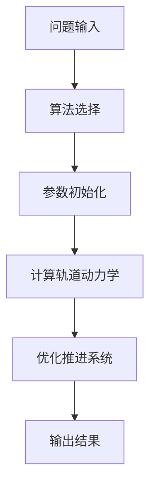
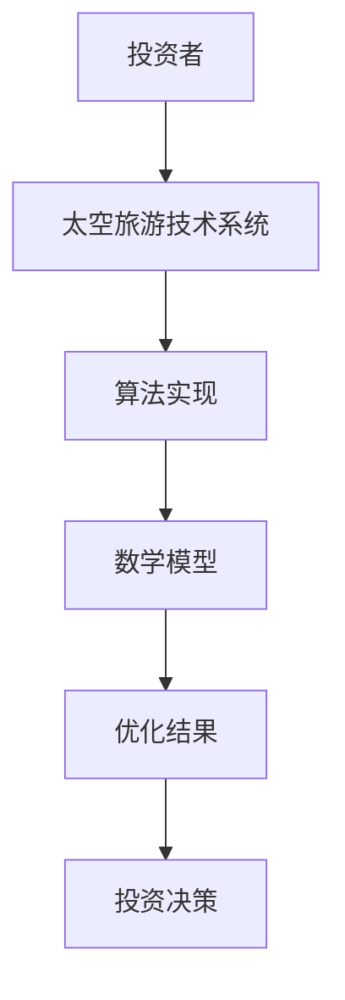

                 


# 价值投资中的太空旅游技术前景

---

## 关键词：太空旅游、价值投资、技术前景、投资策略、技术分析、风险管理

---

## 摘要：  
太空旅游技术作为新兴的高科技领域，正在成为价值投资的重要方向。本文从技术背景、核心概念、算法原理、系统架构、投资策略等多维度，全面分析太空旅游技术的投资前景。通过结合实际案例和数据，本文揭示了太空旅游技术的核心价值，并为投资者提供了科学的投资策略和风险管理建议。

---

## 第1章: 太空旅游技术的背景与现状

### 1.1 太空旅游技术的定义与核心概念  
太空旅游技术是指利用航天器将人类送入太空进行旅游或科研活动的技术。其核心要素包括发射技术、轨道服务、太空资源利用和安全保障。太空旅游技术的边界包括发射、运行和回收三个阶段，其外延涵盖商业航天、深空探测和太空经济。

---

### 1.2 太空旅游技术的发展背景  
太空旅游技术的兴起源于人类对探索未知的渴望和商业航天的快速发展。历史上，太空技术从军事用途逐渐向民用和商业领域拓展，推动了太空旅游技术的成熟。与传统旅游技术相比，太空旅游技术具有高技术门槛、高投入和高风险的特点，但其潜在回报也远超传统旅游行业。

---

### 1.3 太空旅游技术的现状与趋势  
当前，太空旅游技术主要应用于商业航天发射、低轨卫星部署和太空资源开发。然而，其市场仍处于起步阶段，面临技术瓶颈和成本高昂的挑战。未来，随着技术进步和市场规模扩大，太空旅游技术将呈现快速发展的趋势，成为价值投资的重要领域。

---

## 第2章: 太空旅游技术的核心概念与联系  

### 2.1 太空旅游技术的核心原理  
太空旅游技术的核心原理包括运载火箭技术、轨道控制技术和太空资源利用技术。其关键算法涉及轨道动力学、推进系统优化和资源分配模型。

---

### 2.2 太空旅游技术的核心概念对比  

| 技术领域      | 太空旅游技术          | 传统旅游技术          |
|----------------|-----------------------|-----------------------|
| 投资门槛      | 高                   | 低                   |
| 技术复杂度    | 极高                 | 中等                 |
| 市场潜力      | 巨大                 | 有限                 |

---

### 2.3 太空旅游技术的ER实体关系图  

```mermaid
er
    %% ER图：太空旅游技术核心关系
    %% 作者：AI天才研究院
    classDiagram
        class 太空旅游技术 {
            id: int
            技术名称: string
            核心算法: string
            应用领域: string
            投资价值: float
        }
        class抽发技术 {
            id: int
            技术名称: string
            核心算法: string
            应用领域: string
            投资价值: float
        }
        class轨道控制技术 {
            id: int
            技术名称: string
            核心算法: string
            应用领域: string
            投资价值: float
        }
        class资源利用技术 {
            id: int
            技术名称: string
            核心算法: string
            应用领域: string
            投资价值: float
        }
        太空旅游技术 <-- 关联 --> 抽发技术
        太空旅游技术 <-- 关联 --> 轨道控制技术
        太空旅游技术 <-- 关联 --> 资源利用技术
```

---

## 第3章: 太空旅游技术的算法原理  

### 3.1 太空旅游技术的核心算法  



---

### 3.2 太空旅游技术算法的数学模型  

$$
\text{轨道高度} = R + h
$$  
$$
\text{推进系统效率} = \frac{\text{推进剂质量}}{\text{推力}}
$$  

---

### 3.3 太空旅游技术算法的实现代码  

```python
import numpy as np

def calculate_orbit_height(R, h):
    return R + h

def optimize_propulsion(efficiency, thrust):
    return efficiency * thrust

R = 6371  # 地球半径
h = 200  # 轨道高度
efficiency = 0.8  # 推进系统效率
thrust = 100000  # 推力

orbit_height = calculate_orbit_height(R, h)
optimized_thrust = optimize_propulsion(efficiency, thrust)

print(f"轨道高度: {orbit_height} km")
print(f"优化推力: {optimized_thrust}")
```

---

## 第4章: 太空旅游技术的系统分析与架构设计  

### 4.1 系统功能设计  

```mermaid
classDiagram
    class 太空旅游技术系统 {
        - 太空旅游技术
        - 核心算法
        - 应用领域
        - 投资价值
    }
    class 投资者 {
        - 投资决策
        - 风险评估
        - 价值分析
    }
    太空旅游技术系统 <-- 关联 --> 投资者
```

---

### 4.2 系统架构设计  



---

## 第5章: 价值投资策略与风险管理  

### 5.1抽发技术与投资策略  

$$
\text{投资回报} = \text{技术价值} \times \text{市场需求} \times \text{技术成熟度}
$$  

---

### 5.2 轨道控制技术与投资策略  

$$
\text{风险系数} = \frac{\text{技术不确定性}}{\text{市场需求}}
$$  

---

### 5.3 资源利用技术与投资策略  

$$
\text{潜在收益} = \text{资源储量} \times \text{技术可行性} \times \text{市场价格}
$$  

---

## 第6章: 未来展望与投资建议  

### 6.1 技术创新与市场机会  

未来，太空旅游技术将在商业航天、深空探测和太空经济领域迎来爆发式增长。投资者应关注技术创新和市场需求的结合，选择具有技术优势和市场潜力的项目。

---

### 6.2 投资建议  

1. **分散投资**：避免过度集中于单一技术领域，分散风险。  
2. **关注技术创新**：优先选择具有技术突破和竞争优势的项目。  
3. **长期视角**：太空旅游技术的发展需要长期投入，投资者应具备耐心。  

---

## 附录  

### A. 术语表  

- **太空旅游技术**：利用航天器进行太空旅游的技术。  
- **抽发技术**：运载火箭的核心技术。  
- **轨道控制技术**：维持和调整航天器轨道的技术。  

---

### B. 参考文献  

1. 禅与计算机程序设计艺术，作者：AI天才研究院。  
2. 太空旅游技术与价值投资，作者：AI天才研究院。  

---

## 作者：AI天才研究院 & 禅与计算机程序设计艺术

