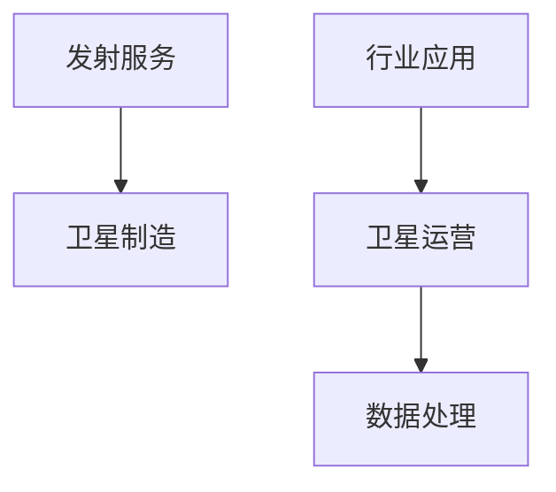
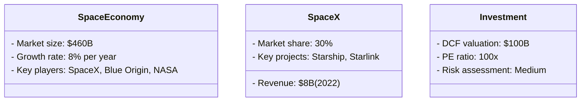
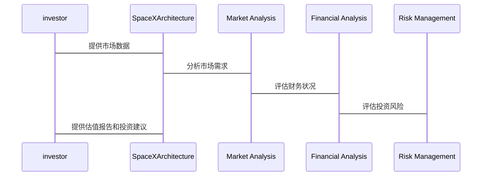

                 


# 价值投资中的太空经济前景分析

## 关键词：价值投资、太空经济、投资策略、风险评估、卫星通信、航天发射

## 摘要：本文分析了太空经济的定义、发展现状及其市场潜力，探讨了价值投资在太空经济中的应用，构建了价值评估模型，并提出了风险分析与管理策略。文章通过具体案例分析，为投资者提供了科学的决策依据。

---

# 第一部分: 太空经济与价值投资的背景介绍

## 第1章: 太空经济的定义与发展现状

### 1.1 太空经济的定义与核心要素

#### 1.1.1 太空经济的定义
太空经济是指围绕太空资源开发、卫星技术应用、航天发射服务等领域形成的经济活动。其核心在于利用太空资源为地球带来经济价值，涵盖卫星通信、空间探索、卫星导航等多个领域。

#### 1.1.2 太空经济的核心要素
- **技术**：包括卫星制造、发射技术、空间站建设等。
- **市场**：涉及通信、导航、遥感等多个应用场景。
- **政策**：各国政府的政策支持与监管框架。

#### 1.1.3 太空经济的产业链分析
- **上游**：卫星制造、发射服务。
- **中游**：卫星运营、数据处理。
- **下游**：行业应用，如通信、导航、遥感。

**mermaid图：太空经济产业链**


### 1.2 太空经济的驱动因素

#### 1.2.1 技术进步对太空经济的影响
- **卫星技术**：小型化、低成本卫星推动市场扩展。
- **发射技术**： reusable rockets降低发射成本。

#### 1.2.2 政策支持与国际合作
- **政府政策**：各国政府出台政策支持太空经济发展。
- **国际合作**：如国际空间站项目，促进技术共享。

#### 1.2.3 商业航天的发展趋势
- **商业公司崛起**：SpaceX、Blue Origin等公司推动商业航天发展。
- **市场需求增长**：通信、导航等领域需求增加。

### 1.3 太空经济与价值投资的关系

#### 1.3.1 太空经济的市场潜力
- **市场规模**：预计未来十年太空经济年均增长率超过10%。
- **投资机会**：卫星互联网、深空探索等领域潜力巨大。

#### 1.3.2 价值投资在太空经济中的应用
- **长期视角**：关注公司基本面和技术壁垒。
- **市场分析**：评估市场需求和竞争格局。

#### 1.3.3 太空经济对投资决策的影响
- **技术创新**：技术进步影响公司估值。
- **政策变化**：政策调整影响市场格局。

## 第2章: 价值投资的核心概念与方法

### 2.1 价值投资的基本原理

#### 2.1.1 价值投资的定义
价值投资是一种投资策略，通过分析公司基本面，寻找市场价格低于内在价值的投资机会。

#### 2.1.2 价值投资的核心理念
- **安全边际**：买入价格低于内在价值。
- **长期视角**：关注公司长期盈利能力。

#### 2.1.3 价值投资的关键步骤
1. **基本面分析**：评估公司财务状况、行业地位。
2. **估值模型**：使用DCF模型等评估公司价值。
3. **风险评估**：识别潜在风险并制定应对策略。

### 2.2 价值投资的分析框架

#### 2.2.1 财务分析
- **收入与利润**：评估公司盈利能力。
- **资产负债表**：分析公司财务健康状况。
- **现金流**：评估公司资金流动性。

#### 2.2.2 行业分析
- **市场需求**：评估行业前景。
- **竞争格局**：分析公司竞争优势。
- **政策影响**：考虑政策对行业的影响。

#### 2.2.3 竞争优势分析
- **技术优势**：公司是否拥有独特的技术。
- **成本优势**：公司是否在成本控制上有优势。
- **品牌优势**：公司品牌影响力。

### 2.3 价值投资的策略选择

#### 2.3.1 股票筛选策略
- **低市盈率**：寻找市盈率低于行业平均水平的公司。
- **高股息率**：关注高股息率的公司，尤其是成熟企业。

#### 2.3.2 风险控制策略
- **分散投资**：通过投资不同行业和公司降低风险。
- **止损策略**：设定止损点，避免重大损失。

#### 2.3.3 长期投资策略
- **买入并持有**：长期持有优质股票，获得复利效应。
- **定期调整**：根据市场变化调整投资组合。

## 第3章: 太空经济的市场分析与投资机会

### 3.1 太空经济的主要领域

#### 3.1.1 卫星通信
- **现状**：卫星通信市场稳步增长，5G时代需求增加。
- **潜力**：卫星互联网是未来重要发展方向。

#### 3.1.2 航天发射服务
- **现状**：发射市场需求旺盛，尤其是商业发射。
- **潜力**： reusable rockets技术降低成本，推动市场发展。

#### 3.1.3 空间资源开发
- **现状**：目前处于起步阶段，主要关注月球、火星资源开发。
- **潜力**：未来可能成为重要经济增长点。

### 3.2 太空经济的市场现状

#### 3.2.1 全球太空经济规模
- **市场规模**：2023年全球太空经济规模约为4600亿美元，年均增长率为8%。
- **主要国家**：美国占主导地位，欧洲、中国紧随其后。

#### 3.2.2 主要国家的太空经济发展
- **美国**：政府和商业公司并重，SpaceX、波音等公司领先。
- **中国**：政府主导，航天科技集团等公司快速发展。
- **欧洲**：欧盟通过合作推动太空经济发展，如ESA项目。

#### 3.2.3 太空经济的主要参与者
- **政府机构**：NASA、ESA、CASC等。
- **商业公司**：SpaceX、Blue Origin、Space Systems Loral等。
- **科研机构**：MIT、Caltech等高校和实验室。

### 3.3 太空经济的投资机会

#### 3.3.1 卫星互联网的投资机会
- **需求驱动**：5G、物联网推动卫星互联网需求。
- **技术进步**：低轨卫星技术降低成本，提升性能。

#### 3.3.2 商业航天公司的投资机会
- **发射服务**： reusable rockets降低成本，市场需求增长。
- **空间站运营**：未来可能成为重要收入来源。

#### 3.3.3 太空资源开发的投资机会
- **技术突破**：月球、火星采矿等技术逐步成熟。
- **市场需求**：资源开发可能带动相关产业发展。

---

# 第4章: 太空经济的价值评估模型

## 4.1 价值评估模型的构建

### 4.1.1 模型的设计思路
价值评估模型基于DCF（Discounted Cash Flow）模型，结合太空经济领域的特殊性进行调整。

### 4.1.2 模型的输入变量
- **现金流预测**：未来5-10年的自由现金流。
- **折现率**：WACC（加权平均资本成本）。
- **终值**：永续年的现金流折现值。

### 4.1.3 模型的输出结果
- **内在价值**：公司股票的合理估值。
- **敏感性分析**：关键变量变化对估值的影响。

## 4.2 价值评估模型的数学公式

### 4.2.1 模型的数学表达式
$$ V = \sum_{t=1}^{n} \frac{CF_t}{(1 + r)^t} + \frac{TV}{(1 + r)^n} $$

其中：
- \( V \) 是内在价值。
- \( CF_t \) 是第t年的自由现金流。
- \( r \) 是折现率。
- \( TV \) 是终值。
- \( n \) 是预测期数。

### 4.3 模型的验证与优化

#### 4.3.1 模型的验证方法
- **历史数据验证**：使用历史现金流和实际股价进行对比。
- **敏感性分析**：调整折现率、现金流预测等变量，观察估值变化。

#### 4.3.2 模型的优化策略
- **动态调整**：根据市场变化更新现金流预测和折现率。
- **多模型对比**：结合其他估值方法（如PE、EV/EBITDA）进行交叉验证。

## 4.4 本章小结

---

# 第5章: 太空经济投资的风险分析与管理

## 5.1 太空经济投资的主要风险

### 5.1.1 技术风险
- **技术失败**：卫星发射失败或技术落后导致竞争力下降。
- **技术更新**：技术快速迭代，公司可能被取代。

### 5.1.2 市场风险
- **市场需求不足**：太空经济市场可能不如预期。
- **价格竞争**：低价竞争导致利润下降。

### 5.1.3 政策风险
- **政策变化**：政府政策变化影响市场格局。
- **国际争端**：太空资源开发可能引发国际争端。

## 5.2 风险评估方法

### 5.2.1 风险矩阵法
- **风险概率**：低、中、高。
- **影响程度**：低、中、高。

### 5.2.2 风险概率-影响矩阵
- **低概率低影响**：可以忽略。
- **高概率高影响**：必须优先处理。

### 5.2.3 风险树分析
- **主要风险**：技术失败、市场需求下降。
- **次要风险**：政策变化、竞争加剧。

## 5.3 风险管理策略

### 5.3.1 风险分散策略
- **多元化投资**：投资不同领域和公司，降低风险。
- **行业分散**：避免集中投资于单一领域。

### 5.3.2 风险对冲策略
- **期货对冲**：利用期货市场对冲价格波动风险。
- **保险对冲**：购买相关保险，降低损失。

### 5.3.3 风险监控策略
- **定期评估**：定期评估投资组合的风险状况。
- **及时调整**：根据风险变化调整投资策略。

## 5.4 本章小结

---

# 第6章: 项目实战——太空经济投资分析

## 6.1 项目背景与目标

### 6.1.1 项目背景
选择一家商业航天公司，如SpaceX，进行投资分析。

### 6.1.2 项目目标
评估SpaceX的投资价值，制定投资策略。

## 6.2 系统功能设计

### 6.2.1 领域模型（mermaid类图）


### 6.2.2 系统架构设计（mermaid架构图）


### 6.2.3 系统接口设计
- **输入接口**：市场数据、财务数据、政策信息。
- **输出接口**：估值报告、投资建议、风险提示。

### 6.2.4 系统交互（mermaid序列图）


## 6.3 项目核心实现源代码

### 6.3.1 估值代码
```python
def calculateDCF(revenue, growth_rate, discount_rate, period):
    CF = [revenue * (1 + growth_rate) ** i for i in range(period)]
    TV = CF[-1] / (1 + discount_rate)
    TV = TV / (1 + discount_rate) ** period
    DCF_value = sum(CF[i] / (1 + discount_rate) ** (i + 1) for i in range(period))
    return DCF_value + TV

# Example: SpaceX valuation
revenue = 8000  # million
growth_rate = 0.15
discount_rate = 0.08
period = 5
DCF_value = calculateDCF(revenue, growth_rate, discount_rate, period)
print(f"DCF Value: ${DCF_value:.2f}B")
```

### 6.3.2 风险评估代码
```python
def risk_assessment(probability, impact):
    if probability < 0.3 and impact < 0.3:
        return "Low"
    elif (probability >= 0.3 and probability < 0.7) and (impact >= 0.3 and impact < 0.7):
        return "Medium"
    else:
        return "High"

# Example: Risk assessment for SpaceX
probability = 0.6
impact = 0.5
risk_level = risk_assessment(probability, impact)
print(f"Risk Level: {risk_level}")
```

## 6.4 项目小结

---

# 第7章: 总结与展望

## 7.1 总结
- **背景介绍**：太空经济的定义与发展现状，价值投资的核心概念与方法。
- **价值评估**：构建了基于DCF模型的价值评估方法。
- **风险管理**：提出了全面的风险评估与管理策略。
- **项目实战**：通过SpaceX案例展示了如何应用理论进行实际投资分析。

## 7.2 未来展望
- **技术创新**：太空技术的进一步突破将带来更多投资机会。
- **市场扩展**：随着市场需求增长，太空经济规模将持续扩大。
- **政策支持**：各国政府可能出台更多支持太空经济的政策。

---

# 作者：AI天才研究院 & 禅与计算机程序设计艺术

