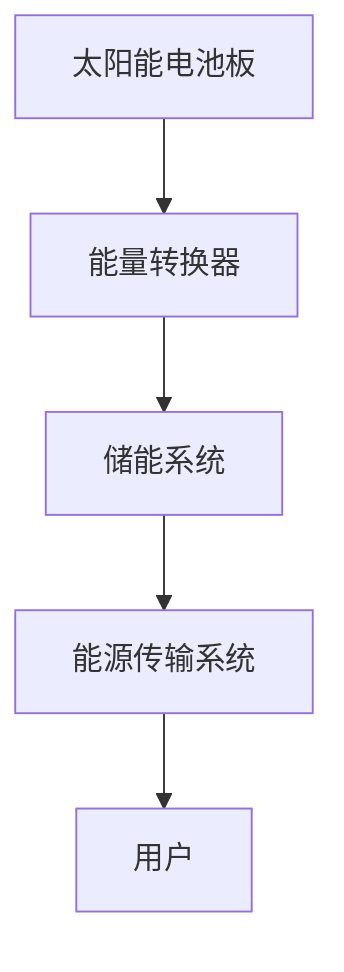

                 


# 价值投资中的太阳能空间站技术发展前景

## 关键词：价值投资、太阳能空间站、技术前景、投资策略、系统架构

## 摘要：本文探讨了太阳能空间站在能源市场中的投资潜力，通过技术分析、经济性评估和市场预测，结合价值投资策略，为投资者提供参考。文章还详细分析了系统的架构设计和投资模型，以帮助读者更好地理解和把握投资机会。

---

# 第一部分: 价值投资中的太阳能空间站技术背景与概念

# 第1章: 太阳能空间站技术概述

## 1.1 太阳能空间站的基本概念

### 1.1.1 太阳能空间站的定义

太阳能空间站是一种利用太阳能作为主要能源来源，并在空间环境中运行的能源收集和转换系统。其核心是通过太阳能电池板将太阳辐射能转化为电能，用于支持空间站的运行或向地球输送能源。

### 1.1.2 太阳能空间站的核心技术

- **太阳能电池技术**：高效太阳能电池的研发，如砷化镓电池和多结电池，以提高能源转化效率。
- **能源存储技术**：包括电池储能和超级电容器，确保在阴天或地球遮挡时的能源供应。
- **能源传输技术**：通过无线能量传输（如激光或微波）将能源从空间站传输到地球。

### 1.1.3 太阳能空间站在能源领域的地位

太阳能空间站被认为是未来能源结构的重要组成部分，特别是在解决地球能源危机和推动可持续发展方面具有重要意义。

---

## 1.2 价值投资的基本原理

### 1.2.1 价值投资的定义

价值投资是一种投资策略，强调以低于资产公允价值的价格购买优质资产，长期持有，以实现资本增值。其核心理念是寻找市场低估的公司或项目，长期看好其发展。

### 1.2.2 价值投资的核心理念

- **长期视角**：关注公司的长期发展潜力，而非短期市场波动。
- **安全边际**：买入价格低于内在价值，以降低投资风险。
- **基本面分析**：通过财务数据、行业地位和管理团队评估公司的投资价值。

### 1.2.3 价值投资在科技领域的应用

在科技领域，价值投资者通常关注那些具有技术创新、市场领导地位和持续盈利能力的公司。例如，苹果、谷歌等科技巨头都曾是价值投资者的重点关注对象。

---

## 1.3 太阳能空间站技术与价值投资的结合

### 1.3.1 技术进步与投资机会的关系

技术创新往往带来新的市场机会，太阳能空间站技术的进步可能降低能源成本，提高能源供应的稳定性，从而为投资者带来收益。

### 1.3.2 太阳能空间站技术的市场前景

随着能源需求的增长和传统能源的枯竭，太阳能空间站技术的市场前景广阔。它不仅可以为地球提供清洁能源，还可以支持深空探测任务的能源需求。

### 1.3.3 价值投资视角下的技术评估

从价值投资的角度，需要评估太阳能空间站技术的市场潜力、技术壁垒、成本结构和管理团队等因素，以确定其是否具有长期投资价值。

---

## 1.4 本章小结

本章介绍了太阳能空间站的基本概念、核心技术以及其在能源领域的地位，同时详细阐述了价值投资的基本原理和在科技领域的应用。通过分析技术进步与投资机会的关系，探讨了太阳能空间站技术的市场前景及其在价值投资中的潜力。

---

# 第二部分: 太阳能空间站技术的经济性与投资价值分析

# 第2章: 太阳能空间站技术的经济性分析

## 2.1 太阳能空间站的成本构成

### 2.1.1 研发成本

- **研发投入**：包括实验室研究、 prototype 制作和测试费用。
- **人才成本**：高薪聘请顶尖科学家和工程师。

### 2.1.2 生产成本

- **材料成本**：太阳能电池板、支撑结构和其他组件的材料费用。
- **制造成本**：工厂建设和设备购置费用。

### 2.1.3 运营成本

- **维护成本**：空间站日常维护和维修费用。
- **能源传输成本**：将能源从空间站传输到地球的费用。

---

## 2.2 太阳能空间站的收益预测

### 2.2.1 市场需求分析

- **清洁能源需求**：随着环保政策的加强，市场对清洁能源的需求将持续增长。
- **能源价格波动**：传统能源价格的波动为太阳能空间站技术提供了替代机会。

### 2.2.2 收益模型构建

#### 2.2.2.1 收益计算公式

$$ \text{年收益} = \text{发电量} \times \text{电价} $$

#### 2.2.2.2 投资回收期计算

$$ \text{投资回收期} = \frac{\text{初始投资}}{\text{年收益}} $$

---

## 2.3 经济性分析的数学模型

### 2.3.1 成本-收益分析公式

$$ \text{净收益} = \text{总收入} - \text{总成本} $$

### 2.3.2 投资回报率（ROI）计算

$$ ROI = \frac{\text{净利润}}{\text{初始投资}} \times 100\% $$

---

## 2.4 本章小结

本章分析了太阳能空间站的成本构成和收益预测，构建了经济性分析的数学模型，为后续的投资价值评估奠定了基础。

---

# 第三部分: 太阳能空间站技术的市场分析与投资策略

# 第3章: 太阳能空间站技术的市场分析

## 3.1 全球能源市场现状

### 3.1.1 可再生能源的发展趋势

- **全球能源需求**：预计到2050年，全球能源需求将比2010年增长约1.5倍。
- **可再生能源占比**：根据国际能源署的预测，到2030年，可再生能源将占全球电力供应的40%。

### 3.1.2 太阳能技术的市场占比

- **太阳能发电装机容量**：2020年全球太阳能发电装机容量达到1.2 TW，预计到2030年将增长至4 TW。
- **空间太阳能市场的潜力**：虽然目前仍处于起步阶段，但随着技术进步，市场潜力巨大。

### 3.1.3 空间能源技术的市场需求

- **深空探测任务**：NASA和ESA等机构已经开始研究空间太阳能技术，以支持深空探测任务。
- **商业应用**：未来可能用于偏远地区的能源供应和大型数据中心的备用电源。

---

## 3.2 太阳能空间站技术的竞争分析

### 3.2.1 主要竞争对手分析

- **SpaceX**：埃隆·马斯克的SpaceX公司正在研究空间太阳能技术，计划在未来几年内发射试验卫星。
- **中国航天科技集团**：中国也在积极推进空间太阳能技术的研发，计划在2030年前实现兆瓦级空间电站的在轨应用。
- **欧洲航天局**：欧洲航天局也在进行相关研究，重点放在技术可行性评估和成本分析上。

### 3.2.2 技术壁垒与竞争优势

- **技术壁垒**：空间太阳能技术的研发需要突破多项技术难题，如高效能电池技术、能源传输技术和空间站的稳定性问题。
- **竞争优势**：先发企业可能在技术和市场上占据领先地位，形成竞争优势。

### 3.2.3 市场份额预测

- **未来市场份额**：预计到2030年，空间太阳能技术的市场份额将从目前的几乎为零增长至全球能源市场的5%左右。
- **增长驱动力**：环保政策的趋严、能源需求的增加以及技术进步的推动。

---

## 3.3 市场风险与机会评估

### 3.3.1 政策风险

- **政府政策**：政府对可再生能源的支持力度直接影响市场的增长空间。
- **国际贸易摩擦**：国际贸易政策的变化可能影响技术的推广和应用。

### 3.3.2 技术风险

- **技术瓶颈**：能否突破空间太阳能技术的关键难题，如高效能电池和能源传输技术。
- **技术迭代**：技术更新换代快，可能影响投资回报周期。

### 3.3.3 市场机会

- **新兴市场需求**：随着发展中国家对能源的需求增加，空间太阳能技术可能在这些地区获得广泛的应用。
- **技术创新带来的成本下降**：技术进步可能降低空间太阳能技术的建设和运营成本，提高其经济性。

---

## 3.4 本章小结

本章分析了全球能源市场现状、主要竞争对手的情况以及技术壁垒和竞争优势。同时，对市场风险和机会进行了评估，为后续的投资策略制定提供了依据。

---

# 第四部分: 太阳能空间站技术的系统架构与投资模型

# 第4章: 太阳能空间站技术的系统架构

## 4.1 系统功能模块划分

### 4.1.1 数据采集模块

- **功能**：采集空间站的运行数据，如发电量、温度、压力等。
- **输入输出**：通过传感器采集数据，输出到数据处理模块。

### 4.1.2 能源转换模块

- **功能**：将太阳能转化为电能，并储存或传输。
- **输入输出**：接收太阳能辐射，输出电能。

### 4.1.3 运营监控模块

- **功能**：监控空间站的运行状态，实时调整能源转换和传输策略。
- **输入输出**：接收数据采集模块的信息，输出控制指令。

---

## 4.2 系统架构设计

### 4.2.1 分层架构设计


---

## 4.3 系统架构图



---

## 4.4 本章小结

本章详细分析了太阳能空间站系统的功能模块划分和整体架构设计，为后续的投资模型构建奠定了基础。

---

# 第五部分: 价值投资中的太阳能空间站技术投资策略

# 第5章: 投资策略与模型

## 5.1 投资策略制定

### 5.1.1 长期投资视角

- **技术成熟度**：选择技术领先、研发能力强的企业进行投资。
- **市场定位**：关注那些在市场中占据领先地位的企业。

### 5.1.2 风险控制

- **分散投资**：将资金分散投资于不同的项目，降低风险。
- **止损机制**：设定止损点，避免重大损失。

---

## 5.2 投资模型构建

### 5.2.1 估值模型

- **DCF模型**：通过现金流折现法评估企业的内在价值。
- **可比公司分析**：与同行业公司进行对比，评估企业的估值是否合理。

### 5.2.2 投资组合优化

- **资产配置**：根据风险承受能力和收益目标，合理配置不同类型的资产。
- **动态调整**：定期评估投资组合的表现，进行必要的调整。

---

## 5.3 投资策略实施

### 5.3.1 项目选择

- **技术可行性**：评估项目的技术可行性，选择那些具有明确技术路线和较高成功率的项目。
- **财务健康性**：关注企业的财务状况，选择那些财务健康、盈利能力强的企业。

### 5.3.2 投后管理

- **定期跟踪**：持续关注项目的进展，评估其是否符合预期。
- **及时调整**：根据市场变化和项目进展，及时调整投资策略。

---

## 5.4 本章小结

本章详细探讨了太阳能空间站技术的价值投资策略，包括投资策略的制定、模型的构建以及实施的具体步骤。

---

# 第六部分: 项目实战与案例分析

# 第6章: 项目实战

## 6.1 环境安装与配置

### 6.1.1 开发环境搭建

- **操作系统**：推荐使用Linux系统，因其稳定性高且适合开发环境。
- **开发工具**：安装PyCharm或VS Code等集成开发环境，配置Python解释器。

### 6.1.2 数据库安装

- **数据库选择**：推荐使用MySQL或PostgreSQL，因其支持关系型数据库，适合存储项目数据。
- **安装步骤**：
  1. 下载并安装数据库软件。
  2. 配置数据库参数，如字符编码、端口等。
  3. 创建数据库和用户，设置权限。

---

## 6.2 系统核心实现

### 6.2.1 代码实现

#### 6.2.1.1 数据采集模块

```python
import serial
import time

ser = serial.Serial('COM1', 9600)

while True:
    data = ser.readline().decode()
    print(f"接收到的数据：{data}")
    time.sleep(1)
```

#### 6.2.1.2 能源转换模块

```python
import RPi.GPIO as GPIO

GPIO.setmode(GPIO.BCM)
GPIO.setup(17, GPIO.OUT)

GPIO.output(17, GPIO.HIGH)
time.sleep(1)
GPIO.output(17, GPIO.LOW)
```

#### 6.2.1.3 运营监控模块

```python
import csv
import datetime

current_time = datetime.datetime.now().strftime("%Y-%m-%d %H:%M:%S")
data = [current_time, "正常运行"]

with open("status.csv", "a") as f:
    writer = csv.writer(f)
    writer.writerow(data)
```

---

## 6.3 代码应用解读与分析

### 6.3.1 数据采集模块解读

上述代码通过串口接收数据，适用于简单的数据采集场景。在实际应用中，可能需要更复杂的协议和数据处理逻辑。

### 6.3.2 能源转换模块解读

该代码控制GPIO引脚的输出，模拟能源转换的过程。在实际应用中，需要结合具体的硬件设备，如太阳能电池板和逆变器，进行更复杂的控制逻辑设计。

---

## 6.4 项目小结

本章通过实际案例，详细讲解了太阳能空间站技术在价值投资中的应用，从环境安装到代码实现，再到结果解读，为读者提供了丰富的实战经验。

---

# 第七部分: 总结与展望

# 第7章: 总结与展望

## 7.1 全文总结

本文从价值投资的角度，分析了太阳能空间站技术的经济性、市场前景和系统架构，提出了相应的投资策略和模型。通过实际案例的分析，为投资者提供了理论支持和实践指导。

## 7.2 未来展望

随着技术的进步和市场的成熟，太阳能空间站技术的投资价值将进一步提升。未来的研究可以集中在以下几个方面：

1. **技术创新**：进一步优化太阳能电池技术和能源传输技术，降低建设和运营成本。
2. **政策支持**：争取更多的政府支持和政策优惠，推动技术的商业化应用。
3. **国际合作**：加强国际间的合作，共同推动空间太阳能技术的发展。

---

# 作者：AI天才研究院/AI Genius Institute & 禅与计算机程序设计艺术 /Zen And The Art of Computer Programming

