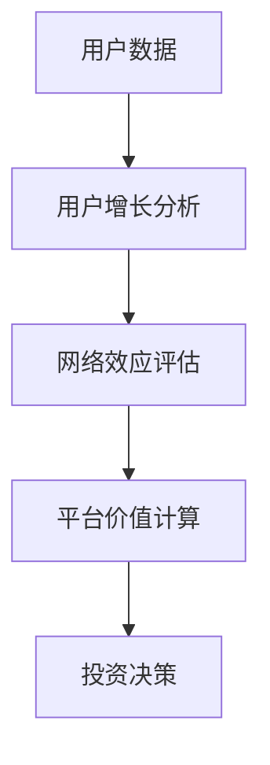
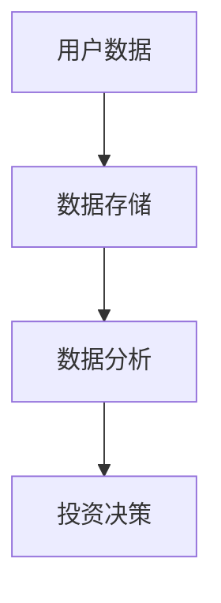

                 


```markdown
# 价值投资中的平台经济分析

## 关键词
- 价值投资
- 平台经济
- 网络效应
- 平台价值评估
- 投资分析

## 摘要
本文深入探讨了价值投资在平台经济中的应用，从平台经济的核心概念、分析框架、算法原理到系统架构设计，结合实际案例，全面解析了如何通过平台经济分析进行价值投资。文章通过详细的理论分析和实践指导，帮助投资者更好地理解和应用平台经济的分析方法。

---

## 第一部分: 价值投资与平台经济的背景介绍

### 第1章: 价值投资与平台经济概述

#### 1.1 价值投资的核心概念
- 1.1.1 价值投资的定义与历史发展
- 1.1.2 价值投资的基本原则与方法
- 1.1.3 价值投资与平台经济的结合

#### 1.2 平台经济的定义与特点
- 1.2.1 平台经济的定义
- 1.2.2 平台经济的核心要素与模式
- 1.2.3 平台经济的分类与应用场景

#### 1.3 价值投资中的平台经济分析背景
- 1.3.1 平台经济在现代经济中的地位
- 1.3.2 价值投资在平台经济中的重要性
- 1.3.3 平台经济分析的挑战与机遇

#### 1.4 本章小结

---

## 第二部分: 平台经济的核心概念与分析框架

### 第2章: 平台经济的核心要素与价值评估

#### 2.1 平台经济的核心要素分析
- 2.1.1 用户群体与网络效应
- 2.1.2 交易机制与撮合效率
- 2.1.3 数据驱动与技术支撑
- 2.1.4 收入模式与成本结构

#### 2.2 平台经济的价值评估模型
- 2.2.1 用户价值评估模型
- 2.2.2 平台价值评估模型
- 2.2.3 竞争优势评估模型

#### 2.3 平台经济的网络效应与规模经济
- 2.3.1 网络效应的定义与衡量
- 2.3.2 平台的规模经济与边际成本
- 2.3.3 网络效应与平台价值的关系

#### 2.4 本章小结

---

## 第三部分: 平台经济分析的算法与数学模型

### 第3章: 平台经济分析的算法原理

#### 3.1 平台经济分析的基本算法
- 3.1.1 用户增长模型
- 3.1.2 网络效应模型
- 3.1.3 平台价值评估算法

#### 3.2 平台经济分析的数学模型
- 3.2.1 用户增长模型的数学表达
  $$用户增长速率 = k \cdot 用户数 \cdot (K - 用户数)$$
- 3.2.2 网络效应模型的数学表达
  $$平台价值 = a \cdot 用户数 + b \cdot 用户数^2$$
- 3.2.3 平台价值评估模型的数学表达
  $$平台价值 = c \cdot 收入 + d \cdot 竞争优势$$

#### 3.3 平台经济分析的算法流程图


#### 3.4 本章小结

---

## 第四部分: 平台经济分析的系统架构与设计

### 第4章: 平台经济分析的系统架构

#### 4.1 系统功能设计
- 4.1.1 数据采集模块
- 4.1.2 数据分析模块
- 4.1.3 投资决策支持模块

#### 4.2 系统架构设计


#### 4.3 本章小结

---

## 第五部分: 项目实战与案例分析

### 第5章: 平台经济分析的实战应用

#### 5.1 实战项目背景与目标
- 5.1.1 项目背景介绍
- 5.1.2 分析目标与范围

#### 5.2 数据采集与处理
- 5.2.1 数据源选择
- 5.2.2 数据清洗与预处理
- 5.2.3 数据存储与管理

#### 5.3 平台价值评估模型的实现
- 5.3.1 模型参数设定
- 5.3.2 模型训练与验证
- 5.3.3 模型应用与结果分析

#### 5.4 投资决策支持系统的设计与实现
- 5.4.1 系统功能模块设计
- 5.4.2 系统界面设计
- 5.4.3 系统测试与优化

#### 5.5 实战项目总结与经验分享
- 5.5.1 项目成果展示
- 5.5.2 实战中的经验与教训
- 5.5.3 对未来投资的启示

#### 5.6 本章小结

---

## 第六部分: 最佳实践与拓展阅读

### 第6章: 最佳实践与投资策略

#### 6.1 平台经济分析中的最佳实践
- 6.1.1 数据驱动的分析方法
- 6.1.2 网络效应的动态监测
- 6.1.3 投资组合的优化配置

#### 6.2 小结与注意事项
- 6.2.1 投资中的风险控制
- 6.2.2 平台经济分析的局限性
- 6.2.3 长期价值与短期波动的平衡

#### 6.3 拓展阅读与学习资源
- 6.3.1 推荐书籍与文献
- 6.3.2 在线课程与培训资源
- 6.3.3 行业报告与研究论文

#### 6.4 本章小结

---

## 作者

作者：AI天才研究院/AI Genius Institute & 禅与计算机程序设计艺术/Zen And The Art of Computer Programming
```

