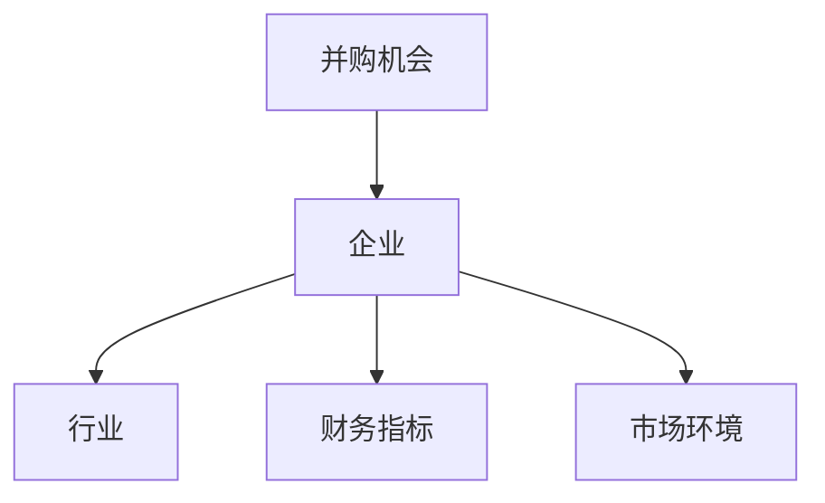
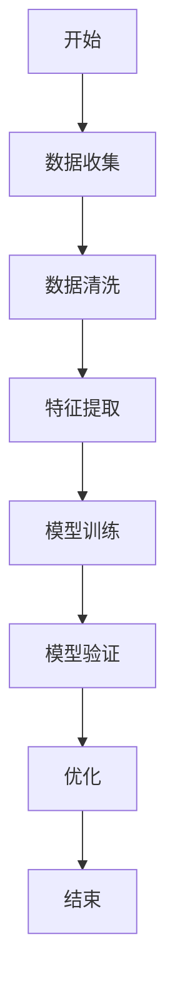
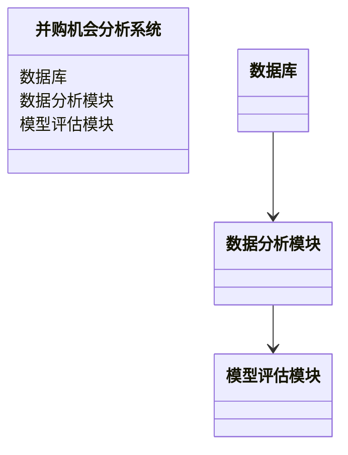
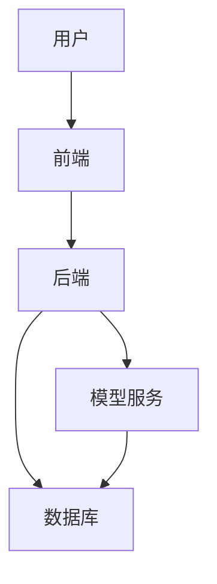
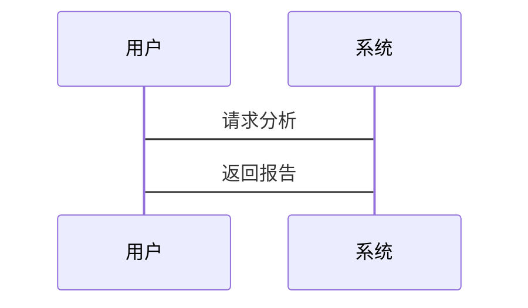

                 


# 《价值投资中的并购机会分析》

---

## 关键词：
- 价值投资
- 并购机会
- 财务分析
- 企业评估
- 投资策略

---

## 摘要：
本文旨在探讨价值投资中的并购机会分析，通过系统化的分析框架和数学模型，帮助投资者识别和评估并购机会。文章从并购的基本概念出发，结合价值投资的核心理念，分析并购机会的关键要素和影响因素。通过算法原理和数学模型的应用，本文详细阐述了并购机会的评估方法，并结合实际案例进行分析。最后，文章提出了并购机会分析的系统架构和最佳实践，为投资者提供科学的决策支持。

---

# 第1章: 背景介绍

## 1.1 并购的基本概念
### 1.1.1 并购的定义与分类
- **定义**：并购（Mergers and Acquisitions，简称M&A）是指一家企业与其他企业（目标公司）合并或收购其资产、股权等行为。
- **分类**：
  - 横向并购：同一行业内的合并，旨在扩大市场份额。
  - 纵向并购：上下游产业的合并，优化供应链。
  - 混合并购：跨行业合并， diversify业务。

### 1.1.2 价值投资的核心理念
- **价值投资**：寻找被市场低估的资产，长期持有，获得超额收益。
- **核心理念**：注重企业的内在价值，而非市场的短期波动。

### 1.1.3 并购与价值投资的关系
- 并购是企业实现价值增长的重要手段。
- 价值投资可以通过并购机会寻找低估的标的，实现超额收益。

## 1.2 价值投资中的并购机会
### 1.2.1 并购机会的定义
- 并购机会是指在市场中存在具有投资价值的并购标的。

### 1.2.2 并购机会的特征
- **低估**：目标公司的市场价格低于其内在价值。
- **竞争优势**：目标公司具备独特的竞争优势。
- **整合潜力**：并购后能够实现协同效应。

### 1.2.3 并购机会的分类
- **防御性并购**：为了防御竞争对手而进行的并购。
- **战略型并购**：为了实现长期战略目标而进行的并购。
- **财务型并购**：以财务回报为目的的并购。

## 1.3 并购与价值投资的结合
### 1.3.1 并购在价值投资中的作用
- 并购可以快速扩大企业规模，提升市场地位。
- 并购可以帮助投资者发现低估的标的。

### 1.3.2 并购与企业价值的关系
- 并购可以提升企业的整体价值，但需注意整合风险。

### 1.3.3 并购对投资组合的影响
- 并购可以增加投资组合的多样性，分散风险。

## 1.4 影响并购机会的主要因素
### 1.4.1 行业环境
- 行业周期：行业处于衰退期时，并购机会增加。
- 竞争格局：行业集中度低时，并购机会较多。

### 1.4.2 企业基本面
- 盈利能力：目标公司具备持续盈利能力。
- 财务状况：目标公司具备健康的财务状况。

### 1.4.3 市场周期
- 经济周期：经济衰退时，并购机会增加。
- 市场情绪：市场恐慌时，并购机会增加。

### 1.4.4 财务状况
- 目标公司具备合理的估值。
- 目标公司具备可整合性。

## 1.5 本章小结
- 本章介绍了并购的基本概念、价值投资的核心理念，以及并购机会的特征和分类。
- 影响并购机会的主要因素包括行业环境、企业基本面、市场周期和财务状况。

---

# 第2章: 并购机会分析的核心概念与联系

## 2.1 并购机会分析的原理
### 2.1.1 并购机会分析的框架
- 数据收集与处理。
- 数据分析与建模。
- 模型验证与优化。

### 2.1.2 并购机会分析的关键要素
- 行业分析。
- 财务分析。
- 竞争分析。

## 2.2 并购与价值投资的核心概念对比
### 2.2.1 并购的核心概念
- 目标公司：企业资产、股权。
- 并购方：企业或投资者。

### 2.2.2 价值投资的核心概念
- 标的：股票、企业。
- 内在价值：企业的真实价值。

### 2.2.3 两者的核心联系
- 并购是价值投资的一种策略。
- 并购机会分析是价值投资的重要组成部分。

## 2.3 并购机会分析的ER实体关系图


## 2.4 本章小结
- 本章通过ER实体关系图展示了并购机会分析的核心要素及其关系。

---

# 第3章: 并购机会分析的算法原理

## 3.1 并购机会评估的算法流程
### 3.1.1 数据收集与处理
- 数据来源：公司财报、行业报告、市场数据。
- 数据清洗：去除无效数据，填补缺失值。

### 3.1.2 数据分析与建模
- 数据分析：财务指标分析、行业分析。
- 建模：构建并购机会评估模型。

### 3.1.3 模型验证与优化
- 模型验证：历史数据验证。
- 模型优化：调整参数，提高准确性。

## 3.2 并购机会评估的数学模型
### 3.2.1 加权平均法
- 公式：$$\text{加权平均} = \sum (\text{权重} \times \text{指标值})$$
- 示例：$$\text{加权平均} = 0.5 \times \text{ROE} + 0.3 \times \text{ROA} + 0.2 \times \text{毛利率}$$

### 3.2.2 多因素分析模型
- 公式：$$\text{综合得分} = \sum (\text{权重}_i \times \text{指标值}_i)$$
- 示例：$$\text{综合得分} = 0.4 \times \text{PE} + 0.3 \times \text{PB} + 0.3 \times \text{PS}$$

### 3.2.3 财务指标评估模型
- 公式：$$\text{估值} = \text{EBITDA} \times \text{倍数}$$
- 示例：$$\text{估值} = \text{EBITDA} \times 5$$

## 3.3 算法流程图


---

# 第4章: 系统分析与架构设计方案

## 4.1 问题场景介绍
- 识别并购机会。
- 评估并购价值。
- 分析并购风险。

## 4.2 项目介绍
- 项目目标：构建并购机会分析系统。
- 项目范围：涵盖数据收集、分析、评估。

## 4.3 系统功能设计
### 4.3.1 领域模型


### 4.3.2 系统架构设计


### 4.3.3 系统接口设计
- API接口：
  - 获取数据：GET /data
  - 分析数据：POST /analyze
  - 生成报告：GET /report

### 4.3.4 系统交互设计


---

# 第5章: 项目实战

## 5.1 环境安装
- 安装Python、Pandas、NumPy、Scikit-learn。

## 5.2 核心实现源代码
```python
import pandas as pd
import numpy as np

def calculate_weighted_average(roes, roas, gross_margins):
    return 0.5 * roes + 0.3 * roas + 0.2 * gross_margins

# 示例数据
data = {
    'ROE': [0.15, 0.2, 0.18],
    'ROA': [0.1, 0.12, 0.15],
    '毛利率': [0.25, 0.3, 0.28]
}

df = pd.DataFrame(data)
weighted_averages = df.apply(lambda row: calculate_weighted_average(row['ROE'], row['ROA'], row['毛利率']), axis=1)
print(weighted_averages)
```

## 5.3 案例分析
- 案例：某公司并购机会分析。
- 分析步骤：数据收集、分析、评估。

## 5.4 项目小结
- 系统实现并购机会分析的流程。
- 案例分析展示了模型的应用。

---

# 第6章: 最佳实践、小结、注意事项和拓展阅读

## 6.1 最佳实践 tips
- 保持数据更新。
- 定期模型优化。
- 注意并购风险。

## 6.2 小结
- 并购机会分析是价值投资的重要组成部分。
- 系统化的分析方法和数学模型可以提高分析效率。

## 6.3 注意事项
- 数据质量影响分析结果。
- 模型假设需合理。
- 并购风险需充分考虑。

## 6.4 拓展阅读
- 建议阅读《并购战》、《价值投资实战》等书籍。

---

# 作者：AI天才研究院/AI Genius Institute & 禅与计算机程序设计艺术 /Zen And The Art of Computer Programming

