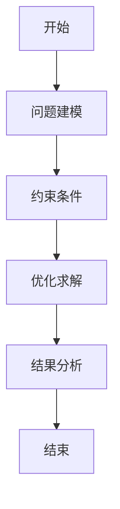
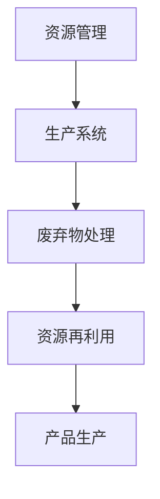
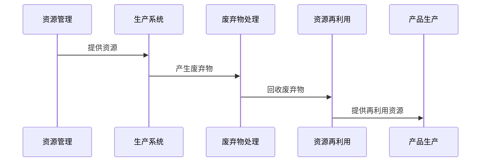

                 


# 价值投资中的循环经济模式分析

> 关键词：价值投资、循环经济模式、资源优化配置、可持续发展、投资回报率、经济系统重构、技术驱动创新

> 摘要：本文系统分析了价值投资与循环经济模式的结合，探讨了循环经济模式的核心概念、算法原理、系统架构以及在实际投资中的应用。通过理论分析和案例实践，揭示了循环经济模式对价值投资的重要意义，为投资者提供了新的视角和策略。

---

# 第一部分: 价值投资中的循环经济模式概述

## 第1章: 循环经济模式的背景与价值投资的结合

### 1.1 循环经济的基本概念与特征

#### 1.1.1 循环经济的定义
循环经济是一种以资源高效利用和循环利用为核心的发展模式，强调通过减少资源消耗、延长产品生命周期、促进废弃物资源化，实现经济与环境的双赢。

#### 1.1.2 循环经济的核心特征
- **资源高效性**：最大限度地减少资源消耗，提高资源利用率。
- **废弃物资源化**：将废弃物转化为新的资源，减少环境污染。
- **系统协同性**：循环经济依赖于产业链上下游的协同合作，形成闭环系统。

#### 1.1.3 循环经济与传统线性经济的对比
| 对比维度 | 循环经济 | 线性经济 |
|----------|----------|----------|
| 资源消耗 | 减少，强调循环利用 | 高，一次性使用 |
| 环境影响 | 低，废弃物资源化 | 高，废弃物产生 |
| 经济效益 | 高，长期可持续 | 低，短期收益 |

### 1.2 价值投资的基本原理

#### 1.2.1 价值投资的定义
价值投资是一种投资策略，强调以低于内在价值的价格买入优质资产，长期持有，等待价格回归其真实价值。

#### 1.2.2 价值投资的核心理念
- **安全边际**：买入价格低于内在价值，确保投资的安全性。
- **长期视角**：关注企业的长期盈利能力，而非短期波动。
- **基本面分析**：通过财务报表、行业地位等分析企业的真实价值。

#### 1.2.3 价值投资与循环经济的结合点
循环经济模式强调资源的高效利用和循环利用，这与价值投资的长期视角和对企业基本面的关注不谋而合。循环经济企业通常具有较高的资源利用效率和较低的环境风险，符合价值投资者对企业质量的要求。

### 1.3 循环经济模式在价值投资中的应用前景

#### 1.3.1 循环经济模式的潜在投资领域
- **环保技术企业**：专注于废弃物处理、资源回收的技术公司。
- **循环经济平台**：搭建资源循环利用的线上平台，促进资源的高效流动。
- **绿色供应链企业**：注重供应链资源优化和废弃物资源化的公司。

#### 1.3.2 价值投资在循环经济中的优势
- **长期视角**：循环经济企业需要长期投入，价值投资的长期视角与之匹配。
- **企业质量**：循环经济企业通常具有较高的行业壁垒和竞争优势，符合价值投资对企业质量的要求。
- **政策支持**：循环经济符合国家可持续发展战略，通常享有政策支持，为投资带来额外收益。

#### 1.3.3 循环经济模式应用的挑战与机遇
- **挑战**：循环经济模式的初期投入大，回报周期长，且市场认知度较低。
- **机遇**：随着环保意识的增强和政策支持的加大，循环经济模式的市场前景广阔。

---

## 第2章: 循环经济模式的核心概念与联系

### 2.1 循环经济模式的原理

#### 2.1.1 循环经济模式的基本原理
循环经济模式通过优化资源配置，实现资源的高效利用和循环利用，从而减少资源消耗和环境污染。其核心在于构建闭环系统，使资源在各环节之间循环流动。

#### 2.1.2 循环经济模式的关键要素
- **资源输入**：包括原材料、能源等输入资源。
- **生产过程**：通过技术创新和管理优化，提高资源利用效率。
- **废弃物处理**：将生产过程中产生的废弃物进行资源化处理，重新投入生产或作为新产品出售。
- **消费者参与**：通过消费者的行为改变，促进资源的循环利用。

#### 2.1.3 循环经济模式的系统性特征
循环经济模式强调系统性，注重产业链上下游的协同合作，形成资源闭环。其系统性特征体现在以下几个方面：
- **整体性**：从整个系统的角度优化资源配置，而非单一环节的优化。
- **协同性**：产业链上下游企业协同合作，共同推动资源的循环利用。
- **动态性**：系统具有动态调整能力，能够适应外部环境的变化。

### 2.2 循环经济模式与价值投资的关系

#### 2.2.1 循环经济模式对价值投资的影响
循环经济模式的兴起为价值投资提供了新的投资机会。循环经济企业的长期盈利能力较强，且通常具有较高的安全边际，符合价值投资的核心理念。

#### 2.2.2 价值投资在循环经济中的作用
价值投资通过对企业基本面的深入分析，识别出具有长期竞争优势的循环经济企业，为投资者提供超额收益。同时，价值投资的长期视角与循环经济的可持续发展理念高度契合。

#### 2.2.3 循环经济模式与价值投资的协同效应
- **协同效应1**：循环经济模式的长期性和可持续性与价值投资的长期视角相匹配。
- **协同效应2**：循环经济企业的高质量和竞争优势为价值投资提供了优质的投资标的。
- **协同效应3**：价值投资的资金支持为循环经济模式的推广和应用提供了资金保障。

### 2.3 循环经济模式的核心概念对比表

| 对比维度 | 循环经济模式 | 传统线性经济 |
|----------|--------------|--------------|
| 资源消耗 | 低，强调循环利用 | 高，一次性使用 |
| 环境影响 | 低，废弃物资源化 | 高，废弃物产生 |
| 经济效益 | 高，长期可持续 | 低，短期收益 |
| 投资回报 | 高，长期视角 | 中，短期波动 |

### 2.4 循环经济模式的ER实体关系图

```mermaid
erd
    左对齐
    供应商 ---+-->> 产品 : 提供
    消费者 ---+-->> 废弃物 : 产生
    回收站 ---+-->> 废弃物 : 回收
    企业 ---+-->> 产品 : 生产
    企业 ---+-->> 废弃物 : 处理
    企业 ---+-->> 资源 : 使用
```

---

## 第3章: 循环经济模式的算法原理与数学模型

### 3.1 循环经济模式的优化算法

#### 3.1.1 算法的基本原理
循环经济模式的优化算法旨在通过数学建模和优化技术，找到资源的最优配置方案，最大化资源利用率和经济效益。

#### 3.1.2 算法的优化目标
- **目标1**：最大化资源利用率。
- **目标2**：最小化废弃物产生。
- **目标3**：最大化经济收益。

#### 3.1.3 算法的实现步骤
1. **问题建模**：将循环经济模式中的资源流动和经济收益转化为数学模型。
2. **约束条件**：明确资源限制、技术限制和市场限制等约束条件。
3. **优化求解**：使用线性规划、整数规划等优化方法，找到最优解。
4. **结果分析**：分析优化结果，验证其合理性和可行性。

### 3.2 循环经济模式的数学模型

#### 3.2.1 数学模型的构建
循环经济模式的数学模型通常包括以下几个部分：
- **变量定义**：定义决策变量，如$x_i$表示第$i$种资源的使用量。
- **目标函数**：最大化资源利用率，例如$\max \sum_{i=1}^{n} x_i$。
- **约束条件**：满足资源限制、技术限制和市场限制，例如$\sum_{i=1}^{n} a_{ij}x_i \leq b_j$，其中$a_{ij}$为技术系数，$b_j$为资源限制。

#### 3.2.2 数学模型的求解方法
使用线性规划方法求解数学模型，例如：
$$
\begin{aligned}
& \max \sum_{i=1}^{n} x_i \\
& \text{subject to} \\
& \quad \sum_{i=1}^{n} a_{ij}x_i \leq b_j, \quad \forall j \\
& \quad x_i \geq 0, \quad \forall i
\end{aligned}
$$
其中，$x_i$为第$i$种资源的使用量，$a_{ij}$为技术系数，$b_j$为资源限制。

#### 3.2.3 数学模型的应用实例
假设某企业生产两种产品，分别消耗两种资源，资源限制分别为100和150。目标是最大化总产量，构建数学模型如下：
$$
\begin{aligned}
& \max \quad 2x_1 + 3x_2 \\
& \text{subject to} \\
& \quad 2x_1 + x_2 \leq 100 \\
& \quad x_1 + 3x_2 \leq 150 \\
& \quad x_1, x_2 \geq 0
\end{aligned}
$$
求解结果为$x_1 = 50$, $x_2 = 50$，总产量为$2 \times 50 + 3 \times 50 = 250$。

### 3.3 算法的Mermaid流程图



### 3.4 算法的Python实现代码

```python
import numpy as np
from scipy.optimize import linprog

# 定义目标函数系数
c = [-2, -3]  # 因为linprog求最小值，所以取负数

# 定义约束矩阵
A = [
    [2, 1],
    [1, 3]
]
b = [100, 150]

# 定义变量下限
x_bounds = [(0, None), (0, None)]

# 使用linprog求解
result = linprog(c, A, b, bounds=x_bounds, method='highs')

# 输出结果
print("最优解：", result.x)
print("最大值：", -result.fun)
```

---

## 第4章: 循环经济模式的系统分析与架构设计

### 4.1 循环经济模式的系统分析

#### 4.1.1 问题场景介绍
循环经济模式的系统分析旨在通过优化资源配置，实现资源的高效利用和循环利用。系统分析的核心在于构建闭环系统，使资源在各环节之间循环流动。

#### 4.1.2 项目介绍
以某环保企业为例，分析其循环经济模式的系统架构。该企业专注于废弃物资源化，通过技术创新和管理优化，实现资源的高效利用。

### 4.2 系统功能设计

#### 4.2.1 领域模型Mermaid类图


### 4.3 系统架构设计

#### 4.3.1 系统架构Mermaid架构图



#### 4.3.2 系统接口设计
- **接口1**：资源输入接口，接收原材料和能源。
- **接口2**：废弃物输出接口，将废弃物发送到回收站。
- **接口3**：资源再利用接口，将回收的废弃物转化为新的资源。

#### 4.3.3 系统交互Mermaid序列图



---

## 第5章: 价值投资中的循环经济模式分析

### 5.1 价值投资中的循环经济模式分析

#### 5.1.1 投资策略
循环经济模式的投资策略包括：
- **策略1**：选择具有循环经济特征的企业，关注其资源利用效率和竞争优势。
- **策略2**：长期持有优质循环经济企业，等待其价值的回归。
- **策略3**：分散投资，降低风险。

#### 5.1.2 投资回报率分析
循环经济企业的投资回报率通常较高，但由于其初期投入大，回报周期较长。投资者需要具备长期视角和耐心，才能获得超额收益。

#### 5.1.3 投资风险分析
循环经济模式的投资风险包括：
- **市场风险**：循环经济市场波动较大，可能影响投资回报。
- **技术风险**：循环经济依赖技术创新，技术失败可能导致投资损失。
- **政策风险**：政策变化可能影响循环经济企业的经营环境。

---

## 第6章: 循环经济模式的项目实战

### 6.1 项目实战：价值投资中的循环经济模式应用

#### 6.1.1 环境安装
- **工具安装**：安装Python和必要的库（如numpy、scipy）。
- **数据获取**：收集循环经济企业的财务数据和市场信息。

#### 6.1.2 核心代码实现
```python
import pandas as pd
import numpy as np
from sklearn import linear_model

# 数据预处理
data = pd.read_csv('data.csv')
X = data[['收入', '成本', '利润']]
y = data['股价']

# 建立线性回归模型
model = linear_model.LinearRegression()
model.fit(X, y)

# 预测股价
predictions = model.predict(X)
print("预测股价：", predictions)
```

#### 6.1.3 案例分析
以某环保企业为例，分析其循环经济模式的应用。通过财务数据和市场信息，评估其投资价值和风险。

---

## 第7章: 循环经济模式的价值投资最佳实践

### 7.1 最佳实践 tips

#### 7.1.1 小结
循环经济模式的价值投资需要从企业的基本面、长期竞争优势和可持续发展能力等多方面进行综合分析。

#### 7.1.2 注意事项
- **注意1**：选择具有强大技术实力和管理能力的企业。
- **注意2**：关注政策支持和市场需求，避免政策风险。
- **注意3**：分散投资，降低风险。

#### 7.1.3 拓展阅读
- 推荐书籍：《循环经济与可持续发展》、《价值投资实战策略》。
- 推荐网站：查阅循环经济相关的行业报告和市场分析。

---

# 作者：AI天才研究院/AI Genius Institute & 禅与计算机程序设计艺术 /Zen And The Art of Computer Programming

