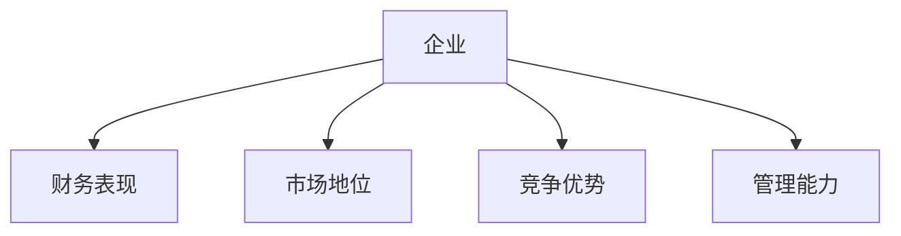
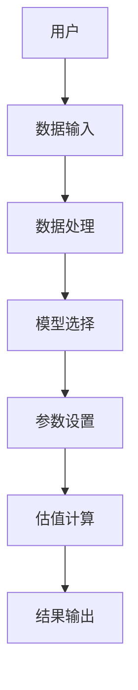

                 


---

# 价值投资中的成长型企业估值

## 关键词：价值投资、成长型企业、企业估值、财务分析、投资策略

## 摘要：  
本文深入探讨了价值投资中的成长型企业估值方法，结合理论与实践，分析了成长型企业估值的核心要素、常用模型及实际案例。通过系统的方法和详细的分析，帮助投资者更好地识别和评估成长型企业的潜在价值，从而做出明智的投资决策。

---

## 第一部分：价值投资与成长型企业概述

### 第1章：价值投资与成长型企业概述

#### 1.1 价值投资的核心理念

- **1.1.1 价值投资的定义与起源**  
  价值投资是一种以低于内在价值的价格购买优质资产的投资策略，起源于20世纪初，由本杰明·格雷厄姆和戴维·多德提出。其核心在于寻找市场先生的错误定价。

- **1.1.2 价值投资的基本原则**  
  价值投资者注重企业的基本面分析，寻找安全边际，即买入价格低于企业的内在价值，以降低投资风险。

- **1.1.3 价值投资与成长投资的区别**  
  价值投资注重低估值和安全边际，而成长投资更关注企业的高成长性和未来潜力。两者在企业筛选标准上存在差异，但可以通过结合两者的方法优化投资策略。

#### 1.2 成长型企业的定义与特点

- **1.2.1 成长型企业的定义**  
  成长型企业是指那些收入和利润持续增长，具备较强市场竞争力和发展潜力的企业。

- **1.2.2 成长型企业的核心特征**  
  - 高增长率：收入和利润持续增长。
  - 市场领导地位：在行业中占据领先地位。
  - 强大的竞争优势：如专利、品牌、技术壁垒等。
  - 管理团队：优秀且稳定的领导团队。

- **1.2.3 成长型企业生命周期分析**  
  成长型企业通常处于成长期或成熟期的早期阶段，具有较高的扩张潜力。

#### 1.3 价值投资与成长型企业结合的意义

- **1.3.1 价值投资视角下的成长型企业识别**  
  通过基本面分析，识别那些估值被市场低估的高成长企业。

- **1.3.2 成长型企业为价值投资带来的机会**  
  高成长企业具备较高的增值空间，能够为投资者带来超额收益。

- **1.3.3 两者的结合对企业估值的影响**  
  结合价值与成长因素，能够更全面地评估企业的内在价值，避免单一估值方法的局限性。

---

## 第二部分：成长型企业估值的核心概念与分析框架

### 第2章：成长型企业估值的核心概念

#### 2.1 估值的基本原理

- **2.1.1 估值的定义与目的**  
  估值是对企业内在价值的估计，旨在确定其合理的价格区间，为投资决策提供依据。

- **2.1.2 估值的基本方法与分类**  
  估值方法主要分为相对估值法（如市盈率、市净率）和绝对估值法（如现金流折现法）。

- **2.1.3 价值与价格的关系**  
  内在价值是企业的实际价值，市场价格受市场情绪影响，可能偏离内在价值。

#### 2.2 成长型企业估值的关键因素

- **2.2.1 财务表现**  
  收入、利润、增长率等财务指标是评估企业成长性的关键因素。

- **2.2.2 市场地位与竞争优势**  
  市场份额和竞争优势直接影响企业的成长空间和盈利能力。

- **2.2.3 管理团队与企业治理**  
  优秀的管理团队能够推动企业持续发展，良好的治理结构有助于提升企业价值。

- **2.2.4 行业环境与宏观经济影响**  
  行业发展趋势和宏观经济环境对企业成长有重要影响。

#### 2.3 成长型企业估值的边界与外延

- **2.3.1 估值的适用范围与限制**  
  估值适用于具备稳定增长潜力的企业，但不适用于周期性或不稳定的企业。

- **2.3.2 估值与企业价值的关系**  
  估值是企业价值的近似估计，帮助投资者判断是否具备投资价值。

- **2.3.3 估值的动态调整机制**  
  随着企业的发展和市场环境的变化，估值需要定期更新和调整。

---

### 第3章：成长型企业估值的核心要素与联系

#### 3.1 核心要素的定义与属性

- **3.1.1 财务表现**  
  包括收入、利润、现金流等，是评估企业财务健康状况的关键指标。

- **3.1.2 市场地位**  
  包括市场份额、品牌影响力等，反映了企业在市场中的竞争力。

- **3.1.3 竞争优势**  
  包括技术壁垒、成本优势、专利等，决定了企业的竞争优势。

- **3.1.4 管理能力**  
  包括领导团队的能力、管理效率等，影响企业的长期发展。

#### 3.2 核心要素的对比分析

- **3.2.1 财务表现与市场地位的对比**  
  财务表现反映企业的盈利能力，市场地位反映企业的市场影响力。

- **3.2.2 竞争优势与管理能力的对比**  
  竞争优势是企业的外部竞争力，管理能力是企业的内部驱动力。

#### 3.3 核心要素的ER实体关系图



---

## 第三部分：成长型企业估值的系统分析与架构设计

### 第4章：成长型企业估值模型与方法

#### 4.1 常用估值模型与方法

- **4.1.1 现金流折现模型（DCF模型）**  
  通过预测未来现金流，折现至现值，估算企业的内在价值。

- **4.1.2 市盈率法**  
  通过比较市盈率与行业平均水平，判断企业估值的高低。

- **4.1.3 市净率法**  
  通过比较市净率与行业平均水平，评估企业的估值。

- **4.1.4 市销率法**  
  通过比较市销率与行业平均水平，评估企业的估值。

#### 4.2 估值模型的数学公式与实现

- **现金流折现模型（DCF模型）**  
  公式：  
  $$ \text{企业价值} = \sum_{t=1}^{n} \frac{\text{现金流}}{(1 + r)^t} $$  
  其中，\( r \) 是折现率，\( n \) 是预测期数。

#### 4.3 系统架构设计

- **4.3.1 问题场景介绍**  
  以某成长型企业为例，设计一套估值系统，帮助投资者快速评估企业价值。

- **4.3.2 系统功能设计**  
  - 数据输入：企业财务数据、市场数据等。
  - 模型选择：选择合适的估值模型。
  - 参数设置：输入相关参数。
  - 估值计算：生成企业估值结果。
  - 结果输出：展示估值结果及分析报告。

- **4.3.3 系统架构图**



---

## 第四部分：成长型企业估值的项目实战与案例分析

### 第5章：成长型企业估值的项目实战

#### 5.1 项目环境安装

- **5.1.1 工具安装**  
  安装Python、Pandas、NumPy等工具。

- **5.1.2 数据获取**  
  获取目标企业的财务数据和市场数据。

#### 5.2 系统核心实现源代码

```python
import pandas as pd
import numpy as np

def dcf_valuation(fcf, growth_rate, discount_rate, horizon):
    terminal_value = fcf * (1 + growth_rate) / (discount_rate - growth_rate)
    present_value = 0
    for t in range(1, horizon + 1):
        cash_flow = fcf * (1 + growth_rate) ** (t - 1)
        present_value += cash_flow / (1 + discount_rate) ** t
    total_value = present_value + terminal_value / (1 + discount_rate) ** horizon
    return total_value

# 示例数据
fcf = 100
growth_rate = 0.1
discount_rate = 0.08
horizon = 5

value = dcf_valuation(fcf, growth_rate, discount_rate, horizon)
print(f"企业估值为：{value}")
```

#### 5.3 代码应用解读与分析

- **代码功能**  
  该代码实现现金流折现模型，计算企业的内在价值。

- **代码实现**  
  通过函数 `dcf_valuation`，输入自由现金流、增长率、折现率和预测期数，计算企业估值。

- **结果解读**  
  示例中，企业估值为计算结果，投资者可以根据此结果判断企业是否被低估。

#### 5.4 实际案例分析

- **案例选择**  
  以某科技公司为例，计算其估值。

- **案例分析**  
  根据财务数据，使用DCF模型计算企业价值，判断其是否具备投资价值。

---

## 第五部分：风险管理与未来趋势

### 第6章：成长型企业估值的风险管理

#### 6.1 估值风险的识别与应对

- **6.1.1 估值模型假设的风险**  
  模型假设可能与实际情况不符，导致估值偏差。

- **6.1.2 数据质量的风险**  
  数据不准确会影响估值结果。

- **6.1.3 市场环境变化的风险**  
  经济波动可能影响企业的实际表现。

#### 6.2 风险管理策略

- **6.2.1 多模型验证**  
  使用多种估值模型进行交叉验证，降低模型假设风险。

- **6.2.2 数据来源可靠性**  
  使用可靠的数据源，确保数据质量。

- **6.2.3 定期更新估值**  
  随着企业的发展和市场变化，定期更新估值模型。

### 第7章：成长型企业估值的未来趋势

#### 7.1 未来趋势的分析

- **7.1.1 科技驱动的估值创新**  
  人工智能和大数据技术将推动估值方法的创新。

- **7.1.2 可持续投资的兴起**  
  ESG（环境、社会、治理）因素将成为估值的重要组成部分。

- **7.1.3 数字化工具的应用**  
  在线估值工具和自动化分析将提升估值效率。

#### 7.2 未来发展的建议

- **7.2.1 加强技术应用**  
  利用科技手段优化估值流程。

- **7.2.2 注重可持续发展**  
  将ESG因素纳入估值模型。

- **7.2.3 提升数据质量**  
  通过高质量数据支持精准估值。

---

## 第六部分：附录

### 附录A：术语表

- **DCF模型**：现金流折现模型，用于估算企业内在价值。
- **市盈率**：股价与每股收益的比率。
- **市净率**：股价与每股净资产的比率。
- **自由现金流**：企业在偿还了所有资本成本后的现金流。

### 附录B：工具推荐

- Python：数据处理与建模。
- Excel：常用的数据分析工具。
- Morningstar：专业的估值工具。

### 附录C：数据来源

- 公司财报：财务数据的主要来源。
- 行业报告：市场分析的重要依据。
- 数据供应商：如FactSet、Bloomberg。

### 附录D：参考文献

- 格雷厄姆，本杰明. 《证券分析》.
- 芒格，查理. 《巴菲特的思维方式》.
- 纳格尔，彼得. 《投资中最简单的事》.

---

## 作者：AI天才研究院/AI Genius Institute & 禅与计算机程序设计艺术/Zen And The Art of Computer Programming

---

**注**：以上目录大纲仅为示例，具体内容需根据实际写作逐步填充细节。

