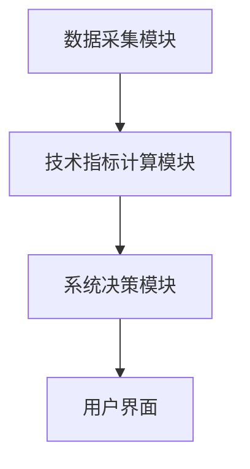
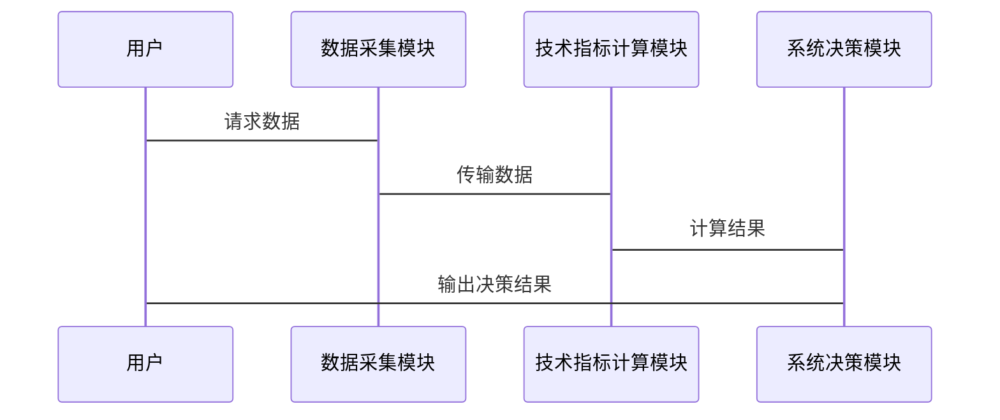

                 


# 《价值投资中的技术分析辅助》

> 关键词：价值投资，技术分析，股票投资，K线图，均线，技术指标

> 摘要：本文探讨了技术分析在价值投资中的辅助作用，详细介绍了技术分析的核心概念、算法原理、数学模型、系统架构以及实战应用。通过分析技术指标和形态识别，结合具体案例，展示了如何利用技术分析提升投资决策的准确性。

---

# 引言

在股票投资领域，价值投资与技术分析是两种常见的方法。价值投资注重基本面分析，寻找被市场低估的企业进行长期投资；而技术分析则通过研究价格走势、成交量等市场数据，预测未来的价格波动。本文将探讨技术分析如何辅助价值投资，帮助投资者在决策过程中更全面地评估投资标的。

---

# 第1章: 价值投资与技术分析概述

## 1.1 价值投资的核心概念

### 1.1.1 价值投资的定义与特点

- **定义**：价值投资是一种以低于公平价值的价格买入优质股票的投资策略，关注企业的内在价值。
- **特点**：
  - 长期投资：关注企业的长期表现，而非短期波动。
  - 低估值：寻找市场价格低于内在价值的企业。
  - 高质量：选择具有强大竞争优势和良好管理的企业。

### 1.1.2 价值投资的基本原理

- **市场有效性**：市场并非总是有效，存在价格与价值偏离的情况。
- **安全边际**：以低于内在价值的价格买入，降低投资风险。
- **长期复利**：通过长期持有优质资产，实现财富的稳步增长。

### 1.1.3 价值投资与技术分析的关系

- **互补关系**：技术分析可以帮助价值投资者识别合适的买入和卖出时机。
- **结合优势**：技术分析弥补了价值投资在时间维度上的不足，帮助投资者在合适的价格区间内介入。

---

## 1.2 技术分析的核心概念

### 1.2.1 技术分析的定义与特点

- **定义**：通过分析历史价格和成交量数据，预测未来价格走势的方法。
- **特点**：
  - 量化性：依赖价格和成交量的统计数据。
  - 可视性：通过图表直观展示价格走势。
  - 时效性：关注短期价格波动。

### 1.2.2 技术分析的基本假设

1. **价格反映一切信息**：市场价格已经反映了所有相关信息。
2. **价格走势具有延续性**：价格走势会延续之前的趋势。
3. **历史形态会重复出现**：价格形态和走势具有周期性。

### 1.2.3 技术分析与价值投资的结合

- **技术分析辅助价值投资**：通过技术指标和形态识别，寻找买入和卖出的时机。
- **价值评估与价格走势结合**：技术分析帮助投资者判断价格是否偏离内在价值。

---

## 1.3 价值投资中的技术分析作用

### 1.3.1 技术分析在价值投资中的地位

- **辅助工具**：技术分析是价值投资的辅助工具，帮助投资者在合适的价格区间介入。
- **风险管理**：通过技术指标控制投资风险，避免过度偏离价值区间。

### 1.3.2 技术分析辅助投资决策的逻辑

- **价格与价值的对比**：通过技术分析判断价格是否处于合理区间。
- **趋势与形态识别**：通过趋势和形态判断价格的未来走势。

### 1.3.3 技术分析与基本面分析的协同效应

- **互补性**：基本面分析提供内在价值，技术分析提供价格走势信息。
- **协同性**：结合两者，提高投资决策的准确性和可靠性。

---

# 第2章: 价值投资中的技术分析基础

## 2.1 技术分析的基本工具

### 2.1.1 K线图的构成与解读

- **K线图**：记录一定时间内价格的最高价、最低价、开盘价和收盘价。
- **K线类型**：
  - **阳线**：收盘价高于开盘价，表示价格上涨。
  - **阴线**：收盘价低于开盘价，表示价格下跌。

### 2.1.2 均线的计算与应用

- **均线计算公式**：
  $$ MA_n = \frac{\sum_{i=1}^{n} P_i}{n} $$
  其中，\( P_i \) 为第i天的价格，\( n \) 为计算天数。
- **应用**：
  - 判断价格趋势。
  - 识别价格支撑位和阻力位。

### 2.1.3 成交量的分析与意义

- **成交量公式**：
  $$ V = \text{交易量} $$
- **应用**：
  - 确认价格趋势的强度。
  - 识别价格波动的真假。

---

## 2.2 技术分析的核心指标

### 2.2.1 移动平均线（MA）的计算与应用

- **移动平均线计算**：
  $$ MA_n = \frac{\sum_{i=1}^{n} P_i}{n} $$
- **应用**：
  - 短期、中期、长期均线的设置。
  - 通过均线交叉判断趋势变化。

### 2.2.2 相对强弱指数（RSI）的计算与应用

- **RSI计算公式**：
  $$ RSI = \frac{\sum_{i=1}^{n} \text{上涨幅度}}{\sum_{i=1}^{n} (\text{上涨幅度} + \text{下跌幅度})} \times 100 $$
- **应用**：
  - 判断超买超卖状态。
  - 识别趋势反转的可能性。

### 2.2.3 布林带（Bollinger Bands）的计算与应用

- **布林带计算公式**：
  - 中线（MA）：
    $$ BB\_MA = \frac{\sum_{i=1}^{n} P_i}{n} $$
  - 上轨（MA + 标准差）：
    $$ BB\_Upper = BB\_MA + \sigma $$
  - 下轨（MA - 标准差）：
    $$ BB\_Lower = BB\_MA - \sigma $$
- **应用**：
  - 判断价格波动范围。
  - 识别价格的超买超卖状态。

---

## 2.3 技术分析的常见形态

### 2.3.1 头肩形的识别与应用

- **头肩形特征**：
  - 头部：价格在一定区域内形成平台。
  - 两个肩部：价格在头部两侧形成较低的高点。
- **应用**：
  - 识别价格趋势反转点。
  - 判断价格的支撑位和阻力位。

### 2.3.2 双重顶的识别与应用

- **双重顶特征**：
  - 价格在一定区域内形成两个高点。
  - 中间形成低点。
- **应用**：
  - 判断价格趋势反转点。
  - 识别价格的阻力位。

### 2.3.3 突破形态的识别与应用

- **突破形态特征**：
  - 价格突破前期形成的平台或趋势线。
  - 突破后价格继续向某一方向移动。
- **应用**：
  - 判断价格趋势的变化。
  - 识别价格的支撑位和阻力位。

---

## 2.4 本章小结

本章详细介绍了技术分析的核心工具和指标，包括K线图、均线、成交量、移动平均线、相对强弱指数和布林带等。这些工具和指标在价值投资中可以帮助投资者判断价格趋势和波动，从而辅助投资决策。

---

# 第3章: 技术分析在价值投资中的应用策略

## 3.1 技术分析在选股中的应用

### 3.1.1 通过技术指标筛选潜在投资标的

- **策略**：
  - 选择价格处于上升趋势的股票。
  - 确保价格未超买或超卖。

### 3.1.2 通过形态识别寻找买入机会

- **策略**：
  - 识别头肩形、双重顶等反转形态。
  - 确认价格突破关键阻力位。

### 3.1.3 通过趋势分析判断投资周期

- **策略**：
  - 长期趋势：选择长期均线向上的股票。
  - 短期趋势：选择短期均线向上的股票。

---

## 3.2 技术分析在投资决策中的应用

### 3.2.1 通过技术分析制定买卖策略

- **买入策略**：
  - 价格突破关键阻力位。
  - 技术指标显示超卖状态。
- **卖出策略**：
  - 价格跌破关键支撑位。
  - 技术指标显示超买状态。

### 3.2.2 通过技术分析管理投资风险

- **风险管理**：
  - 设置止损点：价格跌破支撑位时卖出。
  - 设置止盈点：价格达到预期收益时卖出。

### 3.2.3 通过技术分析优化投资组合

- **策略**：
  - 分散投资：通过技术分析选择不同行业的股票。
  - 调整仓位：根据技术指标变化调整持仓比例。

---

## 3.3 技术分析与价值评估的结合

### 3.3.1 通过技术分析验证价值评估结果

- **策略**：
  - 比较市场价格与内在价值。
  - 判断价格是否处于合理区间。

### 3.3.2 通过技术分析修正价值评估模型

- **策略**：
  - 根据技术指标调整估值模型。
  - 结合市场情绪和技术走势优化估值。

### 3.3.3 通过技术分析提升投资决策的准确性

- **策略**：
  - 综合考虑技术分析和基本面分析。
  - 利用技术分析判断市场趋势，优化投资决策。

---

## 3.4 本章小结

本章探讨了技术分析在价值投资中的具体应用策略，包括选股、制定买卖策略、风险管理以及优化投资组合等方面。通过技术分析，投资者可以更准确地判断投资时机，降低投资风险，提高投资收益。

---

# 第4章: 技术分析算法与数学模型

## 4.1 技术分析算法的实现

### 4.1.1 移动平均收敛散度（MACD）算法

- **MACD计算公式**：
  $$ MACD = \text{短期均线} - \text{长期均线} $$
  $$ MACD\_信号线 = \text{短期均线} - \text{长期均线} $$
- **应用**：
  - 判断价格趋势。
  - 识别价格的买卖信号。

### 4.1.2 相对强弱指数（RSI）算法

- **RSI计算公式**：
  $$ RSI = \frac{\sum_{i=1}^{n} \text{上涨幅度}}{\sum_{i=1}^{n} (\text{上涨幅度} + \text{下跌幅度})} \times 100 $$
- **应用**：
  - 判断超买超卖状态。
  - 识别趋势反转的可能性。

---

## 4.2 技术分析的数学模型

### 4.2.1 移动平均线模型

- **模型公式**：
  $$ MA_n = \frac{\sum_{i=1}^{n} P_i}{n} $$
- **应用**：
  - 判断价格趋势。
  - 识别价格的支撑位和阻力位。

### 4.2.2 布林带模型

- **模型公式**：
  $$ BB\_MA = \frac{\sum_{i=1}^{n} P_i}{n} $$
  $$ BB\_Upper = BB\_MA + \sigma $$
  $$ BB\_Lower = BB\_MA - \sigma $$
- **应用**：
  - 判断价格波动范围。
  - 识别价格的超买超卖状态。

---

## 4.3 本章小结

本章通过数学模型和算法，详细介绍了技术分析的核心指标和计算方法。这些模型和算法为投资者提供了技术分析的理论基础和实现方法。

---

# 第5章: 技术分析系统架构与实现

## 5.1 系统功能设计

### 5.1.1 数据采集模块

- **功能**：
  - 采集股票的历史价格和成交量数据。
  - 数据源：股票数据库、网络接口等。

### 5.1.2 技术指标计算模块

- **功能**：
  - 计算移动平均线、RSI、布林带等技术指标。
  - 提供图表展示技术指标的变化趋势。

### 5.1.3 系统决策模块

- **功能**：
  - 根据技术指标和形态识别生成买卖信号。
  - 提供风险管理策略。

---

## 5.2 系统架构设计

### 5.2.1 系统架构图



### 5.2.2 系统交互流程



---

## 5.3 本章小结

本章详细介绍了技术分析系统的架构设计和功能实现，包括数据采集、技术指标计算和系统决策模块。通过系统化的方法，投资者可以更高效地进行技术分析。

---

# 第6章: 项目实战——股票价格预测系统

## 6.1 项目背景与目标

- **背景**：
  - 利用技术分析预测股票价格。
  - 辅助投资者制定买卖策略。
- **目标**：
  - 实现股票价格预测系统。
  - 提供技术分析的可视化界面。

---

## 6.2 项目环境与工具

- **开发工具**：
  - Python：编程语言。
  - Pandas：数据处理库。
  - Matplotlib：数据可视化库。
  - TA-Lib：技术分析库。

---

## 6.3 项目核心代码实现

### 6.3.1 数据采集代码

```python
import pandas_datareader as pdr

# 采集股票数据
data = pdr.get_data_yahoo('AAPL', start='2020-01-01', end='2023-12-31')
```

### 6.3.2 技术指标计算代码

```python
import talib

# 计算RSI
rsi = talib.RSI(data['Close'], timeperiod=14)
```

### 6.3.3 系统决策代码

```python
# 判断买卖信号
buy_signal = rsi < 30
sell_signal = rsi > 70
```

---

## 6.4 项目实战案例分析

- **案例分析**：
  - 使用AAPL股票数据进行分析。
  - 计算RSI指标，判断买卖信号。
  - 结合K线图和成交量图进行分析。

---

## 6.5 项目小结

本章通过项目实战，详细展示了技术分析在股票价格预测中的应用。通过实际案例分析，投资者可以更好地理解技术分析的实现和应用。

---

# 第7章: 总结与展望

## 7.1 总结

本文详细探讨了技术分析在价值投资中的辅助作用，介绍了技术分析的核心概念、算法原理、数学模型以及系统架构。通过项目实战，展示了技术分析在股票价格预测中的具体应用。

---

## 7.2 展望

- **未来发展方向**：
  - 结合人工智能技术，提升技术分析的准确性。
  - 开发更智能化的技术分析工具。
  - 深入研究技术分析与价值投资的结合。

---

# 作者

**作者：AI天才研究院/AI Genius Institute & 禅与计算机程序设计艺术 /Zen And The Art of Computer Programming**

---

以上是《价值投资中的技术分析辅助》的完整目录大纲和内容框架，涵盖了从基础概念到实战应用的各个方面，确保内容详实、逻辑清晰，能够为读者提供深入的技术分析知识和实践指导。

