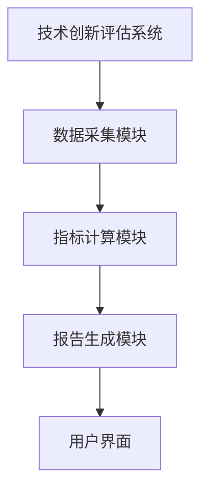
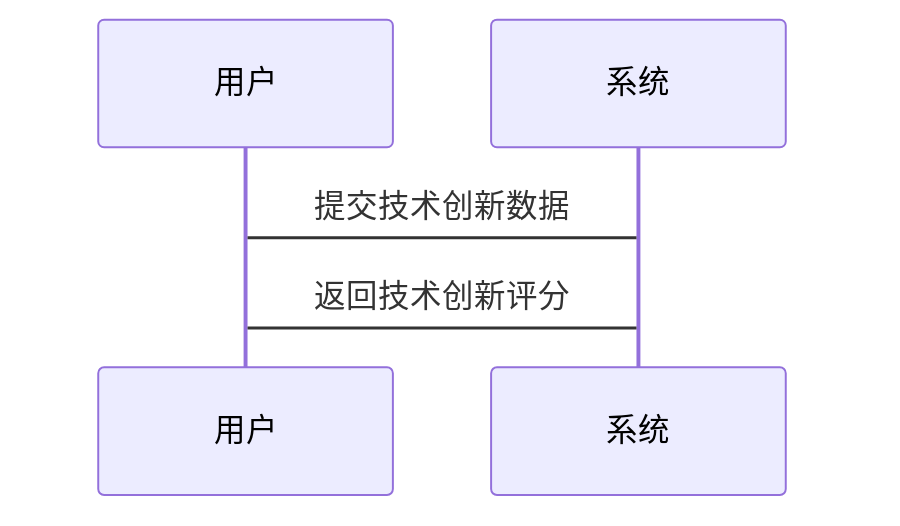

                 


# 价值投资中的技术创新评估

---

## 关键词：价值投资、技术创新、评估模型、算法实现、项目分析

---

## 摘要

在当前快速发展的科技时代，技术创新不仅是企业发展的核心驱动力，也是价值投资者评估企业潜力的重要因素。本文将探讨如何在价值投资中科学地评估技术创新，分析技术创新对企业价值的影响，并提供一套基于数学模型的技术创新评估方法。通过实际案例分析和项目实战，本文将帮助投资者更好地理解和应用技术创新评估，从而在投资决策中做出更明智的选择。

---

## 第一部分：价值投资中的技术创新评估背景与核心概念

### 第1章：价值投资的演变与技术创新的重要性

#### 1.1 价值投资的定义与历史发展

- **1.1.1 价值投资的基本概念**  
  价值投资是一种长期投资策略，强调以低于市场价的价格买入具有内在价值的资产。其核心在于识别那些被市场低估的企业，通过长期持有实现超额收益。

- **1.1.2 价值投资的历史演变**  
  价值投资的理论基础可以追溯到本杰明·格雷厄姆和戴维·多德的《证券分析》。随着时间推移，价值投资方法不断完善，从基本面分析到量化分析，逐步融入更多技术因素。

- **1.1.3 技术创新在价值投资中的作用**  
  随着科技的进步，技术创新已成为企业竞争力的核心。在价值投资中，技术创新不仅影响企业的盈利能力，还决定了其在行业中的地位和未来发展潜力。

#### 1.2 技术创新的定义与特征

- **1.2.1 技术创新的核心概念**  
  技术创新是指将新技术应用于产品或服务，以提高效率、降低成本或创造新的市场需求。

- **1.2.2 技术创新的分类与特征**  
  技术创新可以分为产品创新、流程创新和服务创新。其主要特征包括创新性、可量化性和经济性。

- **1.2.3 技术创新与企业竞争力的关系**  
  技术创新是企业核心竞争力的源泉。拥有领先技术的企业往往能够在市场中占据主导地位，并获得更高的利润率。

#### 1.3 价值投资与技术创新的结合

- **1.3.1 技术创新在价值评估中的重要性**  
  技术创新直接影响企业的长期盈利能力，是价值投资者评估企业的重要指标。

- **1.3.2 技术创新如何影响企业价值**  
  技术创新可以降低生产成本、提高产品附加值，从而提升企业的市场地位和盈利能力。

- **1.3.3 技术创新评估的边界与外延**  
  技术创新评估需要考虑技术的成熟度、商业化潜力以及行业竞争环境。

### 第2章：技术创新评估的核心要素与框架

#### 2.1 技术创新评估的关键指标

- **2.1.1 技术领先性**  
  评估企业技术是否领先于行业平均水平。

- **2.1.2 技术可行性**  
  评估技术的商业化潜力和实施难度。

- **2.1.3 技术商业化潜力**  
  评估技术在市场上的应用前景和收益能力。

#### 2.2 技术创新评估的框架体系

- **2.2.1 技术生命周期分析**  
  分析技术创新所处的阶段（萌芽期、成长期、成熟期、衰退期），评估其市场潜力。

- **2.2.2 技术经济性评估**  
  通过成本-收益分析，评估技术创新的经济效益。

- **2.2.3 技术风险与机会评估**  
  评估技术创新可能面临的技术风险和市场机会。

#### 2.3 技术创新与企业价值的关系

- **2.3.1 技术创新对企业盈利能力的影响**  
  技术创新可以降低生产成本、提高产品附加值，从而提升企业的盈利能力。

- **2.3.2 技术创新对行业地位的影响**  
  技术创新使企业能够在行业中占据领先地位，增强市场竞争力。

- **2.3.3 技术创新对长期投资价值的影响**  
  技术创新决定了企业的长期发展潜力，是价值投资者关注的核心因素。

---

## 第二部分：技术创新评估的数学模型与算法原理

### 第3章：技术创新评估的数学模型

#### 3.1 技术创新评估的基本假设

- **3.1.1 技术创新的可量化性**  
  假设技术创新的影响力可以量化，并通过指标体系进行评估。

- **3.1.2 技术创新的经济价值模型**  
  假设技术创新的经济价值可以通过数学模型进行预测和评估。

#### 3.2 技术创新评估的数学公式

- **3.2.1 技术创新价值的计算公式**  
  $$ V = f(T, E, R) $$  
  其中，\( V \) 表示技术创新的价值，\( T \) 表示技术创新程度，\( E \) 表示经济影响，\( R \) 表示风险因素。

- **3.2.2 技术创新评分的加权计算公式**  
  $$ S = \sum_{i=1}^{n} w_i \cdot v_i $$  
  其中，\( w_i \) 是第 \( i \) 个指标的权重，\( v_i \) 是第 \( i \) 个指标的评分。

#### 3.3 技术创新评估的算法流程

- **3.3.1 数据输入与预处理**  
  收集技术创新相关的数据，包括技术领先性、商业化潜力、技术风险等。

- **3.3.2 指标权重分配**  
  根据行业特点和投资目标，确定各指标的权重。

- **3.3.3 综合评分计算**  
  根据加权评分公式，计算技术创新的综合评分。

### 第4章：技术创新评估的算法实现

#### 4.1 算法原理

- **4.1.1 技术创新评估的多因素分析**  
  通过多因素分析，评估技术创新对企业价值的影响。

- **4.1.2 技术创新评分的加权计算**  
  使用加权计算方法，综合考虑各因素的影响。

- **4.1.3 技术创新风险的量化评估**  
  通过风险模型量化技术创新的风险，并调整评分。

#### 4.2 算法实现步骤

- **4.2.1 数据收集与清洗**  
  收集技术创新相关的数据，清洗和预处理数据。

- **4.2.2 指标权重确定**  
  根据行业特点和投资目标，确定各指标的权重。

- **4.2.3 综合评分计算**  
  根据加权评分公式，计算技术创新的综合评分。

- **4.2.4 结果分析与优化**  
  分析评分结果，优化评估模型。

#### 4.3 算法实现的Python代码示例

```python
import pandas as pd

# 数据加载与预处理
data = pd.read_csv('technology_innovation.csv')
data = data.dropna()

# 指标权重分配
weights = {
    '技术领先性': 0.4,
    '技术可行性': 0.3,
    '商业化潜力': 0.3
}

# 综合评分计算
def calculate_technology_value(row):
    score = 0
    for key, value in weights.items():
        score += row[key] * value
    return score

data['技术创新评分'] = data.apply(calculate_technology_value, axis=1)
print(data['技术创新评分'].describe())
```

---

## 第三部分：技术创新评估的系统分析与架构设计

### 第5章：技术创新评估的系统功能设计

#### 5.1 系统功能需求

- **5.1.1 数据采集模块**  
  采集技术创新相关的数据，包括技术领先性、商业化潜力等。

- **5.1.2 指标计算模块**  
  根据权重计算技术创新的综合评分。

- **5.1.3 报告生成模块**  
  生成技术创新评估报告，展示评分结果和分析建议。

#### 5.2 系统架构设计



#### 5.3 系统接口设计

- **5.3.1 数据接口**  
  提供API接口，用于外部数据的接入和处理。

- **5.3.2 报告接口**  
  提供API接口，用于生成技术创新评估报告。

#### 5.4 系统交互设计



### 第6章：技术创新评估的项目实战

#### 6.1 项目背景与目标

- **6.1.1 项目背景**  
  某科技公司希望评估其技术创新能力，以支持价值投资决策。

- **6.1.2 项目目标**  
  建立技术创新评估模型，量化技术创新对企业价值的影响。

#### 6.2 系统实现

- **6.2.1 环境安装**  
  安装Python、Pandas、Matplotlib等工具。

- **6.2.2 核心代码实现**

```python
import pandas as pd
import matplotlib.pyplot as plt

# 数据加载与预处理
data = pd.read_csv('technology_innovation.csv')
data = data.dropna()

# 指标权重分配
weights = {
    '技术领先性': 0.4,
    '技术可行性': 0.3,
    '商业化潜力': 0.3
}

# 综合评分计算
def calculate_technology_value(row):
    score = 0
    for key, value in weights.items():
        score += row[key] * value
    return score

data['技术创新评分'] = data.apply(calculate_technology_value, axis=1)

# 可视化分析
plt.hist(data['技术创新评分'], bins=10)
plt.xlabel('技术创新评分')
plt.ylabel('频数')
plt.title('技术创新评分分布')
plt.show()
```

#### 6.3 案例分析与解读

- **6.3.1 技术创新评分分布**  
  通过.histogram分析技术创新评分的分布情况，识别技术创新的高潜力企业。

- **6.3.2 技术创新评分与企业价值的关系**  
  通过回归分析，验证技术创新评分与企业价值之间的相关性。

#### 6.4 项目小结

- **6.4.1 项目总结**  
  通过项目实战，验证了技术创新评估模型的有效性。

- **6.4.2 经验总结**  
  在实际应用中，技术创新评估需要结合行业特点和企业实际情况。

---

## 第四部分：技术创新评估的最佳实践与总结

### 第7章：技术创新评估的最佳实践

#### 7.1 关键成功因素

- **7.1.1 数据质量**  
  数据的准确性和完整性是技术创新评估的基础。

- **7.1.2 指标选择**  
  根据行业特点选择合适的指标，避免片面性。

- **7.1.3 模型优化**  
  不断优化评估模型，提高评估结果的准确性。

#### 7.2 小结与展望

- **7.2.1 小结**  
  技术创新评估是价值投资的重要组成部分，通过科学的评估方法可以提高投资决策的准确性。

- **7.2.2 展望**  
  随着人工智能和大数据技术的发展，技术创新评估将更加精准和智能化。

### 第8章：技术创新评估的注意事项与拓展阅读

#### 8.1 投资者注意事项

- **8.1.1 风险控制**  
  技术创新评估需要考虑技术风险和市场风险。

- **8.1.2 持续学习**  
  技术创新评估需要不断学习新技术和新方法。

#### 8.2 拓展阅读

- **8.2.1 推荐书籍**  
  《技术分析的真谛》、《创新者的窘境》。

- **8.2.2 推荐网站**  
  技术创新评估相关的学术论文和行业报告。

---

## 作者：AI天才研究院/AI Genius Institute & 禅与计算机程序设计艺术 /Zen And The Art of Computer Programming

---

这篇博客文章详细探讨了技术创新评估在价值投资中的重要性，通过理论分析、算法实现和项目实战，为投资者提供了一套科学的技术创新评估方法。文章内容丰富，逻辑清晰，旨在帮助投资者更好地理解和应用技术创新评估，从而在复杂多变的市场中做出更明智的投资决策。

