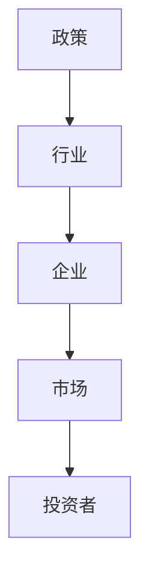
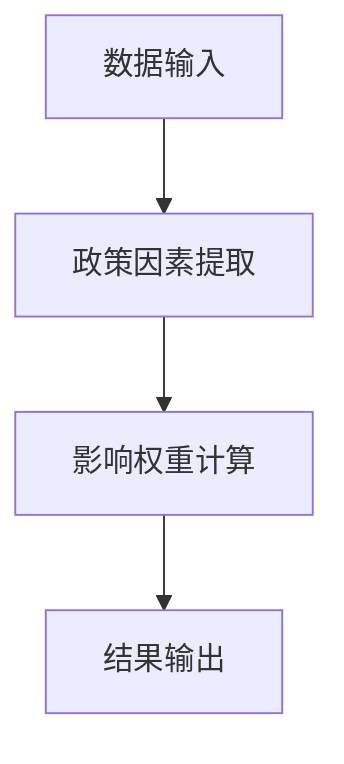
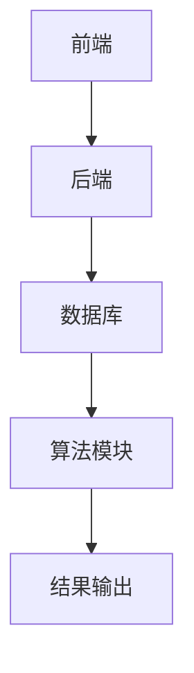
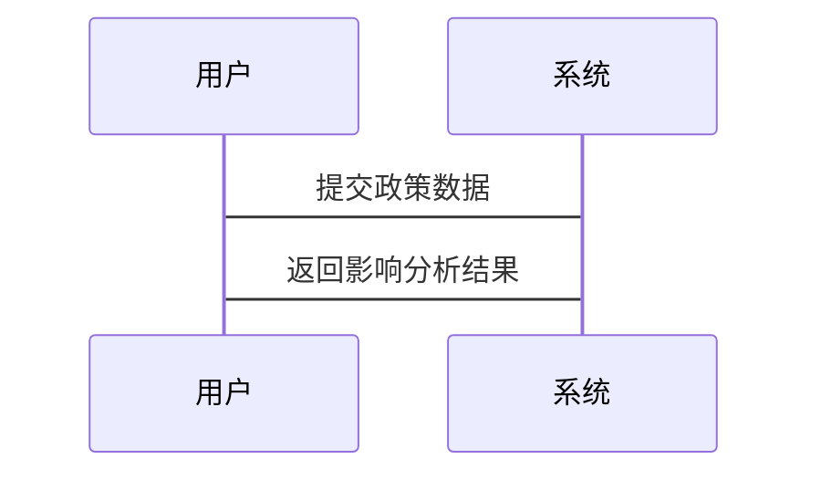

                 


# 价值投资中的政策影响分析

> 关键词：价值投资，政策影响，市场分析，投资策略，风险评估

> 摘要：  
价值投资是一种以基本面分析为核心的长期投资策略，其核心在于识别市场低估的投资标的。然而，在实际投资过程中，政策因素对市场和企业的影响不容忽视。本文从政策影响分析的基本概念出发，结合价值投资的逻辑，系统探讨政策因素如何影响投资决策。通过分析宏观经济政策、行业政策、区域政策等对市场和企业的影响机制，本文提出一套基于政策影响分析的投资策略框架，并通过具体案例和数学模型，为投资者提供实用的分析工具和方法。

---

## 第一部分：价值投资与政策影响分析基础

### 第1章：价值投资与政策影响分析概述

#### 1.1 价值投资的核心概念

##### 1.1.1 价值投资的定义与历史发展
价值投资是一种长期投资策略，强调通过对企业基本面的深入分析，寻找市场价格低于其内在价值的投资机会。该策略由本杰明·格雷厄姆和戴维·多德等人提出，强调安全边际和长期持有。

##### 1.1.2 政策影响分析的定义与作用
政策影响分析是指通过研究政府政策及其对经济、行业和企业的具体影响，评估政策变化对市场和投资标的的价值影响。政策因素包括宏观经济政策（如货币政策、财政政策）、行业政策（如行业准入、补贴政策）和区域政策（如区域发展规划）等。

##### 1.1.3 价值投资与政策影响分析的结合
价值投资的核心在于基本面分析，而政策因素是影响企业基本面的重要外部因素。将政策影响分析纳入价值投资框架，可以帮助投资者更全面地评估企业的长期价值。

---

#### 1.2 政策影响分析的背景与意义

##### 1.2.1 政策对经济和市场的影响
政策变化直接影响经济运行和市场环境。例如，货币政策会影响市场利率和企业融资成本，财政政策会影响政府支出和市场需求，行业政策会影响企业的竞争环境和盈利能力。

##### 1.2.2 价值投资中的政策敏感性
某些行业（如能源、金融、科技）对政策变化高度敏感。投资者需要识别政策变化对这些行业的影响，从而调整投资策略。

##### 1.2.3 政策影响分析的必要性
政策变化往往带来市场机会或风险。通过政策影响分析，投资者可以提前识别潜在风险和机会，优化投资组合。

---

#### 1.3 政策影响分析的框架与方法

##### 1.3.1 政策影响分析的基本框架
1. **政策识别**：识别可能影响市场的政策。
2. **政策分析**：分析政策的直接影响和间接影响。
3. **影响评估**：评估政策对企业和市场的长期影响。

##### 1.3.2 政策影响分析的主要方法
- **定量分析**：通过数学模型量化政策对市场和企业的影响。
- **定性分析**：通过专家访谈和案例分析评估政策影响。

##### 1.3.3 政策影响分析的步骤与流程
1. 确定分析目标。
2. 收集相关政策信息。
3. 分析政策对企业基本面的影响。
4. 评估政策对市场价格的影响。
5. 制定投资策略。

---

### 第2章：政策影响分析的核心概念与联系

#### 2.1 政策影响分析的核心原理

##### 2.1.1 政策的传导机制
政策通过影响市场环境、企业成本和市场需求，最终影响企业的盈利能力和市场价格。

##### 2.1.2 政策对行业和企业的具体影响
- 宏观政策（如货币政策）影响整体经济环境。
- 行业政策（如环保政策）影响行业竞争格局。
- 区域政策（如区域发展规划）影响区域经济发展。

##### 2.1.3 政策与市场预期的关系
政策变化会影响市场预期，进而影响市场价格。投资者需要关注政策变化与市场预期之间的互动关系。

---

#### 2.2 政策影响分析的属性特征对比

##### 2.2.1 宏观政策与微观政策的对比
| 属性 | 宏观政策 | 微观政策 |
|------|----------|----------|
| 对象 | 整体经济 | 特定行业或企业 |
| 影响范围 | 广泛 | 局部 |
| 制定主体 | 政府 | 政府或行业协会 |

##### 2.2.2 行业政策与区域政策的对比
| 属性 | 行业政策 | 区域政策 |
|------|----------|----------|
| 对象 | 特定行业 | 特定区域 |
| 影响范围 | 行业内部 | 区域经济 |
| 制定主体 | 政府或行业协会 | 政府 |

##### 2.2.3 短期政策与长期政策的对比
| 属性 | 短期政策 | 长期政策 |
|------|----------|----------|
| 时间跨度 | 短期 | 长期 |
| 影响深度 | 浅层 | 深层 |
| 制定目标 | 应急 | 发展 |

---

#### 2.3 政策影响分析的ER实体关系图



---

#### 2.4 本章小结
政策影响分析的核心在于理解政策的传导机制及其对市场和企业的影响。通过对比不同类型的政策，投资者可以更好地识别政策变化对投资标的的影响。

---

### 第3章：政策影响分析的算法原理

#### 3.1 政策影响分析的算法概述

##### 3.1.1 政策影响分析的主要算法
- **线性回归模型**：用于分析政策变量与其他变量之间的关系。
- **多元回归模型**：用于分析多个政策变量对市场或企业的影响。
- **时间序列分析**：用于分析政策变化对市场趋势的影响。

##### 3.1.2 政策影响分析的适用场景
- 当政策变化可能对市场或企业产生显著影响时。
- 当需要量化政策对市场或企业的影响时。

##### 3.1.3 政策影响分析的优缺点
- 优点：量化分析，可操作性强。
- 缺点：假设条件较多，模型复杂度高。

---

#### 3.2 政策影响分析的算法流程

##### 3.2.1 算法流程图


---

#### 3.3 政策影响分析的数学模型

##### 3.3.1 政策影响的线性回归模型
$$ y = \beta_0 + \beta_1x_1 + \beta_2x_2 + ... + \beta_nx_n + \epsilon $$

其中：
- \( y \) 表示市场指数或企业价值。
- \( x_i \) 表示政策变量。
- \( \beta_i \) 表示回归系数。
- \( \epsilon \) 表示误差项。

##### 3.3.2 政策影响的多因素模型
$$ y = \beta_0 + \beta_1x_1 + \beta_2x_2 + ... + \beta_nx_n + \epsilon $$

---

#### 3.4 本章小结
政策影响分析的算法流程包括数据输入、政策因素提取、影响权重计算和结果输出。通过线性回归模型和多因素模型，投资者可以量化政策对市场和企业的影响。

---

## 第四部分：系统分析与架构设计方案

### 第4章：价值投资中的政策影响分析系统设计

#### 4.1 系统功能设计

##### 4.1.1 领域模型


##### 4.1.2 系统架构设计


##### 4.1.3 系统接口设计
- 输入接口：政策数据、市场数据。
- 输出接口：影响分析结果、投资建议。

##### 4.1.4 系统交互设计


---

## 第五部分：项目实战

### 第5章：基于政策影响分析的价值投资策略实现

#### 5.1 项目环境与工具安装

##### 5.1.1 环境要求
- 操作系统：Windows/Mac/Linux。
- 开发工具：Python、Jupyter Notebook、Mermaid工具。

##### 5.1.2 安装必要的库
```bash
pip install numpy pandas scikit-learn matplotlib
```

---

#### 5.2 核心算法实现

##### 5.2.1 政策影响分析模型代码
```python
import numpy as np
import pandas as pd
from sklearn.linear_model import LinearRegression
from sklearn.metrics import r2_score

# 示例数据
data = pd.DataFrame({
    '政策变量': [0.1, 0.2, 0.3, 0.4, 0.5],
    '市场指数': [100, 105, 110, 115, 120]
})

# 模型训练
model = LinearRegression()
model.fit(data[['政策变量']], data['市场指数'])

# 模型预测
predictions = model.predict(data[['政策变量']])

# 模型评估
r2 = r2_score(data['市场指数'], predictions)
print(f"R²: {r2}")
```

##### 5.2.2 模型解释
- **政策变量**：表示政策变化的强度。
- **市场指数**：表示市场整体表现。
- **回归系数**：表示政策变化对市场指数的影响程度。

---

## 第六部分：最佳实践与总结

### 第6章：政策影响分析的实战经验与总结

#### 6.1 最佳实践

##### 6.1.1 数据来源的选择
- 使用可靠的政策数据源。
- 结合市场数据进行分析。

##### 6.1.2 模型验证
- 使用历史数据验证模型的有效性。
- 定期更新模型参数。

##### 6.1.3 风险管理
- 设定止损点。
- 分散投资组合。

---

#### 6.2 小结与展望

##### 6.2.1 本章小结
政策影响分析是价值投资的重要组成部分。通过系统化的分析和模型构建，投资者可以更好地识别政策风险和机会。

##### 6.2.2 未来展望
未来，随着人工智能和大数据技术的发展，政策影响分析将更加精准和实时化。投资者需要不断提升自己的技术能力和市场敏感性，以应对复杂的市场环境。

---

## 作者

作者：AI天才研究院/AI Genius Institute & 禅与计算机程序设计艺术 /Zen And The Art of Computer Programming

---

本文通过系统地分析政策影响分析的理论与实践，为投资者提供了实用的工具和方法。希望读者能够结合实际市场情况，灵活运用这些方法，提升投资决策的科学性和准确性。

