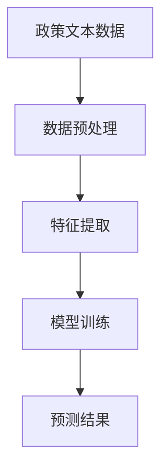
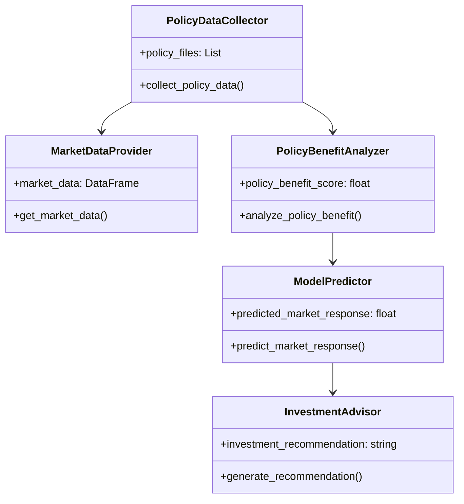
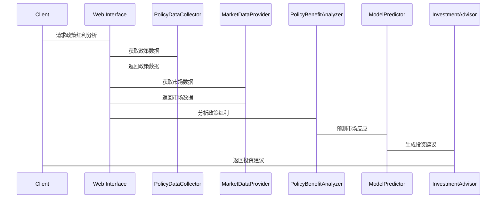

                 


# 价值投资中的政策红利捕捉

> 关键词：价值投资，政策红利，市场机会，投资策略，政策分析，量化模型，投资风险

> 摘要：本文详细探讨了在价值投资中如何有效捕捉政策红利，通过系统化的分析和建模，揭示政策红利对投资决策的影响，并提供实战案例和策略建议。

---

# 第一部分：价值投资中的政策红利背景与概念

## 第1章：价值投资与政策红利概述

### 1.1 价值投资的基本概念
- **1.1.1 价值投资的定义**
  - 价值投资是一种以低于内在价值的价格购买优质资产的投资策略。
  - 核心理念是寻找市场低估的公司，长期持有，等待价值回归。
  
- **1.1.2 价值投资的核心理念**
  - 独特的企业价值：寻找具有竞争优势、良好管理和持续盈利能力的企业。
  - 安全边际：买入价格低于内在价值，以降低投资风险。
  - 长期持有：耐心等待市场对企业的合理估值。

- **1.1.3 价值投资与政策的关系**
  - 政策环境直接影响市场：财政政策、货币政策、行业政策等都会对市场产生重大影响。
  - 政策红利为价值投资者提供机会：政策支持的行业往往具有更高的增长潜力。

### 1.2 政策红利的定义与特征
- **1.2.1 政策红利的定义**
  - 政策红利是指由于政策支持（如行业补贴、税收优惠、放松监管等）带来的市场机会或资产增值。
  - 政策红利通常集中在特定行业或领域，具有较强的周期性和区域性。

- **1.2.2 政策红利的主要特征**
  - **行业集中性**：政策红利通常集中在政府重点支持的行业（如新能源、科技、医疗等）。
  - **时间窗口**：政策红利往往具有一定的时效性，需及时捕捉。
  - **可量化性**：政策红利可以通过政策力度、市场反应等指标进行量化评估。

- **1.2.3 政策红利的来源与分类**
  - **来源**：财政政策（补贴、税收优惠）、货币政策（降息、宽松流动性）、行业政策（准入放宽、牌照发放）。
  - **分类**：短期红利（如刺激经济的临时政策）、长期红利（如科技行业的持续政策支持）。

### 1.3 价值投资中的政策红利捕捉
- **1.3.1 政策红利在价值投资中的重要性**
  - 政策红利可以帮助投资者发现被低估的行业和企业。
  - 政策支持的行业往往具有较高的成长性和抗风险能力。

- **1.3.2 政策红利与市场机会的关系**
  - 政策红利通常伴随着市场机会，但并非所有政策红利都会转化为市场收益。
  - 投资者需结合市场环境、企业基本面等因素，判断政策红利的可持续性和潜在收益。

- **1.3.3 政策红利捕捉的核心逻辑**
  - 通过政策分析，识别具有持续政策支持的行业。
  - 结合企业基本面，选择具有竞争优势的公司。
  - 在政策红利窗口期，合理配置资产，降低投资风险。

---

## 第2章：政策红利的核心概念与联系

### 2.1 政策红利的核心概念
- **2.1.1 政策红利的构成要素**
  - **政策力度**：政策的强度直接影响红利的大小。
  - **政策覆盖范围**：政策影响的行业和区域。
  - **政策执行时间**：政策的实施周期和效果显现的时间。

- **2.1.2 政策红利的传导机制**
  - 政策出台 → 市场预期变化 → 行业竞争格局调整 → 企业盈利提升 → 资产价格波动。
  - 例如，新能源行业的补贴政策可能直接提升相关企业的盈利能力，进而推动股价上涨。

- **2.1.3 政策红利的量化指标**
  - 行业政策支持力度：通过政策文件数量、财政补贴规模等指标量化。
  - 市场反应：通过股价涨幅、成交量变化等指标衡量政策红利的市场影响。

### 2.2 政策红利与市场周期的关系
- **2.2.1 政策红利在经济周期中的表现**
  - 经济衰退期：政府通常会出台刺激政策，释放政策红利，提振市场信心。
  - 经济繁荣期：政策红利可能转向调控市场，防止过热。

- **2.2.2 政策红利对市场情绪的影响**
  - 正面政策红利：提升市场情绪，推动股价上涨。
  - 负面政策红利：打压市场情绪，导致股价下跌。

- **2.2.3 政策红利与行业周期的结合**
  - 行业周期与政策周期的叠加效应：政策红利可能加速行业周期变化。
  - 例如，环保政策的加强可能推动环保行业进入成长期。

### 2.3 政策红利与行业选择的联系
- **2.3.1 行业选择的基本原则**
  - 行业的政策支持力度：选择具有持续政策支持的行业。
  - 行业的成长空间：政策红利较大的行业通常具有较大的成长空间。
  - 行业的风险特征：政策红利较大的行业可能伴随着较高的政策风险。

- **2.3.2 政策红利对行业选择的影响**
  - 政策支持的行业通常具有较高的投资价值。
  - 例如，政府支持的科技创新行业可能具有较高的增长潜力。

- **2.3.3 行业政策红利的评估方法**
  - 行业政策分析：通过政策文件、行业报告等评估行业政策支持力度。
  - 市场反应分析：通过股价、成交量等指标衡量政策红利的市场影响。

---

## 第3章：政策红利捕捉的算法原理

### 3.1 政策红利捕捉的量化方法
- **3.1.1 政策红利的量化指标设计**
  - **政策支持力度指数**：综合评估政策文件数量、财政补贴规模、政策执行力度等因素。
  - **市场反应指数**：通过股价涨幅、成交量变化等指标衡量市场对政策的反应。

- **3.1.2 数据预处理与特征提取**
  - 数据来源：政府政策文件、行业报告、市场数据（股价、成交量等）。
  - 数据清洗：去除异常值、填充缺失值。
  - 特征提取：提取与政策红利相关的特征（如政策文件发布时间、政策执行时间等）。

- **3.1.3 模型训练与优化**
  - 模型选择：使用回归模型、时间序列模型等。
  - 模型训练：通过历史数据训练模型，预测政策红利对市场的影响。
  - 模型优化：通过调整参数、交叉验证等方法优化模型性能。

### 3.2 政策红利捕捉的数学模型
- **3.2.1 模型假设与变量定义**
  - 假设：政策红利对市场的影响是线性的。
  - 变量：政策红利指数、市场反应指数、行业特征等。

- **3.2.2 模型构建与公式推导**
  - 回归模型：
    $$ y = \beta_0 + \beta_1 x_1 + \beta_2 x_2 + \epsilon $$
    其中，$y$ 是市场反应指数，$x_1$ 是政策红利指数，$x_2$ 是行业特征，$\epsilon$ 是误差项。

- **3.2.3 模型验证与评估**
  - 通过历史数据验证模型预测能力。
  - 使用均方误差（MSE）、R²等指标评估模型性能。

### 3.3 政策红利捕捉的算法实现
- **3.3.1 算法流程图（使用 mermaid）**


- **3.3.2 核心代码实现**
```python
import pandas as pd
import numpy as np
from sklearn.linear_model import LinearRegression
from sklearn.metrics import mean_squared_error, r2_score

# 数据预处理
data = pd.read_csv('policy_data.csv')
data = data.dropna()
data['policy_benefit'] = data['policy_benefit'].astype(float)

# 特征提取
X = data[['policy_support', 'industry_growth']]
y = data['market_response']

# 模型训练
model = LinearRegression()
model.fit(X, y)

# 模型预测
y_pred = model.predict(X)

# 模型评估
mse = mean_squared_error(y, y_pred)
r2 = r2_score(y, y_pred)
print(f'MSE: {mse}, R²: {r2}')
```

---

## 第4章：政策红利捕捉的系统分析与架构设计

### 4.1 系统分析
- **问题场景介绍**
  - 如何构建一个实时捕捉政策红利的系统？
  - 系统需求：实时监控政策变化、量化政策红利、预测市场反应。

- **项目介绍**
  - 项目目标：构建一个基于政策分析的投资决策支持系统。
  - 项目范围：涵盖政策数据收集、量化分析、模型预测等功能。

### 4.2 系统功能设计（领域模型 mermaid 类图）


### 4.3 系统架构设计（mermaid 架构图）


### 4.4 系统接口设计
- **输入接口**
  - 政策数据接口：接收政策文件、政策解读等数据。
  - 市场数据接口：接收股价、成交量等市场数据。
  
- **输出接口**
  - 政策红利指数接口：输出量化政策红利指数。
  - 投资建议接口：输出基于模型预测的投资建议。

### 4.5 系统交互（mermaid 序列图）


---

## 第5章：政策红利捕捉的项目实战

### 5.1 环境安装
- **依赖安装**
  ```bash
  pip install pandas numpy scikit-learn
  ```

### 5.2 核心代码实现
- **数据加载与预处理**
```python
import pandas as pd
import numpy as np

data = pd.read_csv('policy_data.csv')
data = data.dropna()
```

- **特征提取与模型训练**
```python
from sklearn.linear_model import LinearRegression

X = data[['policy_support', 'industry_growth']]
y = data['market_response']

model = LinearRegression()
model.fit(X, y)
```

- **模型预测与评估**
```python
y_pred = model.predict(X)
mse = np.mean((y - y_pred) ** 2)
r2 = model.score(X, y)
print(f'MSE: {mse}, R²: {r2}')
```

### 5.3 案例分析
- **案例背景**
  - 行业：新能源行业。
  - 政策：政府出台新能源补贴政策。

- **数据准备**
  - 政策支持指数：0.8（高）
  - 行业增长率：15%（高）

- **模型预测**
  - 预测市场反应指数：0.95（正面）

### 5.4 项目小结
- **项目总结**
  - 成功构建了一个基于政策分析的投资决策支持系统。
  - 系统能够实时捕捉政策红利，提供投资建议。

---

## 第6章：最佳实践与小结

### 6.1 最佳实践 tips
- **政策分析**：密切关注政府政策变化，尤其是行业政策。
- **数据质量**：确保数据的准确性和完整性。
- **模型优化**：根据市场变化不断优化模型。

### 6.2 小结
- 本文详细探讨了价值投资中政策红利的捕捉方法，从理论到实践进行了系统化的分析。
- 通过量化分析和模型构建，帮助投资者更好地识别政策红利带来的市场机会。

### 6.3 注意事项
- 政策红利具有一定的不确定性，需结合市场环境和企业基本面进行综合判断。
- 投资者需具备一定的政策分析能力和风险管理能力。

### 6.4 拓展阅读
- 建议阅读《投资学基础》、《政策分析与评估》等相关书籍，深入理解政策对市场的影响。

---

# 作者：AI天才研究院/AI Genius Institute & 禅与计算机程序设计艺术 /Zen And The Art of Computer Programming

