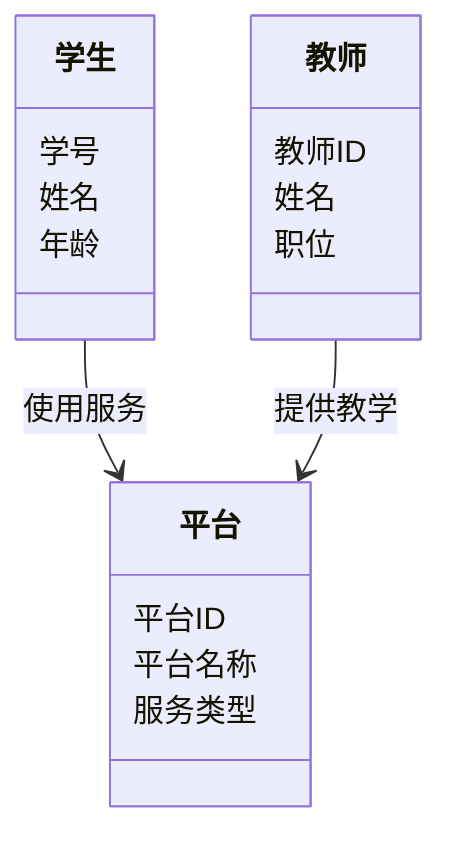

                 


# 价值投资中的教育科技趋势分析

## 关键词：价值投资，教育科技，人工智能，大数据，投资趋势，教育模式创新

## 摘要：  
随着技术的快速发展，教育科技正在成为投资领域的新兴热点。本文从价值投资的角度，深入分析教育科技领域的趋势，探讨技术驱动下的教育模式创新、投资逻辑、行业痛点及未来发展方向。通过结合实际案例和数据分析，为投资者提供具有参考价值的见解。

---

# 第一部分: 价值投资中的教育科技背景与概念

## 第1章: 教育科技的定义与现状

### 1.1 教育科技的核心概念
#### 1.1.1 教育科技的定义与内涵
教育科技（EdTech）是指将技术应用于教育领域，通过创新的工具、平台和方法，优化教学过程、提升学习效果、降低教育成本的新兴行业。其核心在于利用技术解决传统教育中的痛点，例如教育资源分配不均、学习效率低下等问题。

#### 1.1.2 教育科技的发展历程
- **萌芽阶段**：20世纪末，互联网技术的应用推动了在线教育的初步发展。
- **快速发展阶段**：2010年后，移动互联网、人工智能和大数据技术的普及，使得教育科技进入快速发展期。
- **智能化阶段**：当前，AI和大数据技术的应用使得教育科技更加个性化和精准化。

#### 1.1.3 教育科技与价值投资的关系
教育科技行业的快速发展为投资者提供了丰富的投资机会。投资者通过分析技术、市场、用户需求等因素，可以找到具有长期增长潜力的企业进行投资。

---

### 1.2 教育科技的市场现状
#### 1.2.1 全球教育科技市场分析
- **市场规模**：根据市场研究机构的数据，全球教育科技市场的规模预计将在未来几年内以年均15%的速度增长。
- **区域分布**：北美和欧洲市场占据较大份额，但亚洲市场（尤其是中国）增长最为迅速。

#### 1.2.2 中国教育科技市场的特点
- **政策支持**：中国政府近年来大力支持教育科技的发展，推出了一系列政策鼓励技术创新和行业整合。
- **市场竞争**：行业内竞争激烈，头部企业如猿辅导、作业帮等占据了较大的市场份额。
- **融资情况**：教育科技企业吸引了大量的风险投资，尤其是在K-12教育和职业教育领域。

#### 1.2.3 教育科技企业的融资情况
- **融资轮次**：从天使轮到后期轮融资，教育科技企业的融资轮次逐渐增加。
- **投资机构**：主要投资机构包括红杉资本、IDG资本、高盛等。

---

### 1.3 教育科技的技术驱动因素
#### 1.3.1 人工智能在教育中的应用
- **智能推荐**：通过AI算法为学生提供个性化学习内容。
- **自然语言处理**：用于智能问答系统和作业批改。

#### 1.3.2 大数据技术对教育的影响
- **学习行为分析**：通过分析学生的学习数据，优化教学策略。
- **教育资源分配**：大数据技术帮助实现教育资源的均衡分配。

#### 1.3.3 区块链技术的潜在应用
- **学历认证**：利用区块链技术实现学历认证的去中心化，防止造假。
- **智能合约**：用于自动化的学费支付和课程购买。

---

### 1.4 价值投资视角下的教育科技趋势
#### 1.4.1 教育科技行业的投资逻辑
- **技术壁垒**：重点关注具有核心技术优势的企业。
- **市场潜力**：选择市场规模大、增长迅速的细分领域。
- **用户粘性**：考察企业的用户留存率和复购率。

#### 1.4.2 行业痛点与投资机会
- **痛点**：教育资源分配不均、教学效率低、学生个性化需求未被满足。
- **机会**：人工智能、大数据技术的应用为解决上述痛点提供了可能。

#### 1.4.3 未来教育科技的趋势预测
- **智能化教育**：AI技术将进一步普及，推动教育的智能化发展。
- **终身学习**：随着知识更新速度的加快，终身学习将成为趋势。
- **教育普惠**：技术的普及将推动教育资源的均衡分配。

---

## 第2章: 教育科技的核心概念与联系

### 2.1 教育科技的核心要素
#### 2.1.1 教育科技的参与者
- **学生**：学习者，使用教育科技产品和服务。
- **教师**：教育者，利用技术工具提升教学效果。
- **投资者**：资金提供者，通过投资教育科技企业获利。
- **平台**：技术提供者，搭建教育科技的基础设施。

#### 2.1.2 教育科技的商业模式
- **订阅模式**：用户按月或按年支付费用，使用平台服务。
- **广告模式**：通过平台吸引流量，进行广告投放。
- **增值服务模式**：提供额外的课程或资源，作为增值服务。

#### 2.1.3 教育科技的技术架构
- **前端**：用户界面，包括网页和移动端应用。
- **后端**：数据处理和存储，包括服务器和数据库。
- **AI引擎**：用于智能推荐和数据分析。

---

### 2.2 教育科技的核心概念对比
#### 2.2.1 不同教育科技模式的对比
| 模式       | 优点                           | 缺点                           |
|------------|--------------------------------|--------------------------------|
| 在线教育   | 灵活便捷，覆盖范围广           | 学生自律性要求高               |
| 线下教育   | 互动性强，学习效果好           | 覆盖范围有限                   |
| AI辅助教育 | 个性化强，效率高               | 技术门槛高                     |

#### 2.2.2 教育科技与传统教育的对比
- **教学方式**：传统教育以教师为主体，教育科技以学生为主体。
- **学习效果**：传统教育注重知识传授，教育科技注重能力培养。

#### 2.2.3 教育科技与投资回报的关系
- **高增长**：教育科技行业的快速增长为投资者提供了丰厚的回报。
- **高风险**：行业竞争激烈，企业倒闭率较高。

---

### 2.3 教育科技的ER实体关系图
```mermaid
erDiagram
    actor 学生 {
        key string 学号
        string 姓名
        string 年龄
    }
    actor 教师 {
        key string 教师ID
        string 姓名
        string 职位
    }
    actor 投资者 {
        key string 投资者ID
        string 姓名
        string 资金规模
    }
    actor 平台 {
        key string 平台ID
        string 平台名称
        string 服务类型
    }
    student ->平台: 使用平台服务
    教师 ->平台: 提供教学服务
```

---

## 第3章: 教育科技的算法原理与实现

### 3.1 教育科技的核心算法
#### 3.1.1 智能推荐算法
- **算法原理**：基于协同过滤和内容推荐，为学生推荐适合的学习内容。
- **实现步骤**：
  1. 收集学生的学习数据。
  2. 分析学生的兴趣和能力水平。
  3. 推荐个性化学习内容。

#### 3.1.2 学习效果预测算法
- **算法原理**：通过分析学生的学习数据，预测其未来的学习效果。
- **实现步骤**：
  1. 收集学生的历史学习数据。
  2. 建立预测模型。
  3. 预测学生的学习效果。

---

### 3.2 教育科技的算法实现
#### 3.2.1 智能推荐算法的Python实现
```python
import pandas as pd
from sklearn.metrics.pairwise import cosine_similarity

# 数据加载
df = pd.read_csv('student_data.csv')

# 计算相似性矩阵
similarity_matrix = cosine_similarity(df.embedding.values.reshape(-1, 1))

# 根据相似性推荐学习内容
def get_recommendations(student_id, similarity_matrix):
    idx = df[df['student_id'] == student_id].index[0]
    similarities = similarity_matrix[idx]
    recommendations = df[['content_id', 'similarity']].sort_values(by='similarity', ascending=False)
    return recommendations.head(5)
```

#### 3.2.2 学习效果预测算法的数学模型
- **模型公式**：
  $$ \text{预测效果} = \alpha \cdot \text{学习时间} + \beta \cdot \text{互动次数} + \gamma \cdot \text{测试成绩} $$
  其中，$\alpha$, $\beta$, $\gamma$ 是模型参数。

---

## 第4章: 教育科技的系统分析与架构设计

### 4.1 系统分析
#### 4.1.1 问题场景介绍
- **目标**：设计一个智能教育平台，为学生提供个性化学习方案。
- **用户需求**：
  - 学生：获取个性化学习内容。
  - 教师：了解学生学习情况。
  - 投资者：获取投资回报。

#### 4.1.2 项目介绍
- **项目名称**：智能教育平台。
- **项目目标**：通过AI技术优化教学过程。

---

### 4.2 系统功能设计
#### 4.2.1 领域模型（Mermaid类图）


#### 4.2.2 系统架构设计（Mermaid架构图）


---

## 第5章: 项目实战

### 5.1 项目背景与目标
- **项目名称**：在线教育平台。
- **目标**：通过AI技术优化教学过程。

### 5.2 项目实施
#### 5.2.1 环境安装
- **工具**：Python、Jupyter Notebook、TensorFlow。

#### 5.2.2 核心代码实现
```python
import tensorflow as tf
from tensorflow.keras import layers

# 模型定义
model = tf.keras.Sequential([
    layers.Dense(64, activation='relu'),
    layers.Dense(1, activation='sigmoid')
])

# 编译模型
model.compile(optimizer='adam', loss='binary_crossentropy', metrics=['accuracy'])

# 训练模型
model.fit(X_train, y_train, epochs=10, batch_size=32)
```

#### 5.2.3 代码应用解读与分析
- **模型训练**：通过训练数据优化模型参数。
- **模型预测**：使用训练好的模型进行学习效果预测。

### 5.3 实际案例分析
- **案例分析**：某在线教育平台的投资回报率分析。
- **数据展示**：使用图表展示用户增长、收入情况等。

---

## 第6章: 总结与展望

### 6.1 本章小结
- **总结**：教育科技行业的快速发展为投资者提供了丰富的投资机会。
- **展望**：未来，随着技术的进一步发展，教育科技行业将更加智能化和个性化。

### 6.2 最佳实践 tips
- **投资建议**：选择具有核心技术优势和良好市场前景的企业进行投资。
- **技术建议**：关注人工智能和大数据技术在教育领域的应用。

### 6.3 注意事项
- **风险提示**：教育科技行业竞争激烈，投资需谨慎。

### 6.4 拓展阅读
- **推荐书籍**：《教育科技的投资逻辑》。
- **推荐网站**：行业研究报告和数据分析平台。

---

## 作者：AI天才研究院/AI Genius Institute & 禅与计算机程序设计艺术/Zen And The Art of Computer Programming

---

通过以上思考，我们可以看到，教育科技行业的价值投资机会是巨大的，但同时也需要投资者具备敏锐的洞察力和专业的知识。希望本文能够为读者提供有价值的见解和指导。

