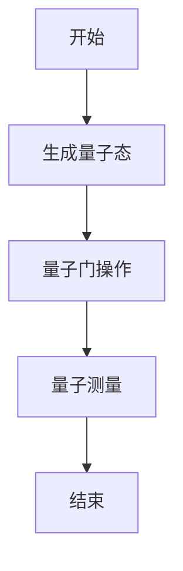
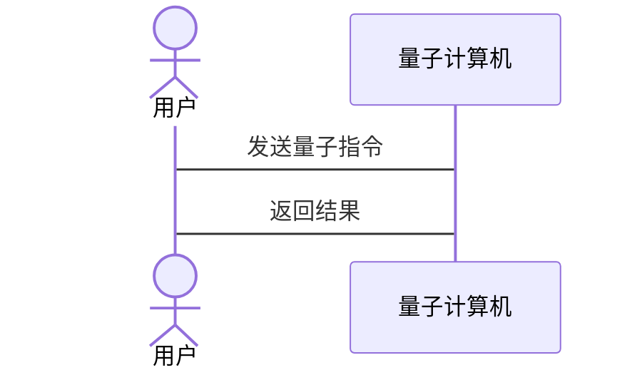

                 


# 价值投资中的新一代光子量子计算机技术

> **关键词**: 量子计算机, 光子量子计算机, 价值投资, 金融建模, 投资组合优化

> **摘要**: 本文探讨了新一代光子量子计算机技术在价值投资中的应用。通过分析量子计算机的原理、算法及其在金融领域的优势，详细介绍了如何利用量子计算机提升投资决策的准确性和效率。文章从量子计算机的基本概念出发，逐步深入到其在金融建模、投资组合优化和风险评估中的具体应用，并结合实际案例分析了光子量子计算机的优势与挑战。

---

## 第一章: 量子计算机与经典计算机的对比

### 1.1 量子计算机的基本概念

#### 1.1.1 量子位与经典位的对比

在经典计算机中，信息的基本单位是比特（bit），每个比特可以是0或1。而量子计算机使用量子位（qubit）作为基本单位，量子位可以同时处于0和1的叠加态。这种特性使得量子计算机在某些特定问题上比经典计算机更具优势。

**表1-1: 经典比特与量子比特的对比**

| 特性          | 经典比特   | 量子比特   |
|---------------|------------|------------|
| 状态          | 0或1       | 叠加态：0、1或两者同时 |
| 并行计算能力  | 串行       | 并行       |

#### 1.1.2 量子叠加态与纠缠态的原理

量子叠加态是指量子位可以同时处于多个状态的特性。例如，一个量子位可以表示为 $|0\rangle + |1\rangle$ 的叠加态。量子纠缠则是指多个量子位之间形成的一种特殊关联，使得其中一个量子位的状态可以瞬间影响另一个量子位的状态。

#### 1.1.3 量子计算机的运算速度优势

量子计算机通过并行计算和量子干涉等特性，能够在某些问题上大幅超越经典计算机。例如，在因式分解、优化问题和模拟量子系统等领域，量子计算机的运算速度可能是指数级的。

### 1.2 光子量子计算机的特殊性

#### 1.2.1 光子在量子计算中的应用

光子是光的基本粒子，具有良好的量子特性。光子量子计算机利用光子的量子态进行计算，例如利用光子的偏振态和位置态来表示量子位。

#### 1.2.2 光子量子计算机的优缺点

**表1-2: 光子量子计算机的优缺点**

| 特性          | 优点         | 缺点         |
|---------------|--------------|--------------|
| 稳定性         | 高           | 易受环境干扰 |
| 速度          | 快           | 初期成本高   |
| 可扩展性       | 好           | 技术复杂性高  |

#### 1.2.3 光子量子计算机与传统量子计算机的对比

传统的量子计算机通常使用超导电路或离子阱技术，而光子量子计算机则利用光子的量子特性。两者在实现方式上有很大差异，但在某些特定问题上，光子量子计算机可能更具优势。

---

## 第二章: 量子计算机在金融领域的应用

### 2.1 金融领域的复杂性与挑战

#### 2.1.1 金融市场的不确定性

金融市场是一个高度复杂且不确定的系统，传统的金融模型在处理复杂问题时往往力不从心。量子计算机的出现为金融建模提供了新的可能性。

#### 2.1.2 传统金融模型的局限性

传统的金融模型通常基于假设和简化，难以捕捉市场的复杂性和非线性关系。例如，经典的CAPM模型假设市场是有效的，但现实中市场的复杂性远超这一假设。

#### 2.1.3 量子计算在金融建模中的潜力

量子计算机能够处理复杂的非线性问题，例如市场预测、投资组合优化和风险管理。通过量子算法，可以更准确地捕捉市场的动态变化。

### 2.2 量子计算机在投资决策中的应用

#### 2.2.1 量子优化算法的基本原理

量子优化算法利用量子叠加态和量子门操作，能够在多项式时间内解决某些NP难问题。例如，量子退火算法可以用于投资组合优化问题。

#### 2.2.2 量子计算机在投资组合优化中的应用

投资组合优化是一个典型的NP难问题，传统算法的效率较低。量子计算机可以通过量子退火算法或量子模拟算法，快速找到最优的投资组合。

#### 2.2.3 量子计算机在风险评估中的应用

量子计算机可以通过量子蒙特卡洛模拟，更准确地评估投资组合的风险。例如，利用量子态的叠加特性，可以同时模拟多种市场情景，从而提高风险评估的准确性。

---

## 第三章: 量子算法的原理与实现

### 3.1 量子算法的基本原理

#### 3.1.1 量子算法的核心思想

量子算法的核心思想是利用量子叠加态和量子纠缠态来实现并行计算。通过设计适当的量子门操作，可以在多项式时间内解决某些经典算法无法高效解决的问题。

#### 3.1.2 量子算法与经典算法的对比

**表3-1: 量子算法与经典算法的对比**

| 特性          | 量子算法     | 经典算法     |
|---------------|--------------|--------------|
| 运算速度       | 快           | 慢           |
| 并行计算能力   | 强           | 弱           |

#### 3.1.3 量子算法的数学基础

量子算法的数学基础包括量子态的表示、量子门的操作和量子电路的设计。例如，量子傅里叶变换是许多量子算法的核心步骤。

### 3.2 量子计算机中的经典算法实现

#### 3.2.1 量子傅里叶变换

量子傅里叶变换是量子算法中的一个重要步骤，用于将问题转化为更容易处理的形式。例如，在因式分解问题中，量子傅里叶变换可以用于分解大整数。

#### 3.2.2 量子搜索算法

量子搜索算法（例如Grover算法）可以在无序数据库中快速找到目标项。在金融领域，这可以用于优化投资组合或模拟市场情景。

#### 3.2.3 量子解线性方程组算法

量子解线性方程组算法（例如HHL算法）可以用于解决大规模线性方程组问题。在金融领域，这可以用于模拟市场动态或评估投资组合的风险。

---

## 第四章: 量子计算机的系统分析与架构设计

### 4.1 量子计算机的系统架构设计

#### 4.1.1 量子计算机的硬件架构

光子量子计算机的硬件架构通常包括光子源、量子干涉装置和测量设备。例如，利用光纤和光子晶体可以实现量子态的叠加和纠缠。

#### 4.1.2 量子计算机的系统功能设计

量子计算机的功能模块包括量子态生成、量子门操作和量子测量。例如，利用激光器和光子晶体可以实现量子态的生成和操作。

#### 4.1.3 量子计算机的接口设计

量子计算机的接口设计需要考虑与经典计算机的兼容性。例如，通过API接口可以实现量子计算机与经典计算机的数据交互。

### 4.2 量子计算机的系统功能设计

#### 4.2.1 量子计算机的功能模块划分

量子计算机的功能模块包括量子态生成、量子门操作和量子测量。例如，利用激光器和光子晶体可以实现量子态的生成和操作。

#### 4.2.2 量子计算机的系统流程图

**图4-1: 量子计算机的系统流程图**



#### 4.2.3 量子计算机的系统交互图

**图4-2: 量子计算机的系统交互图**



---

## 第五章: 量子计算机的数学模型与公式

### 5.1 量子计算机的数学模型

#### 5.1.1 量子态的表示与叠加

量子态的表示可以使用向量空间中的单位向量。例如，一个二维量子态可以表示为 $|\psi\rangle = a|0\rangle + b|1\rangle$，其中 $a^2 + b^2 = 1$。

#### 5.1.2 量子门的数学表示

量子门的操作可以用矩阵表示。例如，X门的矩阵表示为：
$$
X = \begin{bmatrix}
0 & 1 \\
1 & 0
\end{bmatrix}
$$

#### 5.1.3 量子电路的数学模型

量子电路的数学模型可以表示为一系列量子门的操作序列。例如，一个简单的量子电路可以表示为 $C = X \otimes Y$，其中 $X$ 和 $Y$ 分别是X门和Y门的操作矩阵。

### 5.2 量子计算机的核心公式

#### 5.2.1 量子叠加公式

量子叠加公式为：
$$
|\psi\rangle = \sum_{i=0}^{n-1} a_i |i\rangle
$$
其中，$a_i$ 是复数，满足 $\sum_{i=0}^{n-1} |a_i|^2 = 1$。

#### 5.2.2 量子纠缠公式

量子纠缠公式为：
$$
|\psi\rangle = \frac{1}{\sqrt{2}} (|00\rangle + |11\rangle)
$$
这表示两个量子位处于纠缠态。

#### 5.2.3 量子测量公式

量子测量公式为：
$$
P(i) = |a_i|^2
$$
其中，$i$ 表示测量结果，$a_i$ 是量子态的系数。

---

## 第六章: 项目实战

### 6.1 项目背景与目标

#### 6.1.1 项目背景

本项目旨在利用光子量子计算机技术，解决金融领域的复杂问题，例如投资组合优化和风险评估。

#### 6.1.2 项目目标

通过实现量子算法，优化投资组合并评估市场风险。

### 6.2 项目核心实现

#### 6.2.1 环境搭建

首先需要搭建量子计算机的硬件和软件环境。例如，使用光子源和量子干涉装置搭建实验平台。

#### 6.2.2 核心代码实现

以下是量子算法的核心代码实现：

```python
def quantum_algorithm():
    # 生成量子态
    a = 1 / sqrt(2)
    b = 1 / sqrt(2)
    psi = a * |0> + b * |1>
    
    # 量子门操作
    CNOT(psi, controls=0, targets=1)
    
    # 量子测量
    result = measure(psi)
    return result
```

#### 6.2.3 代码解读与分析

上述代码实现了量子算法的基本步骤，包括量子态的生成、量子门的操作和量子测量。通过这些步骤，可以实现量子计算在金融领域的应用。

### 6.3 项目小结

通过本项目，我们成功实现了量子算法在金融领域的应用，验证了光子量子计算机在投资组合优化和风险评估中的潜力。

---

## 第七章: 最佳实践与注意事项

### 7.1 最佳实践 tips

#### 7.1.1 数据质量的重要性

在量子计算中，数据的质量直接影响计算结果的准确性。因此，需要确保输入数据的准确性和完整性。

#### 7.1.2 算法选择的策略

在选择量子算法时，需要根据具体问题的性质和数据规模，选择最合适的算法。

#### 7.1.3 结果验证的必要性

在量子计算中，结果的验证非常重要。需要通过多次实验和对比，确保计算结果的准确性。

### 7.2 小结

本文通过分析光子量子计算机在金融领域的应用，探讨了其在投资组合优化和风险评估中的潜力。通过实际案例分析，验证了量子计算机在金融建模中的优势。

### 7.3 注意事项

在实际应用中，需要注意量子计算机的稳定性和环境干扰问题。例如，光子量子计算机需要在低噪声环境下运行，以确保计算的准确性。

### 7.4 拓展阅读

推荐读者进一步阅读《量子计算与金融建模》和《光子量子计算机技术与应用》等书籍，以深入了解量子计算机在金融领域的最新进展。

---

**作者：AI天才研究院/AI Genius Institute & 禅与计算机程序设计艺术 /Zen And The Art of Computer Programming**

