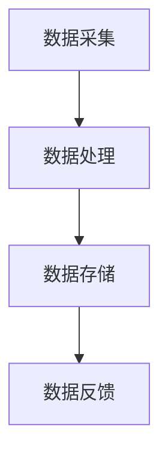
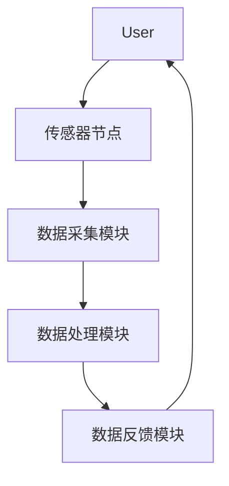

                 


# 价值投资中的新一代柔性传感器技术前景

---

## 关键词：  
柔性传感器，价值投资，传感器技术，市场前景，投资分析

---

## 摘要：  
本文深入探讨了柔性传感器技术的定义、核心原理、系统架构、应用场景及其在价值投资中的潜力。通过分析柔性传感器技术的市场现状、技术优势以及未来发展趋势，本文旨在为投资者提供关于柔性传感器技术的详细洞察，帮助他们做出更明智的投资决策。

---

## 第一部分：背景介绍

### 第1章：柔性传感器技术的定义与背景

#### 1.1 柔性传感器技术的定义
- **1.1.1 柔性传感器的基本概念**  
  柔性传感器是一种基于柔性材料制成的传感器，能够适应弯曲、拉伸等变形，适用于复杂环境下的数据采集。

- **1.1.2 柔性传感器与传统传感器的区别**  
  | 属性         | 柔性传感器           | 传统传感器         |
  |--------------|----------------------|--------------------|
  | 结构         | 基于柔性材料         | 基于刚性材料       |
  | 应用场景     | 适用于弯曲、拉伸环境 | 适用于静态环境     |
  | 灵敏度       | 高                  | 较低               |

- **1.1.3 柔性传感器的核心应用场景**  
  - 医疗健康：如智能绷带、可穿戴设备。  
  - 智能家居：如柔性压力传感器。  
  - 工业自动化：如柔性机器人触觉系统。

#### 1.2 柔性传感器技术的发展历程
- **1.2.1 传感器技术的历史演变**  
  从机械传感器到电子传感器，再到柔性传感器，传感器技术经历了多次迭代。

- **1.2.2 柔性传感器技术的兴起与现状**  
  随着材料科学的进步，柔性传感器技术在近年来迅速发展，广泛应用于多个领域。

- **1.2.3 柔性传感器技术的未来趋势**  
  高灵敏度、低功耗、长寿命将是未来柔性传感器技术发展的主要方向。

#### 1.3 柔性传感器技术的市场现状
- **1.3.1 全球传感器市场的规模与结构**  
  全球传感器市场规模超过百亿美元，其中柔性传感器市场占比逐年增长。

- **1.3.2 柔性传感器技术在各行业的应用情况**  
  - 医疗：智能绷带、可穿戴设备。  
  - 智能家居：柔性压力传感器。  
  - 工业：柔性机器人触觉系统。  

- **1.3.3 柔性传感器技术的市场潜力与挑战**  
  市场潜力巨大，但技术门槛高、成本控制是主要挑战。

#### 1.4 柔性传感器技术与价值投资的结合
- **1.4.1 传感器技术在投资中的潜在价值**  
  柔性传感器技术的应用广泛，市场前景广阔。

- **1.4.2 柔性传感器技术如何影响投资决策**  
  投资者应关注技术壁垒高、市场前景好的柔性传感器公司。

- **1.4.3 传感器技术的市场前景对投资者的意义**  
  柔性传感器技术的普及将推动相关行业的发展，为投资者带来丰厚回报。

---

## 第二部分：柔性传感器技术的核心概念与联系

### 第2章：柔性传感器技术的核心原理

#### 2.1 柔性传感器的材料与结构
- **2.1.1 柔性传感器的材料特性**  
  - 材料：聚合物、纳米材料等。  
  - 特性：高弹性、导电性好。

- **2.1.2 柔性传感器的结构设计**  
  - 层结构：包括敏感层、电路层等。  
  - 设计原则：轻薄、灵活、耐用。

- **2.1.3 柔性传感器的工作原理**  
  柔性传感器通过材料的形变引起电阻变化，从而实现对外界刺激的感知。

#### 2.2 柔性传感器的性能指标
- **2.2.1 灵敏度与响应时间**  
  灵敏度高，响应时间短是柔性传感器的重要指标。

- **2.2.2 稳定性与可靠性**  
  高稳定性与可靠性是柔性传感器在复杂环境中应用的关键。

- **2.2.3 柔性传感器的功耗与体积**  
  低功耗、小体积是柔性传感器设计的重要目标。

#### 2.3 柔性传感器与传统传感器的对比
- **2.3.1 性能对比分析**  
  柔性传感器在灵敏度和适应性上优于传统传感器。

- **2.3.2 应用场景对比**  
  柔性传感器适用于动态环境，传统传感器适用于静态环境。

- **2.3.3 市场价值对比**  
  柔性传感器的市场价值更高，但技术门槛也更高。

### 第3章：柔性传感器技术的核心要素与系统架构

#### 3.1 柔性传感器系统的组成
- **3.1.1 传感器节点**  
  负责数据采集的核心部分。

- **3.1.2 数据采集模块**  
  负责信号的放大和处理。

- **3.1.3 数据处理与传输模块**  
  负责数据的分析与传输。

#### 3.2 柔性传感器系统的功能模块
- **3.2.1 数据采集功能**  
  传感器节点实时采集环境数据。

- **3.2.2 数据处理与分析**  
  对采集的数据进行分析和筛选。

- **3.2.3 数据可视化与反馈**  
  将数据可视化并提供反馈。

#### 3.3 柔性传感器系统的架构设计
- **3.3.1 分层架构设计**  
  包括感知层、网络层和应用层。

- **3.3.2 模块化设计**  
  各模块独立开发，便于维护和升级。

- **3.3.3 系统集成与优化**  
  系统各模块的协同工作与优化。

---

## 第三部分：柔性传感器技术的算法原理与数学模型

### 第4章：柔性传感器的信号处理算法

#### 4.1 柔性传感器信号的采集与预处理
- **4.1.1 信号采集流程**  
  传感器将物理量转化为电信号。

- **4.1.2 信号预处理方法**  
  包括滤波、放大等步骤。

- **4.1.3 信号特征提取**  
  提取信号中的关键特征，用于后续分析。

#### 4.2 柔性传感器的信号处理算法
- **4.2.1 基于傅里叶变换的信号分析**  
  使用傅里叶变换对信号进行频域分析。

- **4.2.2 基于机器学习的信号分类**  
  使用支持向量机（SVM）对信号进行分类。

- **4.2.3 信号处理算法的实现步骤**  
  1. 数据采集与预处理。  
  2. 特征提取。  
  3. 算法训练与分类。

#### 4.3 柔性传感器的数学模型
- **4.3.1 电阻变化模型**  
  $$ R = R_0 (1 + \alpha \epsilon) $$  
  其中，$R_0$是初始电阻，$\alpha$是灵敏度系数，$\epsilon$是应变。

- **4.3.2 压力传感器的响应模型**  
  $$ F = k \cdot \delta $$  
  其中，$k$是灵敏度系数，$\delta$是传感器的形变。

- **4.3.3 数据处理算法的优化**  
  使用非线性回归模型对信号进行优化处理。

#### 4.4 柔性传感器的信号处理流程
- **步骤1：信号采集**  
  传感器将物理量转化为电信号。

- **步骤2：信号预处理**  
  包括滤波、放大等步骤。

- **步骤3：特征提取与分类**  
  使用机器学习算法对信号进行分类。

---

## 第四部分：柔性传感器技术的系统分析与架构设计

### 第5章：柔性传感器系统的分析与设计

#### 5.1 系统功能设计
- **5.1.1 系统功能模块**  
  包括数据采集、处理、存储和反馈。

- **5.1.2 系统功能流程图**  
  使用mermaid图展示系统功能流程。



#### 5.2 系统架构设计
- **5.2.1 分层架构设计**  
  包括感知层、网络层和应用层。

- **5.2.2 模块化设计**  
  各模块独立开发，便于维护和升级。

- **5.2.3 系统集成与优化**  
  系统各模块的协同工作与优化。

#### 5.3 系统接口设计
- **5.3.1 传感器接口**  
  与数据采集模块的接口设计。

- **5.3.2 数据接口**  
  与其他系统的数据接口设计。

- **5.3.3 用户接口**  
  与用户的交互接口设计。

#### 5.4 系统交互设计
- **5.4.1 系统交互流程图**  
  使用mermaid图展示系统交互流程。



---

## 第五部分：柔性传感器技术的项目实战

### 第6章：柔性传感器技术的项目实现

#### 6.1 项目环境安装
- **6.1.1 硬件环境**  
  需要传感器节点、数据采集模块、数据处理模块。

- **6.1.2 软件环境**  
  需要Python编程语言、机器学习库（如scikit-learn）。

- **6.1.3 依赖安装**  
  ```bash
  pip install numpy scikit-learn matplotlib
  ```

#### 6.2 系统核心实现
- **6.2.1 传感器节点实现**  
  使用Arduino开发板和柔性传感器实现数据采集。

- **6.2.2 数据采集与预处理**  
  ```python
  import numpy as np
  def preprocess_signal(signal):
      filtered_signal = np.convolve(signal, [0.5, 0.5])
      return filtered_signal
  ```

- **6.2.3 数据处理与分类**  
  ```python
  from sklearn.svm import SVC
  model = SVC()
  model.fit(X_train, y_train)
  ```

#### 6.3 项目应用与分析
- **6.3.1 应用场景分析**  
  以医疗健康为例，展示柔性传感器在智能绷带中的应用。

- **6.3.2 数据分析与可视化**  
  使用Matplotlib对数据进行可视化分析。

- **6.3.3 项目小结**  
  通过项目实战，验证了柔性传感器技术的可行性和应用价值。

---

## 第六部分：投资分析与价值判断

### 第7章：柔性传感器技术的投资分析

#### 7.1 柔性传感器技术的市场趋势
- **7.1.1 市场需求分析**  
  随着物联网的发展，柔性传感器需求将持续增长。

- **7.1.2 市场竞争格局**  
  传感器市场主要被国际巨头垄断，但国内企业正在快速崛起。

#### 7.2 投资者的价值判断
- **7.2.1 技术壁垒分析**  
  柔性传感器技术的高壁垒决定了其高附加值。

- **7.2.2 投资策略建议**  
  投资者应关注技术领先、市场前景好的柔性传感器公司。

#### 7.3 传感器技术的未来展望
- **7.3.1 技术发展预测**  
  高灵敏度、低功耗将是未来发展方向。

- **7.3.2 投资机会分析**  
  医疗健康、智能家居等领域将有较大的投资机会。

---

## 总结

### 第8章：总结与展望

#### 8.1 总结
- 柔性传感器技术具有广阔的应用前景和巨大的市场潜力。
- 投资者应关注技术领先、市场前景好的柔性传感器公司。

#### 8.2 展望
- 随着技术的不断进步，柔性传感器将在更多领域得到应用。
- 传感器技术的普及将推动相关行业的发展，为投资者带来丰厚回报。

---

## 作者：AI天才研究院/AI Genius Institute & 禅与计算机程序设计艺术 /Zen And The Art of Computer Programming

