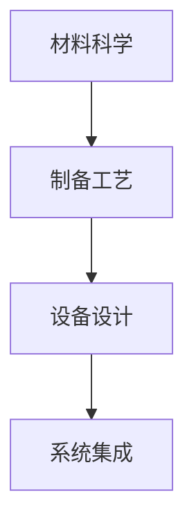

                 

# 价值投资中的新一代柔性电子技术前景

> 关键词：柔性电子技术、价值投资、投资前景、技术分析、投资策略、系统架构

> 摘要：本文将深入探讨新一代柔性电子技术在价值投资中的应用前景。通过分析柔性电子技术的核心原理、市场现状、投资价值以及系统架构，结合实际项目案例，为投资者提供科学的投资决策参考。本文将从技术背景、核心概念、算法原理、系统架构、项目实战等多维度展开，全面解析柔性电子技术与价值投资的结合之道。

---

## 第一部分: 柔性电子技术的背景与概念

### 第1章: 柔性电子技术的定义与发展

#### 1.1 柔性电子技术的基本概念
- 1.1.1 柔性电子技术的定义  
- 1.1.2 柔性电子技术的核心特征  
- 1.1.3 柔性电子技术的演进历程  

#### 1.2 柔性电子技术的市场现状
- 1.2.1 全球柔性电子市场的规模与分布  
- 1.2.2 主要应用领域分析  
- 1.2.3 技术发展的瓶颈与未来趋势  

#### 1.3 柔性电子技术与价值投资的关系
- 1.3.1 价值投资的基本原理  
- 1.3.2 柔性电子技术对投资决策的影响  
- 1.3.3 柔性电子技术的长期投资价值  

#### 1.4 本章小结  
- 本章通过分析柔性电子技术的定义、市场现状及其与价值投资的关系，为后续的深入探讨奠定了基础。  

---

### 第2章: 柔性电子技术的核心概念与投资价值

#### 2.1 柔性电子技术的核心要素
- 2.1.1 材料特性  
- 2.1.2 制备工艺  
- 2.1.3 应用场景  

#### 2.2 柔性电子技术的经济价值分析
- 2.2.1 成本分析  
- 2.2.2 市场需求  
- 2.2.3 技术壁垒  

#### 2.3 柔性电子技术的长期投资价值
- 2.3.1 技术进步对投资的影响  
- 2.3.2 行业竞争格局分析  
- 2.3.3 投资风险与机会  

#### 2.4 本章小结  
- 本章从经济价值和技术壁垒的角度，分析了柔性电子技术的投资潜力，并为投资者提供了风险与机会的平衡点。  

---

### 第3章: 柔性电子技术的核心原理与数学模型

#### 3.1 柔性电子技术的材料科学基础
- 3.1.1 纳米材料的特性  
- 3.1.2 高分子材料的应用  
- 3.1.3 材料的力学性能  

#### 3.2 柔性电子技术的制备工艺分析
- 3.2.1 印刷电子技术  
- 3.2.2 蒸镀与溅射技术  
- 3.2.3 自组装技术  

#### 3.3 柔性电子技术的数学模型
- 3.3.1 应变-应力关系模型  
- 3.3.2 材料的导电性模型  
- 3.3.3 光电转化效率模型  

#### 3.4 本章小结  
- 本章通过材料科学和制备工艺的分析，揭示了柔性电子技术的核心原理，并通过数学模型量化了其性能特征。  

---

### 第4章: 柔性电子技术的系统架构与投资决策模型

#### 4.1 柔性电子技术的系统架构
- 4.1.1 系统功能模块划分  
- 4.1.2 系统组件之间的关系  
- 4.1.3 系统的可扩展性设计  

#### 4.2 投资决策模型的设计
- 4.2.1 模型的输入变量  
- 4.2.2 模型的输出结果  
- 4.2.3 模型的优化与调整  

#### 4.3 系统架构的Mermaid图

#### 4.4 本章小结  
- 本章通过系统架构和投资决策模型的设计，展示了柔性电子技术在投资中的应用前景。  

---

### 第5章: 柔性电子技术的项目实战与投资策略

#### 5.1 项目环境的安装与配置
- 5.1.1 开发工具的安装  
- 5.1.2 数据库的搭建  
- 5.1.3 网络环境的配置  

#### 5.2 系统核心功能的实现
- 5.2.1 数据采集与处理  
- 5.2.2 投资决策模型的实现  
- 5.2.3 系统界面设计与优化  

#### 5.3 项目实战的案例分析
- 5.3.1 柔性电子技术在某领域的应用案例  
- 5.3.2 投资策略的实施与效果分析  

#### 5.4 本章小结  
- 本章通过项目实战，验证了柔性电子技术在投资中的实际应用效果，并总结了成功经验与教训。  

---

## 第二部分: 价值投资中的柔性电子技术投资策略

### 第6章: 投资策略的制定与实施

#### 6.1 投资策略的制定原则
- 6.1.1 风险控制原则  
- 6.1.2 长期价值导向  
- 6.1.3 数据驱动决策  

#### 6.2 投资策略的实施步骤
- 6.2.1 数据收集与分析  
- 6.2.2 技术评估与筛选  
- 6.2.3 投资组合的构建  

#### 6.3 本章小结  
- 本章从投资策略的制定与实施角度，为投资者提供了科学的决策框架。  

---

### 第7章: 柔性电子技术投资的风险与应对

#### 7.1 投资风险的识别与评估
- 7.1.1 市场风险  
- 7.1.2 技术风险  
- 7.1.3 财务风险  

#### 7.2 风险应对策略
- 7.2.1 多元化投资组合  
- 7.2.2 技术跟踪与更新  
- 7.2.3 财务风险管理  

#### 7.3 本章小结  
- 本章通过风险分析与应对策略，为投资者提供了降低投资风险的有效方法。  

---

### 第8章: 柔性电子技术投资的未来展望

#### 8.1 柔性电子技术的未来发展趋势
- 8.1.1 新材料的突破  
- 8.1.2 制备工艺的创新  
- 8.1.3 应用领域的拓展  

#### 8.2 未来投资机会与挑战
- 8.2.1 新兴市场的崛起  
- 8.2.2 技术融合带来的新机遇  
- 8.2.3 全球化竞争的加剧  

#### 8.3 本章小结  
- 本章展望了柔性电子技术的未来发展趋势，为投资者提供了长期投资的参考依据。  

---

## 第三部分: 总结与展望

### 第9章: 总结

#### 9.1 核心观点回顾
- 柔性电子技术的定义与发展  
- 投资价值与风险分析  
- 系统架构与投资策略  

#### 9.2 研究成果的意义
- 为投资者提供科学的决策支持  
- 推动柔性电子技术的广泛应用  

#### 9.3 本章小结  
- 本章总结了全文的主要内容，强调了柔性电子技术在价值投资中的重要性。  

---

### 第10章: 展望

#### 10.1 未来研究方向
- 柔性电子技术的进一步创新  
- 投资策略的优化与调整  
- 全球化背景下的投资机会  

#### 10.2 对投资者的建议
- 关注技术创新与市场动态  
- 加强风险管理与策略调整  
- 提升专业素养与投资能力  

#### 10.3 本章小结  
- 本章展望了柔性电子技术与价值投资的未来发展方向，并提出了对投资者的建议。  

---

## 作者：AI天才研究院/AI Genius Institute & 禅与计算机程序设计艺术 /Zen And The Art of Computer Programming

