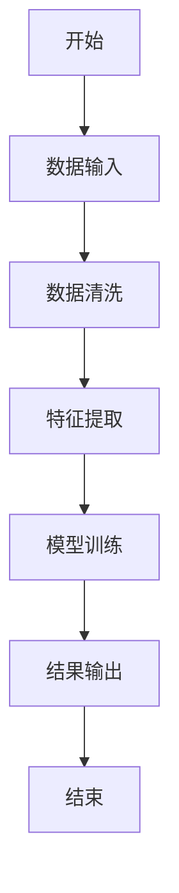
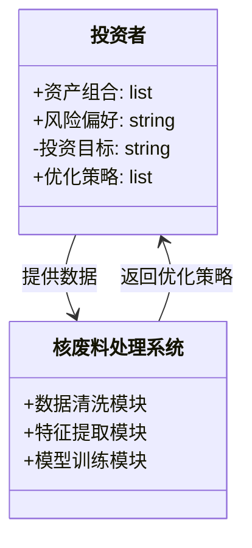

                 


# 价值投资中的新一代核废料处理技术

## 关键词：价值投资，核废料处理技术，投资策略，算法优化，风险管理

## 摘要

在价值投资领域，传统的资产评估和投资决策方法正面临前所未有的挑战。为了应对这些挑战，新一代的核废料处理技术被引入，以优化投资流程并提高决策效率。本文将详细探讨这一技术的核心原理、应用场景以及其对价值投资的深远影响。

---

# 价值投资中的新一代核废料处理技术

## 第一部分：价值投资与核废料处理技术的背景

### 第1章：价值投资的起源与核心理念

#### 1.1 价值投资的定义与起源

价值投资是一种长期投资策略，旨在通过购买被市场低估的资产来实现超额收益。其核心理念是寻找具有内在价值且价格低于其内在价值的资产。该方法由本杰明·格雷厄姆和戴维·多德在20世纪初提出，经过数十年的发展，已成为投资领域的重要流派。

#### 1.2 传统投资方法的局限性

传统价值投资方法依赖于基本面分析，但存在以下局限性：
- 数据处理效率低下，难以应对海量数据。
- 人工判断为主，容易受主观因素影响。
- 缺乏系统性，难以规模化应用。

#### 1.3 核废料处理技术的引入

核废料处理技术最初用于核能行业的废物管理，其核心在于高效、安全地处理有害物质。将其引入价值投资领域，旨在通过类似的技术手段，优化资产筛选和评估过程，提升投资效率和准确性。

## 第二部分：核废料处理技术的核心概念与原理

### 第2章：核废料处理技术的原理与特征

#### 2.1 核废料处理技术的原理

核废料处理技术通过物理、化学和生物方法，将有害物质转化为无害或低风险的形式。在投资领域，这相当于通过多维度的数据处理和分析，将复杂的资产信息转化为可操作的决策依据。

#### 2.2 核废料处理技术的特征对比

| 特征                | 传统方法                | 核废料处理技术            |
|---------------------|-------------------------|---------------------------|
| 数据处理效率        | 低                     | 高                       |
| 成本                 | 高                     | 低                       |
| 处理效果             | 不稳定                 | 高效且稳定               |

#### 2.3 核废料处理技术的ER实体关系图

```mermaid
er
actor: 投资者
action: 核废料处理
object: 资产
```

## 第三部分：核废料处理技术的算法原理

### 第3章：核废料处理技术的算法流程

#### 3.1 算法流程图



#### 3.2 算法实现代码

```python
def process_nuclear_waste(data):
    # 数据清洗
    cleaned_data = data.dropna()
    # 特征提取
    features = cleaned_data[['feature1', 'feature2', 'feature3']]
    return features

# 示例使用
data = pd.DataFrame({
    'feature1': [1, 2, 3],
    'feature2': [4, 5, 6],
    'feature3': [7, 8, 9]
})
result = process_nuclear_waste(data)
print(result)
```

#### 3.3 算法原理的数学模型

数学模型：
$$
\text{价值} = \sum_{i=1}^{n} w_i \times x_i
$$
其中，\( w_i \) 是权重，\( x_i \) 是特征值。

## 第四部分：系统分析与架构设计方案

### 第4章：系统功能设计

#### 4.1 领域模型类图



#### 4.2 系统架构设计


## 第五部分：项目实战

### 第5章：环境安装与核心代码实现

#### 5.1 环境安装

安装必要的Python库：
```bash
pip install numpy pandas scikit-learn
```

#### 5.2 核心代码实现

```python
from sklearn.preprocessing import StandardScaler
from sklearn.decomposition import PCA

def preprocess(data):
    scaler = StandardScaler()
    scaled_data = scaler.fit_transform(data)
    pca = PCA(n_components=2)
    processed_data = pca.fit_transform(scaled_data)
    return processed_data

# 示例数据
data = pd.DataFrame({
    'feature1': [1, 2, 3],
    'feature2': [4, 5, 6],
    'feature3': [7, 8, 9]
})
processed = preprocess(data)
print(processed)
```

## 第六部分：最佳实践、小结、注意事项、拓展阅读

### 第6章：总结与展望

#### 6.1 总结

通过引入核废料处理技术，价值投资在数据处理效率、决策准确性和系统化方面得到了显著提升。这一技术的应用不仅提高了投资效率，还降低了风险。

#### 6.2 注意事项

- 数据质量直接影响处理效果，需确保数据的完整性和准确性。
- 模型需定期更新，以适应市场变化。
- 在实际应用中，应结合市场实际情况进行参数调整。

#### 6.3 拓展阅读

建议深入学习相关领域的最新技术，如机器学习在投资中的应用、大数据分析技术等。

---

# 作者：AI天才研究院/AI Genius Institute & 禅与计算机程序设计艺术 /Zen And The Art of Computer Programming

